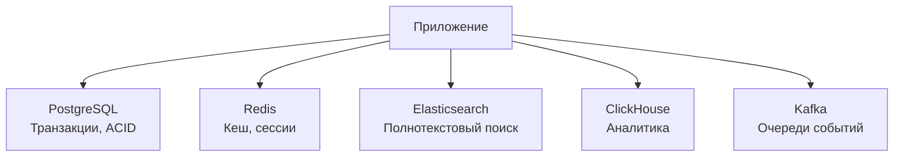
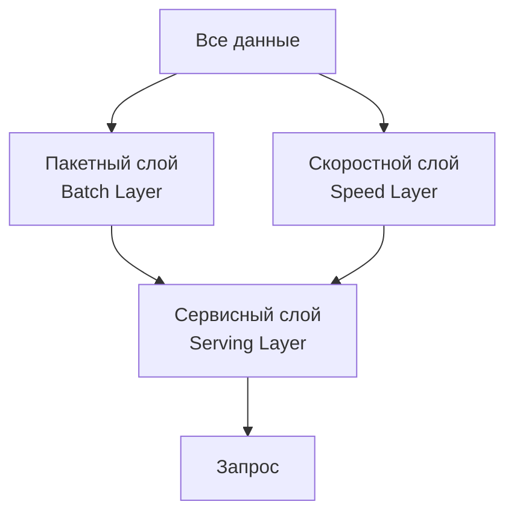
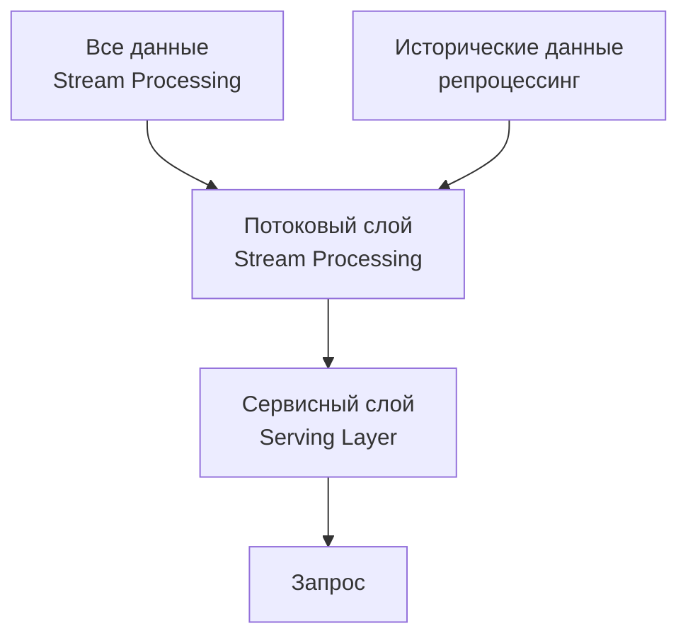
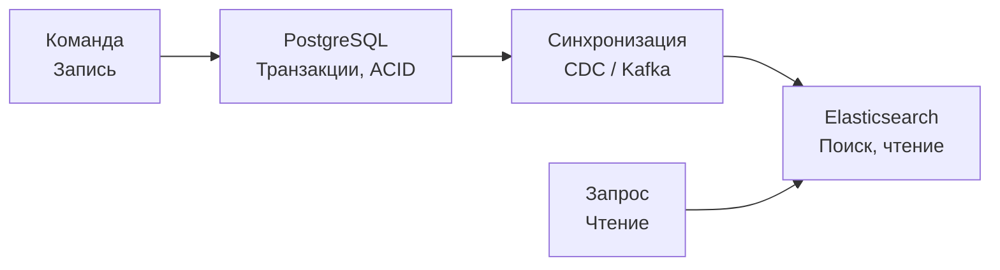

## Введение: Лучшее из двух миров

Представьте, что вы строите дом. Вам нужен и прочный фундамент, и красивая отделка, и эффективное отопление. Вы не выбираете один материал на все — вы используете бетон для фундамента, дерево для стен, стекло для окон. Каждый материал хорош для своей задачи.

В мире баз данных происходит то же самое. Долгое время шел спор: "SQL против NoSQL". Но индустрия пришла к пониманию, что это не битва, а сотрудничество. Реальные системы редко используют только один тип базы данных. Чаще всего они комбинируют несколько подходов, выбирая лучший инструмент для каждой задачи.

**Гибридные подходы в NoSQL** — это стратегии, которые комбинируют разные типы баз данных (или разные модели данных в одной системе) для достижения оптимального результата. Это может быть:

- **Polyglot persistence** — использование нескольких разных баз данных в одной системе (PostgreSQL для транзакций, Redis для кеша, Elasticsearch для поиска).
- **Multi-model databases** — одна база данных, поддерживающая несколько моделей данных (документы, графы, ключ-значение).
- **SQL-on-NoSQL** — использование SQL-синтаксиса для запросов к NoSQL-данным.
- **Lambda architecture** — комбинация пакетной и потоковой обработки.

Гибридные подходы — это признание того, что не существует "серебряной пули". Каждая база данных хороша для одних задач и плоха для других. Умный архитектор комбинирует их.

## Polyglot Persistence: Многоязычное хранение

### Что это такое

Polyglot persistence (многоязычное хранение) — это подход, при котором система использует несколько разных баз данных, каждая для своей специализированной задачи. Термин придуман Нилом Фордом (Neal Ford) и популяризован Мартином Фаулером (Martin Fowler).

**Простыми словами:** Вы не говорите на одном языке со всеми людьми в мире. С коллегами — на русском, с иностранными партнерами — на английском, с родственниками — на родном языке. Так же и с данными: для одних задач лучше подходит PostgreSQL, для других — Redis, для третьих — Elasticsearch.

### Архитектура типичного современного приложения



### Пример: Интернет-магазин

| Компонент | База данных | Почему |
| :--- | :--- | :--- |
| **Каталог товаров** | MongoDB | Гибкая схема (разные характеристики у телефонов, одежды, книг) |
| **Заказы и транзакции** | PostgreSQL | Нужны ACID, сложные JOIN, отчеты |
| **Корзина покупок** | Redis | Временные данные, очень быстрый доступ |
| **Поиск по каталогу** | Elasticsearch | Полнотекстовый поиск, фасеты, ранжирование |
| **Аналитика продаж** | ClickHouse | Огромные объемы, агрегации, временные ряды |
| **Рекомендации** | Neo4j | Графовые запросы ("пользователи, купившие этот товар, также купили...") |

### Преимущества polyglot persistence

| Преимущество | Описание |
| :--- | :--- |
| **Best tool for the job** | Каждая задача решается инструментом, оптимальным для нее |
| **Независимое масштабирование** | Можно масштабировать только ту БД, где есть узкое место |
| **Технологическая гибкость** | Можно использовать новые технологии без переписывания всей системы |
| **Снижение рисков** | Проблемы в одной БД не останавливают всю систему |

### Недостатки и риски

| Недостаток | Описание |
| :--- | :--- |
| **Сложность операций** | Нужно администрировать несколько разных систем |
| **Сложность разработки** | Разработчики должны знать несколько БД и языков запросов |
| **Сложность обеспечения консистентности** | Данные могут быть дублированы в нескольких БД, нужно синхронизировать |
| **Высокие затраты** | Больше серверов, больше лицензий, больше специалистов |

### Стратегии синхронизации между БД

При использовании нескольких баз данных одни и те же данные часто хранятся в нескольких местах (например, товар — и в MongoDB для каталога, и в Elasticsearch для поиска). Нужно поддерживать их в согласованном состоянии.

**Синхронная запись (сложно):**

```javascript
// Псевдокод: синхронная запись в две БД
async function saveProduct(product) {
    // Запускаем транзакцию?
    await mongodb.save('products', product);
    await elasticsearch.index('products', product);
    // Если один из запросов упал — что делать?
}
```

**Асинхронная синхронизация через очередь (лучше):**

```javascript
// Псевдокод: асинхронная синхронизация
async function saveProduct(product) {
    await mongodb.save('products', product);
    await kafka.send('product-updates', product);  // Отправляем в очередь
}

// Отдельный потребитель обновляет Elasticsearch
kafka.consume('product-updates', (product) => {
    elasticsearch.index('products', product);
});
```

**Change Data Capture (CDC) — еще лучше:**

```sql
-- PostgreSQL CDC: читаем журнал транзакций
-- Любое изменение в PostgreSQL автоматически отправляется в Kafka
INSERT INTO products ...  -- Автоматически попадет в Elasticsearch через Debezium
```

## Multi-Model Databases: Одна БД — много моделей

### Что это такое

Multi-model database — это база данных, которая поддерживает несколько моделей данных (документы, графы, ключ-значение, колонки) в одном ядре, с единым языком запросов и единым механизмом хранения.

**Простыми словами:** Это как швейцарский нож. Один инструмент, но много лезвий. Не так хорошо, как специализированный нож для каждой задачи, но удобно и компактно.

### Примеры multi-model БД

| База данных | Поддерживаемые модели |
| :--- | :--- |
| **ArangoDB** | Документы, графы, ключ-значение |
| **OrientDB** | Документы, графы |
| **Cosmos DB (Microsoft)** | Документы, графы, ключ-значение, колонки |
| **Couchbase** | Документы, ключ-значение (с графами через плагины) |
| **PostgreSQL** (с расширениями) | Реляционная, документы (JSONB), ключ-значение (HStore), графы (pgRouting, Apache AGE) |

### Пример: ArangoDB (документы + графы)

```javascript
// Вставка документов (вершин графа)
db.users.insert({ _key: "ivan", name: "Иван", age: 30 });
db.users.insert({ _key: "petr", name: "Петр", age: 25 });
db.users.insert({ _key: "anna", name: "Анна", age: 35 });

// Создание ребра (связи)
db.friends.insert({ _from: "users/ivan", _to: "users/petr", since: 2020 });
db.friends.insert({ _from: "users/ivan", _to: "users/anna", since: 2021 });

// Графовый запрос: найти друзей друзей Ивана
FOR v, e, p IN 1..2 OUTBOUND "users/ivan" GRAPH "social"
    RETURN DISTINCT v.name
```

### Пример: PostgreSQL как multi-model

PostgreSQL — реляционная база, но с расширениями она становится мощной multi-model системой.

```sql
-- Документная модель (JSONB)
CREATE TABLE products (
    id SERIAL PRIMARY KEY,
    data JSONB
);

INSERT INTO products (data) VALUES 
    ('{"name": "iPhone", "price": 1000, "specs": {"color": "black"}}'),
    ('{"name": "Футболка", "price": 20, "specs": {"size": "L", "color": "red"}}');

-- Индекс на JSONB поле
CREATE INDEX idx_products_color ON products ((data->'specs'->>'color'));

-- Графовая модель (через рекурсивные CTE)
WITH RECURSIVE friends AS (
    SELECT user_id, friend_id, 1 AS depth
    FROM friendships
    WHERE user_id = 1
    UNION ALL
    SELECT f.user_id, f.friend_id, depth + 1
    FROM friendships f
    JOIN friends ON friends.friend_id = f.user_id
    WHERE depth < 3
)
SELECT * FROM friends;
```

### Когда выбирать multi-model БД

| Сценарий | Почему подходит |
| :--- | :--- |
| **Небольшие проекты с ограниченным бюджетом** | Одна БД проще в администрировании |
| **Данные имеют разные модели, но связаны** | Графовые запросы к документным данным без ETL |
| **Команда не хочет изучать несколько БД** | Один язык запросов для всех моделей |
| **Прототипирование и MVP** | Быстро начать, потом можно разделить |

### Когда лучше использовать специализированные БД

| Сценарий | Почему multi-model не подходит |
| :--- | :--- |
| **Очень высокие нагрузки** | Специализированные БД лучше оптимизированы |
| **Требуется лучший в классе полнотекстовый поиск** | Elasticsearch несравненно мощнее |
| **Графы с миллиардами ребер** | Neo4j или specialized graph БД эффективнее |
| **Аналитика на петабайтах данных** | ClickHouse или Snowflake |

## SQL-on-NoSQL: SQL как язык запросов к NoSQL

### Что это такое

SQL-on-NoSQL — это подход, при котором NoSQL-база данных (или движок поверх нее) поддерживает SQL как язык запросов. Это позволяет разработчикам и аналитикам использовать знакомый синтаксис для работы с нереляционными данными.

### Примеры

**Cassandra (CQL — Cassandra Query Language):**
```sql
-- CQL похож на SQL, но это не SQL
CREATE TABLE users (user_id UUID PRIMARY KEY, name TEXT, email TEXT);
SELECT * FROM users WHERE user_id = 123;
```

**MongoDB (через $sql утилиту или драйверы):**
```javascript
// MongoDB не имеет нативного SQL, но есть сторонние решения
// 8MongoDB Connector for BI позволяет выполнять SQL через ODBC
```

**Elasticsearch (SQL):**
```sql
-- Elasticsearch поддерживает SQL (X-Pack)
SELECT name, price FROM products WHERE price > 100 ORDER BY price DESC;
```

**Presto / Trino (движок запросов):**
```sql
-- Presto может запрашивать данные из разных источников (MongoDB, Cassandra, Hive)
SELECT * FROM mongodb.default.users WHERE city = 'Москва';
```

### Преимущества SQL-on-NoSQL

| Преимущество | Описание |
| :--- | :--- |
| **Низкий порог входа** | Аналитики и разработчики уже знают SQL |
| **Богатство запросов** | JOIN, GROUP BY, оконные функции (где поддерживаются) |
| **Интеграция с BI-инструментами** | Tableau, Power BI, Metabase "говорят" на SQL |
| **Стандартизация** | Меньше учить разных языков запросов |

### Ограничения

| Ограничение | Почему |
| :--- | :--- |
| **Неполная поддержка SQL** | JOIN могут отсутствовать или быть ограничены |
| **Производительность** | SQL-запрос к NoSQL может быть медленнее нативного API |
| **Императивность vs декларативность** | Некоторые NoSQL-операции сложно выразить в SQL |

## Lambda Architecture: Пакетная + потоковая обработка

### Что это такое

Lambda architecture — это архитектурный паттерн для обработки больших данных, который комбинирует пакетную (batch) и потоковую (stream) обработку. Термин введен Натаном Марцем (Nathan Marz).

**Простыми словами:** У вас есть два пути обработки данных. Медленный, но точный (пакетная обработка всего объема данных) и быстрый, но с приблизительными результатами (потоковая обработка только новых данных). Результаты объединяются для получения окончательного ответа.

### Компоненты Lambda architecture



| Слой | Назначение | Технологии | Характеристики |
| :--- | :--- | :--- | :--- |
| **Batch Layer** | Хранит все данные, вычисляет точные агрегаты | Hadoop, Spark, Cassandra | Точный, медленный, дорогой |
| **Speed Layer** | Обрабатывает только новые данные, дает приблизительные результаты | Kafka Streams, Flink, Storm | Быстрый, приблизительный, дешевый |
| **Serving Layer** | Объединяет результаты batch и speed, отвечает на запросы | Druid, ClickHouse, Elasticsearch | Объединяет, индексирует |

### Пример: Подсчет просмотров видео

```javascript
// Batch Layer (раз в час)
// Считаем точное количество просмотров за все время
SELECT video_id, COUNT(*) AS total_views
FROM views_history
GROUP BY video_id;

// Speed Layer (реальное время)
// Считаем просмотры за последний час
SELECT video_id, COUNT(*) AS recent_views
FROM views_stream
WHERE timestamp > NOW() - INTERVAL '1 hour'
GROUP BY video_id;

// Serving Layer (запрос)
// Объединяем результаты
total_views = batch_total_views + speed_recent_views;
```

### Kappa Architecture: Упрощение Lambda

Lambda архитектура сложна (два пути обработки, два кода). Kappa архитектура предлагает упрощение: обрабатывать все данные как поток, включая ретроспективную обработку.



**Kappa:**
- Один код для всех данных
- Данные хранятся в журнале событий (Kafka)
- При необходимости можно "перемотать" журнал назад и пересчитать

**Когда Lambda, когда Kappa:**
- Lambda — когда пакетная и потоковая обработка существенно различаются
- Kappa — когда потоковая обработка достаточно мощная для всего объема данных

## Гибридное хранение: In-Memory + Disk + Cold Storage

### Что это такое

Гибридное хранение — это комбинация разных типов носителей для оптимального соотношения скорости и стоимости.

| Уровень | Носитель | Скорость | Стоимость | Тип данных |
| :--- | :--- | :--- | :--- | :--- |
| **L1: In-Memory** | RAM (Redis, Memcached) | Наносекунды | Высокая | Горячие данные, сессии, кеш |
| **L2: Fast SSD** | NVMe (MongoDB, PostgreSQL) | Микросекунды | Средняя | Оперативные данные |
| **L3: HDD** | SATA диски | Миллисекунды | Низкая | Холодные данные, логи |
| **L4: Cold Storage** | S3 Glacier, Tape | Секунды/минуты | Очень низкая | Архивы, бэкапы |

### Пример: Система логирования

```javascript
// Горячие логи (последний час) — в Redis
redis.rpush('logs:hot', log_line);
redis.expire('logs:hot', 3600);

// Теплые логи (последний день) — в ClickHouse
clickhouse.insert('logs_warm', log_line);

// Холодные логи (старше дня) — в S3 с автоматической архивацией
s3.upload('logs-cold/2024-01-01.log', compressed_data);
```

## Гибридные подходы в популярных системах

### PostgreSQL + JSONB

PostgreSQL — классическая реляционная БД, но с поддержкой JSONB она становится гибридной.

```sql
-- Реляционная строгая схема для критичных данных
CREATE TABLE orders (
    id SERIAL PRIMARY KEY,
    customer_id INT NOT NULL REFERENCES customers(id),
    created_at TIMESTAMP NOT NULL,
    status VARCHAR(20) NOT NULL
);

-- Гибкая JSONB схема для дополнительных атрибутов
ALTER TABLE orders ADD COLUMN metadata JSONB;

-- Индекс на JSONB поле
CREATE INDEX idx_orders_metadata ON orders USING GIN (metadata);

-- Поиск внутри JSON
SELECT * FROM orders WHERE metadata->>'promo_code' = 'WELCOME10';
```

### MySQL + JSON (ограниченно)

MySQL также поддерживает JSON, но менее мощно, чем PostgreSQL.

```sql
CREATE TABLE products (
    id INT PRIMARY KEY,
    name VARCHAR(255),
    attributes JSON
);

-- Индекс на JSON поле (виртуальный столбец)
ALTER TABLE products ADD COLUMN color VARCHAR(50) 
    GENERATED ALWAYS AS (attributes->>'$.color') STORED;
CREATE INDEX idx_color ON products (color);
```

### Redis + Modules

Redis — ключ-значение, но через модули расширяется до других моделей.

| Модуль | Функциональность |
| :--- | :--- |
| **RediSearch** | Полнотекстовый поиск, вторичные индексы |
| **RedisGraph** | Графовая БД (поверх Redis) |
| **RedisJSON** | Документная модель (JSON) |
| **RedisTimeSeries** | Временные ряды |
| **RedisBloom** | Вероятностные структуры данных |

```javascript
// RediSearch: создание индекса
FT.CREATE idx_users ON HASH PREFIX 1 user: SCHEMA name TEXT email TEXT

// Поиск
FT.SEARCH idx_users "@name:Иван"

// RedisJSON: работа с JSON
JSON.SET user:123 $ '{"name":"Иван","age":30}'
JSON.GET user:123 $.name
```

### SingleStore (ранее MemSQL)

SingleStore — гибридная БД, которая объединяет OLTP и OLAP в одной системе.

```sql
-- Таблица для транзакций (хранится в памяти)
CREATE TABLE orders (
    id INT PRIMARY KEY,
    customer_id INT,
    amount DECIMAL(10,2)
) USING MEMORY;

-- Таблица для аналитики (хранится на диске, колоночная)
CREATE TABLE sales_summary (
    date DATE,
    product_id INT,
    total_sales DECIMAL(10,2)
) USING COLUMNSTORE;
```

## Практические паттерны гибридных подходов

### Паттерн 1: CQRS с разными хранилищами

CQRS (Command Query Responsibility Segregation) — разделение операций записи (Command) и чтения (Query). Можно использовать разные БД для каждой стороны.



**Пример:**
- Запись заказа → PostgreSQL (гарантия согласованности)
- Чтение заказов → Elasticsearch (быстрый поиск, агрегации)
- Синхронизация → Debezium + Kafka

### Паттерн 2: Временные ряды + метаданные

- Метаданные (описание датчиков) → PostgreSQL (реляционная, транзакции)
- Данные датчиков (миллиарды точек) → ClickHouse / InfluxDB (временные ряды)

### Паттерн 3: Графовые запросы к документным данным

- Хранение документов → MongoDB
- Графовые запросы → ArangoDB (или Neo4j)
- Синхронизация через событийный брокер

### Паттерн 4: Кеширование горячих данных

- Основное хранилище → PostgreSQL / MongoDB
- Кеш горячих данных → Redis (TTL, LRU)

```javascript
// Паттерн cache-aside
async function getUser(userId) {
    // 1. Проверить кеш
    let user = await redis.get(`user:${userId}`);
    if (user) return JSON.parse(user);
    
    // 2. Промах кеша — идем в БД
    user = await db.users.findOne({ _id: userId });
    
    // 3. Сохраняем в кеш на 5 минут
    await redis.set(`user:${userId}`, JSON.stringify(user), 'EX', 300);
    
    return user;
}
```

## Когда использовать гибридные подходы

| Признак | Решение |
| :--- | :--- |
| **Разные типы данных в системе** | Polyglot persistence |
| **Ограниченный бюджет, но нужна гибкость** | Multi-model БД |
| **Команда уже знает SQL** | SQL-on-NoSQL |
| **Нужны и точные агрегаты, и real-time** | Lambda / Kappa architecture |
| **Данные имеют разные температурные режимы** | Гибридное хранение (in-memory + disk + cold) |
| **Начинаете с монолита, планируете рост** | Начать с одной БД, добавить другие по мере необходимости |

## Распространенные ошибки

### Ошибка 1: Преждевременный полиглот

Добавление Redis, Elasticsearch, Kafka, Cassandra в проект, где достаточно одного PostgreSQL.

**Как исправить:** Начинайте с простого. Добавляйте новые технологии только когда появляется реальная потребность.

### Ошибка 2: Синхронная запись в несколько БД

```javascript
// Плохо
await postgres.save(order);
await elasticsearch.index(order);
await redis.set(`order:${order.id}`, order);
```

Если один из запросов упадет, данные станут несогласованными.

**Как исправить:** Асинхронная синхронизация через очередь или CDC.

### Ошибка 3: Игнорирование консистентности

Данные дублируются в нескольких БД, но нет механизма синхронизации.

**Как исправить:** Проектируйте синхронизацию как часть архитектуры. Используйте event sourcing, CDC, distributed transactions (где возможно).

### Ошибка 4: Одна БД на все случаи жизни в большой системе

"У нас в компании стандарт — MongoDB. Все пишем в MongoDB". Даже когда это неоптимально (аналитика, графы, полнотекстовый поиск).

**Как исправить:** Признайте, что разные задачи требуют разных инструментов. Добавьте специализированные БД для узких мест.

### Ошибка 5: Сложность ради сложности

Добавление Kafka, Flink, Cassandra, Elasticsearch в проект, где нужна только небольшая админка на 100 пользователей.

**Как исправить:** Архитектура должна соответствовать масштабу и требованиям. Для 90% проектов одного PostgreSQL достаточно.

## Резюме для системного аналитика

1. **Гибридные подходы — это не мода, а необходимость.** Современные системы редко обходятся одной базой данных. Реальные приложения комбинируют несколько БД, каждая для своей задачи.

2. **Polyglot persistence** — использование нескольких разных БД в одной системе. Плюсы: лучший инструмент для каждой задачи. Минусы: сложность операций, синхронизации, администрирования.

3. **Multi-model databases** — одна БД, поддерживающая несколько моделей данных. Хорошо для небольших проектов и прототипирования, но уступает специализированным БД под высокими нагрузками.

4. **SQL-on-NoSQL** — использование SQL для запросов к NoSQL. Снижает порог входа, но может иметь ограничения в производительности и функциональности.

5. **Lambda architecture** — комбинация пакетной и потоковой обработки. Пакетный слой дает точность, потоковый — скорость. Kappa архитектура упрощает подход до одного потока.

6. **Гибридное хранение** — разные типы носителей для разных данных. Горячие данные — в памяти, теплые — на SSD, холодные — на HDD или в облачном архиве.