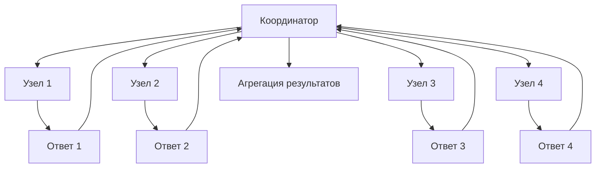

## Введение: Плата за гибкость

В реляционных базах данных индексы — это хорошо изученная территория. Вы создаете индекс на столбце, и запросы по этому столбцу становятся быстрыми. Просто, предсказуемо, работает.

В нереляционных базах данных все сложнее. Нет единой модели данных — есть документы, ключи-значения, колонки, графы. Нет единого языка запросов. Нет единого механизма индексации. То, что работает в MongoDB, может не работать в Cassandra. То, что быстро в Redis, невозможно в Couchbase.

**Индексы в NoSQL — это компромисс между гибкостью и производительностью.** Вы платите за возможность хранить данные разной структуры и масштабироваться на тысячи серверов. Плата — в ограничениях на индексацию, в необходимости проектировать индексы под запросы (а не запросы под индексы), в ручном управлении распределением данных.

В этом материале мы разберем, как индексы работают в разных типах NoSQL-систем, в чем их особенности и ограничения, и как проектировать индексы для нереляционных баз данных.

## Почему индексы в NoSQL отличаются от SQL

### Отсутствие стандарта

В SQL есть стандарт (ANSI SQL), и индексы ведут себя похоже в PostgreSQL, MySQL, Oracle. В NoSQL каждая база данных — это свой мир. MongoDB не похожа на Cassandra, Redis не похож на Neo4j.

### Ограниченные возможности запросов

Многие NoSQL-базы не поддерживают сложные запросы с произвольными условиями. Cassandra требует, чтобы вы указывали первичный ключ (partition key) в запросе. Redis вообще не имеет вторичных индексов (только ключ-значение). DynamoDB требует явного создания Global Secondary Index для альтернативных путей доступа.

### Распределенная природа

В распределенных NoSQL-системах данные разбросаны по множеству узлов. Индекс тоже должен быть распределенным. Поиск по вторичному индексу может потребовать обращения ко всем узлам кластера (scatter-gather), что дорого.

### Модель данных диктует индексы

- **Ключ-значение:** только первичный индекс по ключу. Вторичных индексов нет или они эмулируются.
- **Документо-ориентированные:** богатые возможности индексации (включая вложенные поля, текст, гео).
- **Колоночные:** первичный индекс по составному ключу (partition key + clustering columns), вторичные индексы ограничены.
- **Графовые:** индексы на свойствах вершин и ребер, плюс специализированные индексы для обхода.

## Первичный индекс: Король NoSQL

Во всех NoSQL-базах первичный индекс — самый важный. Это основной (и часто единственный) способ быстро получить данные.

### Ключ-значение (Redis, Memcached, DynamoDB KV)

Самый простой случай. Данные доступны только по первичному ключу.

```javascript
// Redis
SET user:123 '{"name": "Иван", "email": "ivan@example.com"}'
GET user:123  // Быстро: O(1)

// Нет способа найти пользователя по email (без дополнительной структуры)
// Пришлось бы создать отдельную запись: SET email:ivan@example.com 123
```

**Характеристики:**
- Доступ O(1) или O(log N) по хешу или B-Tree
- Нет вторичных индексов (или они эмулируются через дополнительные структуры)
- Идеально для кеширования, сессий, простых хранилищ

### Документо-ориентированные (MongoDB, Couchbase)

В MongoDB первичный индекс — по полю `_id`. Вы можете выбрать другой уникальный ключ при создании коллекции.

```javascript
// MongoDB — первичный индекс по _id (создается автоматически)
db.users.insertOne({ _id: 123, name: "Иван", email: "ivan@example.com" });

// Поиск по _id — быстрый (O(log N))
db.users.findOne({ _id: 123 });

// Можно создать свой первичный ключ (коллекция с пользовательским ключом)
db.createCollection("users", { autoIndexId: false });
db.users.createIndex({ email: 1 }, { unique: true });
```

### Колоночные (Cassandra, HBase)

В Cassandra первичный ключ — составной. Он состоит из partition key (распределение данных по узлам) и clustering columns (сортировка внутри партиции).

```sql
-- Cassandra
CREATE TABLE users (
    user_id UUID,           -- partition key
    created_at TIMESTAMP,   -- clustering column (часть первичного ключа)
    name TEXT,
    email TEXT,
    PRIMARY KEY (user_id, created_at)
);

-- Быстрые запросы: нужен partition key
SELECT * FROM users WHERE user_id = 123;  -- Быстро: знаем, на каком узле данные
SELECT * FROM users WHERE user_id = 123 AND created_at > '2024-01-01';  -- Быстро

-- Медленные запросы: нет partition key
SELECT * FROM users WHERE name = 'Иван';  -- Scan всех узлов! (ОЧЕНЬ медленно)
```

**Характеристики:**
- Partition key определяет распределение по узлам
- Clustering columns определяют порядок внутри партиции (поддерживают диапазонные запросы)
- Запрос без partition key — полное сканирование кластера (антипаттерн)

## Вторичные индексы: Гибкость за плату

Вторичные индексы позволяют искать данные не только по первичному ключу, но и по другим полям. В NoSQL вторичные индексы часто имеют ограничения.

### Вторичные индексы в MongoDB

MongoDB поддерживает богатую систему вторичных индексов.

```javascript
// Обычный индекс (B-Tree)
db.users.createIndex({ email: 1 });

// Составной индекс
db.users.createIndex({ city: 1, age: -1 });

// Уникальный индекс
db.users.createIndex({ email: 1 }, { unique: true });

// Индекс на вложенном поле
db.users.createIndex({ "address.city": 1 });

// Индекс на элемент массива (multikey index)
db.users.createIndex({ tags: 1 });  // Одна запись в индексе на каждый тег

// Текстовый индекс (полнотекстовый поиск)
db.articles.createIndex({ title: "text", content: "text" });

// Геопространственный индекс (2dsphere)
db.places.createIndex({ location: "2dsphere" });

// Индекс с частичной фильтрацией (partial index)
db.users.createIndex(
    { email: 1 },
    { partialFilterExpression: { is_active: true } }
);
```

**Особенности MongoDB:**
- Индексы могут быть построены на любом поле (включая вложенные)
- Мультиключевые индексы для массивов (один документ может быть в индексе несколько раз)
- Текстовые и геопространственные индексы для специализированных запросов
- Частичные индексы (индексируются только документы, удовлетворяющие условию)

### Вторичные индексы в Cassandra

Cassandra — сложный случай. Вторичные индексы есть, но они имеют серьезные ограничения и часто не рекомендуются для production.

```sql
-- Создание вторичного индекса в Cassandra
CREATE INDEX idx_users_name ON users (name);

-- Теперь можно искать по name (но осторожно!)
SELECT * FROM users WHERE name = 'Иван';
```

**Проблемы вторичных индексов в Cassandra:**

| Проблема | Почему |
| :--- | :--- |
| **Низкая кардинальность** | Индекс на поле с 2-3 значениями (например, `status`) будет медленным |
| **Распределенный поиск** | Cassandra не знает, на каком узле искать, и шлет запрос на все узлы |
| **Требуется координация** | Нужно опросить все узлы и собрать результаты — дорого |

**Альтернативы вторичным индексам в Cassandra:**
- Создать отдельную таблицу, денормализованную под нужный запрос
- Использовать материализованные представления (с осторожностью)
- Использовать индексы SSTable (SASI) — экспериментальная функция

```sql
-- Альтернатива: отдельная таблица для поиска по name
CREATE TABLE users_by_name (
    name TEXT,
    user_id UUID,
    created_at TIMESTAMP,
    PRIMARY KEY (name, created_at)
);

-- Теперь поиск по name — быстрый
SELECT * FROM users_by_name WHERE name = 'Иван';
```

### Вторичные индексы в DynamoDB

DynamoDB имеет хорошо продуманную систему вторичных индексов.

**Global Secondary Index (GSI):**
- Полностью независимый индекс с другим partition key и sort key
- Может быть согласованным или eventual
- Требует дополнительного хранилища и пропускной способности

**Local Secondary Index (LSI):**
- Индекс с тем же partition key, но другим sort key
- Создается вместе с таблицей (нельзя добавить позже)
- Согласован с таблицей

```json
// DynamoDB — таблица с GSI
{
    "TableName": "Users",
    "KeySchema": [
        { "AttributeName": "user_id", "KeyType": "HASH" }   // partition key
    ],
    "GlobalSecondaryIndexes": [
        {
            "IndexName": "EmailIndex",
            "KeySchema": [
                { "AttributeName": "email", "KeyType": "HASH" }
            ],
            "Projection": { "ProjectionType": "ALL" }
        }
    ]
}

// Запросы
// По первичному ключу
aws dynamodb query --table-name Users --key-condition-expression "user_id = :id"

// По GSI (по email)
aws dynamodb query --table-name Users --index-name EmailIndex --key-condition-expression "email = :email"
```

## Специализированные индексы

### Текстовый поиск (Full-Text Search)

MongoDB, Couchbase, Elasticsearch поддерживают полнотекстовый поиск.

```javascript
// MongoDB — текстовый индекс
db.articles.createIndex({ title: "text", content: "text" });

// Поиск по словам
db.articles.find({ $text: { $search: "NoSQL индексы" } });

// С сортировкой по релевантности
db.articles.find(
    { $text: { $search: "NoSQL индексы" } },
    { score: { $meta: "textScore" } }
).sort({ score: { $meta: "textScore" } });
```

### Геопространственные индексы

Для запросов типа "найти все точки в радиусе" или "найти ближайшие".

```javascript
// MongoDB — геоиндекс
db.places.createIndex({ location: "2dsphere" });

// Поиск в радиусе (в метрах)
db.places.find({
    location: {
        $near: {
            $geometry: { type: "Point", coordinates: [37.617, 55.752] },
            $maxDistance: 1000  // 1 км
        }
    }
});

// Поиск в прямоугольнике
db.places.find({
    location: {
        $geoWithin: {
            $box: [[37.5, 55.7], [37.7, 55.8]]
        }
    }
});
```

### Индексы на массивах (Multikey Indexes)

В MongoDB один документ может создавать несколько записей в индексе — по одному на каждый элемент массива.

```javascript
// Документ
{
    "_id": 1,
    "name": "Иван",
    "tags": ["mongodb", "nosql", "database"]
}

// Индекс на tags
db.users.createIndex({ tags: 1 });

// Поиск по тегу — использует индекс
db.users.find({ tags: "nosql" });
```

### Индексы на картах (Map indexes)

В Cassandra можно индексировать элементы коллекций.

```sql
-- Индекс на элемент списка
CREATE INDEX idx_user_phones ON users (phones);

-- Индекс на ключ карты
CREATE INDEX idx_user_metadata_keys ON users (KEYS(metadata));

-- Индекс на значение карты
CREATE INDEX idx_user_metadata_values ON users (VALUES(metadata));
```

## Составные индексы и порядок полей

В NoSQL составные индексы работают, но порядок полей еще важнее, чем в SQL.

### MongoDB

```javascript
// Составной индекс: сначала city, потом age
db.users.createIndex({ city: 1, age: -1 });

// Эффективные запросы
db.users.find({ city: "Москва" });                    // Использует индекс (левый префикс)
db.users.find({ city: "Москва", age: { $gt: 18 } }); // Использует индекс полностью

// Неэффективные запросы
db.users.find({ age: { $gt: 18 } });                  // НЕ использует индекс (не с city)
```

**Правило:** как в SQL — левый префикс. Индекс работает только если запрос начинается с первого поля.

### Cassandra

В Cassandra порядок полей в первичном ключе критичен.

```sql
CREATE TABLE events (
    tenant_id UUID,        -- partition key
    event_date DATE,       -- clustering column 1
    event_type TEXT,       -- clustering column 2
    data TEXT,
    PRIMARY KEY (tenant_id, event_date, event_type)
);

-- Эффективные запросы (используют partition key)
SELECT * FROM events WHERE tenant_id = 123;
SELECT * FROM events WHERE tenant_id = 123 AND event_date = '2024-01-01';
SELECT * FROM events WHERE tenant_id = 123 AND event_date > '2024-01-01';

-- Тоже эффективны (часть clustering columns)
SELECT * FROM events WHERE tenant_id = 123 AND event_date = '2024-01-01' AND event_type = 'click';

-- Неэффективные (пропущена clustering column)
SELECT * FROM events WHERE tenant_id = 123 AND event_type = 'click';  -- Нужно сканировать все event_date
```

## Индексы и производительность в NoSQL

### Стоимость индексов в распределенных системах

| Фактор | Влияние на производительность |
| :--- | :--- |
| **Запись** | Каждый индекс должен быть обновлен. В распределенной системе — на всех узлах, где есть данные |
| **Хранение** | Индексы занимают место. В DynamoDB вы платите за каждый ГБ индекса |
| **Чтение** | Хороший индекс ускоряет чтение. Плохой индекс (или его отсутствие) — полное сканирование кластера |

### Scatter-Gather проблема

В распределенных системах запрос по вторичному индексу может потребовать обращения ко всем узлам.



**Когда scatter-gather приемлем:**
- Кластер небольшой (3-10 узлов)
- Запрос выполняется редко
- Вторичный индекс высокоселективный (находит мало строк)

**Когда scatter-gather неприемлем:**
- Кластер большой (100+ узлов)
- Запрос выполняется часто
- Вторичный индекс низкоселективный (находит много строк)

### Оптимизация: Денормализация вместо индексов

В NoSQL (особенно в колоночных) распространена стратегия: не создавать вторичные индексы, а дублировать данные в отдельные таблицы под каждый паттерн запроса.

```sql
-- Вместо вторичного индекса на name
-- Создаем отдельную таблицу
CREATE TABLE users_by_name (
    name TEXT,
    user_id UUID,
    created_at TIMESTAMP,
    email TEXT,
    PRIMARY KEY (name, created_at)
);

-- При вставке пользователя — вставляем в обе таблицы
BEGIN BATCH
    INSERT INTO users (user_id, name, email, created_at) VALUES (123, 'Иван', 'ivan@example.com', NOW());
    INSERT INTO users_by_name (name, user_id, email, created_at) VALUES ('Иван', 123, 'ivan@example.com', NOW());
APPLY BATCH;
```

**Плюсы:**
- Запросы всегда по partition key — быстрые и предсказуемые
- Нет scatter-gather
- Легко масштабировать

**Минусы:**
- Дублирование данных (больше места)
- Сложность поддержки консистентности (нужно обновлять везде)
- Больше операций записи

## Индексы в разных NoSQL-системах: Сравнение

| Система | Тип | Первичный индекс | Вторичные индексы | Составные | Текст | Гео |
| :--- | :--- | :--- | :--- | :--- | :--- | :--- |
| **MongoDB** | Документная | `_id` (B-Tree) | Да (B-Tree, Hash, Geospatial, Text) | Да | Да | Да |
| **Cassandra** | Колоночная | Partition + Clustering | Ограниченные (не рекомендуется) | Только в первичном | Нет | Нет |
| **DynamoDB** | KV/Документная | Partition + Sort | GSI, LSI | Да | Нет | Нет |
| **Redis** | Ключ-значение | По ключу (хэш) | Нет (эмулируется через структуры) | Нет | Нет | Да (RediSearch) |
| **Elasticsearch** | Поисковая | `_id` | Все поля по умолчанию | Да | Да | Да |
| **Neo4j** | Графовая | ID узла/ребра | На свойствах (B-Tree) | Да | Да (через плагины) | Нет |

## Проектирование индексов в NoSQL: Стратегии

### Стратегия 1: Сначала запросы, потом индексы

В реляционных базах вы сначала проектируете нормализованную схему, потом пишете запросы. В NoSQL — наоборот.

1. **Определите все запросы**, которые будет выполнять приложение.
2. **Для каждого запроса** определите, по каким полям он фильтрует и сортирует.
3. **Спроектируйте первичный ключ** так, чтобы самые частые запросы попадали в него.
4. **Добавьте вторичные индексы** для остальных запросов.
5. **Рассмотрите денормализацию** (отдельные таблицы) для запросов, которые не покрываются индексами.

### Стратегия 2: Hot partition avoidance

В распределенных системах важно, чтобы partition key обеспечивал равномерное распределение нагрузки.

```javascript
// Плохо: все записи нового пользователя попадают в одну партицию
{ user_id: 123, timestamp: "2024-01-01T10:00:00" }

// Хорошо: добавление случайного суффикса для распределения
{ user_id: 123, bucket: "123_0", timestamp: "2024-01-01T10:00:00" }
{ user_id: 123, bucket: "123_1", timestamp: "2024-01-01T10:01:00" }
```

### Стратегия 3: Индексная фильтрация (Partial / Filtered indexes)

MongoDB поддерживает частичные индексы — индексируются только документы, удовлетворяющие условию.

```javascript
// Индексируем только активных пользователей
db.users.createIndex(
    { email: 1 },
    { partialFilterExpression: { is_active: true } }
);

// Запрос использует индекс
db.users.find({ email: "ivan@example.com", is_active: true });

// Запрос НЕ использует индекс (is_active = false)
db.users.find({ email: "ivan@example.com", is_active: false });
```

### Стратегия 4: TTL-индексы для автоматического удаления

MongoDB и некоторые другие NoSQL-базы поддерживают TTL-индексы — документы автоматически удаляются после истечения времени.

```javascript
// Автоматическое удаление сессий через 1 час
db.sessions.createIndex(
    { created_at: 1 },
    { expireAfterSeconds: 3600 }
);
```

## Распространенные ошибки

### Ошибка 1: Создание индексов "на всякий случай"

В SQL можно создать индекс "на всякий случай" — лишние индексы замедлят запись, но не сломают систему. В NoSQL распределенная природа усугубляет проблему: каждый лишний индекс замедляет запись на всех узлах.

**Как исправить:** Индексируйте только поля, которые реально используются в запросах. Удаляйте неиспользуемые индексы.

### Ошибка 2: Запросы без partition key в Cassandra

```sql
-- Это убьет производительность
SELECT * FROM users WHERE name = 'Иван';  -- scatter-gather по всем узлам
```

**Как исправить:** Проектируйте таблицы так, чтобы все частые запросы включали partition key. Или создайте отдельную таблицу с нужным partition key.

### Ошибка 3: Неправильный порядок в составном индексе MongoDB

```javascript
// Индекс (age, city)
db.users.createIndex({ age: 1, city: 1 });

// Запрос по city не использует индекс
db.users.find({ city: "Москва" });  // НЕ использует индекс
```

**Как исправить:** Начинайте индекс с полей, которые будут в фильтрации всегда. Если вы часто ищете по city, поставьте city первым.

### Ошибка 4: Огромные вторичные индексы в DynamoDB

GSI в DynamoDB потребляет пропускную способность (RCU/WCU) отдельно от таблицы. Неконтролируемый рост индекса может привести к неожиданным счетам.

**Как исправить:** Мониторьте размер индексов и потребление RCU/WCU. Используйте проекцию только необходимых атрибутов (`KEYS_ONLY` или `INCLUDE` вместо `ALL`).

### Ошибка 5: Индекс на поле с низкой кардинальностью в Cassandra

```sql
CREATE INDEX idx_users_status ON users (status);  -- status = 'active'/'inactive'
```

Cassandra вторичный индекс на поле с 2-3 значениями будет медленным и неэффективным.

**Как исправить:** Не создавайте такие индексы. Используйте денормализацию — отдельные таблицы для каждого статуса.

## Резюме для системного аналитика

1. **Индексы в NoSQL сильно зависят от типа базы данных.** То, что работает в MongoDB, не работает в Cassandra. Изучайте особенности вашей системы.

2. **Первичный индекс — самый важный.** В большинстве NoSQL-систем запросы без первичного ключа либо невозможны, либо очень медленные. Проектируйте первичный ключ под самые частые запросы.

3. **Вторичные индексы — это компромисс.** Они дают гибкость, но плата может быть высокой: замедление записи, дополнительное хранилище, scatter-gather при чтении.

4. **В Cassandra вторичные индексы — инструмент с ограничениями.** Они не подходят для полей с низкой кардинальностью и для больших кластеров. Лучшая альтернатива — денормализация через отдельные таблицы.

5. **DynamoDB GSI — мощный, но дорогой инструмент.** Каждый GSI потребляет отдельную пропускную способность. Проектируйте GSI осознанно, не создавайте "на всякий случай".

6. **MongoDB имеет самую богатую систему индексов среди NoSQL.** Поддерживает составные, многоключевые (на массивах), текстовые, геопространственные, частичные индексы.

7. **В Redis нет вторичных индексов.** Если вам нужен поиск по значению, вы должны создать отдельные структуры (например, хеш-таблицу email -> user_id).