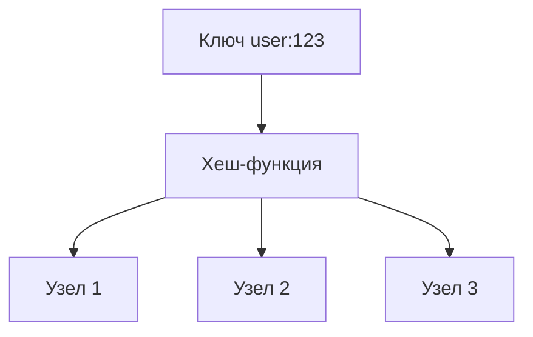

## Введение: Самый простой и самый быстрый

Представьте себе шкаф с множеством ячеек. На каждой ячейке написан номер. Вы берете предмет, кладете в ячейку и запоминаете номер. Когда вам нужно найти предмет, вы идете прямо к этой ячейке. Не нужно перебирать все ячейки, не нужно искать по содержимому — вы знаете номер, и предмет находится мгновенно.

Это и есть модель "ключ-значение". Самая простая и самая древняя структура данных в информатике. Словарь (dictionary), ассоциативный массив (associative array), хеш-таблица (hash table), карта (map) — все это разные названия одной и той же идеи.

**Key-value база данных (хранилище "ключ-значение")** — это база данных, которая хранит данные как коллекцию пар "ключ-значение". Ключ уникален и используется для доступа к значению. Значение — это произвольные данные (строка, число, JSON, бинарный объект), которые база данных не интерпретирует.

Это не просто "еще один тип NoSQL". Это фундаментальная абстракция, на которой построены многие другие системы. Документо-ориентированные базы? Документ — это значение, а _id — это ключ. Колоночные базы? Первичный ключ — это ключ, а остальные колонки — значения. Кеширующие системы? Идеальный пример key-value.

Key-value хранилища — это максимальная простота и максимальная скорость. Никаких JOIN, никаких сложных запросов, никаких схем. Просто положить и получить.
## Основные принципы

### Ключ (Key)

Ключ — это уникальный идентификатор, по которому вы получаете доступ к данным. Ключ может быть:

| Тип ключа | Пример | Особенности |
| :--- | :--- | :--- |
| **Целое число** | `123`, `100500` | Компактный, быстрый, но неинформативный |
| **Строка** | `"user:123"`, `"session:abc123"` | Информативный, может содержать префиксы |
| **Бинарный** | UUID, хеш | Компактный, но нечитаемый |
| **Составной** | `"order:2024-01-01:123"` | Кодирует несколько параметров в ключе |

**Важные свойства ключей:**
- Уникальность: два значения не могут иметь одинаковый ключ
- Простота сравнения: ключи должны быстро сравниваться
- Равномерное распределение: для шардирования

### Значение (Value)

Значение — это любые данные, которые вы хотите сохранить. Key-value база данных не интерпретирует содержимое значения. Для нее это просто последовательность байтов.

| Тип значения | Пример | Когда использовать |
| :--- | :--- | :--- |
| **Строка** | `"Hello, world!"` | Простые сообщения |
| **Число** | `42`, `3.14159` | Счетчики, метрики |
| **JSON** | `{"name":"Иван","age":30}` | Структурированные данные |
| **Бинарный** | изображение, видео | Файлы, блобы |
| **Сериализованный объект** | Protocol Buffer, MessagePack, Pickle | Сложные структуры |

### Операции

Key-value хранилища поддерживают минимальный, но очень быстрый набор операций.

| Операция | Описание | Сложность |
| :--- | :--- | :--- |
| `GET(key)` | Получить значение по ключу | O(1) |
| `SET(key, value)` | Записать значение по ключу | O(1) |
| `DELETE(key)` | Удалить пару ключ-значение | O(1) |
| `EXISTS(key)` | Проверить существование ключа | O(1) |
| `INCR(key)` | Атомарно увеличить числовое значение | O(1) |
| `EXPIRE(key, ttl)` | Установить время жизни | O(1) |

**Примеры (Redis):**

```bash
# Простейшие операции
SET user:123 "{\"name\":\"Иван\"}"
GET user:123
DEL user:123

# Работа со сроками жизни
SET session:abc123 "user_id=123" EX 3600   # Живет 1 час
EXPIRE temp:data 60                        # Умрет через 60 секунд
TTL session:abc123                         # Сколько осталось

# Атомарные операции со счетчиками
INCR page:home:views                       # Увеличить на 1
INCRBY page:home:views 100                 # Увеличить на 100
DECR inventory:123                         # Уменьшить на 1
```

## Как это работает под капотом

### Хеш-таблица (In-Memory)

Для in-memory key-value хранилищ (Redis, Memcached) используется хеш-таблица.

```
Хеш-таблица:

[0] → "user:123" → указатель на значение
[1] → NULL
[2] → "session:abc" → указатель на значение
[3] → "user:456" → указатель на значение
...
```

- **Время доступа:** O(1) в среднем
- **Память:** Данные хранятся в RAM
- **Долговечность:** Требуется персистентность (снапшоты, AOF)

### LSM-Tree (On-Disk)

Для дисковых key-value хранилищ (RocksDB, LevelDB, Badger) используется LSM-Tree (Log-Structured Merge-Tree).

```
Запись → MemTable (в памяти) → SSTable на диске → Компакция
```

- **Время доступа:** O(log N) с амортизацией
- **Память:** Основные данные на диске, кеш в памяти
- **Долговечность:** Встроенная (WAL)

### Распределенная хеш-таблица (DHT)

Для распределенных key-value хранилищ (DynamoDB, Cassandra в режиме KV, Riak) используется DHT.



- **Масштабирование:** Горизонтальное
- **Согласованность:** Настраиваемая (eventual/strong)
- **Доступность:** Высокая (репликация)

## Популярные key-value базы данных

### Redis (Remote Dictionary Server)

Самая популярная key-value БД. Работает в памяти, но может сохранять данные на диск.

```bash
# Redis — не только строки, но и структуры данных
SET user:123 "Иван"
HSET user:456 name "Петр" age 25           # Хеш
LPUSH queue:jobs "task1" "task2"           # Список
SADD tags:news "sport" "politics"          # Множество
ZADD leaderboard 100 "Иван" 200 "Петр"     # Сортированное множество

# Публикация/подписка
PUBLISH channel:news "Breaking news"
SUBSCRIBE channel:news
```

**Характеристики:**
- In-memory (оперативная память)
- Поддерживает сложные структуры данных (хеши, списки, множества, битовые карты)
- Репликация, персистентность (RDB, AOF)
- Lua-скриптинг
- Pub/Sub, Streams

**Когда использовать:**
- Кеширование
- Сессии пользователей
- Очереди (через списки)
- Счетчики и метрики
- Лимитирование (rate limiting)
- Лидерборды (через sorted sets)

**Когда НЕ использовать:**
- Большие объемы данных (дорого хранить в RAM)
- Сложные запросы (нет индексов по значениям)
- Долговременное хранение (есть риск потери при сбое)

### Memcached

Простой in-memory кеш, без персистентности и сложных структур.

```bash
# Memcached — только строки
set user:123 0 3600 15
Иван Петрович
STORED

get user:123
VALUE user:123 0 15
Иван Петрович
END
```

**Характеристики:**
- Только key-value (нет структур данных)
- Нет персистентности (только кеш)
- Максимальная производительность (проще Redis)
- Распределенный хешинг (consistent hashing)

**Когда использовать:**
- Простой кеш без сложных потребностей
- Когда Redis избыточен

### RocksDB / LevelDB

Встраиваемые key-value библиотеки на диске (LSM-Tree).

```cpp
// RocksDB (C++)
rocksdb::DB* db;
rocksdb::DB::Open(options, "/path/to/db", &db);
db->Put(rocksdb::WriteOptions(), "key", "value");
db->Get(rocksdb::ReadOptions(), "key", &value);
```

**Характеристики:**
- Встраиваемая (embedded) — работает внутри приложения
- Дисковое хранилище (LSM-Tree)
- Высокая производительность записи
- Сжатие данных

**Когда использовать:**
- База внутри приложения (не сервер)
- Высокая нагрузка на запись
- Ограниченная оперативная память

### Amazon DynamoDB (режим Key-Value)

Управляемая облачная key-value БД.

```javascript
// AWS SDK
await dynamodb.put({
    TableName: 'Users',
    Item: { userId: '123', name: 'Иван', age: 30 }
});

const result = await dynamodb.get({
    TableName: 'Users',
    Key: { userId: '123' }
});
```

**Характеристики:**
- Полностью управляемый сервис AWS
- Автоматическое масштабирование
- Настраиваемая согласованность
- Глобальные таблицы (мульти-регион)

**Когда использовать:**
- Проекты на AWS
- Нужно автоматическое масштабирование
- Нет желания администрировать Redis

### Riak / Riak KV

Распределенная AP-система (по CAP-теореме).

**Характеристики:**
- Высокая доступность (AP)
- Репликация, автоматическое восстановление
- Ссылочные типы данных (CRDTs)

**Когда использовать:**
- Высокая доступность важнее согласованности
- Распределенная система без единой точки отказа

## Продвинутые паттерны использования

### Паттерн 1: Кеширование (Cache-Aside)

Самый распространенный паттерн. Приложение сначала проверяет кеш, при промахе — идет в основную БД.

```javascript
async function getUser(userId) {
    // 1. Проверяем кеш (Redis)
    let user = await redis.get(`user:${userId}`);
    if (user) {
        return JSON.parse(user);
    }
    
    // 2. Промах кеша — идем в PostgreSQL
    user = await db.users.findOne({ id: userId });
    
    // 3. Сохраняем в кеш на 5 минут
    await redis.set(`user:${userId}`, JSON.stringify(user), 'EX', 300);
    
    return user;
}
```

**Варианты:**
- **Write-through:** Запись сначала в кеш, потом в БД
- **Write-behind:** Запись в кеш, асинхронно в БД
- **Cache-aside (lazy loading):** Загрузка только при обращении

### Паттерн 2: Счетчики и лимитирование

Атомарные операции инкремента идеальны для счетчиков.

```javascript
// Счетчик просмотров страницы
async function recordPageView(pageId) {
    await redis.incr(`page:${pageId}:views`);
}

// Rate limiting (не более 100 запросов в минуту)
async function checkRateLimit(userId) {
    const key = `rate:${userId}:${Math.floor(Date.now() / 60000)}`;
    const count = await redis.incr(key);
    if (count === 1) {
        await redis.expire(key, 60);  // Живет 1 минуту
    }
    return count <= 100;
}
```

### Паттерн 3: Сессии пользователей

Хранение сессий — классический use case для key-value.

```javascript
// Сохранение сессии при логине
await redis.setex(
    `session:${sessionId}`,
    86400,  // 24 часа
    JSON.stringify({ userId: 123, role: 'admin', ip: '1.2.3.4' })
);

// Проверка сессии при каждом запросе
const session = await redis.get(`session:${sessionId}`);
if (!session) {
    return res.status(401).json({ error: 'Unauthorized' });
}
```

### Паттерн 4: Очереди (Redis Lists)

```javascript
// Producer
await redis.lpush('queue:emails', JSON.stringify({ to: 'user@example.com', subject: 'Hello' }));

// Consumer (блокирующий)
const task = await redis.brpop('queue:emails', 5);  // Ждет до 5 секунд
if (task) {
    processEmail(JSON.parse(task[1]));
}
```

### Паттерн 5: Лидерборды (Redis Sorted Sets)

```javascript
// Добавление очков
await redis.zincrby('leaderboard:game1', 100, 'user:123');
await redis.zincrby('leaderboard:game1', 50, 'user:456');

// Топ-10 игроков
const top10 = await redis.zrevrange('leaderboard:game1', 0, 9, 'WITHSCORES');

// Ранг игрока
const rank = await redis.zrevrank('leaderboard:game1', 'user:123');
```

### Паттерн 6: Распределенные блокировки (Redis)

```javascript
// Блокировка с таймаутом (чтобы не повисла)
const lockKey = `lock:resource:${resourceId}`;
const lockAcquired = await redis.set(lockKey, processId, 'NX', 'EX', 10);

if (lockAcquired) {
    try {
        // Критическая секция
        await doSomething();
    } finally {
        await redis.del(lockKey);
    }
} else {
    throw new Error('Resource locked');
}
```

**Важно:** Redis не гарантирует идеальные распределенные блокировки (есть проблема с часами и сетевыми задержками). Для критичных случаев используйте Redlock или ZooKeeper.

### Паттерн 7: Геопространственные запросы (Redis)

```bash
# Добавление точек
GEOADD locations 37.617 55.752 "Moscow"
GEOADD locations -73.935 40.730 "New York"

# Поиск в радиусе 1000 км от Москвы
GEORADIUS locations 37.617 55.752 1000 km

# Расстояние между городами
GEODIST locations Moscow "New York" km
```

## Плюсы и минусы key-value хранилищ

### Плюсы

| Плюс | Описание |
| :--- | :--- |
| **Максимальная производительность** | O(1) доступ, микросекундные задержки |
| **Простота** | Нет схем, нет сложных запросов |
| **Горизонтальное масштабирование** | Отлично шардируется по ключу |
| **Низкая задержка** | Особенно у in-memory решений |
| **Высокая доступность** | Легко реплицируется |

### Минусы

| Минус | Описание |
| :--- | :--- |
| **Поиск только по ключу** | Нельзя искать по значению или по части ключа |
| **Нет связей** | Нет JOIN, нет ссылочной целостности |
| **Ограниченные запросы** | Нет агрегаций, группировок, оконных функций |
| **Ограниченная память (in-memory)** | RAM дороже диска |
| **Eventual consistency** | Некоторые системы не гарантируют сильную согласованность |

## Key-value в сравнении с другими типами NoSQL

| Характеристика | Key-value | Документная | Колоночная | Графовая |
| :--- | :--- | :--- | :--- | :--- |
| **Модель данных** | Пары ключ-значение | JSON-документы | Колонки | Вершины и ребра |
| **Поиск по значению** | Нет (только по ключу) | Да | Да | Да |
| **Сложные запросы** | Нет | Ограниченно | Да (аналитика) | Да (обход графа) |
| **Вложенные данные** | Нет (но value может быть JSON) | Да | Нет | Да |
| **Связи** | Нет | Ограниченно ($lookup) | Нет | Да (основная модель) |
| **Производительность** | Максимальная | Высокая | Высокая (аналитика) | Средняя |
| **Типичное применение** | Кеш, сессии | Каталоги, CMS | Аналитика | Соцсети, рекомендации |

## Когда выбирать key-value

### Идеальные сценарии

| Сценарий | Почему подходит |
| :--- | :--- |
| **Кеширование** | Быстрый доступ, TTL, не требуется постоянное хранение |
| **Сессии пользователей** | Доступ по session_id, короткое время жизни |
| **Счетчики и метрики** | Атомарные операции инкремента |
| **Очереди задач** | LPUSH/RPOP, блокирующие операции |
| **Лимитирование (rate limiting)** | Окна времени, счетчики |
| **Лидерборды** | Сортированные множества |
| **Распределенные блокировки** | SET NX EX |
| **Pub/Sub** | Легковесные уведомления |

### Сомнительные сценарии

| Сценарий | Почему плохо подходит |
| :--- | :--- |
| **Сложные запросы** (WHERE age > 18 AND city = 'Москва') | Нет индексов по значениям |
| **Связи между объектами** (JOIN) | Нет реляционной модели |
| **Аналитика и отчеты** | Нет агрегаций |
| **Большие объемы данных** | In-memory дорого, дисковые KV медленнее |
| **Долговременное хранение критичных данных** | Некоторые KV (Memcached) не имеют персистентности |

## Выбор key-value базы данных: Сравнение

| Критерий | Redis | Memcached | RocksDB | DynamoDB |
| :--- | :--- | :--- | :--- | :--- |
| **Хранение** | In-memory + disk (опционально) | In-memory | Disk (LSM) | SSD (управляемый) |
| **Структуры данных** | Строки, хеши, списки, множества, ZSET, битмапы, гео | Только строки | Строки, колонки | Документы, ключ-значение |
| **Персистентность** | RDB, AOF | Нет | Да (на диске) | Да (облачная) |
| **Репликация** | Master-replica, Sentinel, Cluster | Нет | Встраиваемая | Автоматическая (глобальные таблицы) |
| **Транзакции** | Lua-скрипты (атомарно), MULTI/EXEC | Нет | Да (ACID на уровне одной операции) | Транзакции на нескольких элементах |
| **Масштабирование** | Cluster (шардирование) | Consistent hashing | Встраиваемая | Автоматическое |
| **Сложность администрирования** | Средняя | Низкая | Низкая (embedded) | Нулевая (управляемая) |
| **Цена** | Бесплатно (open source) | Бесплатно | Бесплатно | Платно (по запросам) |

## Проектирование ключей

В key-value хранилищах проектирование ключей — это искусство. Поскольку нельзя искать по значению, всю логику запроса нужно закодировать в ключе.

### Стратегии именования ключей

**Использование префиксов:**

```
user:123
user:456:profile
session:abc123
order:2024-01-01:123
```

**Использование составных ключей (с разделителем):**

```
"user:123:profile"
"user:123:settings"
"user:123:orders:2024-01"
```

**Использование хешей для группировки (Redis):**

```bash
HSET user:123 name "Иван" email "ivan@example.com" age 30
HGET user:123 name
HGETALL user:123
```

### Шаблоны хороших ключей

| Шаблон | Пример | Почему хорошо |
| :--- | :--- | :--- |
| `entity:id` | `user:123` | Просто, понятно, легко удалить группу через `SCAN user:*` |
| `entity:id:attribute` | `user:123:email` | Позволяет обновлять отдельные атрибуты |
| `entity:id:range:date` | `order:2024-01:123` | Позволяет сканировать диапазоны (с осторожностью) |
| `namespace:entity:id` | `app1:user:123` | Изоляция между приложениями/арендаторами |

### Чего избегать в ключах

| Антипаттерн | Почему плохо | Пример |
| :--- | :--- | :--- |
| **Слишком длинные ключи** | Занимают память, замедляют сравнение | `"very_long_namespace_for_user_profile_information_123"` |
| **Случайные ключи** | Плохое распределение в DHT | UUID v4 в качестве ключа |
| **Ключи без префиксов** | Нельзя найти все записи одного типа | `"123"` (что это? user? order?) |
| **Ключи с пробелами и спецсимволами** | Проблемы с экранированием | `"user:Иван Иванов"` |

## Распространенные ошибки

### Ошибка 1: Использование Redis как единственной БД

Redis — это не замена PostgreSQL. Он не поддерживает сложные запросы, не гарантирует долговечность (в режиме по умолчанию), не умеет в JOIN.

**Как исправить:** Используйте Redis как кеш или для специфических задач, но основное хранилище — реляционная или документная БД.

### Ошибка 2: Хранение больших значений в Redis

Redis загружает все данные в память. Хранение гигабайтных значений (видео, изображений) разорительно.

**Как исправить:** Для больших объектов используйте S3, MinIO, Blob Storage. В Redis храните только ссылки (URL, ключи).

### Ошибка 3: Игнорирование TTL (времени жизни)

Данные в кеше накапливаются, память заканчивается, сервер падает.

**Как исправить:** Всегда устанавливайте TTL для кешируемых данных. Используйте политики вытеснения (LRU, LFU).

### Ошибка 4: Использование KEYS в Redis (продакшн)

```bash
# Опасно! Блокирует сервер на время сканирования всех ключей
KEYS user:*

# Безопасно
SCAN 0 MATCH user:* COUNT 100
```

### Ошибка 5: Наивные распределенные блокировки

```javascript
// Плохо (нет таймаута)
await redis.set('lock:resource', processId);
// ... если процесс упадет, блокировка останется навсегда
```

**Как исправить:** Используйте SET NX EX или Redlock.

## Резюме для системного аналитика

1. **Key-value хранилища — самые простые и самые быстрые среди NoSQL.** Доступ по ключу за O(1), никаких сложных запросов, никаких схем. Идеальны для кеширования, сессий, счетчиков, очередей.

2. **Главное ограничение — только доступ по ключу.** Нельзя искать по значению, нельзя делать JOIN, нельзя выполнять сложные агрегации. Если вам нужен поиск по полям — выбирайте документную или реляционную БД.

3. **Redis — король key-value.** In-memory, богатые структуры данных, Lua-скриптинг, репликация, персистентность. Memcached — проще, быстрее, но без структур данных и персистентности.

4. **Встраиваемые KV (RocksDB, LevelDB) — для приложений, которым нужна локальная база.** Высокая производительность записи, дисковое хранение, работает внутри вашего процесса.

5. **Две основные модели персистентности:** in-memory (Redis, Memcached) — максимальная скорость, но данные в RAM; on-disk (RocksDB) — больше места, но медленнее.

6. **Проектирование ключей — ключевой навык.** Хороший ключ должен быть коротким, информативным, равномерно распределенным. Используйте префиксы и разделители.