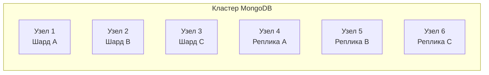
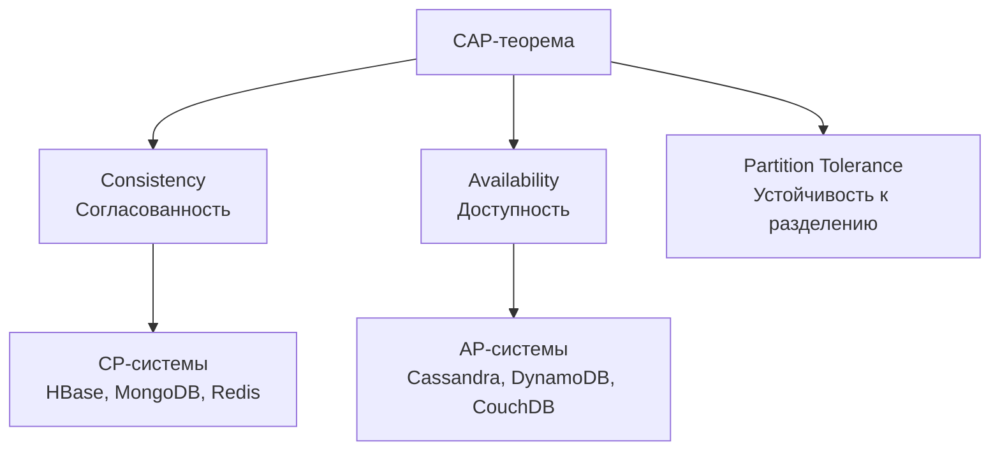

## Введение: За пределами строгих таблиц

Представьте, что вы ведете записную книжку. В ней есть место для имени, телефона и адреса. Все записи имеют одинаковую структуру. Это удобно, пока все контакты одинаковы. Но что, если у одного контакта есть три телефона и два адреса, у другого — только email и никнейм в соцсети, а у третьего — вообще только имя и заметка "познакомились на конференции"? Ваша строгая таблица начнет трещать по швам: придется добавлять пустые столбцы, создавать дополнительные таблицы для телефонов и адресов.

**Реляционные базы данных** (SQL) — это как таблицы в Excel. Строгая схема, четкие связи, единая структура для всех строк. Это идеально для банковских транзакций, учета товаров, систем бронирования — там, где данные предсказуемы, а целостность критична.

**Нереляционные базы данных** (NoSQL — "Not Only SQL") — это другой подход. Они не требуют фиксированной схемы, позволяют хранить данные в разных форматах (документы, графы, пары "ключ-значение"), легко масштабируются на тысячи серверов. Это идеально для больших данных, социальных сетей, каталогов товаров с разными характеристиками, систем реального времени.

Нереляционные базы данных — это не "замена" реляционным, а инструмент для других задач. Они решают проблемы, с которыми классические SQL-базы справляются плохо или не справляются вовсе.

## Почему появились нереляционные БД

Реляционные базы данных доминировали с 1970-х годов. Но в конце 2000-х — начале 2010-х годов мир изменился.

### Проблема масштабирования

Интернет-гиганты (Google, Amazon, Facebook) столкнулись с объемами данных, которые реляционные базы не могли обрабатывать. Триллионы записей, миллионы запросов в секунду. Вертикальное масштабирование (более мощный сервер) уперлось в потолок. Нужно было горизонтальное масштабирование — тысячи дешевых серверов, работающих как один.

Реляционные базы данных были спроектированы для работы на одном мощном сервере. Распределение данных между множеством серверов (шардирование) возможно, но сложно и требует ручного управления.

### Проблема гибкости схемы

В современном мире данные часто не имеют фиксированной структуры. Товар в интернет-магазине: у телефона — одни характеристики (диагональ экрана, объем памяти), у одежды — другие (размер, материал, цвет). В реляционной базе это либо EAV-антипаттерн (таблица "свойства"), либо постоянные ALTER TABLE для добавления новых столбцов.

### Проблема производительности

Некоторые операции в реляционных базах данных дороги. JOIN на десятках миллионов записей может выполняться секунды. Агрегации на терабайтах данных — минуты. Для определенных сценариев (логи, временные ряды, кеширование) нужны специализированные решения.

### Проблема сложности

Для простых задач (хранилище "ключ-значение") реляционная база — это тяжелый молоток для маленького гвоздя. ACID, транзакции, индексы — все это создает накладные расходы, которые не нужны, если вы просто хотите сохранить и прочитать значение по ключу.

## Что объединяет нереляционные БД

Несмотря на разнообразие, все нереляционные базы данных имеют общие черты.

### Отсутствие фиксированной схемы (Schema-less)

В реляционной базе вы сначала определяете схему (таблицы, столбцы, типы данных), потом вставляете данные. В нереляционных базах схема не требуется — вы просто сохраняете данные, и они сами определяют свою структуру.

```javascript
// В документо-ориентированной БД (MongoDB)
// Документ 1 (телефон)
{
    "_id": "123",
    "name": "Иван",
    "phone": "+7-999-123-45-67"
}

// Документ 2 (телефон + email + адрес)
{
    "_id": "456",
    "name": "Петр",
    "phone": "+7-999-765-43-21",
    "email": "petr@example.com",
    "address": "Москва, ул. Тверская, 1"
}

// Документ 3 (только имя и заметка)
{
    "_id": "789",
    "name": "Анна",
    "note": "Познакомились на конференции"
}
```

Одна коллекция (аналог таблицы) может содержать документы разной структуры. Это называется "схема на чтение" (schema-on-read), в отличие от реляционного "схема на запись" (schema-on-write).

### Горизонтальное масштабирование

Нереляционные базы данных спроектированы для работы на кластерах из сотен и тысяч серверов. Данные автоматически распределяются между узлами (шардирование). При добавлении нового сервера данные перераспределяются без остановки системы.



### Ослабленные гарантии ACID (частично)

Многие нереляционные базы данных жертвуют некоторыми свойствами ACID ради производительности и масштабируемости. Это не значит, что они "плохие" — просто они делают другой выбор.

| Гарантия | Реляционные БД | Нереляционные БД |
| :--- | :--- | :--- |
| **Атомарность** | Полная (транзакции) | Часто только на уровне одного документа/записи |
| **Согласованность** | Сильная (ACID Consistency) | Часто "eventual consistency" (данные согласуются со временем) |
| **Изоляция** | Полная (уровни изоляции) | Ослабленная или отсутствует |
| **Долговечность** | Полная (WAL, синхронная запись) | Может быть асинхронной |

Это не недостаток, а осознанный компромисс. Для многих приложений (социальные сети, аналитика, логи) не требуется строгая ACID. Лайк под постом может появиться не мгновенно у всех пользователей — это нормально.

### Специализированные модели данных

Вместо универсальной табличной модели, нереляционные базы данных используют специализированные модели под конкретные задачи:

| Модель | Примеры БД | Лучше всего для |
| :--- | :--- | :--- |
| **Ключ-значение** | Redis, DynamoDB, Riak | Кеширование, сессии, простые хранилища |
| **Документо-ориентированные** | MongoDB, Couchbase, Firestore | Каталоги товаров, CMS, логи, JSON-данные |
| **Колоночные** | Cassandra, HBase, ClickHouse | Аналитика, временные ряды, большие данные |
| **Графовые** | Neo4j, ArangoDB, Amazon Neptune | Социальные сети, рекомендации, поиск путей |

## CAP-теорема: Почему нереляционные БД такие, какие есть

CAP-теорема — это фундаментальное ограничение распределенных систем. Она гласит, что распределенная система может обеспечить только два из трех свойств одновременно:

| Свойство | Описание |
| :--- | :--- |
| **Consistency (C)** | Все узлы видят одни и те же данные одновременно. Если вы записали значение, любой последующий чтение вернет его |
| **Availability (A)** | Каждый запрос получает ответ (даже если данные не самые свежие). Система всегда доступна |
| **Partition tolerance (P)** | Система продолжает работать даже при разрыве связи между узлами |

**Смысл CAP-теоремы:** При сетевом разделении (часть узлов не может связаться с другой частью) вы должны выбрать:
- **CP (Consistency + Partition tolerance):** Жертвуете доступностью. Система может отказать в ответе, чтобы не отдавать устаревшие данные. Пример: большинство реляционных баз в распределенном режиме.
- **AP (Availability + Partition tolerance):** Жертвуете согласованностью. Система всегда отвечает, но может отдать устаревшие данные. Пример: Cassandra, DynamoDB.
- **CA (Consistency + Availability):** Не может работать при сетевом разделении. Практически недостижимо в распределенных системах.



**Что это значит для СА:**
- Если вам нужна строгая согласованность (как в банке), выбирайте CP-систему и будьте готовы к возможной недоступности при сетевых проблемах.
- Если вам нужна высокая доступность (социальная сеть, интернет-магазин), выбирайте AP-систему и проектируйте приложение с учетом eventual consistency.

## Основные типы нереляционных БД

### Ключ-значение (Key-Value Stores)

Самая простая модель. Данные хранятся как коллекция пар "ключ-значение". Ключ уникален, значение — произвольные данные (строка, число, JSON, бинарные данные).

```javascript
// Redis
SET user:123 '{"name": "Иван", "email": "ivan@example.com"}'
GET user:123
```

**Характеристики:**
- Максимальная производительность (O(1) доступ по ключу)
- Простейшее масштабирование (шардирование по ключу)
- Нет возможности поиска по значению (только по ключу)
- Нет связей между записями

**Примеры:** Redis, Amazon DynamoDB (режим ключ-значение), Riak, Memcached.

**Когда использовать:**
- Кеширование (сессии пользователей, результаты запросов)
- Хранилище корзин покупок
- Настройки и конфигурации
- Очереди и стриминг (Redis)

### Документо-ориентированные (Document Stores)

Данные хранятся как документы (обычно в JSON или BSON). Документы сгруппированы в коллекции (аналог таблиц). Каждый документ может иметь свою структуру.

```javascript
// MongoDB
db.users.insertOne({
    name: "Иван",
    email: "ivan@example.com",
    address: {
        city: "Москва",
        street: "Тверская",
        zip: "101000"
    },
    orders: [
        { id: 1001, total: 5000 },
        { id: 1002, total: 3000 }
    ]
});

// Поиск по вложенным полям
db.users.find({ "address.city": "Москва" });
```

**Характеристики:**
- Гибкая схема — документы разной структуры в одной коллекции
- Поддержка индексов на любых полях (включая вложенные)
- Возможность поиска и агрегации (JOIN через $lookup, но это дорого)
- Хорошая поддержка транзакций (в современных версиях)

**Примеры:** MongoDB, Couchbase, CouchDB, Firestore.

**Когда использовать:**
- Каталоги товаров с разными характеристиками
- Системы управления контентом (CMS)
- Логи и события (каждый лог — документ)
- JSON-данные от API

### Колоночные (Column-Family Stores / Wide-Column Stores)

Данные хранятся не по строкам, а по колонкам. Это позволяет эффективно читать только нужные колонки, что критично для аналитики на больших объемах.

**Реляционная таблица (строковое хранение):**

| id | name | age | city | salary |
| :--- | :--- | :--- | :--- | :--- |
| 1 | Иван | 30 | Москва | 50000 |
| 2 | Петр | 25 | СПб | 45000 |
| 3 | Анна | 35 | Казань | 55000 |

На диске: `1,Иван,30,Москва,50000,2,Петр,25,СПб,45000,3,Анна,35,Казань,55000`

**Колоночное хранение (например, Cassandra, ClickHouse):**

На диске: `Иван,Петр,Анна,30,25,35,Москва,СПб,Казань,50000,45000,55000`

```sql
-- Cassandra (CQL)
CREATE TABLE users (
    user_id UUID PRIMARY KEY,
    name TEXT,
    age INT,
    city TEXT,
    email TEXT
);

-- Запрос — эффективен, если данные распределены правильно
SELECT name, age FROM users WHERE user_id = 123;
```

**Характеристики:**
- Очень высокая производительность для аналитических запросов (чтение нескольких колонок из миллиардов строк)
- Отличное сжатие (значения одной колонки часто повторяются)
- Горизонтальное масштабирование
- Сложные JOIN не поддерживаются

**Примеры:** Cassandra, HBase, ClickHouse, Bigtable (Google).

**Когда использовать:**
- Аналитика больших данных (Data Warehouse)
- Временные ряды (метрики, IoT, логи)
- Системы с огромными объемами записи
- Приложения, где важна производительность чтения нескольких колонок

### Графовые (Graph Databases)

Данные хранятся как вершины (узлы) и ребра (связи). Оптимизированы для обхода связей.

```cypher
// Neo4j
CREATE (ivan:Person {name: "Иван", age: 30})
CREATE (petr:Person {name: "Петр", age: 25})
CREATE (anna:Person {name: "Анна", age: 35})
CREATE (ivan)-[:FRIEND]->(petr)
CREATE (ivan)-[:FRIEND]->(anna)
CREATE (petr)-[:KNOWS]->(anna)

// Найти друзей друзей Ивана
MATCH (ivan:Person {name: "Иван"})-[:FRIEND]->(friend)-[:FRIEND]->(friendOfFriend)
RETURN DISTINCT friendOfFriend.name
```

**Характеристики:**
- Очень быстрые запросы на обход связей (в отличие от SQL с множественными JOIN)
- Естественное представление связанных данных
- Сложность масштабирования (графы плохо шардируются)

**Примеры:** Neo4j, ArangoDB, Amazon Neptune, JanusGraph.

**Когда использовать:**
- Социальные сети (друзья, подписчики, рекомендации)
- Системы рекомендаций ( "пользователи, купившие этот товар, также купили...")
- Обнаружение мошенничества (связи между счетами, транзакциями)
- Управление доступом и правами (кто кому что разрешил)
- Поиск путей (логистика, маршрутизация)

## Сравнение с реляционными БД

| Характеристика | Реляционные (SQL) | Нереляционные (NoSQL) |
| :--- | :--- | :--- |
| **Модель данных** | Таблицы со строками и столбцами | Документы, ключ-значение, колонки, графы |
| **Схема** | Фиксированная (schema-on-write) | Гибкая (schema-on-read) |
| **Транзакции** | Полная поддержка ACID | Ограниченная (часто только на уровне документа) |
| **Связи** | Через внешние ключи (JOIN) | Встроенные документы или ссылки (JOIN дороги) |
| **Масштабирование** | Вертикальное (реже горизонтальное) | Горизонтальное (из коробки) |
| **Язык запросов** | SQL (стандартизированный) | Специфичный для каждой БД (MongoDB Query, Cypher, CQL) |
| **Согласованность** | Сильная (ACID) | Часто eventual consistency |
| **Производительность чтения** | Хорошая (с индексами) | Очень хорошая для специализированных сценариев |
| **Производительность записи** | Хорошая (с транзакциями) | Очень хорошая (асинхронная, без блокировок) |
| **Сложность** | Высокая (нормализация, оптимизация) | Средняя (простые модели, но компромиссы) |

## Когда использовать нереляционные БД

### Признаки, что NoSQL подходит

| Признак | Пример |
| :--- | :--- |
| **Данные не имеют фиксированной схемы** | Товары с разными характеристиками, пользовательские настройки |
| **Горизонтальное масштабирование критично** | Ожидаются миллиарды записей и миллионы запросов в секунду |
| **Высокая доступность важнее строгой согласованности** | Социальные сети, аналитика, системы реального времени |
| **Простые операции (в основном по ключу)** | Кеш, хранилище сессий |
| **Сложные связи между данными** (графы) | Социальные сети, рекомендации |
| **Аналитика на огромных объемах** (колоночные) | Хранилища данных, временные ряды |

### Признаки, что лучше остаться на SQL

| Признак | Пример |
| :--- | :--- |
| **Строгая согласованность обязательна** | Финансовые транзакции, системы бронирования |
| **Сложные запросы с JOIN** | Отчеты, связывающие 10+ таблиц |
| **Данные легко нормализуются** | Классический учет: клиенты, заказы, товары |
| **Нужны сложные транзакции** | Перевод денег между счетами, оформление заказа |
| **Команда не имеет опыта работы с NoSQL** | Реляционные базы более предсказуемы и документированы |

## Распространенные ошибки при выборе NoSQL

### Ошибка 1: "NoSQL всегда быстрее SQL"

NoSQL быстрее для определенных паттернов доступа (чтение по ключу, колоночные запросы). Но для сложных запросов с агрегациями и JOIN реляционная база может оказаться быстрее и удобнее.

### Ошибка 2: "Нереляционные БД не нуждаются в проектировании"

Отсутствие фиксированной схемы не означает отсутствие проектирования. В NoSQL нужно проектировать модель данных под конкретные запросы (в отличие от SQL, где модель нормализуется независимо от запросов).

### Ошибка 3: "Одна NoSQL БД на все случаи жизни"

Разные типы NoSQL решают разные задачи. Документо-ориентированная база не подойдет для графовых запросов, а графовая — для простого кеширования.

### Ошибка 4: "NoSQL означает отсутствие транзакций"

Современные NoSQL-базы (MongoDB, Cassandra) поддерживают транзакции, но с ограничениями (часто только на уровне одного документа или с производительностью хуже, чем в SQL).

### Ошибка 5: "Миграция с SQL на NoSQL решит все проблемы"

Миграция с SQL на NoSQL — это не замена двигателя в машине, а пересадка с автомобиля на лодку. Если ваша проблема в производительности SQL, скорее всего, проблема в индексах, запросах или нормализации, а не в самой SQL.

## Резюме для системного аналитика

1. **Нереляционные базы данных — это не замена SQL, а инструмент для других задач.** Они решают проблемы, с которыми классические реляционные базы справляются плохо: гибкая схема, горизонтальное масштабирование, высокие нагрузки на запись.

2. **Основные типы:** ключ-значение (кеширование), документо-ориентированные (каталоги, CMS), колоночные (аналитика, временные ряды), графовые (социальные сети, рекомендации).

3. **CAP-теорема** объясняет компромиссы: в распределенных системах нужно выбирать между согласованностью и доступностью. Большинство NoSQL-систем выбирают доступность (AP-системы).

4. **Отсутствие фиксированной схемы** ("schema-less") — это "схема на чтение", а не отсутствие схемы вообще. Данные все равно имеют структуру, просто она не проверяется при записи.

5. **Транзакции и ACID** в NoSQL ослаблены. Многие системы предлагают только атомарность на уровне одного документа или eventual consistency. Это нормально для многих приложений, но неприемлемо для финансовых систем.

6. **Горизонтальное масштабирование** — главное преимущество NoSQL. Шардирование, репликация, автоматическое перераспределение данных — все это работает "из коробки".