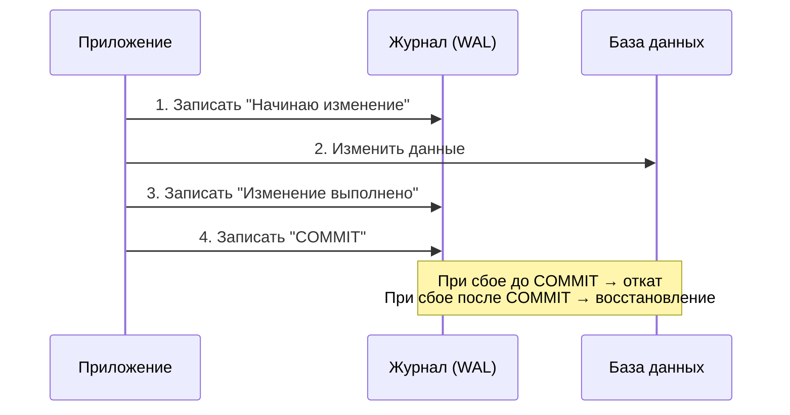

## Введение: Четыре стража надежности

Представьте, что вы отправляете деньги другу через банковское приложение. Вы нажимаете кнопку “Перевести”, и приложение сообщает: “Операция выполнена успешно”. Что вы ожидаете от банковской системы?

Вы ожидаете, что:
- Деньги не потеряются и не размножатся (либо спишутся с вашего счета и зачислятся другу, либо ничего не произойдет).
- Ваши деньги не исчезнут из-за того, что в тот же момент кто-то еще переводил деньги с того же счета.
- После того как система сказала “успешно”, деньги действительно переведены, даже если сразу после этого отключат электричество.

Эти ожидания описываются четырьмя свойствами, которые вместе образуют аббревиатуру **ACID**. ACID — это фундамент надежности реляционных баз данных. Это набор гарантий, которые база данных дает разработчикам и бизнесу.

**ACID** расшифровывается как:

| Буква | Термин | Что означает простыми словами |
| :--- | :--- | :--- |
| **A** | Atomicity (Атомарность) | “Все или ничего”. Транзакция либо выполняется полностью, либо не выполняется вообще |
| **C** | Consistency (Согласованность) | База данных всегда остается в правильном, согласованном состоянии |
| **I** | Isolation (Изоляция) | Параллельные транзакции не мешают друг другу |
| **D** | Durability (Долговечность) | Зафиксированные данные не теряются, даже при сбое |

Эти четыре свойства работают вместе, создавая иллюзию, что база данных — это надежное, предсказуемое место для хранения информации, даже когда в реальности происходит множество параллельных операций и случаются сбои.

## Atomicity (Атомарность): Все или ничего

### Что это такое

Атомарность гарантирует, что транзакция — это неделимая единица работы. Либо все операции внутри транзакции успешно применяются к базе данных, либо ни одна из них не применяется. Не бывает ситуации, когда часть операций выполнена, а часть — нет.

Слово “атомарность” происходит от греческого “atomos” — “неделимый”. Как атом долгое время считался неделимой частицей материи, так и транзакция считается неделимой с точки зрения внешнего наблюдателя.

### Пример из реальной жизни

Перевод денег между счетами состоит из двух операций:
1. Списать 100 рублей со счета А.
2. Зачислить 100 рублей на счет Б.

Если эти операции выполняются без атомарности, возможна катастрофа: деньги списаны со счета А, но из-за сбоя не зачислены на счет Б. Деньги исчезли.

Атомарность гарантирует, что в случае сбоя между операциями система автоматически откатит (отменит) уже выполненное списание. Деньги останутся на счете А, как будто ничего не начиналось.

### Как это работает под капотом

Для реализации атомарности базы данных используют журнал транзакций (Write-Ahead Log, WAL — тема отдельного документа). Принцип прост:

1. Перед тем как изменить данные на диске, база данных записывает в журнал: “Я собираюсь сделать изменение X”.
2. Только после записи в журнал изменение применяется к данным.
3. Если транзакция фиксируется, в журнал записывается маркер “COMMIT”.
4. Если происходит сбой, при восстановлении база данных читает журнал:
   - Для транзакций с маркером “COMMIT” — применяет все изменения (redo).
   - Для транзакций без маркера “COMMIT” — отменяет все изменения (undo).



### Что атомарность НЕ гарантирует

Важное уточнение: атомарность не гарантирует, что транзакция обязательно выполнится успешно. Она гарантирует только, что если транзакция не удалась, она не оставила следов. Транзакция может откатиться по многим причинам:
- Нарушение ограничений (уникальности, внешнего ключа, проверочного ограничения).
- Ошибка в коде (деление на ноль, выход за границы).
- Сбой системы или сети.
- Взаимная блокировка (deadlock).

### Атомарность в распределенных системах

В распределенных системах (транзакции, затрагивающие несколько независимых баз данных) атомарность достигается через протокол двухфазной фиксации (2PC). Однако это сложный и медленный механизм, который часто заменяют альтернативными подходами (Saga, событийная архитектура) в современных микросервисных системах.

## Consistency (Согласованность): Данные всегда правильные

### Что это такое

Согласованность гарантирует, что транзакция переводит базу данных из одного согласованного состояния в другое согласованное состояние. База данных никогда не оказывается в “плохом” состоянии, где нарушены бизнес-правила или ограничения.

Согласованность — это единственное свойство ACID, которое база данных не может обеспечить в одиночку. Она требует активного участия разработчика и аналитика.

### Два уровня согласованности

**Согласованность на уровне базы данных (ограничения):**

База данных автоматически проверяет определенные ограничения и не позволит их нарушить:
- **Уникальность (UNIQUE):** Нельзя вставить двух пользователей с одинаковым email.
- **Внешний ключ (FOREIGN KEY):** Нельзя создать заказ для несуществующего клиента.
- **Проверочное ограничение (CHECK):** Нельзя вставить возраст -5 или зарплату с 20 знаками после запятой.
- **NOT NULL:** Нельзя вставить строку без обязательного поля.

```sql
-- Эти ограничения база данных проверяет автоматически
CREATE TABLE accounts (
    id INT PRIMARY KEY,
    balance DECIMAL(10,2) CHECK (balance >= 0), -- Нельзя уйти в минус
    currency VARCHAR(3) NOT NULL
);
```

**Согласованность на уровне приложения (бизнес-правила):**

База данных не знает ваших бизнес-правил. Она не знает, что “сумма дебета должна равняться сумме кредита” или что “нельзя переводить деньги на заблокированный счет”. Эти правила должен обеспечивать код приложения внутри транзакции.

```sql
BEGIN TRANSACTION;

-- Бизнес-правило: перед переводом проверить, что счет получателя не заблокирован
IF EXISTS (SELECT 1 FROM accounts WHERE id = 2 AND status = 'blocked')
BEGIN
    ROLLBACK;
    RAISE ERROR 'Счет получателя заблокирован';
END

UPDATE accounts SET balance = balance - 100 WHERE id = 1;
UPDATE accounts SET balance = balance + 100 WHERE id = 2;

-- Бизнес-правило: проверить, что итоговая сумма всех счетов не изменилась
-- (база данных этого не умеет проверять автоматически)

COMMIT;
```

### Согласованность и ограничения

Вот что происходит, когда транзакция пытается нарушить ограничение базы данных:

```sql
-- Есть ограничение CHECK (balance >= 0)
BEGIN TRANSACTION;
UPDATE accounts SET balance = balance - 1000 WHERE id = 1; -- Баланс стал -500
COMMIT; -- Ошибка! Транзакция откатится, баланс не изменится
```

База данных не позволит зафиксировать несогласованное состояние. Транзакция откатится, и приложение получит ошибку.

### Согласованность и параллельные транзакции

Согласованность тесно связана с изоляцией. Без правильной изоляции одна транзакция может увидеть промежуточное состояние другой транзакции, которое может быть временно несогласованным.

**Пример нарушения согласованности из-за плохой изоляции:**

Транзакция A переводит деньги:
```sql
BEGIN TRANSACTION;
UPDATE accounts SET balance = balance - 100 WHERE id = 1; -- Баланс 1: 1000 → 900
UPDATE accounts SET balance = balance + 100 WHERE id = 2; -- Баланс 2: 500 → 600
COMMIT;
```

Транзакция B читает балансы в тот же момент:
```sql
SELECT balance FROM accounts WHERE id = 1; -- Видит 900 (уже списано)
SELECT balance FROM accounts WHERE id = 2; -- Видит 500 (еще не зачислено)
-- Суммарно: 900 + 500 = 1400, а должно быть 1500. Данные несогласованы!
```

Если уровень изоляции допускает “грязное чтение”, транзакция B увидит несогласованное состояние. Это нарушает принцип “база данных всегда в согласованном состоянии” с точки зрения читающей транзакции.

### Что согласованность НЕ гарантирует

Согласованность не гарантирует, что данные соответствуют реальному миру. Если приложение по ошибке перевело деньги не тому получателю, база данных будет идеально согласована — но с реальностью она не согласована. ACID не защищает от логических ошибок в коде.

## Isolation (Изоляция): Транзакции не мешают друг другу

### Что это такое

Изоляция гарантирует, что параллельно выполняющиеся транзакции не мешают друг другу. Каждая транзакция работает так, как будто она единственная в системе. Промежуточные результаты незавершенной транзакции не видны другим транзакциям.

### Зачем нужна изоляция

Без изоляции параллельные транзакции могут создавать хаос:
- Одна транзакция читает данные, которые другая транзакция еще не зафиксировала (и, возможно, откатит).
- Две транзакции одновременно обновляют одни и те же данные, и изменения одной теряются.
- Транзакция видит неполный набор данных, потому что другая транзакция добавила новые строки в середине чтения.

### Уровни изоляции (обзор)

Изоляция — это спектр, а не бинарное свойство. Существует несколько уровней изоляции, которые дают разные гарантии за разную производительность. Чем выше уровень изоляции, тем больше защита от аномалий, но тем ниже производительность и выше вероятность блокировок.

| Уровень изоляции | Какие аномалии допускает |
| :--- | :--- |
| READ UNCOMMITTED | Грязное чтение, неповторяющееся чтение, фантомы |
| READ COMMITTED | Неповторяющееся чтение, фантомы |
| REPEATABLE READ | Фантомы |
| SERIALIZABLE | Никаких |

(Подробно уровни изоляции и аномалии будут рассмотрены в следующих документах темы “Транзакции”.)

### Как реализуется изоляция

Существует два основных механизма реализации изоляции, которые часто комбинируются.

**Блокировки (Locks):**

Транзакция ставит блокировки на данные, которые читает или изменяет. Другие транзакции должны ждать, пока блокировки не будут сняты.

- Блокировки чтения (shared locks) — могут быть у нескольких транзакций одновременно.
- Блокировки записи (exclusive locks) — только у одной транзакции.

**Проблема блокировок:** взаимные блокировки (deadlocks), когда две транзакции ждут друг друга.

**Многоверсионность (MVCC — Multi-Version Concurrency Control):**

Каждая транзакция работает со своей версией данных. При изменении данных создается новая версия, а старые версии сохраняются.

- Читающие транзакции видят данные на момент начала транзакции (или на момент выполнения запроса — зависит от уровня изоляции).
- Пишущие транзакции не блокируют читающие.
- Нет “грязных чтений”, потому что незафиксированные изменения существуют только в новой версии.

**MVCC используется в:** PostgreSQL, Oracle, MySQL (InnoDB с REPEATABLE READ и выше), SQL Server (в режиме SNAPSHOT).

### Изоляция и производительность

Выбор уровня изоляции — это всегда компромисс между:
- **Целостностью данных** — насколько строго мы защищаем данные от аномалий.
- **Производительностью** — насколько быстро система обрабатывает транзакции.
- **Доступностью** — насколько часто транзакции блокируют друг друга.

Для банковского перевода нужен высокий уровень изоляции (REPEATABLE READ или SERIALIZABLE). Для отчета, где небольшая неточность не страшна, можно использовать READ COMMITTED или даже READ UNCOMMITTED.

## Durability (Долговечность): Данные не теряются

### Что это такое

Долговечность гарантирует, что после успешной фиксации транзакции (COMMIT) данные сохраняются навсегда и не теряются при любых сбоях: отключении электричества, падении операционной системы, сбое диска.

Если база данных сказала “COMMIT успешен”, значит, данные в безопасности.

### Как это работает: Write-Ahead Logging (WAL)

Основной механизм обеспечения долговечности — журнал предзаписи (Write-Ahead Log). Принцип: сначала запись в журнал, потом на диск. Более подробно WAL будет рассмотрен в отдельном документе, здесь дадим краткое описание.

**Принцип WAL:**

1. Перед изменением данных на диске база данных записывает описание изменения в специальный журнал (WAL).
2. После записи в журнал изменение может быть применено к основным файлам данных.
3. При фиксации транзакции в журнал записывается маркер “COMMIT”, и журнал принудительно сбрасывается на диск.

**Восстановление после сбоя:**

При запуске после сбоя база данных:
1. Читает WAL с последней контрольной точки.
2. Повторно применяет (redo) все изменения зафиксированных транзакций, которые еще не попали на диск.
3. Откатывает (undo) изменения незавершенных транзакций.

### Что означает “долговечность” на практике

Долговечность — это не абсолютное утверждение. Даже самые надежные системы могут потерять данные в определенных сценариях:

- **Физическое уничтожение всех копий данных** (пожар в дата-центре, если нет резервной копии в другом регионе).
- **Одновременный сбой всех дисков в RAID-массиве** (редко, но возможно).
- **Атака шифровальщика**, зашифровавшая все данные, если нет защищенных бэкапов.
- **Ошибка администратора** (DROP DATABASE production вместо test).

Поэтому к долговечности обычно добавляют:
- **Репликация:** Данные хранятся на нескольких серверах.
- **Резервное копирование:** Регулярные бэкапы на отдельные носители.
- **Разнесение по регионам:** Копии данных в разных географических точках.

### Настройки долговечности (компромисс с производительностью)

Базы данных позволяют настраивать поведение WAL, жертвуя долговечностью ради производительности.

| Настройка | Гарантия долговечности | Производительность |
| :--- | :--- | :--- |
| **Full durability** (по умолчанию) | COMMIT гарантирует, что данные на диске (WAL). Максимальная надежность | Базовая |
| **Delayed durability** (отложенная фиксация) | COMMIT записывается в буфер, но не сразу на диск. При сбое возможна потеря последних секунд транзакций | Выше (меньше операций записи) |
| **Async commit** | COMMIT возвращается до того, как данные попали на диск. Самый рискованный | Максимальная |

**Когда можно ослабить долговечность:**

- Системы, где потеря последних нескольких секунд/минут данных некритична (логи, метрики, некоторые аналитические системы).
- Тестовые и разработческие среды.
- Системы с очень высокой нагрузкой на запись, где скорость важнее абсолютной надежности.

**Когда нельзя ослаблять долговечность:**

- Финансовые системы (потеря транзакции = потеря денег).
- Системы бронирования (потеря билета = потерянный клиент).
- Любые системы, где после COMMIT у пользователя формируется юридически значимый документ.

## Взаимосвязь свойств ACID

Свойства ACID не существуют изолированно. Они работают вместе, усиливая друг друга.

**Atomicity + Consistency:**
Атомарность гарантирует, что транзакция либо выполнится полностью, либо откатится. Согласованность гарантирует, что в случае успеха данные будут правильными. Вместе они дают: “Либо транзакция сделает все правильно, либо не сделает ничего”.

**Isolation + Atomicity:**
Изоляция скрывает промежуточные состояния от других транзакций. Атомарность гарантирует, что эти промежуточные состояния никогда не станут постоянными. Вместе они дают: “Никто не увидит незавершенную работу”.

**Durability + Consistency:**
Долговечность гарантирует, что согласованное состояние сохранится при сбоях. Вместе они дают: “После COMMIT правильные данные никуда не денутся”.

**Atomicity + Durability (через WAL):**
WAL обеспечивает и атомарность (позволяет откатить незавершенные транзакции), и долговечность (позволяет восстановить зафиксированные). Это ключевая технология, связывающая A и D.

## ACID в разных базах данных

Не все базы данных в полной мере реализуют ACID. Это одна из главных границ между реляционными и NoSQL-базами.

| Тип базы данных | ACID | Типичный компромисс |
| :--- | :--- | :--- |
| **Реляционные (PostgreSQL, Oracle, SQL Server, MySQL InnoDB)** | Полная поддержка | Базовый выбор для систем, где целостность критична |
| **NoSQL (MongoDB, Cassandra, Redis)** | Ограниченная или отсутствует | Часто жертвуют атомарностью на уровне нескольких документов или изоляцией ради масштабируемости |
| **NewSQL (CockroachDB, Yugabyte, Spanner)** | Полная ACID + масштабируемость | Более сложная архитектура, выше задержки |

**Пример: ACID в PostgreSQL vs Cassandra**

PostgreSQL (реляционная, полная ACID):
- Транзакции могут охватывать несколько таблиц и строк.
- Чтение никогда не видит незафиксированных изменений (READ COMMITTED по умолчанию).
- После COMMIT данные не теряются.

Cassandra (NoSQL, ограниченная ACID):
- Атомарность только на уровне одной строки (partition).
- Нет изоляции в традиционном смысле (чтение может видеть частичные обновления).
- Долговечность обеспечивается через репликацию, но возможна потеря при определенных сценариях сбоев.

Выбор между ACID и ее отсутствием — это выбор между целостностью данных и масштабируемостью/производительностью.

## Резюме для системного аналитика

1. **ACID — это четыре гарантии надежности реляционных баз данных.** Atomicity (все или ничего), Consistency (данные всегда правильные), Isolation (транзакции не мешают друг другу), Durability (зафиксированные данные не теряются).

2. **Atomicity** защищает от сбоев в середине транзакции. Если транзакция не завершилась успешно, никакие ее изменения не применяются.

3. **Consistency** требует, чтобы данные всегда удовлетворяли заданным ограничениям и бизнес-правилам. База данных проверяет ограничения автоматически, бизнес-правила — ответственность приложения.

4. **Isolation** позволяет транзакциям работать параллельно, не мешая друг другу. Реализуется через блокировки или многоверсионность (MVCC). Уровни изоляции — это компромисс между целостностью и производительностью.

5. **Durability** гарантирует, что после COMMIT данные переживут любой сбой. Обеспечивается через журнал предзаписи (WAL) и репликацию.

6. **ACID — это не бесплатно.** Более высокие гарантии обычно означают более низкую производительность и масштабируемость. Понимание компромиссов — ключевая задача аналитика.