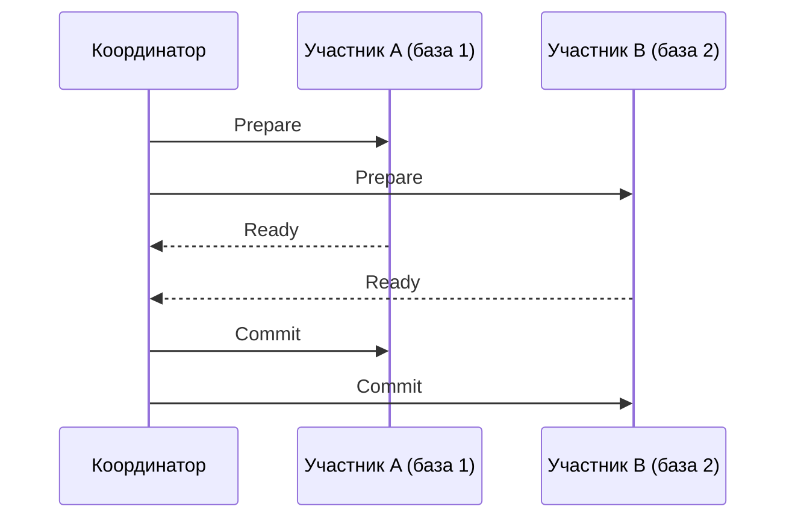

## Введение: Две кнопки управления транзакцией

Представьте, что вы заполняете важную форму на сайте. Вы вводите данные, проверяете их, перепроверяете. И вот наконец нажимаете кнопку “Отправить”. В этот момент система говорит: “Ваши данные сохранены”. Вы чувствуете облегчение — все сделано правильно, информация зафиксирована.

А теперь представьте, что вы поняли: вы ошиблись в номере телефона или захотели отменить операцию. Вы ищете кнопку “Отменить” и нажимаете ее. Форма закрывается, данные не сохраняются — как будто вы никогда не начинали ее заполнять.

В мире баз данных эти две кнопки называются `COMMIT` и `ROLLBACK`. Это две команды, которые завершают транзакцию, но с противоположными результатами.

**COMMIT** (фиксация) — говорит базе данных: “Все изменения, которые я сделал в этой транзакции, теперь должны стать постоянными. Сохрани их навсегда”.

**ROLLBACK** (откат) — говорит базе данных: “Забудь все изменения, которые я сделал в этой транзакции. Верни все как было до меня”.

Без этих команд транзакции бесполезны. Именно `COMMIT` и `ROLLBACK` превращают последовательность операций в атомарную единицу — “все или ничего”.

## COMMIT: Фиксация изменений

### Что происходит при COMMIT

Когда транзакция выполняет `COMMIT`, база данных проходит несколько этапов, чтобы гарантировать, что изменения не будут потеряны.

**Этапы COMMIT (упрощенно):**

1. **Запись в журнал (WAL):** База данных записывает в журнал предзаписи (Write-Ahead Log) информацию о том, что транзакция зафиксирована. Это критически важно для долговечности (Durability).

2. **Сброс журнала на диск:** СУБД принудительно сбрасывает буфер журнала на диск. Только после этого `COMMIT` считается успешным.

3. **Освобождение блокировок:** Все блокировки, которые держала транзакция, снимаются. Другие транзакции, которые ждали эти данные, теперь могут продолжить работу.

4. **Пометка транзакции как завершенной:** В системных каталогах и структурах управления транзакциями отмечается, что транзакция успешно завершена.

**Важный нюанс:** На момент `COMMIT` изменения могут быть еще не записаны в основные файлы базы данных — они могут оставаться в буферах в памяти. Но они уже есть в журнале, поэтому при сбое система сможет их восстановить.

### Синтаксис COMMIT

```sql
-- В большинстве СУБД
COMMIT;

-- Или более полные варианты
COMMIT WORK;
COMMIT TRANSACTION;
COMMIT AND CHAIN;  -- PostgreSQL: завершить и начать новую транзакцию
```

### Что означает “успешный COMMIT”

Когда база данных ответила “COMMIT выполнен успешно”, это дает программисту и бизнесу строгие гарантии:

- **Изменения сохранены:** Данные записаны в журнал на диск. Даже при немедленном отключении электричества данные будут восстановлены при следующем запуске.

- **Изменения видны другим:** Другие транзакции, в зависимости от уровня изоляции, теперь могут видеть эти изменения.

- **Изменения необратимы:** Отменить `COMMIT` нельзя. Единственный способ “отменить” зафиксированные изменения — выполнить новую транзакцию, которая сделает обратные изменения.

### COMMIT в разных сценариях

**Простая транзакция:**

```sql
BEGIN;
UPDATE accounts SET balance = balance - 100 WHERE id = 1;
UPDATE accounts SET balance = balance + 100 WHERE id = 2;
COMMIT;  -- Оба изменения становятся постоянными
```

**Транзакция с условной фиксацией:**

```sql
BEGIN;
UPDATE products SET stock = stock - 1 WHERE id = 1 AND stock > 0;

-- Проверяем, сколько строк было обновлено
IF ROW_COUNT() > 0 THEN
    COMMIT;  -- Товар списан, фиксируем
ELSE
    ROLLBACK;  -- Товара не было, откатываем (хотя изменений и не было)
END IF;
```

### Автоматический COMMIT (Autocommit)

В большинстве сред по умолчанию включен режим автокоммита. В этом режиме каждая отдельная SQL-команда автоматически выполняется как собственная транзакция с неявным `COMMIT` в конце.

```sql
-- В режиме автокоммита
UPDATE accounts SET balance = balance - 100 WHERE id = 1;
-- Невидимый COMMIT происходит автоматически

UPDATE accounts SET balance = balance + 100 WHERE id = 2;
-- Еще один невидимый COMMIT
```

**Проблема:** Если между двумя обновлениями произойдет сбой, деньги будут списаны, но не зачислены.

**Как отключить автокоммит:**

```sql
-- PostgreSQL, MySQL, SQL Server
SET autocommit = 0;  -- или OFF

-- После этого COMMIT нужно писать явно
UPDATE accounts SET balance = balance - 100 WHERE id = 1;
UPDATE accounts SET balance = balance + 100 WHERE id = 2;
COMMIT;
```

## ROLLBACK: Откат изменений

### Что происходит при ROLLBACK

Когда транзакция выполняет `ROLLBACK`, база данных отменяет все изменения, сделанные этой транзакцией, и возвращает данные к состоянию на момент начала транзакции.

**Этапы ROLLBACK (упрощенно):**

1. **Чтение журнала отмены (undo log):** База данных использует информацию, записанную в журнале, чтобы понять, какие изменения нужно отменить.

2. **Восстановление старых версий:** Для каждой измененной строки база данных восстанавливает ее предыдущее состояние.

3. **Освобождение блокировок:** Все блокировки, которые держала транзакция, снимаются.

4. **Пометка транзакции как откаченной:** В системных каталогах отмечается, что транзакция была откачена.

### Синтаксис ROLLBACK

```sql
-- В большинстве СУБД
ROLLBACK;

-- Или более полные варианты
ROLLBACK WORK;
ROLLBACK TRANSACTION;
ROLLBACK AND CHAIN;  -- PostgreSQL: откатить и начать новую транзакцию
```

### Когда используется ROLLBACK

**Явный ROLLBACK по условию:**

```sql
BEGIN;
UPDATE accounts SET balance = balance - 100 WHERE id = 1;
UPDATE accounts SET balance = balance + 100 WHERE id = 2;

-- Проверяем, что баланс не стал отрицательным
IF (SELECT balance FROM accounts WHERE id = 1) < 0 THEN
    ROLLBACK;  -- Откатываем перевод
    RAISE ERROR 'Недостаточно средств';
ELSE
    COMMIT;
END IF;
```

**Автоматический ROLLBACK при ошибке:**

```sql
BEGIN;
UPDATE accounts SET balance = balance - 100 WHERE id = 1;
-- Ошибка: счет 2 не существует
UPDATE accounts SET balance = balance + 100 WHERE id = 2;  -- ОШИБКА!

-- В зависимости от СУБД, может произойти автоматический ROLLBACK
-- Или нужно явно вызвать ROLLBACK в обработчике ошибки
```

**Принудительный ROLLBACK администратором:**

Иногда администратору нужно прервать “висячую” транзакцию, которая заблокировала ресурсы и не завершается.

```sql
-- PostgreSQL: отменить активную транзакцию
SELECT pg_cancel_backend(pid);  -- Вежливая отмена
SELECT pg_terminate_backend(pid);  -- Принудительное завершение (вызовет ROLLBACK)
```

### ROLLBACK и точки сохранения (SAVEPOINT)

Точки сохранения позволяют откатиться не до начала транзакции, а только до определенной точки.

```sql
BEGIN;
INSERT INTO logs (message) VALUES ('Шаг 1');
SAVEPOINT step1;

INSERT INTO logs (message) VALUES ('Шаг 2');
-- Ошибка! Откатываемся до step1
ROLLBACK TO SAVEPOINT step1;

INSERT INTO logs (message) VALUES ('Шаг 2 (повторный)');
COMMIT;  -- Вставятся сообщения "Шаг 1" и "Шаг 2 (повторный)"
```

Точки сохранения полезны в сложных сценариях, где нужно обрабатывать ошибки частично, не теряя весь прогресс транзакции.

## Что происходит при сбое между BEGIN и COMMIT

Это ключевой вопрос для понимания надежности транзакций. Что будет, если сервер потеряет питание в середине транзакции?

**Сценарий A: Сбой до COMMIT**

```
BEGIN; → UPDATE → UPDATE → [СБОЙ] → COMMIT (не выполнен)
```

**Результат:** При восстановлении база данных увидит в журнале незавершенную транзакцию (есть BEGIN, нет COMMIT) и выполнит ROLLBACK. Никакие изменения не будут применены. Система вернется к состоянию на момент BEGIN.

**Сценарий B: Сбой после COMMIT, но до записи на диск**

```
BEGIN; → UPDATE → UPDATE → COMMIT → [СБОЙ] → (данные еще не на диске)
```

**Результат:** При восстановлении база данных увидит в журнале запись о COMMIT и выполнит REDO (повторное применение) всех изменений транзакции. Данные будут восстановлены. Зафиксированная транзакция не теряется.

Это и есть суть долговечности (Durability) в ACID: после `COMMIT` данные переживают любой сбой.

## Двухфазная фиксация (2PC) для распределенных транзакций

Когда одна транзакция затрагивает несколько независимых баз данных (или других ресурсов), простого `COMMIT` недостаточно. Нужен протокол двухфазной фиксации (Two-Phase Commit, 2PC).

### Фаза 1: Prepare (подготовка)

Координатор (обычно приложение или специальный менеджер транзакций) спрашивает каждого участника: “Ты готов зафиксировать изменения?”

Каждый участник:
- Записывает в свой журнал, что он готов к фиксации.
- Блокирует ресурсы так, чтобы не отпустить их до получения решения.
- Отвечает координатору: “Да, готов” или “Нет, не могу”.

### Фаза 2: Commit или Rollback

**Если все ответили “готов”:**

Координатор говорит всем: “COMMIT”. Каждый участник фиксирует транзакцию, снимает блокировки и сообщает об успехе.

**Если кто-то ответил “нет” или не ответил в таймаут:**

Координатор говорит всем: “ROLLBACK”. Каждый участник откатывает транзакцию и снимает блокировки.



### Проблемы 2PC

| Проблема | Описание |
| :--- | :--- |
| **Блокировка ресурсов** | Участники держат блокировки от Prepare до финального решения. При сбое координатора блокировки могут висеть долго |
| **Единая точка отказа** | Если координатор упал после того, как все сказали “готов”, участники не знают, что делать, и ждут |
| **Низкая производительность** | Дополнительный сетевой обмен, синхронные операции записи на каждом участнике |
| **Сложность восстановления** | При сбое координатора нужен специальный протокол восстановления |

Из-за этих проблем в современных микросервисных архитектурах 2PC используется редко. Вместо него применяют саги (Saga), событийно-ориентированные подходы и компенсирующие транзакции.

## COMMIT и ROLLBACK в разных СУБД

### PostgreSQL

```sql
-- Явные
COMMIT;
ROLLBACK;

-- COMMIT AND CHAIN (завершить и начать новую транзакцию)
COMMIT AND CHAIN;

-- Поддержка 2PC
PREPARE TRANSACTION 'my_transaction';
COMMIT PREPARED 'my_transaction';
ROLLBACK PREPARED 'my_transaction';
```

**Особенность:** В PostgreSQL `COMMIT` принудительно сбрасывает WAL на диск, что гарантирует долговечность, но может влиять на производительность. Существует режим `synchronous_commit = off`, который делает `COMMIT` асинхронным (быстрее, но возможна потеря последних транзакций при сбое).

### MySQL (InnoDB)

```sql
-- Явные
COMMIT;
ROLLBACK;

-- Автокоммит по умолчанию включен
SET autocommit = 0;  -- Отключить

-- Поддержка точек сохранения
SAVEPOINT sp;
ROLLBACK TO SAVEPOINT sp;
RELEASE SAVEPOINT sp;  -- Удалить точку сохранения
```

**Особенность:** MySQL поддерживает `XA` (распределенные транзакции) через XA-команды: `XA START`, `XA END`, `XA PREPARE`, `XA COMMIT`, `XA ROLLBACK`.

### SQL Server

```sql
-- Явные
COMMIT TRANSACTION;
ROLLBACK TRANSACTION;

-- Именованные транзакции
BEGIN TRANSACTION MyTransaction;
COMMIT TRANSACTION MyTransaction;

-- Вложенные транзакции (на самом деле savepoints)
BEGIN TRANSACTION;
BEGIN TRANSACTION;  -- Внутренняя
COMMIT;  -- Не фиксирует, только уменьшает счетчик
COMMIT;  -- Реальная фиксация
```

**Особенность:** SQL Server поддерживает вложенные транзакции, но внутренние `COMMIT` не фиксируют изменения — фиксация происходит только при последнем внешнем `COMMIT`.

### Oracle

```sql
-- Явные
COMMIT;
ROLLBACK;

-- COMMIT с комментарием (для аудита)
COMMIT COMMENT 'Перевод средств по счету 12345';

-- ROLLBACK с точкой сохранения
ROLLBACK TO SAVEPOINT sp;
```

**Особенность:** В Oracle `COMMIT` по умолчанию синхронный и принудительно сбрасывает журнал на диск. Уровень изоляции READ COMMITTED — умолчание.

## Автоматический ROLLBACK: Когда база данных решает за вас

СУБД может выполнить автоматический ROLLBACK в следующих ситуациях:

| Ситуация | Поведение |
| :--- | :--- |
| **Ошибка выполнения SQL** (нарушение уникальности, CHECK, деление на ноль) | В большинстве СУБД — откат всей транзакции (в некоторых — только текущего оператора) |
| **Deadlock (взаимная блокировка)** | СУБД выбирает “жертву” и откатывает ее транзакцию |
| **Таймаут блокировки** | Транзакция ждала блокировку дольше допустимого — откат |
| **Обрыв соединения** | Клиент потерял связь с сервером — откат незавершенной транзакции |
| **Аварийное завершение сервера** | При восстановлении — откат всех незавершенных транзакций |
| **Ошибка сериализации (SSI)** | В PostgreSQL на уровне SERIALIZABLE — автоматический откат при конфликте |

Важно понимать поведение вашей СУБД. В PostgreSQL большинство ошибок приводит к откату всей транзакции. В MySQL некоторые ошибки откатывают только текущий оператор, оставляя транзакцию активной.

## Идиома “Проверить и откатить” в коде приложений

В реальных приложениях шаблон работы с транзакциями обычно выглядит так:

```sql
-- Псевдокод на Python/Java/Go
try:
    BEGIN TRANSACTION
    
    # Бизнес-логика
    UPDATE accounts SET balance = balance - 100 WHERE id = 1
    UPDATE accounts SET balance = balance + 100 WHERE id = 2
    
    # Проверка бизнес-правил
    if check_negative_balance():
        raise InsufficientFundsError()
    
    COMMIT
    
except Exception as e:
    ROLLBACK
    raise e  # Или обработать ошибку
```

**Ключевые принципы:**

- Всегда используйте `try/catch` или аналогичный механизм обработки ошибок.
- `ROLLBACK` должен выполняться при любом исключении до выхода из транзакции.
- `COMMIT` должен выполняться только после успешной проверки всех бизнес-правил.
- Чем короче транзакция, тем меньше вероятность конфликтов и тем проще обработка ошибок.

## Распространенные ошибки при использовании COMMIT и ROLLBACK

### Ошибка 1: Забывать ROLLBACK при ошибке

```sql
BEGIN;
UPDATE accounts SET balance = balance - 100 WHERE id = 1;
UPDATE accounts SET balance = balance + 100 WHERE id = 2;  -- Ошибка! id=2 не существует
COMMIT;  -- Упс... первое обновление зафиксировалось?
```

**Последствия:** Зависит от СУБД. В PostgreSQL транзакция переходит в состояние “aborted”, и `COMMIT` выполнит `ROLLBACK`. В других СУБД может произойти частичная фиксация.

**Как исправить:** Всегда обрабатывайте ошибки и явно вызывайте `ROLLBACK`.

### Ошибка 2: Слишком долгие транзакции

```sql
BEGIN;
-- Делаем что-то с базой
-- Ждем ответа от внешнего API (5 секунд)
-- Еще что-то с базой
-- Ждем ввода пользователя (30 секунд)
COMMIT;
```

**Последствия:** Длительные блокировки, рост числа старых версий в MVCC, возможный конфликт с VACUUM, ошибка “snapshot too old”.

**Как исправить:** Транзакции должны быть максимально короткими. Внешние вызовы и ожидания — за пределами транзакции.

### Ошибка 3: COMMIT без проверки результата

```sql
BEGIN;
UPDATE accounts SET balance = balance - 100 WHERE id = 1;
-- Нет проверки, сколько строк было обновлено
COMMIT;
```

**Последствия:** Если счета с id=1 не существует, транзакция зафиксирует “ничего”. Это может быть не тем, что ожидал бизнес.

**Как исправить:** Проверяйте количество затронутых строк (`ROW_COUNT()`, `sql%ROWCOUNT`).

### Ошибка 4: Игнорировать распределенные транзакции

```sql
-- Приложение обновляет базу 1
UPDATE db1.accounts SET balance = balance - 100 WHERE id = 1;

-- Приложение обновляет базу 2
UPDATE db2.accounts SET balance = balance + 100 WHERE id = 2;

-- Нет COMMIT, который бы объединял обе базы
```

**Последствия:** При сбое между обновлениями деньги потеряны.

**Как исправить:** Используйте распределенные транзакции (2PC) или пересмотрите архитектуру (события, саги).

### Ошибка 5: Путать ROLLBACK и COMMIT в обработчиках ошибок

```sql
BEGIN;
-- ... операции ...
if error then
    COMMIT;  -- Упс! Нужен ROLLBACK
end if;
```

**Последствия:** При ошибке транзакция фиксируется, а не откатывается.

**Как исправить:** Внимательно проверяйте, что пишете в обработчиках ошибок.

## Резюме для системного аналитика

1. **COMMIT делает изменения постоянными.** После успешного `COMMIT` данные сохраняются даже при сбое (благодаря WAL). Это гарантия долговечности (Durability).

2. **ROLLBACK отменяет все изменения транзакции.** Транзакция возвращается к состоянию на момент `BEGIN`. Это реализация атомарности (Atomicity) — “все или ничего”.

3. **Автокоммит — враг многошаговых операций.** В режиме автокоммита каждая команда фиксируется отдельно. Для операций, требующих атомарности, автокоммит нужно отключать.

4. **При сбое до `COMMIT` данные не теряются.** Система автоматически откатит незавершенную транзакцию. При сбое после `COMMIT` данные будут восстановлены из журнала.

5. **Распределенные транзакции (2PC) сложны и дороги.** Они блокируют ресурсы на время подготовки и зависят от координатора. В современных системах их часто заменяют сагами и событийной архитектурой.

6. **Транзакции должны быть короткими.** Долгие транзакции приводят к блокировкам, разрастанию версий и проблемам с производительностью.

7. **Всегда обрабатывайте ошибки.** При любом исключении внутри транзакции нужно выполнить `ROLLBACK`. Иначе возможны частично зафиксированные изменения.