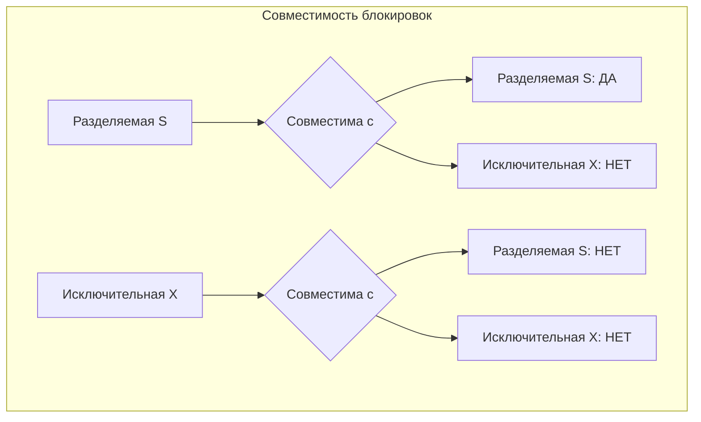

## Введение: Как база данных создает порядок из хаоса

Представьте себе библиотеку, в которой одновременно работают сотни читателей. Одни приходят сдать книги, другие — взять новые, третьи — просто читать в читальном зале. Если бы не было правил и механизмов, возник бы хаос: книги бы терялись, несколько читателей пытались бы взять одну и ту же книгу, кто-то читал бы книгу, которую только что сдали, но еще не успели вернуть на полку.

В реальной библиотеке есть механизмы: каталог, регистратура, абонемент, читальный зал. Они позволяют всем читателям работать одновременно, не мешая друг другу.

В базах данных роль таких механизмов играют **механизмы изоляции**. Это технические решения, которые позволяют множеству транзакций выполняться параллельно, создавая иллюзию, что каждая транзакция работает с базой данных в одиночестве.

Механизмы изоляции — это “инструменты”, с помощью которых база данных реализует обещанный уровень изоляции. Разные СУБД используют разные комбинации этих механизмов, и даже один уровень изоляции может быть реализован по-разному в разных системах.

## Два фундаментальных подхода

Все механизмы изоляции можно разделить на две большие группы: **пессимистичные** и **оптимистичные**. Это философски разные подходы к управлению параллельным доступом.

### Пессимистичный подход: Блокировки

**Основная идея:** “Конфликты будут происходить часто, поэтому давайте предотвращать их заранее”.

При пессимистичном подходе транзакция, прежде чем что-то сделать с данными, ставит на них блокировку. Другие транзакции, которым нужны те же данные, должны ждать, пока блокировка не будет снята.

**Аналогия:** Вы приходите в банкомат и хотите снять деньги. Банкомат блокирует ваш счет на время операции, чтобы другой банкомат не мог списать те же деньги. Пессимизм: “Кто-то обязательно попытается сделать то же самое, поэтому я заблокирую ресурс заранее”.

**Плюсы:** Простая логика, гарантированная защита от конфликтов.

**Минусы:** Низкая производительность при высокой конкуренции, риск взаимных блокировок (deadlocks).

### Оптимистичный подход: Многоверсионность (MVCC)

**Основная идея:** “Конфликты случаются редко, поэтому давайте не будем мешать друг другу, а если конфликт произойдет — разберемся в конце”.

При оптимистичном подходе транзакции не блокируют друг друга. Каждая транзакция работает со своей “версией” данных. Когда транзакция пытается зафиксироваться, система проверяет, не было ли конфликтов с другими транзакциями. Если были — транзакция откатывается, и ее нужно выполнить заново.

**Аналогия:** Вы и ваш коллега одновременно редактируете один и тот же документ в Google Docs. Система не блокирует документ — вы оба видите изменения друг друга в реальном времени. В базе данных это сложнее, но идея похожа: работайте параллельно, а о конфликтах подумаем потом.

**Плюсы:** Высокая производительность при чтении, читающие транзакции не блокируют пишущие.

**Минусы:** Сложность реализации, возможные откаты транзакций при конфликтах.

Большинство современных реляционных СУБД (PostgreSQL, Oracle, MySQL InnoDB, SQL Server в режиме SNAPSHOT) используют комбинацию обоих подходов: многоверсионность для чтения и блокировки для записи.

## Блокировки (Locks)

### Что такое блокировка

Блокировка — это механизм, который временно ограничивает доступ других транзакций к определенному ресурсу (строке, странице, таблице). Транзакция, установившая блокировку, может работать с ресурсом, остальные — ждут или выполняют альтернативные действия.

### Типы блокировок по режиму доступа

**Разделяемая блокировка (Shared Lock, S-lock):**

- Ставится при чтении данных.
- Множество транзакций могут одновременно держать разделяемые блокировки на один и тот же ресурс.
- Разделяемые блокировки совместимы друг с другом.
- Не совместимы с исключительными блокировками.

**Исключительная блокировка (Exclusive Lock, X-lock):**

- Ставится при изменении данных (INSERT, UPDATE, DELETE).
- Только одна транзакция может держать исключительную блокировку на ресурс.
- Не совместима ни с какими другими блокировками.



### Типы блокировок по уровню гранулярности

| Уровень | Что блокируется | Когда используется |
| :--- | :--- | :--- |
| **Строка (Row)** | Конкретная строка таблицы | Базовый уровень в OLTP-системах |
| **Страница (Page)** | Блок данных (обычно 4-16 КБ) | Когда нужно заблокировать группу строк |
| **Таблица (Table)** | Вся таблица | При массовых операциях или DDL |
| **Диапазон (Range/Gap)** | Диапазон значений между строками | Для защиты от фантомов |

### Иерархия блокировок (Intention Locks)

Чтобы эффективно работать с блокировками разных уровней, СУБД используют иерархию блокировок намерения (intention locks). Перед тем как заблокировать строку, транзакция ставит блокировку намерения на таблицу. Это позволяет другим транзакциям быстро понять, есть ли конфликт, не проверяя каждую строку.

**Пример:** Если транзакция A заблокировала строку в таблице, транзакция B, желающая заблокировать всю таблицу, увидит блокировку намерения и поймет, что нужно ждать.

### Взаимные блокировки (Deadlocks)

Взаимная блокировка — это ситуация, когда две или более транзакции ждут друг друга, и ни одна не может продолжить выполнение.

**Пример классического deadlock:**

```sql
-- Транзакция A блокирует строку 1
BEGIN;
UPDATE accounts SET balance = balance - 100 WHERE id = 1; -- Блокировка на строке 1

-- Транзакция B блокирует строку 2
BEGIN;
UPDATE accounts SET balance = balance - 50 WHERE id = 2; -- Блокировка на строке 2

-- Транзакция A пытается заблокировать строку 2 (ждет B)
UPDATE accounts SET balance = balance + 100 WHERE id = 2; -- Ждет

-- Транзакция B пытается заблокировать строку 1 (ждет A)
UPDATE accounts SET balance = balance + 50 WHERE id = 1; -- Ждет

-- Deadlock! Ни одна транзакция не может продолжить
```

**Как СУБД решает deadlock:**

1. Обнаруживает цикл ожидания (обычно через граф ожиданий).
2. Выбирает “жертву” — транзакцию, которую проще откатить (обычно ту, которая сделала меньше изменений).
3. Откатывает выбранную транзакцию и снимает ее блокировки.
4. Другая транзакция продолжает выполнение.

Приложение, получившее ошибку deadlock, должно повторить откаченную транзакцию.

## Многоверсионность (MVCC)

### Что такое MVCC

MVCC (Multi-Version Concurrency Control) — это механизм, при котором каждое изменение данных создает новую версию строки, а старые версии сохраняются. Транзакции видят ту версию данных, которая была актуальна на момент их начала (или на момент выполнения запроса — зависит от уровня изоляции).

**Ключевая идея:** Читающие транзакции никогда не блокируют пишущие, а пишущие — читающие. Каждый работает со своей “версией реальности”.

### Как это работает под капотом

В СУБД с MVCC каждая строка хранит не только данные, но и служебную информацию:

- **Создатель (xmin):** Идентификатор транзакции, которая создала эту версию строки.
- **Удалитель (xmax):** Идентификатор транзакции, которая удалила (или изменила) эту версию строки.

**В PostgreSQL это устроено так:**

```sql
-- Упрощенное представление строки с версиями
-- Транзакция 100 создала строку
INSERT INTO accounts (id, balance) VALUES (1, 1000);
-- Строка: id=1, balance=1000, xmin=100, xmax=0

-- Транзакция 101 изменила баланс
UPDATE accounts SET balance = 900 WHERE id = 1;
-- Старая версия: id=1, balance=1000, xmin=100, xmax=101
-- Новая версия: id=1, balance=900, xmin=101, xmax=0
```

Когда транзакция читает данные, она видит только те версии, чей xmin уже зафиксирован и чей xmax либо не заполнен, либо содержит незафиксированную или более новую транзакцию.

### Снимки данных (Snapshots)

В MVCC каждая транзакция работает со своим снимком данных (snapshot). Снимок — это “фотография” состояния базы данных на определенный момент.

**В PostgreSQL (REPEATABLE READ):** Снимок создается в момент начала транзакции. Все запросы внутри транзакции видят одни и те же данные.

**В PostgreSQL (READ COMMITTED):** Снимок создается для каждого запроса отдельно. Поэтому внутри одной транзакции разные запросы могут видеть разные данные.

### Преимущества MVCC

| Преимущество | Объяснение |
| :--- | :--- |
| **Чтение не блокирует запись** | Читающие транзакции работают со старыми версиями, не мешая тем, кто обновляет данные |
| **Запись не блокирует чтение** | Пишущие транзакции создают новые версии, не мешая читателям |
| **Высокая производительность при смешанной нагрузке** | Идеально для OLTP-систем с множеством одновременных чтений и записей |
| **Согласованное чтение** | REPEATABLE READ и SERIALIZABLE легко реализовать через снимки |

### Недостатки MVCC

| Недостаток | Объяснение |
| :--- | :--- |
| **Разрастание версий (bloat)** | Старые версии нужно периодически чистить (VACUUM в PostgreSQL) |
| **Дополнительное место** | Каждое обновление создает новую версию, пока старые не будут удалены |
| **Накладные расходы** | Нужно хранить и проверять служебные поля (xmin, xmax) |
| **Ошибка “snapshot too old”** | В некоторых СУБД слишком старые снимки могут быть удалены системой |

### Очистка старых версий (VACUUM / Purge)

Старые версии строк, которые больше не нужны ни одной активной транзакции, должны быть удалены. Иначе база данных будет бесконечно разрастаться.

**В PostgreSQL** этот процесс называется VACUUM. Он бывает:
- **Автоматический (autovacuum):** Запускается в фоне, когда накапливается достаточно “мертвых” строк.
- **Ручной:** VACUUM или VACUUM FULL (более агрессивная версия, блокирующая таблицу).

**В Oracle** аналогичный процесс называется “undo retention” и “space reclamation”.

## Блокировки и MVCC: Как они сочетаются

В большинстве современных СУБД блокировки и MVCC работают вместе, дополняя друг друга.

| Механизм | Для чего используется |
| :--- | :--- |
| **MVCC** | Для чтения данных без блокировок, для реализации снимков |
| **Разделяемые блокировки** | Для операций, которым нужна гарантия, что данные не изменятся (например, SELECT FOR UPDATE) |
| **Исключительные блокировки** | Для изменений данных (INSERT, UPDATE, DELETE) |
| **Блокировки диапазонов (Gap locks)** | Для защиты от фантомов (особенно в MySQL InnoDB) |

### SELECT FOR UPDATE: Явная блокировка

Иногда MVCC недостаточно. Например, вам нужно заблокировать строку, чтобы потом обновить ее, гарантируя, что никто не изменит ее между чтением и обновлением.

```sql
BEGIN;
-- Явно блокируем строку, чтобы другие транзакции не могли ее изменить
SELECT balance FROM accounts WHERE id = 1 FOR UPDATE;
-- Теперь мы уверены, что баланс не изменится до нашего обновления
UPDATE accounts SET balance = balance - 100 WHERE id = 1;
COMMIT;
```

`SELECT FOR UPDATE` ставит исключительную блокировку на выбранные строки. Другие транзакции могут их читать (если используют MVCC), но не могут изменять или тоже блокировать.

## Gap-блокировки (Range Locks)

### Что это такое

Gap-блокировки (блокировки промежутков) — это специальные блокировки, которые блокируют не существующие строки, а промежутки между ними. Они используются для защиты от фантомов.

### Зачем они нужны

Представьте, что вы выполняете запрос:

```sql
SELECT * FROM products WHERE price BETWEEN 10 AND 20;
```

Если у вас нет gap-блокировок, другая транзакция может вставить новый товар с ценой 15 после того, как вы выполнили этот запрос, но до фиксации вашей транзакции. При повторном запросе вы увидите новый товар — фантом.

Gap-блокировки блокируют не только существующие строки, но и пространство между ними, чтобы никто не мог вставить новую строку в этот диапазон.

### Как это работает в MySQL InnoDB

InnoDB использует gap-блокировки на уровне REPEATABLE READ для защиты от фантомов. Это одна из причин, почему REPEATABLE READ в MySQL защищает от фантомов, хотя стандарт этого не требует.

```sql
-- InnoDB, уровень REPEATABLE READ
BEGIN;
SELECT * FROM products WHERE price BETWEEN 10 AND 20 FOR UPDATE;
-- InnoDB блокирует:
-- - все строки с price от 10 до 20
-- - все промежутки между этими строками
-- Теперь никто не может вставить новую строку с price в этом диапазоне
COMMIT;
```

### Недостатки gap-блокировок

- **Блокировка целых диапазонов** может сильно снизить производительность при частых вставках.
- **Высокий риск deadlock** — чем больше заблокировано, тем выше вероятность конфликтов.
- В MySQL InnoDB gap-блокировки часто становятся причиной неожиданных блокировок и взаимоблокировок.

## Serializable Snapshot Isolation (SSI)

### Что это такое

SSI — это современный механизм изоляции, который используется в PostgreSQL для реализации уровня SERIALIZABLE. В отличие от классического SERIALIZABLE через блокировки, SSI использует многоверсионность и проверку конфликтов на этапе фиксации.

### Как работает SSI

1. Транзакции работают со своими снимками данных (как в REPEATABLE READ).
2. Система отслеживает зависимости между транзакциями: какая транзакция что читала, какая что изменяла.
3. При фиксации транзакции проверяется, не возникло ли циклической зависимости (как в графе ожиданий).
4. Если возникает потенциальная аномалия сериализации, одна из транзакций откатывается с ошибкой “could not serialize access”.

### SSI vs Классический SERIALIZABLE

| Характеристика | Классический SERIALIZABLE (блокировки) | SSI (PostgreSQL) |
| :--- | :--- | :--- |
| **Производительность** | Низкая (много блокировок) | Выше (меньше блокировок) |
| **Риск deadlock** | Высокий | Низкий (откаты вместо блокировок) |
| **Требует повтор транзакций** | Нет (транзакции ждут) | Да (при конфликте — откат) |
| **Подходит для OLTP** | Плохо | Умеренно |

### Почему SSI требует повторных попыток

В SSI транзакция может быть откачена не из-за ошибки или deadlock, а просто потому, что она конфликтует с другой транзакцией таким образом, что их одновременное выполнение не эквивалентно последовательному.

Приложение должно быть готово повторить такую транзакцию. Это ключевое требование при использовании SERIALIZABLE в PostgreSQL.

## Сравнение механизмов изоляции в разных СУБД

### PostgreSQL

| Механизм | Применение |
| :--- | :--- |
| MVCC | Основа всего (все уровни изоляции) |
| Блокировки строк | Только для SELECT FOR UPDATE и изменений |
| SSI | SERIALIZABLE |
| VACUUM | Очистка старых версий |

**Особенность:** READ UNCOMMITTED не поддерживается, ведет себя как READ COMMITTED.

### MySQL InnoDB

| Механизм | Применение |
| :--- | :--- |
| MVCC | READ COMMITTED, REPEATABLE READ |
| Блокировки строк | Изменения, SELECT FOR UPDATE |
| Gap-блокировки | REPEATABLE READ (для защиты от фантомов) |
| Блокировки таблиц | DDL, некоторые ALTER |

**Особенность:** REPEATABLE READ — уровень по умолчанию, защищает от фантомов через gap-блокировки.

### Oracle

| Механизм | Применение |
| :--- | :--- |
| MVCC (через undo) | Основа всего |
| Блокировки строк | Только для изменений (минимально) |
| Undo retention | Управление старыми версиями |

**Особенность:** READ UNCOMMITTED не поддерживается. Читающие транзакции никогда не блокируются пишущими.

### SQL Server

| Механизм | Применение |
| :--- | :--- |
| Блокировки | READ COMMITTED (по умолчанию, с блокировками) |
| MVCC (SNAPSHOT) | READ COMMITTED SNAPSHOT, SNAPSHOT |
| Блокировки диапазонов | SERIALIZABLE |

**Особенность:** Два режима READ COMMITTED — с блокировками и с версионированием.

## Как механизмы изоляции связаны с уровнями изоляции

Разные механизмы позволяют реализовать разные уровни изоляции.

| Уровень изоляции | Типичная реализация |
| :--- | :--- |
| READ UNCOMMITTED | Без блокировок чтения (или с очень слабыми) |
| READ COMMITTED | MVCC + снимки на каждый запрос (или кратковременные блокировки) |
| REPEATABLE READ | MVCC + снимок на всю транзакцию (+ gap-блокировки в MySQL) |
| SERIALIZABLE | SSI (PostgreSQL) или блокировки диапазонов (другие СУБД) |

## Резюме для системного аналитика

1. **Два фундаментальных подхода к изоляции:** пессимистичный (блокировки) и оптимистичный (многоверсионность). Современные СУБД комбинируют оба.

2. **Блокировки** бывают разделяемые (чтение) и исключительные (запись). Они могут быть на разных уровнях: строка, страница, таблица, диапазон.

3. **Взаимные блокировки (deadlocks)** неизбежны при использовании блокировок. СУБД автоматически их обнаруживает и откатывает одну из транзакций. Приложение должно повторять откаченные транзакции.

4. **MVCC (многоверсионность)** позволяет читающим транзакциям не блокировать пишущие. Каждая транзакция работает со своим снимком данных. Используется в PostgreSQL, Oracle, MySQL InnoDB, SQL Server (SNAPSHOT).

5. **Старые версии нужно чистить.** В PostgreSQL — VACUUM, в Oracle — undo retention. Без очистки база данных будет бесконечно расти.

6. **Gap-блокировки** защищают от фантомов, блокируя промежутки между строками. Активно используются в MySQL InnoDB на уровне REPEATABLE READ.

7. **SSI (Serializable Snapshot Isolation)** — современная реализация SERIALIZABLE в PostgreSQL. Работает через отслеживание конфликтов на этапе фиксации. Требует, чтобы приложение повторяло откаченные транзакции.