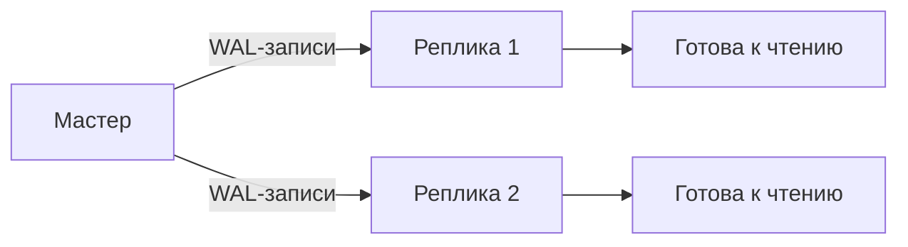

## Введение: Черный ящик самолета

Представьте себе черный ящик самолета. Он не управляет самолетом, не хранит все детали его конструкции. Но он записывает все, что происходит в полете: каждое действие пилота, каждое изменение высоты, каждое показание датчиков. Если случается катастрофа, черный ящик позволяет восстановить картину событий и понять, что произошло.

В базах данных есть свой “черный ящик” — это журнал предзаписи, или WAL (Write-Ahead Logging). Он записывает каждое изменение, которое собирается сделать база данных, прежде чем это изменение будет применено к основным файлам.

**Почему “предзапись”?** Потому что запись в журнал происходит **до** (write-ahead) того, как данные записываются на свое постоянное место. Сначала — запись в журнал, потом — изменение данных.

WAL — это фундаментальный механизм, который обеспечивает два ключевых свойства ACID: **атомарность** (Atomicity) и **долговечность** (Durability). Без WAL база данных не могла бы гарантировать, что зафиксированные транзакции не потеряются при сбое, а незавершенные — не оставят следов.

## Зачем нужен WAL: Две проблемы, одно решение

### Проблема 1: Как гарантировать долговечность (Durability)

Когда транзакция фиксируется (`COMMIT`), база данных должна гарантировать, что эти изменения переживут любой сбой: отключение электричества, падение операционной системы, аварию сервера.

Но запись данных на диск — операция медленная. Если бы база данных записывала каждое изменение сразу на диск, производительность была бы катастрофической. Поэтому изменения сначала накапливаются в буферах в оперативной памяти, а на диск записываются позже, группами.

Что произойдет, если сервер потеряет питание до того, как изменения из буфера попадут на диск? Зафиксированные данные будут потеряны. Это нарушает долговечность.

**Решение WAL:** При `COMMIT` база данных записывает в журнал (который находится на диске) информацию о том, что транзакция зафиксирована. Эта запись принудительно сбрасывается на диск. Журнал пишется последовательно (очень быстро), в отличие от случайных записей в основные файлы данных. При сбое база данных читает журнал и восстанавливает все зафиксированные изменения.

### Проблема 2: Как обеспечить атомарность (Atomicity)

Если транзакция не завершилась успехом (ошибка, отмена пользователем, сбой), все ее изменения должны быть отменены. База данных должна вернуться к состоянию до начала транзакции.

Как это сделать, если изменения уже частично записаны на диск? Нужен способ узнать, какие изменения были сделаны незавершенной транзакцией, и отменить их.

**Решение WAL:** В журнале записаны все изменения, сделанные каждой транзакцией. При восстановлении база данных видит, какие транзакции не имеют маркера `COMMIT`, и откатывает (отменяет) их изменения, используя информацию из журнала.

Таким образом, WAL — это единственный источник истины для восстановления базы данных после сбоя. Если основные файлы данных повреждены или устарели, журнал позволяет привести их в актуальное и согласованное состояние.

## Как устроен WAL: Основные компоненты

### Журнал транзакций (Transaction Log, WAL)

Журнал — это последовательный файл (или набор файлов) на диске, в который база данных записывает все изменения. Записи в журнале идут строго по порядку: каждая новая запись добавляется в конец.

**Что содержится в WAL-записи:**

| Компонент | Описание |
| :--- | :--- |
| **LSN (Log Sequence Number)** | Уникальный номер записи в журнале, определяющий ее позицию. LSN монотонно возрастают |
| **Идентификатор транзакции (XID)** | Какая транзакция сделала изменение |
| **Тип операции** | INSERT, UPDATE, DELETE, BEGIN, COMMIT, ROLLBACK и другие |
| **Идентификатор таблицы** | В какой таблице произошло изменение |
| **Старое значение строки (до изменения)** | Нужно для отката (UNDO) |
| **Новое значение строки (после изменения)** | Нужно для повторного применения (REDO) |

### Буфер журнала (WAL Buffer)

Буфер журнала — это область в оперативной памяти, где накапливаются WAL-записи перед тем, как они будут записаны на диск. Запись на диск — операция дорогая, поэтому накопление записей в буфере и запись группами значительно повышает производительность.

### Контрольная точка (Checkpoint)

Контрольная точка — это момент времени, когда база данных гарантирует, что все изменения до определенного LSN уже записаны в основные файлы данных на диск. После контрольной точки при восстановлении можно не читать журнал за период до нее.

**Как работает контрольная точка:**

1. База данных записывает в журнал специальную запись “начало контрольной точки”.
2. Все “грязные” страницы (измененные страницы в буферном кеше, которые еще не записаны на диск) сбрасываются на диск.
3. База данных записывает в журнал запись “конец контрольной точки” с указанием текущего LSN.
4. При восстановлении после сбоя база данных начинает чтение журнала с последней завершенной контрольной точки.

Контрольные точки происходят автоматически (по таймеру, по достижении определенного объема изменений) или могут быть вызваны вручную (`CHECKPOINT`).

## Структура WAL-записи (подробно)

### LSN (Log Sequence Number)

LSN — это 64-битное число (в большинстве СУБД), которое монотонно возрастает. Каждая WAL-запись имеет свой уникальный LSN. LSN позволяет:

- Определять порядок операций во времени.
- Находить место в журнале для начала восстановления.
- Ссылаться на предыдущие записи (например, запись о `COMMIT` ссылается на последнюю запись изменений этой транзакции).

В PostgreSQL LSN выглядит как `0/16B3748`. В SQL Server — `LSN: 00000016:00000034:0001`.

### XID (Transaction ID)

Каждая транзакция получает уникальный идентификатор (XID). XID используются для:

- Определения, какой транзакции принадлежит изменение.
- Отслеживания состояния транзакции (активна, зафиксирована, откачена).
- Определения видимости версий в MVCC.

### REDO и UNDO информация

| Тип информации | Что хранит | Когда используется |
| :--- | :--- | :--- |
| **REDO** | Новое значение строки (после изменения) | При восстановлении зафиксированных транзакций |
| **UNDO** | Старое значение строки (до изменения) | При откате незавершенных транзакций |

В разных СУБД подходы к хранению REDO/UNDO различаются:

- **PostgreSQL:** WAL содержит только REDO-информацию. UNDO-информация хранится в самих таблицах (через механизм версионирования).
- **Oracle:** UNDO-информация хранится отдельно в undo-таблицах.
- **MySQL InnoDB:** REDO в WAL, UNDO в отдельном табличном пространстве.

## Процесс восстановления после сбоя

Когда база данных запускается после аварийного завершения, она проходит через три фазы восстановления.

### Фаза 1: Определение границ восстановления

База данных находит последнюю контрольную точку в журнале. Восстановление нужно начинать с этой точки или чуть раньше (на случай, если контрольная точка не была полностью завершена).

### Фаза 2: REDO (Повторное применение)

База данных читает журнал, начиная с точки восстановления, и повторно применяет все изменения зафиксированных транзакций, которые еще не попали на диск.

Как база данных понимает, что изменение нужно применить (REDO) или пропустить?

- Если страница данных на диске имеет LSN меньше, чем LSN изменения в журнале — изменение нужно применить (страница устарела).
- Если LSN страницы больше или равен LSN изменения — изменение уже применено.

**Важный момент:** REDO применяет изменения даже для транзакций, которые в итоге будут откачены. Это нормально, потому что затем фаза UNDO отменит их. Такой подход проще, чем пытаться пропускать изменения незавершенных транзакций.

### Фаза 3: UNDO (Откат незавершенных транзакций)

База данных находит в журнале все транзакции, которые не имеют записи `COMMIT`. Для каждой такой транзакции она:

1. Читает журнал в обратном порядке (от конца к началу).
2. Для каждого изменения восстанавливает старое значение строки.
3. В конце записывает в журнал запись о том, что транзакция откачена.

После этих трех фаз база данных готова к приему соединений. Все зафиксированные транзакции сохранены, все незавершенные — откачены.

## WAL и производительность: Синхронная и асинхронная фиксация

WAL — это компромисс между надежностью и производительностью. Основной рычаг управления этим компромиссом — настройка `synchronous_commit`.

### Синхронная фиксация (Synchronous Commit)

При синхронной фиксации `COMMIT` не возвращает управление приложению, пока WAL-запись о фиксации не будет принудительно сброшена на диск.

```sql
-- В PostgreSQL
SET synchronous_commit = on;
```

**Гарантии:** После успешного `COMMIT` данные точно сохранены на диске. Даже при немедленном сбое данные будут восстановлены.

**Цена:** Каждый `COMMIT` требует синхронной операции записи на диск (fsync), что может занимать миллисекунды. При высокой частоте `COMMIT` это становится узким местом.

### Асинхронная фиксация (Asynchronous Commit)

При асинхронной фиксации `COMMIT` возвращает управление сразу после записи в буфер журнала в памяти, без ожидания сброса на диск.

```sql
-- В PostgreSQL
SET synchronous_commit = off;
```

**Гарантии:** При сбое возможна потеря последних транзакций, которые были зафиксированы, но еще не попали в журнал на диске. Обычно это окно составляет несколько миллисекунд.

**Цена:** Гораздо выше производительность, особенно при большом количестве мелких транзакций.

### Режимы синхронной фиксации в PostgreSQL

PostgreSQL предлагает несколько режимов синхронной фиксации:

| Режим | Гарантии | Производительность |
| :--- | :--- | :--- |
| `off` | Нет гарантий (потеря возможна) | Максимальная |
| `on` | Полная гарантия | Базовая |
| `remote_write` | Ждет подтверждения от реплики, что данные получены (не обязательно записаны на диск) | Выше, чем `on` |
| `remote_apply` | Ждет, пока реплика не применит изменения | Ниже, чем `on` |
| `local` | Только локальный диск, без реплик | Между `off` и `on` |

## WAL и репликация: Как реплики получают данные

WAL используется не только для восстановления после сбоя, но и для репликации (копирования данных на другие серверы).

### Потоковая репликация (Streaming Replication)

Основной сервер (мастер) постоянно отправляет WAL-записи на реплики. Реплики читают эти записи и применяют изменения к своим копиям данных.



**Синхронная репликация:** Мастер ждет, пока реплика подтвердит получение WAL-записи (а иногда и применение), прежде чем подтвердить `COMMIT` клиенту. Гарантирует, что данные не потеряются, даже если мастер умрет мгновенно. Но увеличивает задержку и снижает доступность (если реплика недоступна).

**Асинхронная репликация:** Мастер не ждет реплику. Выше производительность и доступность, но при сбое мастера последние транзакции могут быть потеряны (или их нужно вручную извлекать из реплики).

### Физическая репликация (Physical Replication)

Реплика воспроизводит WAL-записи на уровне байтов. Это самый эффективный способ репликации, но реплика должна быть идентична мастеру (та же версия СУБД, та же архитектура).

### Логическая репликация (Logical Replication)

Реплика интерпретирует WAL-записи на уровне логических изменений (вставка строки, обновление). Позволяет реплицировать между разными версиями СУБД, разными схемами, выборочно (только определенные таблицы).

## Проблемы и ограничения WAL

### Разрастание WAL (WAL Bloat)

Если база данных генерирует WAL-записи быстрее, чем они могут быть применены к основным данным и удалены, журнал будет бесконечно расти. Это может заполнить весь диск.

**Причины:**
- Очень высокая нагрузка на запись.
- Длинные незавершенные транзакции (реплика отстает, и WAL нельзя удалить, потому что он нужен реплике).
- Ошибки в настройках архивации WAL.

**Решение:** Мониторинг размера WAL, настройка автоматического удаления старых файлов (`wal_keep_size`, `max_wal_size`), регулярные контрольные точки.

### Фрагментация WAL

WAL пишется последовательно, но при ротации файлов могут возникать задержки. В некоторых СУБД старые WAL-файлы переиспользуются, что приводит к фрагментации, если размер файлов не кратен размеру блока файловой системы.

### Коррупция WAL

Если WAL-файл поврежден, восстановление может быть невозможно. Некоторые СУБД поддерживают контрольные суммы WAL-записей для обнаружения повреждений.

**Защита:**
- Использование надежных дисков (RAID, enterprise SSD).
- Регулярные резервные копии WAL-файлов.
- Репликация (если один WAL поврежден, можно использовать другой).

### Производительность WAL на медленных дисках

Синхронная запись WAL требует, чтобы диск подтвердил запись (fsync). На дисках без кеша с защитой от сбоев (например, некоторые облачные диски) это может быть очень медленно.

**Оптимизации:**
- Выделение WAL на отдельный быстрый диск (NVMe, SSD с защитой от сбоев).
- Группировка COMMIT (несколько транзакций сбрасываются одним fsync).
- Асинхронная фиксация для некритичных данных.

## WAL в разных СУБД: Сравнение

### PostgreSQL

- WAL включен всегда, отключить нельзя.
- Файлы WAL имеют фиксированный размер (обычно 16 МБ).
- Поддерживает синхронную и асинхронную фиксацию.
- Репликация через WAL (физическая и логическая).
- Контрольные точки автоматические и ручные (`CHECKPOINT`).

**Ключевые параметры:**
- `synchronous_commit`: on, off, remote_write, remote_apply, local.
- `wal_level`: replica, logical (уровень детализации WAL).
- `max_wal_size`: максимальный размер WAL до принудительной контрольной точки.

### MySQL (InnoDB)

- REDO-лог (аналог WAL) используется для долговечности.
- UNDO-лог хранится отдельно, в табличных пространствах.
- Binary log (binlog) — отдельный журнал для репликации и point-in-time recovery.
- Групповая фиксация (group commit) для повышения производительности.

**Ключевые параметры:**
- `innodb_flush_log_at_trx_commit`: 0 (асинхронный), 1 (синхронный), 2 (запись в буфер ОС).
- `sync_binlog`: синхронизация binlog.

### SQL Server

- Transaction Log (аналог WAL) обязателен для каждой базы данных.
- Поддерживает синхронную и асинхронную фиксацию.
- Always On Availability Groups используют WAL для репликации.
- Контрольные точки автоматические.

### Oracle

- REDO-лог — обязательный компонент.
- UNDO-данные хранятся отдельно в undo-таблицах.
- Архивные REDO-логи для восстановления на момент времени (point-in-time recovery).
- Data Guard использует REDO-логи для репликации.

## Резюме для системного аналитика

1. **WAL (Write-Ahead Logging) — это журнал предзаписи.** Все изменения сначала записываются в WAL, и только потом — в основные файлы данных. Это обеспечивает атомарность и долговечность (A и D в ACID).

2. **WAL решает две проблемы.** Во-первых, позволяет восстановить зафиксированные транзакции после сбоя (REDO). Во-вторых, позволяет откатить незавершенные транзакции (UNDO).

3. **Синхронная vs асинхронная фиксация — главный компромисс.** Синхронная (`synchronous_commit = on`) гарантирует, что после `COMMIT` данные на диске, но медленнее. Асинхронная быстрее, но возможна потеря последних транзакций при сбое.

4. **Контрольные точки (Checkpoint) ограничивают объем восстановления.** Они гарантируют, что все изменения до определенного момента уже на диске. Восстановление начинается с последней контрольной точки.

5. **WAL — основа репликации.** Реплики получают WAL-записи от мастера и применяют их. Синхронная репликация дает гарантию, что данные не потеряются при сбое мастера, но снижает производительность и доступность.

6. **WAL может разрастаться.** При высокой нагрузке на запись или при отставании реплик WAL будет расти. Нужно мониторить размер WAL и настраивать автоматическую очистку.

7. **Разные СУБД реализуют WAL по-разному.** PostgreSQL использует единый WAL, MySQL — REDO-лог + binlog, SQL Server — transaction log, Oracle — REDO-лог + UNDO. Понимание особенностей важно для настройки и диагностики.