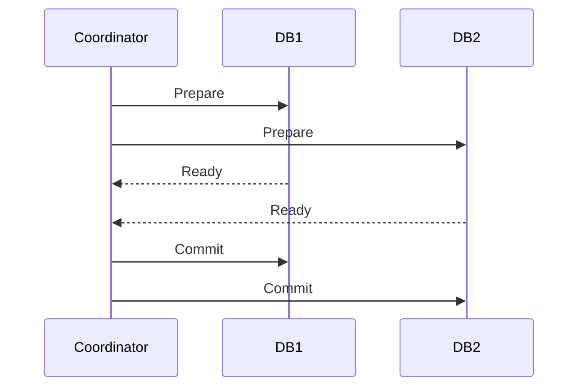

## Введение: Ошибка в банкомате

Представьте, что вы переводите деньги с карты на карту через банкомат. Вы вводите сумму, номер счета получателя, нажимаете "Перевести". Банкомат сообщает: "Операция выполнена". Вы смотрите на чек — деньги списаны с вашего счета. Но получатель говорит, что деньги не пришли.

Что произошло? Банкомат выполнил только первую часть операции: списал деньги с вашего счета. А вторая часть — зачислить деньги получателю — по какой-то причине не выполнилась. Сбой сети, ошибка в программе, отключение электричества.

В результате деньги потеряны. Ваши — да. Банковские — нет. Система оказалась в противоречивом состоянии: деньги ушли из одного места, но не пришли в другое.

**Транзакция** — это механизм, который предотвращает такие ситуации. Транзакция гарантирует, что группа операций выполнится либо полностью, либо не выполнится вообще. Нет промежуточных состояний, когда часть операций уже сделана, а часть еще нет.

Если перевод денег оформлен как транзакция, то в случае сбоя система автоматически откатит (отменит) списание денег с вашего счета. Ваши деньги останутся на месте, а вы получите сообщение об ошибке. Лучше потерять возможность перевода, чем потерять деньги.

## Транзакция: Определение

**Транзакция** — это логически неделимая единица работы с базой данных. Она представляет собой последовательность операций (чтение, вставка, обновление, удаление), которые выполняются как единое целое.

Транзакция обладает двумя ключевыми свойствами, которые отличают ее от простой последовательности запросов:

1. **Неделимость (атомарность):** Транзакция либо выполняется полностью, либо не выполняется вообще. Не может быть ситуации, когда часть операций применена, а часть — нет.

2. **Изолированность (частично):** Пока транзакция не завершена, ее промежуточные результаты не видны другим транзакциям. Каждая транзакция работает так, как будто она одна в системе.

Остальные свойства транзакций (согласованность, долговечность) относятся к теме ACID и будут рассмотрены отдельно. Здесь мы фокусируемся на самом понятии транзакции и механизмах ее выполнения.

**Простыми словами:** Транзакция — это “все или ничего”. Либо все операции внутри транзакции успешно применяются к базе данных, либо ни одна из них не применяется. База данных никогда не оказывается в “половинчатом” состоянии.

## Жизненный цикл транзакции

Транзакция проходит несколько четко определенных этапов от начала до конца.

### Начало транзакции

Транзакция начинается явно или неявно.

- **Явное начало:** Вы пишете `BEGIN TRANSACTION`, `START TRANSACTION` или `BEGIN` (в зависимости от СУБД).
- **Неявное начало:** В некоторых СУБД каждая отдельная команда SQL автоматически выполняется как отдельная транзакция (режим автокоммита). В других СУБД транзакция начинается с первой команды после завершения предыдущей транзакции.

```sql
-- Явное начало транзакции (синтаксис зависит от СУБД)
BEGIN TRANSACTION;

UPDATE accounts SET balance = balance - 100 WHERE account_id = 1;
UPDATE accounts SET balance = balance + 100 WHERE account_id = 2;

-- Завершение транзакции
COMMIT;
```

### Выполнение операций

Внутри транзакции вы можете выполнять любые операции с базой данных: `SELECT`, `INSERT`, `UPDATE`, `DELETE`. Все эти операции временно видны только внутри текущей транзакции (в зависимости от уровня изоляции, но об этом позже в отдельной теме).

Важно понимать: пока транзакция не завершена, изменения не считаются постоянными. Они существуют только в контексте этой транзакции. Другие транзакции могут их видеть или не видеть — это зависит от настроек изоляции.

### Фиксация (COMMIT)

`COMMIT` — это команда, которая делает все изменения транзакции постоянными. После `COMMIT`:

- Изменения записываются на диск (или в журнал предзаписи – WAL).
- Другие транзакции начинают видеть эти изменения (в зависимости от уровня изоляции).
- Транзакция завершается, и ее ресурсы освобождаются.

```sql
COMMIT; -- или COMMIT TRANSACTION, COMMIT WORK
```

### Откат (ROLLBACK)

`ROLLBACK` — это команда, которая отменяет все изменения, сделанные в текущей транзакции. После `ROLLBACK`:

- База данных возвращается к состоянию, которое было на момент начала транзакции.
- Никакие изменения не применяются.
- Транзакция завершается, и ее ресурсы освобождаются.

```sql
ROLLBACK; -- или ROLLBACK TRANSACTION, ROLLBACK WORK
```

`ROLLBACK` может быть выполнен:
- Явно — программист написал `ROLLBACK` в коде (например, при обнаружении ошибки).
- Автоматически — СУБД выполняет откат при возникновении ошибки внутри транзакции (например, нарушение уникальности, деление на ноль, сбой соединения).
- Принудительно — администратор или система могут прервать “висячую” транзакцию.

### Точка сохранения (SAVEPOINT)

Внутри транзакции можно создавать промежуточные точки сохранения, чтобы откатываться не до начала транзакции, а только до определенной точки.

```sql
BEGIN TRANSACTION;

INSERT INTO logs (message) VALUES ('Шаг 1 выполнен');
SAVEPOINT step1;

INSERT INTO logs (message) VALUES ('Шаг 2 выполнен');
-- Ошибка! Откатываемся только до step1
ROLLBACK TO SAVEPOINT step1;

INSERT INTO logs (message) VALUES ('Шаг 2 (повторный)');
COMMIT;
```

Точки сохранения полезны в сложных сценариях, когда нужно обрабатывать ошибки частично, не теряя весь прогресс транзакции.

## Транзакции в реальной жизни: Банковский перевод

Рассмотрим классический пример — перевод денег между счетами.

**Без транзакции:**

```sql
-- Шаг 1: Списать 100 рублей со счета 1
UPDATE accounts SET balance = balance - 100 WHERE account_id = 1;

-- Шаг 2: Зачислить 100 рублей на счет 2
UPDATE accounts SET balance = balance + 100 WHERE account_id = 2;
```

Что произойдет, если между шагом 1 и шагом 2 произойдет сбой (отключение электричества, обрыв сети, ошибка в коде)?

- Деньги списаны со счета 1.
- Деньги не зачислены на счет 2.
- Деньги исчезли из системы. Банк в убытке. Клиент в ярости.

**С транзакцией:**

```sql
BEGIN TRANSACTION;

UPDATE accounts SET balance = balance - 100 WHERE account_id = 1;
UPDATE accounts SET balance = balance + 100 WHERE account_id = 2;

COMMIT;
```

Если сбой произойдет до `COMMIT`, СУБД автоматически выполнит `ROLLBACK`. Деньги не будут списаны ни с одного счета. Система останется в согласованном состоянии.

**Что происходит под капотом:**

1. При `BEGIN TRANSACTION` СУБД выделяет ресурсы для транзакции.
2. При `UPDATE` СУБД записывает изменения в специальную область (журнал транзакций, буферные страницы), но не применяет их постоянно.
3. При `COMMIT` СУБД записывает информацию о фиксации в журнал (WAL) и затем применяет изменения к основному хранилищу данных.
4. При сбое до `COMMIT` СУБД при восстановлении увидит незавершенную транзакцию в журнале и выполнит ее откат.

## Транзакции в разных сценариях

### OLTP (Online Transaction Processing)

Классические OLTP-системы — это банковские системы, системы бронирования билетов, интернет-магазины. Для них транзакции:

- Короткие (миллисекунды или доли секунды).
- Манипулируют небольшим количеством строк.
- Требуют высокой степени изоляции (чтобы не было конфликтов).
- Обрабатывают тысячи или миллионы транзакций в секунду.

**Пример:** Оформление заказа в интернет-магазине — одна транзакция, которая проверяет остаток товара, резервирует его, списывает деньги, создает заказ.

### OLAP (Online Analytical Processing)

Аналитические системы (хранилища данных, отчеты) используют транзакции иначе:

- Длинные транзакции (минуты или часы).
- Манипулируют миллионами строк.
- Часто используют более слабые уровни изоляции ради производительности.
- Транзакций меньше, но каждая обрабатывает огромные объемы.

**Пример:** Пересчет итогов продаж за месяц — одна транзакция, которая агрегирует миллионы записей.

### Распределенные транзакции (XA-транзакции)

Когда одна транзакция затрагивает несколько независимых баз данных (или других ресурсов), нужны распределенные транзакции. Протокол двухфазной фиксации (2PC — Two-Phase Commit) обеспечивает атомарность на нескольких узлах.

**Фаза 1 (prepare):** Каждый участник сообщает координатору: “Я готов зафиксировать изменения”.

**Фаза 2 (commit/rollback):** Если все участники ответили “готов”, координатор говорит “фиксируй”. Если кто-то ответил “нет” или не ответил — “откатывай”.



Распределенные транзакции сложны, медленны и чувствительны к сбоям сети. Современные микросервисные архитектуры часто избегают их в пользу саг (Saga) и событийно-ориентированных подходов.

## Автокоммит (Autocommit)

В большинстве СУБД по умолчанию включен режим **автокоммита**. Это означает, что каждая отдельная SQL-команда автоматически выполняется как собственная транзакция: неявный `BEGIN` перед командой и неявный `COMMIT` после успешного выполнения.

```sql
-- В режиме автокоммита это:
UPDATE accounts SET balance = balance - 100 WHERE account_id = 1;

-- Эквивалентно этому:
BEGIN TRANSACTION;
UPDATE accounts SET balance = balance - 100 WHERE account_id = 1;
COMMIT;
```

**Почему автокоммит — это проблема для сложных операций:**

Если вам нужно выполнить две операции как одну транзакцию, автокоммит помешает. Каждая операция зафиксируется отдельно.

```sql
-- В режиме автокоммита это НЕ транзакция:
UPDATE accounts SET balance = balance - 100 WHERE account_id = 1;
UPDATE accounts SET balance = balance + 100 WHERE account_id = 2;
-- При сбое между ними — деньги потеряны
```

**Как отключить автокоммит:**

```sql
-- В PostgreSQL, MySQL, SQL Server обычно:
SET autocommit = 0; -- или OFF

-- После этого нужно явно писать COMMIT или ROLLBACK
```

В некоторых СУБД (например, PostgreSQL) автокоммит отключается неявно при первом `BEGIN`.

## Вложенные транзакции

Некоторые СУБД поддерживают вложенные транзакции — транзакции внутри транзакций.

```sql
BEGIN TRANSACTION; -- Внешняя транзакция
    INSERT INTO logs VALUES ('Начали');

    BEGIN TRANSACTION; -- Вложенная транзакция
        UPDATE accounts SET balance = balance - 100 WHERE id = 1;
    COMMIT; -- Фиксация вложенной транзакции

    BEGIN TRANSACTION;
        UPDATE accounts SET balance = balance + 100 WHERE id = 2;
    COMMIT;
COMMIT; -- Фиксация внешней транзакции
```

**Важное предостережение:** В большинстве реализаций вложенные транзакции — это на самом деле точки сохранения (savepoints) под капотом. Внутренний `COMMIT` не делает изменения постоянными — они станут постоянными только после `COMMIT` внешней транзакции. Внутренний `ROLLBACK` откатывается до соответствующей точки сохранения.

```sql
BEGIN TRANSACTION; -- Транзакция T1
    INSERT INTO t1 VALUES (1);
    
    SAVEPOINT sp1;
    INSERT INTO t1 VALUES (2);
    
    ROLLBACK TO SAVEPOINT sp1; -- Значение 2 не вставится
    
    INSERT INTO t1 VALUES (3);
COMMIT; -- Вставятся значения 1 и 3
```

Не стоит полагаться на вложенные транзакции как на настоящую изоляцию уровней. Это скорее синтаксический сахар для точек сохранения.

> Синтаксический сахар – это **синтаксические возможности, которые не влияют на поведение программы, но делают использование языка более удобным для человека**.

## Что происходит при сбое: Механизм восстановления

Когда СУБД запускается после сбоя (падение сервера, отключение электричества, ошибка операционной системы), она должна восстановить согласованное состояние. Для этого используется журнал предзаписи (WAL — Write-Ahead Logging), который будет подробно рассмотрен в отдельном документе.

**Как работает восстановление после сбоя:**

1. СУБД читает журнал транзакций с диска. Журнал содержит все изменения, которые произошли до сбоя, с отметками о том, какие транзакции зафиксированы, а какие — нет.

2. **Redo (повторное применение):** Все изменения зафиксированных транзакций, которые не были записаны на диск до сбоя, применяются снова. Это гарантирует, что зафиксированные данные не потеряны.

3. **Undo (откат):** Все изменения незавершенных транзакций отменяются. База данных возвращается к состоянию, которое было до начала этих транзакций.

**Результат:** После восстановления база данных оказывается в согласованном состоянии. Зафиксированные транзакции сохранены. Незафиксированные — отменены. Никаких “половинчатых” состояний.

## Резюме для системного аналитика

1. **Транзакция — это механизм “все или ничего”.** Она гарантирует, что группа операций выполнится полностью или не выполнится вообще. Без транзакций базы данных быстро приходят в противоречивое состояние.

2. **Основные команды:** `BEGIN TRANSACTION` (начало), `COMMIT` (фиксация), `ROLLBACK` (откат). Точки сохранения (`SAVEPOINT`) позволяют откатываться частично.

3. **Автокоммит — враг сложных операций.** В режиме автокоммита каждая команда фиксируется отдельно. Для многошаговых операций автокоммит нужно отключать.

4. **Короткие транзакции — хорошие транзакции.** Чем короче транзакция, тем меньше конфликтов, блокировок и проблем с производительностью.

5. **Транзакции не должны включать внешние вызовы.** API, email, ожидание пользователя — все это должно быть за пределами транзакции.

6. **Распределенные транзакции (2PC) — сложный инструмент.** В современных распределенных системах их часто заменяют сагами и событийной архитектурой.