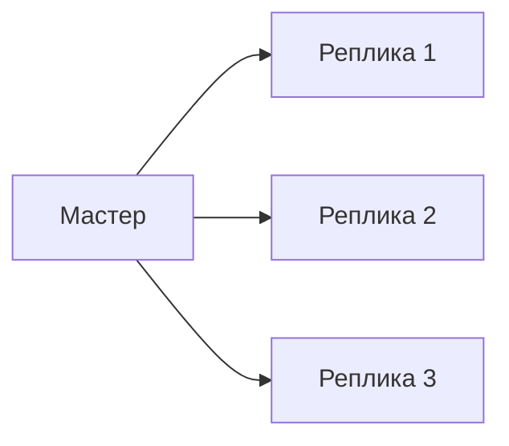

## Введение: Когда один сервер перестаёт справляться

Представьте, что у вас есть небольшой магазин. За день заходит 50 человек — вы справляетесь. Через месяц — 500 человек. Вы нанимаете ещё одного продавца. Через год — 5000 человек в день. Ваш маленький магазин не вмещает всех. Что делать? Можно переехать в огромный торговый центр (вертикальное масштабирование). А можно открыть несколько магазинов в разных районах города (горизонтальное масштабирование).

С базами данных та же история. Сначала вы ставите PostgreSQL на один сервер. Данных немного, запросов мало. Потом бизнес растёт. Данных становится всё больше. Запросов — всё больше. Один сервер перестаёт справляться: медленные ответы, долгие бэкапы, высокий CPU.

**Масштабирование базы данных** — это способность системы увеличивать свою производительность и ёмкость при росте нагрузки. Существует два основных подхода: вертикальное масштабирование (увеличиваем мощность одного сервера) и горизонтальное масштабирование (добавляем новые серверы).

Для системного аналитика масштабирование — это не техническая деталь, а архитектурное решение. От него зависит, как долго проработает система без переделки, сколько будет стоить инфраструктура и насколько сложным будет управление.

## Два типа масштабирования

| Тип | Что делаем | Аналогия |
| :--- | :--- | :--- |
| **Вертикальное** | Увеличиваем мощность одного сервера | Переезжаем в больший офис |
| **Горизонтальное** | Добавляем новые серверы | Открываем филиалы |

## Вертикальное масштабирование (Scaling Up)

### Что это

Вы берёте существующий сервер и делаете его мощнее: больше CPU, больше RAM, быстрее диски. Или переезжаете на более крупный сервер в облаке.

### Как это выглядит

```yaml
Было:
  - 4 CPU, 16 GB RAM, SSD 500 GB

Стало:
  - 16 CPU, 64 GB RAM, SSD 2 TB
```

### Преимущества

| Преимущество | Объяснение |
| :--- | :--- |
| **Простота** | Не нужно менять архитектуру приложения |
| **Совместимость** | Все функции базы данных работают как раньше |
| **Транзакции** | ACID, внешние ключи, JOIN — всё сохраняется |
| **Управление** | Один сервер проще администрировать |

### Недостатки

| Недостаток | Объяснение |
| :--- | :--- |
| **Физический предел** | Нельзя бесконечно увеличивать мощность |
| **Стоимость** | Самые мощные серверы очень дороги |
| **Отсутствие отказоустойчивости** | Сервер упал — всё упало |
| **Простой при апгрейде** | Чтобы увеличить память, часто нужна остановка |

### Когда использовать

```yaml
Подходит:
  - Начальный этап (пока нагрузки мало)
  - Данные помещаются на один сервер
  - Бюджет позволяет купить мощный сервер
  - Нет времени/ресурсов на сложную архитектуру

Не подходит:
  - Данные > 10 ТБ (дорого)
  - Запросов > 10 000 в секунду
  - Нужна отказоустойчивость
```

## Горизонтальное масштабирование (Scaling Out)

### Что это

Вы добавляете новые серверы, и нагрузка распределяется между ними. Вместо одного мощного сервера — много маленьких.

### Как это выглядит

```yaml
Было:
  - 1 сервер (4 CPU, 16 GB RAM)

Стало:
  - 5 серверов (каждый 4 CPU, 16 GB RAM)
  - Итого: 20 CPU, 80 GB RAM
```

### Преимущества

| Преимущество | Объяснение |
| :--- | :--- |
| **Теоретически безлимитно** | Можно добавлять серверы бесконечно |
| **Дешевле** | Много маленьких серверов дешевле одного огромного |
| **Отказоустойчивость** | Если один сервер упал, другие работают |
| **Гибкость** | Можно добавлять серверы по мере роста |

### Недостатки

| Недостаток | Объяснение |
| :--- | :--- |
| **Сложность** | Приложение должно знать о нескольких серверах |
| **Ограниченные возможности** | Не все базы данных хорошо шардируются |
| **Транзакции** | Распределённые транзакции сложны |
| **JOIN** | JOIN между разными серверами медленные или невозможны |

### Когда использовать

```yaml
Подходит:
  - Данные > 1 ТБ
  - Запросов > 10 000 в секунду
  - Нужна отказоустойчивость
  - Бюджет ограничен (много маленьких серверов дешевле)

Не подходит:
  - Маленькие проекты (избыточно)
  - Требуются сложные транзакции
  - Команда не имеет опыта распределённых систем
```

## Способы горизонтального масштабирования

### 1. Репликация (Replication)

Данные копируются на несколько серверов. Один сервер — мастер (пишем в него), остальные — реплики (читаем из них).



**Преимущества:** Отказоустойчивость, распределение чтения.

**Недостатки:** Запись идёт в один сервер (узкое место), задержка репликации.

**Когда использовать:** Чтения >> записи, нужна отказоустойчивость.

### 2. Шардирование (Sharding)

Данные разбиваются на части (шарды) и распределяются по разным серверам. Каждый сервер хранит только часть данных.

```yaml
Шард 1: пользователи с id 1-1000
Шард 2: пользователи с id 1001-2000
Шард 3: пользователи с id 2001-3000
```

**Преимущества:** Линейное масштабирование (добавили сервер — увеличили ёмкость).

**Недостатки:** Сложность, JOIN между шардами невозможны, перебалансировка при добавлении сервера.

**Когда использовать:** Данные не помещаются на один сервер, нагрузка на запись высокая.

### 3. Партиционирование (Partitioning)

Разбиение данных внутри одного сервера (физическое разделение). Не требует нескольких серверов.

```yaml
Таблица orders:
  - Партиция 2024-01: заказы января
  - Партиция 2024-02: заказы февраля
```

**Преимущества:** Ускорение запросов (поиск только в нужной партиции), упрощение удаления старых данных.

**Недостатки:** Всё ещё один сервер.

## Масштабирование чтения

Когда запросов на чтение больше, чем может обработать один сервер, помогает репликация.

```yaml
Архитектура:
  - Мастер: пишем
  - 5 реплик: читаем
  - Приложение распределяет запросы между репликами

Результат:
  - В 5 раз больше запросов на чтение
  - Отказоустойчивость (реплика упала — есть другие)
```

**Ограничения:**

- Запись всё равно идёт в мастер (может быть узким местом)
- Задержка репликации (реплики могут быть не совсем свежими)

## Масштабирование записи

Когда запросов на запись много, репликация не помогает (пишем всё равно в один мастер). Нужно шардирование.

```yaml
Архитектура:
  - Шард 1: пользователи 0-999
  - Шард 2: пользователи 1000-1999
  - Шард 3: пользователи 2000-2999

Запись:
  - Пользователь с id=500 → шард 1
  - Пользователь с id=1500 → шард 2
  - Пользователь с id=2500 → шард 3
```

**Выбор ключа шардирования (shard key):**

| Хороший ключ | Плохой ключ |
| :--- | :--- |
| Равномерно распределяет данные | Создаёт "горячие" шарды |
| Стабильный (не меняется) | Часто меняется |
| Используется в большинстве запросов | Редко используется в запросах |

## Масштабирование в разных типах БД

### Реляционные БД (PostgreSQL, MySQL)

| Подход | Простота | Эффективность |
| :--- | :--- | :--- |
| Вертикальное | Высокая | Средняя |
| Репликация | Средняя | Высокая (для чтения) |
| Шардирование | Низкая | Высокая (для записи) |

**Реальность:** Реляционные БД создавались для вертикального масштабирования. Горизонтальное — возможно, но сложно. Требует ручного управления или специальных расширений (Citus для PostgreSQL, Vitess для MySQL).

### Нереляционные БД (MongoDB, Cassandra)

| Подход | Простота | Эффективность |
| :--- | :--- | :--- |
| Вертикальное | Высокая | Средняя |
| Репликация | Высокая | Высокая |
| Шардирование | Высокая | Высокая |

**Реальность:** NoSQL БД создавались для горизонтального масштабирования. Шардирование и репликация встроены "из коробки".

## Примеры архитектур

### Маленький проект (начало)

```yaml
Один сервер PostgreSQL:
  - 4 CPU, 16 GB RAM
  - Данные: 10 GB
  - Запросов: 100 в секунду

Масштабирование: вертикальное
```

### Средний проект (рост)

```yaml
PostgreSQL мастер + 2 реплики:
  - Мастер: запись
  - Реплики: чтение

Масштабирование: репликация
```

### Большой проект (миллионы пользователей)

```yaml
Шардированный PostgreSQL (Citus) + реплики:
  - Шард 1 + реплики
  - Шард 2 + реплики
  - Шард 3 + реплики

Масштабирование: шардирование + репликация
```

### Очень большой проект (миллиарды записей)

```yaml
Cassandra (NoSQL):
  - 100 узлов
  - Репликация: 3 копии
  - Шардирование: автоматическое

Масштабирование: горизонтальное (из коробки)
```

## Компромиссы CAP-теоремы

При горизонтальном масштабировании приходится выбирать между:

| Выбор | Что жертвуем |
| :--- | :--- |
| **CP (Consistency + Partition tolerance)** | Доступность (при разделении сети система не отвечает) |
| **AP (Availability + Partition tolerance)** | Согласованность (данные могут быть временно не свежими) |

**Что это значит для аналитика:**

- **CP-системы** (HBase, MongoDB по умолчанию) — строгая согласованность, но возможна недоступность при сетевых проблемах. Для финансов, бронирования.
- **AP-системы** (Cassandra, DynamoDB) — высокая доступность, но eventual consistency. Для логов, социальных сетей.

## Стоимость масштабирования

### Вертикальное

```yaml
Сервер 4 CPU, 16 GB: $100/мес
Сервер 16 CPU, 64 GB: $400/мес
Сервер 64 CPU, 256 GB: $2000/мес

Цена растёт нелинейно.
```

### Горизонтальное

```yaml
5 серверов по 4 CPU, 16 GB: 5 × $100 = $500/мес
10 серверов по 4 CPU, 16 GB: 10 × $100 = $1000/мес

Цена растёт линейно.
```

**Вывод:** Для больших объёмов горизонтальное масштабирование дешевле.

## Распространённые ошибки

### Ошибка 1: Позднее масштабирование

Ждут, пока сервер упадёт, и только тогда начинают думать о масштабировании.

**Решение:** Мониторить CPU, RAM, IOPS, размер данных. Планировать масштабирование заранее.

### Ошибка 2: Шардирование преждевременно

Шардирование на 100 серверов, когда данных на 10 GB. Сложность не оправдана.

**Решение:** Начинать с вертикального. Переходить на горизонтальное только когда вертикальное упёрлось в потолок.

### Ошибка 3: Неправильный ключ шардирования

Выбрали ключ, который создаёт "горячий" шард (например, статус "active").

**Решение:** Выбирать ключ с равномерным распределением.

### Ошибка 4: Игнорирование задержки репликации

Читают с реплики сразу после записи в мастер. Данные ещё не продублировались.

**Решение:** Читать с мастера для критичных данных, использовать read-after-write consistency.

### Ошибка 5: JOIN между шардами

Пытаются сделать JOIN между таблицами, которые находятся на разных шардах.

**Решение:** Денормализация, изменение схемы, выбор другого ключа шардирования.

## Резюме

1. **Два типа масштабирования:** вертикальное (мощнее сервер) и горизонтальное (больше серверов).

2. **Вертикальное:** просто, но есть потолок, дорого на больших объёмах. Для начала проекта, для малых и средних нагрузок.

3. **Горизонтальное:** сложно, но безлимитно, дешевле на больших объёмах. Для больших данных, высокой нагрузки, отказоустойчивости.

4. **Репликация** — копирование данных. Для масштабирования чтения и отказоустойчивости.

5. **Шардирование** — разбиение данных. Для масштабирования записи.

6. **CAP-теорема** — при горизонтальном масштабировании выбираем между согласованностью и доступностью.

7. **Стоимость:** горизонтальное дешевле для больших объёмов.