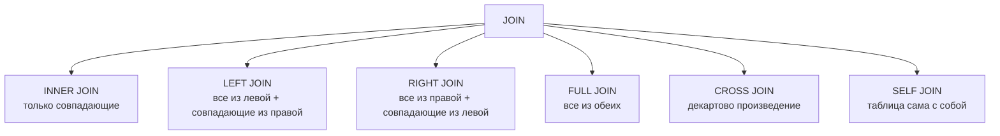

## Введение: Собираем пазл

Представьте, что у вас есть две коробки с деталями пазла. В одной коробке — кусочки неба. В другой — кусочки земли. По отдельности они бесполезны. Только соединив их вместе, вы увидите целую картину.

В реляционных базах данных информация о разных сущностях хранится в разных таблицах. Пользователи — в одной таблице, их заказы — в другой. Чтобы получить полную информацию о заказах вместе с именами пользователей, нужно соединить эти таблицы.

**JOIN** — это операция SQL, которая объединяет строки из двух (или более) таблиц на основе условия связи между ними. JOIN позволяет "склеить" разрозненные данные в единый результат, собирая пазл из кусочков, разложенных по разным таблицам.

## Типы JOIN



### Визуальное представление (диаграммы Венна)

| Тип JOIN | Результат |
| :--- | :--- |
| `INNER JOIN` | Только пересечение |
| `LEFT JOIN` | Вся левая + пересечение |
| `RIGHT JOIN` | Вся правая + пересечение |
| `FULL JOIN` | Вся левая + вся правая |

## INNER JOIN

`INNER JOIN` возвращает только те строки, для которых есть совпадение в обеих таблицах. Если строке из левой таблицы нет соответствия в правой, она не попадает в результат.

```sql
-- Вывести заказы с именами клиентов
SELECT 
    o.id AS order_id,
    o.amount,
    c.name AS customer_name
FROM orders o
INNER JOIN customers c ON o.customer_id = c.id;
```

**Результат:** только заказы, у которых есть клиент. Заказы с `customer_id = NULL` не попадут.

### INNER JOIN с несколькими условиями

```sql
-- Заказы за 2024 год с активными клиентами
SELECT o.id, o.amount, c.name
FROM orders o
INNER JOIN customers c ON o.customer_id = c.id 
    AND c.is_active = true
WHERE o.order_date >= '2024-01-01';
```

### INNER JOIN нескольких таблиц

```sql
-- Полная информация о заказе: клиент, заказ, товары
SELECT 
    c.name AS customer_name,
    o.id AS order_id,
    p.name AS product_name,
    oi.quantity,
    oi.price
FROM orders o
INNER JOIN customers c ON o.customer_id = c.id
INNER JOIN order_items oi ON o.id = oi.order_id
INNER JOIN products p ON oi.product_id = p.id;
```

## LEFT JOIN (LEFT OUTER JOIN)

`LEFT JOIN` возвращает все строки из левой таблицы и совпадающие из правой. Если совпадения нет, колонки из правой таблицы будут заполнены NULL.

```sql
-- Все клиенты и их заказы (даже если заказов нет)
SELECT 
    c.id,
    c.name,
    o.id AS order_id,
    o.amount
FROM customers c
LEFT JOIN orders o ON c.id = o.customer_id;
```

**Результат:** клиенты без заказов будут иметь NULL в колонках заказа.

### Поиск клиентов без заказов

```sql
-- Клиенты, у которых нет ни одного заказа
SELECT c.id, c.name
FROM customers c
LEFT JOIN orders o ON c.id = o.customer_id
WHERE o.id IS NULL;
```

### LEFT JOIN с условием в ON vs WHERE

```sql
-- Разница важна!

-- Вариант 1: условие в ON (фильтрует правую таблицу ДО JOIN)
SELECT c.name, o.amount
FROM customers c
LEFT JOIN orders o ON c.id = o.customer_id AND o.amount > 1000;

-- Вариант 2: условие в WHERE (фильтрует результат ПОСЛЕ JOIN)
SELECT c.name, o.amount
FROM customers c
LEFT JOIN orders o ON c.id = o.customer_id
WHERE o.amount > 1000;  -- Превращает LEFT в INNER (NULL не проходят)
```

## RIGHT JOIN (RIGHT OUTER JOIN)

`RIGHT JOIN` — зеркальная версия `LEFT JOIN`. Возвращает все строки из правой таблицы и совпадающие из левой.

```sql
-- Все заказы и их клиенты (если клиент есть)
SELECT 
    o.id AS order_id,
    c.name AS customer_name
FROM customers c
RIGHT JOIN orders o ON c.id = o.customer_id;
```

**Замечание:** `RIGHT JOIN` редко используется, потому что любой `RIGHT JOIN` можно переписать как `LEFT JOIN`, поменяв таблицы местами.

```sql
-- То же самое через LEFT JOIN
SELECT 
    o.id AS order_id,
    c.name AS customer_name
FROM orders o
LEFT JOIN customers c ON c.id = o.customer_id;
```

## FULL JOIN (FULL OUTER JOIN)

`FULL JOIN` возвращает все строки из обеих таблиц. Если есть совпадение — строки объединяются. Если нет — недостающие колонки заполняются NULL.

```sql
-- Все клиенты и все заказы
SELECT 
    c.id AS customer_id,
    c.name,
    o.id AS order_id,
    o.amount
FROM customers c
FULL JOIN orders o ON c.id = o.customer_id;
```

**Результат:** 
- Клиенты с заказами — одна строка с данными клиента и заказа
- Клиенты без заказов — строка с данными клиента и NULL в колонках заказа
- Заказы без клиентов (если такое возможно) — строка с NULL в колонках клиента и данными заказа

### Поиск несовпадающих записей в обеих таблицах

```sql
-- Клиенты без заказов И заказы без клиентов
SELECT 
    c.id AS customer_id,
    c.name,
    o.id AS order_id
FROM customers c
FULL JOIN orders o ON c.id = o.customer_id
WHERE c.id IS NULL OR o.id IS NULL;
```

## CROSS JOIN

`CROSS JOIN` возвращает декартово произведение: каждая строка из левой таблицы соединяется с каждой строкой из правой. Результат: N строк в левой × M строк в правой.

```sql
-- Все комбинации цветов и размеров
SELECT color, size
FROM colors
CROSS JOIN sizes;

-- То же самое без ключевого слова CROSS
SELECT color, size
FROM colors, sizes;
```

**Когда использовать:**
- Генерация тестовых данных
- Создание всех возможных комбинаций (например, для расписания)
- Подготовка данных для матричных отчетов

## SELF JOIN (самообъединение)

`SELF JOIN` — это JOIN таблицы с самой собой. Нужен для работы с иерархическими данными.

```sql
-- Сотрудники и их руководители
SELECT 
    e.name AS employee,
    m.name AS manager
FROM employees e
LEFT JOIN employees m ON e.manager_id = m.id;

-- Иерархия подчинения (категории товаров)
SELECT 
    c1.name AS category,
    c2.name AS subcategory
FROM categories c1
LEFT JOIN categories c2 ON c1.id = c2.parent_id
WHERE c1.parent_id IS NULL;  -- только верхний уровень
```

### Рекурсивный SELF JOIN (WITH RECURSIVE)

```sql
-- Все подчиненные менеджера (включая подчиненных подчиненных)
WITH RECURSIVE subordinates AS (
    -- Базовый запрос: непосредственные подчиненные
    SELECT id, name, manager_id, 1 AS level
    FROM employees
    WHERE manager_id = 1  -- ID менеджера
    
    UNION ALL
    
    -- Рекурсивный запрос: подчиненные подчиненных
    SELECT e.id, e.name, e.manager_id, s.level + 1
    FROM employees e
    INNER JOIN subordinates s ON e.manager_id = s.id
)
SELECT * FROM subordinates;
```

## NATURAL JOIN

`NATURAL JOIN` автоматически соединяет таблицы по колонкам с одинаковыми именами. Не рекомендуется, так как поведение неявное и может привести к ошибкам.

```sql
-- Автоматически соединит по колонкам с одинаковыми именами
SELECT * FROM customers NATURAL JOIN orders;

-- Эквивалентно (если общая колонка называется id)
SELECT * FROM customers JOIN orders ON customers.id = orders.customer_id;
-- Но если общих колонок несколько, будут использованы все!
```

**Почему NATURAL JOIN опасен:**
- Неявное поведение
- Если добавить новую колонку с таким же именем, JOIN изменится
- Легко получить непреднамеренный результат

## USING

`USING` — альтернативный синтаксис, когда колонки для JOIN называются одинаково.

```sql
-- Вместо ON customers.id = orders.customer_id
SELECT * 
FROM customers 
JOIN orders USING (customer_id);  -- колонка называется одинаково

-- С несколькими колонками
SELECT * 
FROM orders 
JOIN order_items USING (order_id, product_id);
```

**Особенность:** колонка, указанная в USING, появляется в результате только один раз.

## Сравнение типов JOIN

| Тип | Что возвращает | Когда использовать |
| :--- | :--- | :--- |
| `INNER JOIN` | Только совпадающие строки | Когда нужны только записи, у которых есть связь |
| `LEFT JOIN` | Все из левой + совпадающие из правой | Когда нужны все записи из основной таблицы, даже если нет связей |
| `RIGHT JOIN` | Все из правой + совпадающие из левой | Редко (можно заменить LEFT) |
| `FULL JOIN` | Все из обеих таблиц | Когда нужны все записи из обеих таблиц |
| `CROSS JOIN` | Декартово произведение | Когда нужны все комбинации |
| `SELF JOIN` | Таблица сама с собой | Иерархические данные |

## Условия JOIN

### ON vs WHERE

```sql
-- Разница в порядке выполнения

-- ON: фильтрует строки ДО JOIN
-- WHERE: фильтрует строки ПОСЛЕ JOIN

-- Для INNER JOIN разницы нет (оптимизатор переставит)
-- Для OUTER JOIN разница критична
```

### Несколько условий в ON

```sql
-- Соединение по нескольким колонкам
SELECT *
FROM orders o
JOIN order_items oi ON o.id = oi.order_id AND o.status = 'completed';

-- То же самое, но условие в WHERE
SELECT *
FROM orders o
JOIN order_items oi ON o.id = oi.order_id
WHERE o.status = 'completed';
```

### JOIN с неравенством

```sql
-- Диапазоны цен (например, цены на даты)
SELECT *
FROM products p
JOIN price_history ph ON p.id = ph.product_id 
    AND p.current_date BETWEEN ph.start_date AND ph.end_date;

-- Похожие имена (не точное совпадение)
SELECT a.name, b.name
FROM users a
JOIN users b ON a.name ILIKE b.name  -- ILIKE = LIKE без учета регистра
WHERE a.id != b.id;
```

## JOIN нескольких таблиц

### Порядок выполнения

```sql
-- JOIN выполняются слева направо (в большинстве СУБД)
SELECT *
FROM a
JOIN b ON a.id = b.a_id
JOIN c ON b.id = c.b_id
JOIN d ON c.id = d.c_id;

-- Эквивалентно (((a JOIN b) JOIN c) JOIN d)
```

### Важность порядка для LEFT JOIN

```sql
-- Результат зависит от порядка

-- Вариант 1
SELECT *
FROM customers c
LEFT JOIN orders o ON c.id = o.customer_id
JOIN order_items oi ON o.id = oi.order_id;
-- Заказы без позиций отфильтруются (JOIN превращается в INNER)

-- Вариант 2 (сохраняет NULL)
SELECT *
FROM customers c
LEFT JOIN orders o ON c.id = o.customer_id
LEFT JOIN order_items oi ON o.id = oi.order_id;
-- Заказы без позиций останутся (NULL в колонках order_items)
```

## JOIN и агрегация

```sql
-- Количество заказов на клиента
SELECT 
    c.id,
    c.name,
    COUNT(o.id) AS orders_count,
    SUM(o.amount) AS total_spent
FROM customers c
LEFT JOIN orders o ON c.id = o.customer_id
GROUP BY c.id, c.name;

-- Внимание: LEFT JOIN может дублировать строки перед агрегацией
-- COUNT(o.id) считает только не-NULL, что правильно для подсчета заказов
```

### Проблема дублирования при JOIN

```sql
-- Осторожно: если у заказа несколько товаров, сумма заказа умножится
SELECT 
    c.name,
    SUM(o.amount) AS total  -- НЕПРАВИЛЬНО! Будет дублирование
FROM customers c
JOIN orders o ON c.id = o.customer_id
JOIN order_items oi ON o.id = oi.order_id
GROUP BY c.name;

-- Правильно: агрегировать до JOIN
WITH order_totals AS (
    SELECT order_id, SUM(quantity * price) AS total
    FROM order_items
    GROUP BY order_id
)
SELECT c.name, SUM(ot.total)
FROM customers c
JOIN orders o ON c.id = o.customer_id
JOIN order_totals ot ON o.id = ot.order_id
GROUP BY c.name;
```

## JOIN и подзапросы

```sql
-- JOIN с подзапросом
SELECT c.name, latest_order.amount
FROM customers c
JOIN (
    SELECT customer_id, MAX(amount) AS amount
    FROM orders
    GROUP BY customer_id
) latest_order ON c.id = latest_order.customer_id;

-- Эквивалентно с оконной функцией (часто эффективнее)
SELECT DISTINCT c.name, FIRST_VALUE(o.amount) OVER (PARTITION BY o.customer_id ORDER BY o.amount DESC)
FROM customers c
JOIN orders o ON c.id = o.customer_id;
```

## JOIN и индексы

### Какие индексы нужны для JOIN

```sql
-- Для JOIN по customers.id = orders.customer_id
-- Нужны индексы:
-- 1. На customers.id (первичный ключ — уже индекс)
-- 2. На orders.customer_id (внешний ключ — рекомендуется индексировать)

CREATE INDEX idx_orders_customer_id ON orders(customer_id);
```

### План выполнения (EXPLAIN)

```sql
-- Анализ производительности JOIN
EXPLAIN (ANALYZE, BUFFERS)
SELECT c.name, o.amount
FROM customers c
JOIN orders o ON c.id = o.customer_id
WHERE o.order_date > '2024-01-01';
```

**Что смотреть:**
- `Nested Loop` — хорошо для маленьких таблиц
- `Hash Join` — хорошо для средних таблиц
- `Merge Join` — хорошо для больших отсортированных таблиц

## Распространенные ошибки

### Ошибка 1: Забытый JOIN

```sql
-- Плохо (декартово произведение)
SELECT c.name, o.amount
FROM customers c, orders o;

-- Хорошо
SELECT c.name, o.amount
FROM customers c
JOIN orders o ON c.id = o.customer_id;
```

### Ошибка 2: Неправильный тип JOIN

```sql
-- Плохо: клиенты без заказов потеряются
SELECT c.name, o.amount
FROM customers c
JOIN orders o ON c.id = o.customer_id;

-- Хорошо: все клиенты, даже без заказов
SELECT c.name, o.amount
FROM customers c
LEFT JOIN orders o ON c.id = o.customer_id;
```

### Ошибка 3: Условие в WHERE вместо ON для OUTER JOIN

```sql
-- Плохо: условие в WHERE превращает LEFT в INNER
SELECT c.name, o.amount
FROM customers c
LEFT JOIN orders o ON c.id = o.customer_id
WHERE o.amount > 1000;  -- NULL не проходят

-- Хорошо: условие в ON
SELECT c.name, o.amount
FROM customers c
LEFT JOIN orders o ON c.id = o.customer_id AND o.amount > 1000;
```

### Ошибка 4: Дублирование строк из-за "размножения"

```sql
-- Заказ с 3 товарами: сумма заказа посчитается 3 раза
SELECT o.id, SUM(o.amount)  -- НЕПРАВИЛЬНО
FROM orders o
JOIN order_items oi ON o.id = oi.order_id
GROUP BY o.id;

-- Правильно: агрегация до JOIN или DISTINCT
SELECT o.id, o.amount  -- o.amount уже сумма
FROM orders o;
```

### Ошибка 5: JOIN без индексов

```sql
-- Медленно: полное сканирование обеих таблиц
SELECT * FROM large_table1 t1
JOIN large_table2 t2 ON t1.unindexed_column = t2.unindexed_column;
-- Нужны индексы!
```

## Практические примеры

### Пример 1: Отчет по продажам

```sql
SELECT 
    DATE(o.order_date) AS sale_date,
    c.name AS customer_name,
    c.city,
    p.name AS product_name,
    oi.quantity,
    oi.price,
    oi.quantity * oi.price AS line_total
FROM orders o
JOIN customers c ON o.customer_id = c.id
JOIN order_items oi ON o.id = oi.order_id
JOIN products p ON oi.product_id = p.id
WHERE o.order_date BETWEEN '2024-01-01' AND '2024-12-31'
ORDER BY o.order_date, c.name;
```

### Пример 2: Анализ воронки

```sql
-- Посещения → регистрации → покупки
SELECT 
    DATE(v.visit_date) AS date,
    COUNT(DISTINCT v.user_id) AS visits,
    COUNT(DISTINCT r.user_id) AS registrations,
    COUNT(DISTINCT o.user_id) AS purchases,
    ROUND(COUNT(DISTINCT r.user_id)::DECIMAL / NULLIF(COUNT(DISTINCT v.user_id), 0) * 100, 2) AS reg_rate,
    ROUND(COUNT(DISTINCT o.user_id)::DECIMAL / NULLIF(COUNT(DISTINCT r.user_id), 0) * 100, 2) AS purchase_rate
FROM visits v
LEFT JOIN registrations r ON v.user_id = r.user_id AND v.visit_date = r.reg_date
LEFT JOIN orders o ON v.user_id = o.user_id AND v.visit_date = o.order_date
GROUP BY DATE(v.visit_date)
ORDER BY date;
```

### Пример 3: Обновление с JOIN

```sql
-- PostgreSQL: обновление с JOIN
UPDATE orders 
SET status = 'VIP'
FROM customers c
WHERE orders.customer_id = c.id AND c.total_spent > 100000;

-- MySQL: обновление с JOIN
UPDATE orders o
JOIN customers c ON o.customer_id = c.id
SET o.status = 'VIP'
WHERE c.total_spent > 100000;
```

### Пример 4: Удаление с JOIN

```sql
-- PostgreSQL: удаление дубликатов
DELETE FROM users u
USING (
    SELECT MIN(id) as keep_id, email
    FROM users
    GROUP BY email
    HAVING COUNT(*) > 1
) duplicates
WHERE u.email = duplicates.email AND u.id != duplicates.keep_id;
```

## Резюме для системного аналитика

1. **JOIN** — операция объединения таблиц по условию связи. Это сердце реляционных баз данных. Без JOIN данные остаются в изолированных таблицах, как детали пазла в разных коробках.

2. **INNER JOIN** — только совпадающие строки. **LEFT JOIN** — все из левой, совпадающие из правой. **FULL JOIN** — все из обеих. **CROSS JOIN** — декартово произведение.

3. **Условия JOIN** обычно по внешним ключам: `ON orders.customer_id = customers.id`. Индексы на этих колонках критически важны для производительности.

4. **Порядок JOIN имеет значение**, особенно для `LEFT JOIN`. Условия в `ON` фильтруют до JOIN, условия в `WHERE` — после.

5. **При агрегации с JOIN** остерегайтесь дублирования (размножения строк). Агрегируйте до JOIN или используйте `DISTINCT`.

6. **SELF JOIN** — таблица сама с собой. Нужен для иерархий (сотрудник — руководитель, категория — подкатегория).