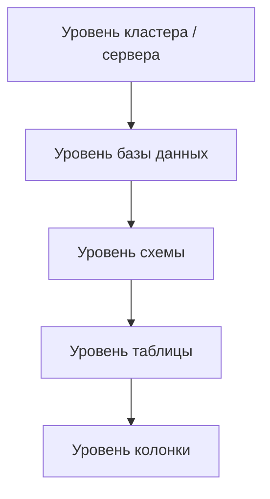

# ## Введение: Кто есть кто в базе данных

Представьте офис компании. В нем есть разные люди: директор, бухгалтер, менеджеры, стажеры. У каждого свой доступ к документам. Директор может все. Бухгалтер видит финансовые документы, но не видит код разработки. Стажер видит только общую информацию, но не может ничего менять.

В базе данных происходит то же самое. Разные пользователи и роли должны иметь разные права доступа. Кто-то может читать данные, кто-то — добавлять, кто-то — изменять структуру таблиц. Без системы прав любой пользователь мог бы удалить все данные или прочитать чужие зарплаты.

**DCL (Data Control Language)** — это язык управления доступом к данным. Он определяет, кто и что может делать с объектами базы данных.

| Команда | Назначение | Аналогия в офисе |
| :--- | :--- | :--- |
| `GRANT` | Дать права | Выдать ключ от кабинета |
| `REVOKE` | Забрать права | Отобрать ключ |

DCL — это то, о чем аналитик обычно не думает, пока не столкнется с ошибкой "permission denied". Но понимание DCL важно, чтобы:
- Знать, почему вы не видите某些 таблицы
- Понимать, какие права нужны вашим отчетам
- Проектировать безопасную систему

## Основные понятия

### Пользователь (User)

Учетная запись, под которой подключаются к базе данных.

```sql
-- PostgreSQL: создание пользователя
CREATE USER analyst WITH PASSWORD 'secure_password';

-- MySQL
CREATE USER 'analyst'@'localhost' IDENTIFIED BY 'secure_password';

-- SQL Server
CREATE USER analyst FOR LOGIN analyst_login;
```

### Роль (Role)

Группа прав, которую можно назначать пользователям. Роли упрощают управление: проще дать права роли, а потом добавить пользователей в роль, чем назначать права каждому пользователю отдельно.

```sql
-- PostgreSQL: создание роли
CREATE ROLE read_only;
CREATE ROLE read_write;
CREATE ROLE admin;

-- Назначение прав роли
GRANT SELECT ON ALL TABLES TO read_only;
GRANT INSERT, UPDATE, DELETE ON ALL TABLES TO read_write;
GRANT ALL PRIVILEGES ON ALL TABLES TO admin;

-- Назначение роли пользователю
GRANT read_only TO analyst;
```

### Привилегии (Privileges)

Конкретные действия, которые разрешены.

| Привилегия | Что разрешает |
| :--- | :--- |
| `SELECT` | Читать данные из таблицы/представления |
| `INSERT` | Добавлять строки в таблицу |
| `UPDATE` | Изменять строки в таблице |
| `DELETE` | Удалять строки из таблицы |
| `TRUNCATE` | Очищать таблицу (удалять все строки) |
| `REFERENCES` | Создавать внешние ключи, ссылающиеся на таблицу |
| `TRIGGER` | Создавать триггеры на таблице |
| `CREATE` | Создавать объекты (таблицы, индексы, схемы) |
| `ALTER` | Изменять структуру объектов |
| `DROP` | Удалять объекты |
| `EXECUTE` | Выполнять функции и процедуры |
| `USAGE` | Использовать схему, последовательность, тип |
| `ALL PRIVILEGES` | Все доступные привилегии |

## GRANT: Дать права

### GRANT на таблицу

```sql
-- Дать право на чтение таблицы users
GRANT SELECT ON users TO analyst;

-- Дать права на чтение и вставку
GRANT SELECT, INSERT ON orders TO analyst;

-- Дать все права на таблицу
GRANT ALL PRIVILEGES ON users TO admin;

-- Дать права на все таблицы в схеме
GRANT SELECT ON ALL TABLES IN SCHEMA public TO analyst;

-- PostgreSQL: дать права на будущие таблицы
ALTER DEFAULT PRIVILEGES IN SCHEMA public GRANT SELECT ON TABLES TO analyst;
```

### GRANT с опцией передачи (WITH GRANT OPTION)

Позволяет пользователю не только пользоваться правом, но и передавать его другим.

```sql
-- Администратор дает право, и администратор может передать его дальше
GRANT SELECT ON users TO team_lead WITH GRANT OPTION;

-- Теперь team_lead может дать SELECT другим
GRANT SELECT ON users TO junior_analyst;
```

### GRANT на схему

```sql
-- Право использовать схему
GRANT USAGE ON SCHEMA sales TO analyst;

-- Право создавать объекты в схеме
GRANT CREATE ON SCHEMA sales TO developer;
```

### GRANT на функцию

```sql
-- Право выполнять функцию
GRANT EXECUTE ON FUNCTION calculate_discount(INT, DECIMAL) TO analyst;
```

### GRANT на последовательность (sequence)

```sql
-- Право использовать последовательность
GRANT USAGE ON SEQUENCE users_id_seq TO app_user;
```

### GRANT на базу данных

```sql
-- Право подключаться к базе данных
GRANT CONNECT ON DATABASE myapp TO analyst;

-- Право создавать объекты в базе данных
GRANT CREATE ON DATABASE myapp TO developer;
```

## REVOKE: Забрать права

### REVOKE простой

```sql
-- Забрать право на чтение
REVOKE SELECT ON users FROM analyst;

-- Забрать несколько прав
REVOKE SELECT, INSERT ON orders FROM analyst;

-- Забрать все права
REVOKE ALL PRIVILEGES ON users FROM analyst;
```

### REVOKE с каскадом (CASCADE)

Если пользователь передал права другим, `REVOKE` может отозвать и их.

```sql
-- Отозвать право у team_lead и у всех, кому он его передал
REVOKE SELECT ON users FROM team_lead CASCADE;
```

### REVOKE с ограничением (RESTRICT)

Запрещает отзыв, если есть зависимые права.

```sql
-- Ошибка, если team_lead уже передал права другим
REVOKE SELECT ON users FROM team_lead RESTRICT;
```

## Роли и группы

### Создание и управление ролями

```sql
-- Создание ролей
CREATE ROLE read_only;
CREATE ROLE read_write;
CREATE ROLE data_engineer;

-- Назначение прав ролям
GRANT SELECT ON ALL TABLES TO read_only;
GRANT SELECT, INSERT, UPDATE, DELETE ON ALL TABLES TO read_write;
GRANT CREATE, ALTER, DROP ON SCHEMA public TO data_engineer;

-- Назначение ролей пользователям
GRANT read_only TO analyst;
GRANT read_write TO data_analyst;

-- Назначение роли другой роли (иерархия)
GRANT read_only TO read_write;  -- read_write теперь включает read_only
```

### Предопределенные роли

Многие СУБД имеют встроенные роли.

**PostgreSQL:**

| Роль | Назначение |
| :--- | :--- |
| `pg_read_all_data` | Чтение всех данных |
| `pg_write_all_data` | Запись всех данных |
| `pg_monitor` | Мониторинг (статистика, запросы) |
| `pg_signal_backend` | Отмена запросов других пользователей |

```sql
-- PostgreSQL: дать право на чтение всех данных
GRANT pg_read_all_data TO analyst;
```

**SQL Server:**

| Роль | Назначение |
| :--- | :--- |
| `db_datareader` | Чтение всех таблиц |
| `db_datawriter` | Запись во все таблицы |
| `db_ddladmin` | Создание и изменение объектов |
| `db_owner` | Полный контроль над базой |

```sql
-- SQL Server: дать роль
EXEC sp_addrolemember 'db_datareader', 'analyst';
```

**MySQL:**

| Роль | Назначение |
| :--- | :--- |
| `SELECT` | Чтение |
| `INSERT` | Добавление |
| `UPDATE` | Обновление |
| `DELETE` | Удаление |
| `ALL PRIVILEGES` | Все права |

## Уровни привилегий

Привилегии могут быть назначены на разных уровнях.



### Уровень кластера (все базы данных)

```sql
-- PostgreSQL: право создавать базы данных
GRANT CREATEDB TO admin;

-- Право создавать роли
GRANT CREATEROLE TO admin;
```

### Уровень базы данных

```sql
-- Право подключаться к базе данных
GRANT CONNECT ON DATABASE myapp TO analyst;

-- Право создавать объекты в базе данных
GRANT CREATE ON DATABASE myapp TO developer;
```

### Уровень схемы

```sql
-- Право использовать схему
GRANT USAGE ON SCHEMA sales TO analyst;

-- Право создавать объекты в схеме
GRANT CREATE ON SCHEMA sales TO developer;
```

### Уровень таблицы

```sql
-- Права на таблицу
GRANT SELECT, INSERT ON users TO analyst;
```

### Уровень колонки

```sql
-- PostgreSQL: право только на определенные колонки
GRANT SELECT (id, name, email) ON users TO analyst;
GRANT UPDATE (status) ON users TO manager;
```

## Безопасность на уровне строк (Row Level Security)

Некоторые СУБД позволяют ограничивать доступ не только к таблицам, но и к отдельным строкам.

### PostgreSQL: RLS (Row Level Security)

```sql
-- Включение RLS для таблицы
ALTER TABLE users ENABLE ROW LEVEL SECURITY;

-- Политика: пользователь видит только свои данные
CREATE POLICY user_policy ON users
    USING (user_id = current_user_id());

-- Политика: менеджер видит данные своего отдела
CREATE POLICY manager_policy ON employees
    USING (department_id IN (SELECT department_id FROM managers WHERE manager_id = current_user_id()));

-- Политика для вставки
CREATE POLICY insert_policy ON orders
    FOR INSERT
    WITH CHECK (customer_id = current_user_id());
```

### Пример RLS в действии

```sql
-- Таблица с данными пользователей
CREATE TABLE user_data (
    user_id INT,
    data TEXT
);

-- Включение RLS
ALTER TABLE user_data ENABLE ROW LEVEL SECURITY;

-- Политика: пользователь видит только свои строки
CREATE POLICY user_isolation ON user_data
    USING (user_id = current_setting('myapp.user_id')::INT);

-- Пользователь с user_id=123 видит только свои данные
SET myapp.user_id = '123';
SELECT * FROM user_data;  -- только строки с user_id=123
```

## Практические примеры

### Пример 1: Настройка доступа для аналитика

```sql
-- Создание пользователя
CREATE USER analyst WITH PASSWORD 'analyst_pass';

-- Создание роли для аналитиков
CREATE ROLE analyst_role;

-- Права: чтение всех таблиц в public
GRANT SELECT ON ALL TABLES IN SCHEMA public TO analyst_role;

-- Права: чтение всех будущих таблиц
ALTER DEFAULT PRIVILEGES IN SCHEMA public GRANT SELECT ON TABLES TO analyst_role;

-- Право подключаться к базе данных
GRANT CONNECT ON DATABASE myapp TO analyst_role;

-- Назначение роли пользователю
GRANT analyst_role TO analyst;
```

### Пример 2: Настройка доступа для разработчика

```sql
-- Создание пользователя
CREATE USER developer WITH PASSWORD 'dev_pass';

-- Создание роли
CREATE ROLE developer_role;

-- Права: все на таблицы в схеме dev
GRANT ALL PRIVILEGES ON ALL TABLES IN SCHEMA dev TO developer_role;

-- Права: создание таблиц
GRANT CREATE ON SCHEMA dev TO developer_role;

-- Права: выполнение функций
GRANT EXECUTE ON ALL FUNCTIONS IN SCHEMA dev TO developer_role;

-- Назначение
GRANT developer_role TO developer;
```

### Пример 3: Настройка доступа для приложения

```sql
-- Приложение только пишет в таблицу logs
CREATE USER app_user WITH PASSWORD 'app_pass';

GRANT INSERT ON logs TO app_user;

-- Приложение читает справочники, но не может их менять
GRANT SELECT ON products, categories TO app_user;

-- Приложение не имеет доступа к пользовательским данным
-- (нет прав на таблицу users)
```

### Пример 4: Аудит доступа

```sql
-- PostgreSQL: кто имеет права на таблицу?
SELECT grantee, privilege_type 
FROM information_schema.table_privileges 
WHERE table_name = 'users';

-- MySQL: права пользователя
SHOW GRANTS FOR 'analyst'@'localhost';

-- PostgreSQL: права текущего пользователя
SELECT * FROM aclexplode('SELECT'::regclass);
```

## Привилегии по умолчанию

Когда создается новый объект (таблица, схема), кто получает на него права?

### PostgreSQL: привилегии по умолчанию

```sql
-- Владелец объекта: все права
-- PUBLIC (все пользователи): ничего (кроме CONNECT на базу)

-- Настройка привилегий для будущих объектов
ALTER DEFAULT PRIVILEGES IN SCHEMA public 
    GRANT SELECT ON TABLES TO analyst;

ALTER DEFAULT PRIVILEGES IN SCHEMA public 
    GRANT INSERT, UPDATE, DELETE ON TABLES TO app_role;
```

### MySQL: привилегии по умолчанию

- Владелец: все права
- Другие пользователи: нет прав (если не даны явно)

### SQL Server: привилегии по умолчанию

- Владелец схемы: все права
- `public` роль: SELECT на системные объекты, ограниченные права на пользовательские

## Просмотр прав

### PostgreSQL

```sql
-- Права пользователя на таблицы
SELECT table_name, grantee, privilege_type
FROM information_schema.table_privileges
WHERE grantee = 'analyst';

-- Права роли
SELECT * FROM pg_roles;

-- Все права текущего пользователя
SELECT * FROM aclexplode('SELECT'::regclass);
```

### MySQL

```sql
-- Права пользователя
SHOW GRANTS FOR 'analyst'@'localhost';

-- Текущий пользователь
SHOW GRANTS;
```

### SQL Server

```sql
-- Права пользователя
SELECT * FROM sys.fn_my_permissions('users', 'OBJECT');

-- Роли пользователя
EXEC sp_helprolemember;
```

## Лучшие практики

### Принцип наименьших привилегий (Least Privilege)

Давайте пользователю ровно те права, которые ему нужны, и не больше.

```sql
-- Плохо: дать все права
GRANT ALL PRIVILEGES ON ALL TABLES TO analyst;

-- Хорошо: только чтение
GRANT SELECT ON ALL TABLES IN SCHEMA public TO analyst;
```

### Использование ролей

```sql
-- Плохо: давать права напрямую каждому пользователю
GRANT SELECT ON users TO analyst1;
GRANT SELECT ON users TO analyst2;
GRANT SELECT ON users TO analyst3;

-- Хорошо: создать роль и дать права роли
CREATE ROLE analysts;
GRANT SELECT ON users TO analysts;
GRANT analysts TO analyst1, analyst2, analyst3;
```

### Разделение по схемам

```sql
-- Данные для аналитики в одной схеме, операционные данные в другой
CREATE SCHEMA reporting;
CREATE SCHEMA operational;

GRANT SELECT ON ALL TABLES IN SCHEMA reporting TO analysts;
GRANT SELECT, INSERT, UPDATE, DELETE ON ALL TABLES IN SCHEMA operational TO app;
```

### Ограничение доступа на уровне колонок

```sql
-- Аналитик не должен видеть пароли
GRANT SELECT (id, name, email, created_at) ON users TO analyst;
-- Нет права на колонку password_hash
```

### Регулярный аудит прав

```sql
-- Проверять, у кого есть неоправданно широкие права
SELECT grantee, privilege_type 
FROM information_schema.table_privileges 
WHERE privilege_type = 'ALL';
```

## Распространенные ошибки

### Ошибка 1: GRANT ALL всем пользователям

```sql
-- Очень опасно
GRANT ALL PRIVILEGES ON ALL TABLES TO public;
```

**Как исправить:** Никогда не давайте `ALL PRIVILEGES` роли `PUBLIC`. Это даст права всем пользователям, включая анонимных.

### Ошибка 2: Забытые права на будущие объекты

```sql
-- Дали права на существующие таблицы
GRANT SELECT ON ALL TABLES IN SCHEMA public TO analyst;

-- Но новые таблицы создаются без прав для analyst
CREATE TABLE new_table (id INT);
```

**Как исправить:** Настроить права по умолчанию.

```sql
ALTER DEFAULT PRIVILEGES IN SCHEMA public 
    GRANT SELECT ON TABLES TO analyst;
```

### Ошибка 3: Избыточные права

```sql
-- Аналитику не нужны INSERT, UPDATE, DELETE
GRANT SELECT, INSERT, UPDATE, DELETE ON users TO analyst;
```

**Как исправить:** Только SELECT.

### Ошибка 4: GRANT на уровне базы данных вместо схемы

```sql
-- Дает права на ВСЕ таблицы во всех схемах
GRANT SELECT ON DATABASE myapp TO analyst;
```

**Как исправить:** Давать права на конкретные схемы или таблицы.

```sql
GRANT SELECT ON ALL TABLES IN SCHEMA public TO analyst;
```

### Ошибка 5: Не отзывать права при увольнении

Пользователь уволился, но его учетная запись все еще имеет доступ.

**Как исправить:** Отзывать права или блокировать пользователя.

```sql
REVOKE ALL PRIVILEGES ON ALL TABLES IN SCHEMA public FROM former_employee;
-- или
ALTER USER former_employee WITH NOLOGIN;
```

## Резюме для системного аналитика

1. **DCL (Data Control Language)** — язык управления доступом. Две основные команды: `GRANT` (дать права) и `REVOKE` (забрать права). DCL определяет, кто и что может делать с данными.

2. **Пользователи (Users)** — учетные записи, под которыми подключаются к базе. **Роли (Roles)** — группы прав, которые можно назначать пользователям. Роли упрощают управление доступом.

3. **Уровни привилегий:** кластер (все базы), база данных, схема, таблица, колонка. Чем ниже уровень, тем тоньше контроль.

4. **Принцип наименьших привилегий (Least Privilege):** давайте пользователю ровно те права, которые ему нужны. Аналитику обычно достаточно `SELECT`. Разработчику — `SELECT, INSERT, UPDATE, DELETE` в своей схеме. Администратору — `ALL`.

5. **Row Level Security (RLS)** позволяет ограничивать доступ на уровне строк. Например, пользователь видит только свои данные. Это более тонкий контроль, чем привилегии на таблицы.

6. **Права по умолчанию** (Default Privileges) определяют, кто получает права на будущие объекты. Важно настраивать, чтобы новые таблицы автоматически получали правильные права.