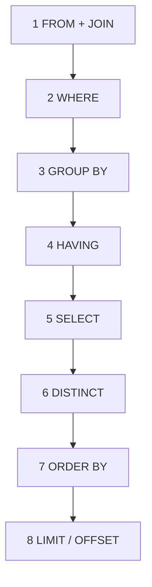

## Введение: Язык, который понимают все базы данных

Представьте, что вы хотите спросить у коллеги: "Сколько у нас заказов от клиентов из Москвы за последний месяц?" Если коллега говорит по-русски, вы задаете вопрос по-русски. Если по-английски — по-английски. Проблема в том, что базы данных не говорят ни по-русски, ни по-английски.

Им нужен специальный язык. Язык, который понимают и PostgreSQL, и MySQL, и Oracle, и SQL Server. Язык, который одинаково хорошо описывает и простые вопросы ("найти клиента по ID"), и сложные аналитические запросы ("показать динамику продаж по категориям товаров за последние 5 лет").

**SQL (Structured Query Language)** — это язык для работы с реляционными базами данных. На нем вы:
- **Спрашиваете:** "Дай мне данные, которые удовлетворяют таким-то условиям"
- **Командуете:** "Добавь новую запись", "Обнови существующую", "Удали ненужное"
- **Создаете:** "Создай таблицу для хранения клиентов"
- **Управляете:** "Дай пользователю Ивану права на чтение этой таблицы"

SQL появился в 1970-х годах в лабораториях IBM и с тех пор стал стандартом индустрии. Он декларативный — вы описываете **что** хотите получить, а не **как** это сделать. База данных сама решает, как эффективно выполнить ваш запрос.

## Декларативный vs Императивный

Это самое важное, что нужно понять о SQL.

### Императивный подход (как)

Вы описываете последовательность действий:

```python
# Python (императивный) — как найти пользователей из Москвы старше 18 лет
result = []
for user in all_users:
    if user.city == "Москва" and user.age > 18:
        result.append(user)
```

Вы говорите компьютеру: "Сделай так, потом так, потом проверь условие, потом добавь в список". Вы управляете процессом.

### Декларативный подход (что)

Вы описываете желаемый результат:

```sql
-- SQL (декларативный) — как найти пользователей из Москвы старше 18 лет
SELECT * FROM users WHERE city = 'Москва' AND age > 18;
```

Вы говорите: "Дай мне всех пользователей, у которых город Москва и возраст больше 18". **Как** это сделать (использовать индекс или сканировать таблицу, в каком порядке проверять условия) решает база данных.

### Почему это важно

| Аспект | Императивный (Python, Java, C++) | Декларативный (SQL) |
| :--- | :--- | :--- |
| **Что пишет программист** | Алгоритм (шаги) | Результат (условия) |
| **Кто решает "как"** | Программист | База данных (оптимизатор) |
| **Зависимость от данных** | Высокая (приходится переписывать) | Низкая (оптимизатор подстраивается) |
| **Переносимость** | Низкая (разные алгоритмы для разных БД) | Высокая (SQL везде похож) |

## История SQL

| Год | Событие |
| :--- | :--- |
| **1970** | Эдгар Кодд публикует статью о реляционной модели данных |
| **1974** | В IBM создают SEQUEL (Structured English Query Language) |
| **1979** | Oracle выпускает первую коммерческую реализацию SQL |
| **1986** | SQL становится стандартом ANSI |
| **1987** | Стандарт ISO |
| **1992** | SQL-92 (масштабное обновление) |
| **1999** | SQL:1999 (рекурсивные запросы, триггеры) |
| **2003** | SQL:2003 (оконные функции, XML) |
| **2011** | SQL:2011 (темпоральные данные) |
| **2016** | SQL:2016 (JSON) |

Сегодня существует много диалектов SQL. Код, написанный для PostgreSQL, может не работать в MySQL без изменений. Но основные конструкции (`SELECT`, `FROM`, `WHERE`, `JOIN`, `GROUP BY`) одинаковы везде.

## Категории команд SQL

### DDL (Data Definition Language) — определение данных

Создание и изменение структуры базы данных.

| Команда | Назначение | Пример |
| :--- | :--- | :--- |
| `CREATE` | Создать таблицу, индекс, представление | `CREATE TABLE users (id INT, name TEXT);` |
| `ALTER` | Изменить структуру таблицы | `ALTER TABLE users ADD COLUMN email TEXT;` |
| `DROP` | Удалить таблицу, индекс, представление | `DROP TABLE users;` |
| `TRUNCATE` | Очистить таблицу (удалить все строки) | `TRUNCATE TABLE logs;` |

### DML (Data Manipulation Language) — манипуляция данными

Чтение и изменение данных.

| Команда | Назначение | Пример |
| :--- | :--- | :--- |
| `SELECT` | Чтение данных | `SELECT * FROM users WHERE age > 18;` |
| `INSERT` | Добавление строк | `INSERT INTO users (name) VALUES ('Иван');` |
| `UPDATE` | Обновление строк | `UPDATE users SET age = 30 WHERE name = 'Иван';` |
| `DELETE` | Удаление строк | `DELETE FROM users WHERE age < 18;` |

### DCL (Data Control Language) — контроль доступа

Управление правами пользователей.

| Команда | Назначение | Пример |
| :--- | :--- | :--- |
| `GRANT` | Дать права | `GRANT SELECT ON users TO analyst;` |
| `REVOKE` | Забрать права | `REVOKE INSERT ON users FROM public;` |

### TCL (Transaction Control Language) — управление транзакциями

Управление транзакциями (будет подробно в отдельной теме).

| Команда | Назначение | Пример |
| :--- | :--- | :--- |
| `BEGIN` | Начать транзакцию | `BEGIN;` |
| `COMMIT` | Зафиксировать изменения | `COMMIT;` |
| `ROLLBACK` | Отменить изменения | `ROLLBACK;` |
| `SAVEPOINT` | Установить точку отката | `SAVEPOINT sp1;` |

## Простейший SQL запрос

```sql
-- Выбрать все столбцы из таблицы users
SELECT * FROM users;

-- Выбрать только имя и email
SELECT name, email FROM users;

-- Выбрать с условием
SELECT name, email FROM users WHERE city = 'Москва';

-- Выбрать с сортировкой
SELECT name, age FROM users ORDER BY age DESC;

-- Выбрать с ограничением количества
SELECT name FROM users LIMIT 10;
```

## Порядок выполнения SQL запроса

Это одна из самых важных тем для понимания SQL. То, как вы пишете запрос, и то, как база данных его выполняет, — это разные порядки.

### Как мы пишем (синтаксический порядок)

```sql
SELECT DISTINCT 
    u.name,
    COUNT(o.id) AS order_count
FROM users u
JOIN orders o ON u.id = o.user_id
WHERE u.city = 'Москва'
    AND o.created_at > '2024-01-01'
GROUP BY u.name
HAVING COUNT(o.id) > 5
ORDER BY order_count DESC
LIMIT 10;
```

### Как выполняется (логический порядок)



| Шаг   | Ключевое слово     | Что происходит                                                                                                          |
| :---- | :----------------- | :---------------------------------------------------------------------------------------------------------------------- |
| **1** | `FROM` + `JOIN`    | Определяется набор данных. Соединяются таблицы, создается "виртуальная таблица" со всеми колонками из всех JOIN         |
| **2** | `WHERE`            | Фильтрация строк. Отбрасываются строки, не удовлетворяющие условию. **Здесь еще нет доступа к алиасам из SELECT**       |
| **3** | `GROUP BY`         | Группировка. Строки объединяются в группы по указанным колонкам                                                         |
| **4** | `HAVING`           | Фильтрация групп. Отбрасываются группы, не удовлетворяющие условию. **Здесь уже можно использовать агрегатные функции** |
| **5** | `SELECT`           | Вычисление выражений. Создаются алиасы колонок, вычисляются скалярные функции                                           |
| **6** | `DISTINCT`         | Удаление дубликатов из результата                                                                                       |
| **7** | `ORDER BY`         | Сортировка результата. **Здесь уже можно использовать алиасы из SELECT**                                                |
| **8** | `LIMIT` / `OFFSET` | Ограничение количества строк. Выбрасываются строки за пределами лимита                                                  |

### Почему это важно знать

**Ошибка 1: Использование алиаса в WHERE**

```sql
-- Так нельзя (WHERE выполняется до SELECT)
SELECT name, age * 12 AS age_months FROM users WHERE age_months > 240;

-- Так можно
SELECT name, age * 12 AS age_months FROM users WHERE age * 12 > 240;
```

**Ошибка 2: Использование агрегатной функции в WHERE**

```sql
-- Так нельзя (WHERE выполняется до GROUP BY)
SELECT department, AVG(salary) FROM employees WHERE AVG(salary) > 50000 GROUP BY department;

-- Так можно (HAVING выполняется после GROUP BY)
SELECT department, AVG(salary) FROM employees GROUP BY department HAVING AVG(salary) > 50000;
```

**Ошибка 3: Использование алиаса в GROUP BY**

```sql
-- В некоторых СУБД нельзя, в некоторых можно
SELECT name, age * 12 AS age_months FROM users GROUP BY name, age_months;

-- Безопасный вариант
SELECT name, age * 12 AS age_months FROM users GROUP BY name, age * 12;
```

**Ошибка 4: Использование LIMIT без ORDER BY**

```sql
-- Непонятно, какие 10 строк будут выбраны
SELECT * FROM users LIMIT 10;

-- Правильно: сначала сортируем, потом ограничиваем
SELECT * FROM users ORDER BY created_at DESC LIMIT 10;
```

## Визуальный пример порядка выполнения

Запрос:

```sql
SELECT 
    u.name,
    COUNT(o.id) as orders
FROM users u
JOIN orders o ON u.id = o.user_id
WHERE u.city = 'Москва'
GROUP BY u.name
HAVING COUNT(o.id) > 2
ORDER BY orders DESC;
```

**Шаг 1: FROM + JOIN**

Создается виртуальная таблица со всеми колонками из users и orders.

| u.id | u.name | u.city | o.id | o.user_id | o.amount |
| :--- | :--- | :--- | :--- | :--- | :--- |
| 1 | Иван | Москва | 101 | 1 | 500 |
| 1 | Иван | Москва | 102 | 1 | 300 |
| 2 | Петр | СПб | 103 | 2 | 700 |
| 3 | Анна | Москва | 104 | 3 | 200 |
| 3 | Анна | Москва | 105 | 3 | 400 |
| 3 | Анна | Москва | 106 | 3 | 100 |

**Шаг 2: WHERE**

Оставляем только Москву.

| u.id | u.name | u.city | o.id | o.user_id | o.amount |
| :--- | :--- | :--- | :--- | :--- | :--- |
| 1 | Иван | Москва | 101 | 1 | 500 |
| 1 | Иван | Москва | 102 | 1 | 300 |
| 3 | Анна | Москва | 104 | 3 | 200 |
| 3 | Анна | Москва | 105 | 3 | 400 |
| 3 | Анна | Москва | 106 | 3 | 100 |

**Шаг 3: GROUP BY**

Группировка по имени.

| u.name | Группа |
| :--- | :--- |
| Иван | [строки 1-2] |
| Анна | [строки 3-5] |

**Шаг 4: HAVING**

Оставляем только тех, у кого COUNT(o.id) > 2.

| u.name | COUNT(o.id) | Подходит? |
| :--- | :--- | :--- |
| Иван | 2 | Нет (не больше 2) |
| Анна | 3 | Да |

**Шаг 5: SELECT**

Вычисляем выражения.

| name | orders |
| :--- | :--- |
| Анна | 3 |

**Шаг 6: DISTINCT**

Нет DISTINCT — пропускаем.

**Шаг 7: ORDER BY**

Сортировка по orders DESC.

| name | orders |
| :--- | :--- |
| Анна | 3 |

**Шаг 8: LIMIT**

Нет LIMIT — пропускаем.


## Почему SQL жив уже 50 лет

| Причина | Объяснение |
| :--- | :--- |
| **Декларативность** | Вы говорите "что", а не "как". База данных сама находит лучший способ выполнения |
| **Математическая основа** | Реляционная алгебра — строгая, предсказуемая, формальная |
| **Стандартизация** | Единый язык для разных баз данных |
| **Мощность** | Один запрос может заменить тысячи строк императивного кода |
| **Оптимизация** | Оптимизаторы запросов становятся умнее, код на SQL не нужно переписывать |
| **Экосистема** | BI-инструменты (Tableau, Power BI), ORM (SQLAlchemy, Hibernate) — все говорят на SQL |

## Резюме для системного аналитика

1. **SQL (Structured Query Language)** — язык для работы с реляционными базами данных. Декларативный: вы описываете "что" получить, а не "как".

2. **Категории команд:** DDL (структура), DML (данные), DCL (права), TCL (транзакции). Аналитик чаще всего работает с DML (SELECT, INSERT, UPDATE, DELETE).

3. **Порядок выполнения SQL запроса** отличается от порядка написания: FROM → WHERE → GROUP BY → HAVING → SELECT → DISTINCT → ORDER BY → LIMIT. Это критически важно для понимания, почему одни запросы работают, а другие — нет.