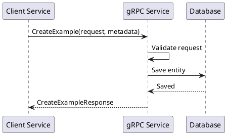

# Шаблон gRPC

> gRPC-контракт описывает сервис, методы, сообщения request/response, тип вызова, ошибки, deadlines, metadata и правила совместимости `.proto`.

## Паспорт метода

| Поле | Значение |
|---|---|
| Сервис | `<Package.ServiceName>` |
| Метод | `<MethodName>` |
| Тип вызова | `Unary / Server streaming / Client streaming / Bidirectional streaming` |
| Proto-файл | `<path/to/service.proto>` |
| Версия | `v1` |
| Статус | `Draft / Review / Approved / Deprecated` |

## Назначение

Опишите бизнес-операцию, которую выполняет метод.

## Участники

| Участник | Роль |
|---|---|
| `<client-service>` | gRPC-клиент |
| `<server-service>` | gRPC-сервер |
| `<external-system>` | Внешняя зависимость |

## Metadata

| Key | Тип | Обяз. | Описание |
|---|---|---|---|
| authorization | string | Да / Нет | Токен доступа |
| x-correlation-id | string | Да | Сквозная трассировка |
| x-request-id | string | Нет | ID запроса |
| idempotency-key | string | Да / Нет | Ключ идемпотентности |

## Proto-контракт

```proto
syntax = "proto3";

package example.v1;

service ExampleService {
  rpc CreateExample(CreateExampleRequest) returns (CreateExampleResponse);
}

message CreateExampleRequest {
  string external_id = 1;
  string name = 2;
  string comment = 3;
}

message CreateExampleResponse {
  string id = 1;
  string status = 2;
}
```

## Request message

| Поле | Proto type | Обяз. | Правило | Описание |
|---|---|---|---|---|
| external_id | string | Да | Не пустое | Внешний ID |
| name | string | Да | До `<N>` символов | Название |
| comment | string | Нет | До `<N>` символов | Комментарий |

## Response message

| Поле | Proto type | Обяз. | Описание |
|---|---|---|---|
| id | string | Да | Идентификатор сущности |
| status | string | Да | Статус обработки |

## Бизнес-логика

1. Принять gRPC-запрос.
2. Проверить metadata.
3. Проверить обязательные поля.
4. Выполнить бизнес-валидации.
5. Выполнить операцию.
6. Вернуть response.

## Ошибки

| gRPC status | Условие |
|---|---|
| INVALID_ARGUMENT | Некорректные входные данные |
| UNAUTHENTICATED | Не передан или невалиден токен |
| PERMISSION_DENIED | Нет прав |
| NOT_FOUND | Объект не найден |
| ALREADY_EXISTS | Объект уже существует |
| FAILED_PRECONDITION | Нарушено бизнес-условие |
| DEADLINE_EXCEEDED | Превышен deadline |
| UNAVAILABLE | Сервис временно недоступен |
| INTERNAL | Внутренняя ошибка |

## Deadlines и retry

| Параметр | Значение |
|---|---|
| Deadline клиента | `<N>` мс |
| Timeout внешнего вызова | `<N>` мс |
| Retry | Да / Нет |
| Условия retry | `UNAVAILABLE`, `DEADLINE_EXCEEDED` |
| Максимум попыток | `<N>` |

## Совместимость proto

| Правило | Требование |
|---|---|
| Не переиспользовать номера полей | Удаленные номера помечать как `reserved` |
| Не менять тип существующего поля | Требует новой версии контракта |
| Новые поля добавлять с новыми номерами | Старые клиенты продолжают работать |
| enum расширять осторожно | Старые клиенты могут не знать новое значение |

## Пример reserved

```proto
message CreateExampleRequest {
  reserved 4, 5;
  reserved "old_field";
}
```

## Sequence diagram



## Открытые вопросы

| ID | Вопрос | Кому адресован | Статус |
|---|---|---|---|
| Q-001 | `<вопрос>` | `<роль / ФИО>` | Открыт |

## Критерии приемки документа

| ID | Критерий |
|---|---|
| AC-DOC-001 | Документ согласован с владельцем продукта / архитектором / разработкой, если применимо. |
| AC-DOC-002 | Все спорные места вынесены в открытые вопросы или зафиксированы как ограничения. |
| AC-DOC-003 | В документе нет неоднозначных формулировок вроде "быстро", "удобно", "корректно" без измеримого критерия. |
