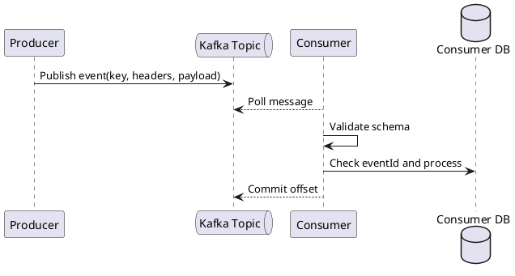

# Шаблон Kafka-топика

> Описание Kafka-топика фиксирует назначение топика, producer, consumers, key, headers, payload, гарантии доставки, порядок сообщений, retry, DLQ и schema evolution.

## Паспорт топика

| Поле | Значение |
|---|---|
| Название топика | `<domain.entity.event.v1>` |
| Назначение | `<какие события публикуются>` |
| Домен | `<домен / bounded context>` |
| Владелец | `<команда / сервис>` |
| Producer | `<service-name>` |
| Consumers | `<service-a>, <service-b>` |
| Версия схемы | `v1` |
| Статус | `Draft / Active / Deprecated` |

## Назначение

Опишите бизнес-событийность, которую отражает топик.

## Тип сообщения

| Параметр | Значение |
|---|---|
| Тип | `Domain Event / Integration Event / Command / Notification Event` |
| Формат | `JSON / Avro / Protobuf` |
| Схема | `Schema Registry / Git / Confluence` |
| Совместимость | `Backward / Forward / Full / None` |

## Producer

| Поле | Значение |
|---|---|
| Сервис | `<producer-service>` |
| Когда публикует | `<после какого события / транзакции>` |
| Способ публикации | `direct publish / outbox / CDC` |
| Гарантия публикации | `<описание>` |

## Consumers

| Consumer | Consumer group | Назначение | Критичность |
|---|---|---|---|
| `<consumer-service>` | `<group-id>` | `<что делает>` | High / Medium / Low |

## Key

| Поле | Значение |
|---|---|
| Kafka key | `<fieldName>` |
| Тип | `string / long / uuid` |
| Зачем выбран | `<порядок / распределение / дедупликация>` |
| Гарантия порядка | Только внутри partition по одинаковому key |

## Headers

| Header | Тип | Обяз. | Описание |
|---|---|---|---|
| correlationId | string | Да | Сквозная трассировка |
| causationId | string | Нет | ID события/команды-источника |
| eventId | string | Да | Уникальный ID события |
| eventType | string | Да | Тип события |
| schemaVersion | string | Да | Версия схемы |
| producer | string | Да | Producer-сервис |

## Payload

```json
{
  "eventId": "evt-123",
  "eventType": "RequestCreated",
  "occurredAt": "2026-05-09T12:00:00Z",
  "data": {
    "requestId": "req-123",
    "status": "CREATED",
    "createdBy": "user-123"
  }
}
```

## Описание payload

| Поле | Тип | Обяз. | Описание |
|---|---|---|---|
| eventId | string | Да | Уникальный ID события |
| eventType | string | Да | Тип события |
| occurredAt | string | Да | Время события |
| data.requestId | string | Да | ID бизнес-объекта |
| data.status | string | Да | Новый статус |

## Настройки топика

| Параметр | Значение |
|---|---|
| Partitions | `<N>` |
| Replication factor | `<N>` |
| Retention | `<N>` дней/часов |
| Cleanup policy | `delete / compact / delete,compact` |
| Max message size | `<N>` КБ/МБ |

## Гарантии доставки

| Вопрос | Ответ |
|---|---|
| Возможна повторная доставка? | Да / Нет |
| Требуется идемпотентный consumer? | Да / Нет |
| Требуется порядок сообщений? | Да / Нет |
| Уровень порядка | `partition + key` |

## Retry и DLQ

| Параметр | Значение |
|---|---|
| Retry | Да / Нет |
| Количество попыток | `<N>` |
| Backoff | `fixed / exponential` |
| Retry topics | `<topic.retry.1>` |
| DLQ topic | `<topic.dlq>` |
| Кто разбирает DLQ | `<команда / роль>` |

## Schema evolution

| Изменение | Допустимо? | Комментарий |
|---|---|---|
| Добавить необязательное поле | Да | Обычно совместимо |
| Удалить поле | Нет / после deprecate | Может сломать consumers |
| Изменить тип поля | Нет | Breaking change |
| Добавить enum | Осторожно | Старые consumers могут не обработать |

## Мониторинг

| Метрика | Описание |
|---|---|
| Consumer lag | Отставание consumer group |
| Messages in / out | Количество сообщений |
| Error rate | Доля ошибок обработки |
| DLQ count | Сообщения в DLQ |
| Processing duration | Время обработки |

## Sequence diagram



## Открытые вопросы

| ID    | Вопрос     | Кому адресован | Статус |
| ----- | ---------- | -------------- | ------ |
| Q-001 | `<вопрос>` | `<роль / ФИО>` | Открыт |

## Критерии приемки документа

| ID | Критерий |
|---|---|
| AC-DOC-001 | Документ согласован с владельцем продукта / архитектором / разработкой, если применимо. |
| AC-DOC-002 | Все спорные места вынесены в открытые вопросы или зафиксированы как ограничения. |
| AC-DOC-003 | В документе нет неоднозначных формулировок вроде "быстро", "удобно", "корректно" без измеримого критерия. |
