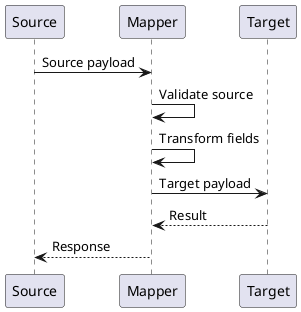

# Шаблон маппинга

> Маппинг описывает, как данные преобразуются между источником и получателем: UI -> API, REST -> gRPC, API -> БД, система A -> система B, событие -> внутренняя модель.

## Паспорт маппинга

| Поле | Значение |
|---|---|
| Название | `<название>` |
| Источник | `<система / API / БД / UI>` |
| Получатель | `<система / API / БД / UI>` |
| Направление | `<source> -> <target>` |
| Сценарий | `<UC / FR>` |
| Версия | `v1.0` |
| Статус | `Draft / Review / Approved` |

## Назначение

Опишите, зачем нужен маппинг.

## Контекст взаимодействия

```text
Frontend -> BFF REST API -> Backend gRPC -> Database
```

## Общие правила преобразования

| ID | Правило |
|---|---|
| MAP-RULE-001 | Если поле отсутствует и не является обязательным, в target оно не передается. |
| MAP-RULE-002 | Если обязательное поле отсутствует, вернуть ошибку валидации. |
| MAP-RULE-003 | Даты передаются в формате ISO 8601. |
| MAP-RULE-004 | Пустые строки обрабатываются как `null`, если не указано иное. |
| MAP-RULE-005 | Значения enum преобразуются по таблице соответствия. |

## Маппинг полей

| Source path | Source type | Target path | Target type | Обяз. | Правило преобразования | Default | Комментарий |
|---|---|---|---|---|---|---|---|
| `body.contractId` | string | `request.contract_id` | string | Да | Передать без изменений |  | ID договора |
| `body.reasonCode` | string | `request.reason_code` | string | Да | По справочнику `ReasonCode` |  | Причина |
| `body.comment` | string | `request.comment` | string | Нет | Trim, max 1000 | `null` | Комментарий |
| `headers.X-Correlation-Id` | string | `metadata.x-correlation-id` | string | Да | Передать без изменений | Сгенерировать | Трассировка |

## Таблица соответствия enum

| Source value | Target value | Описание |
|---|---|---|
| CLIENT_REQUEST | CLIENT_INITIATED | Инициатива клиента |
| ERROR_CORRECTION | CORRECTION | Исправление ошибки |

## Маппинг ошибок

| Source error | Target error | HTTP / gRPC status | Текст |
|---|---|---|---|
| CONTRACT_NOT_FOUND | CONTRACT_NOT_FOUND | `404 / NOT_FOUND` | Договор не найден |
| INVALID_STATUS | INVALID_STATE | `409 / FAILED_PRECONDITION` | Недопустимый статус |
| VALIDATION_ERROR | INVALID_ARGUMENT | `422 / INVALID_ARGUMENT` | Проверьте данные |

## Валидации до маппинга

| ID | Поле | Проверка | Ошибка |
|---|---|---|---|
| VAL-001 | `body.contractId` | Обязательно | CONTRACT_ID_REQUIRED |
| VAL-002 | `body.reasonCode` | Значение есть в справочнике | INVALID_REASON_CODE |

## Правила null / empty

| Source value | Target value | Комментарий |
|---|---|---|
| `null` | `null` | Если поле необязательное |
| `""` | `null` | Если пустая строка не имеет смысла |
| `[]` | `[]` | Если пустой список допустим |
| Поле отсутствует | Не передавать | Если target допускает отсутствие |

## Пример source

```json
{
  "contractId": "123456",
  "reasonCode": "CLIENT_REQUEST",
  "comment": "Заявление клиента"
}
```

## Пример target

```json
{
  "contract_id": "123456",
  "reason_code": "CLIENT_INITIATED",
  "comment": "Заявление клиента"
}
```

## Диаграмма



## Открытые вопросы

| ID | Вопрос | Кому адресован | Статус |
|---|---|---|---|
| Q-001 | `<вопрос>` | `<роль / ФИО>` | Открыт |

## Критерии приемки документа

| ID | Критерий |
|---|---|
| AC-DOC-001 | Документ согласован с владельцем продукта / архитектором / разработкой, если применимо. |
| AC-DOC-002 | Все спорные места вынесены в открытые вопросы или зафиксированы как ограничения. |
| AC-DOC-003 | В документе нет неоднозначных формулировок вроде "быстро", "удобно", "корректно" без измеримого критерия. |
