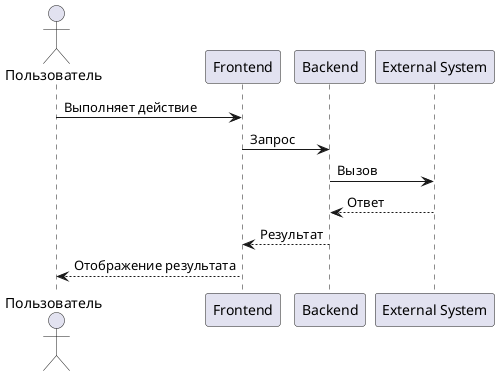

# Шаблон UC

> Use Case описывает сценарий взаимодействия актора с системой для достижения конкретной цели.

## Паспорт UC

| Поле | Значение |
|---|---|
| ID | `UC-001` |
| Название | `<название сценария>` |
| Система | `<название>` |
| Основной актор | `<роль / система>` |
| Автор | `<ФИО>` |
| Статус | `Черновик / На согласовании / Согласовано` |

## Цель

Опишите, какую цель актор достигает с помощью сценария.

## Акторы

| Актор | Тип | Описание |
|---|---|---|
| `<Пользователь>` | Основной | Инициирует сценарий |
| `<Сервис>` | Вторичный | Участвует в обработке |
| `<Внешняя система>` | Вторичный | Возвращает данные / принимает запрос |

## Предусловия

| ID | Предусловие |
|---|---|
| PRE-001 | Пользователь авторизован. |
| PRE-002 | У пользователя есть право `<permission>`. |
| PRE-003 | Объект существует и находится в статусе `<status>`. |

## Триггер

Что запускает сценарий.

## Основной сценарий

| Шаг | Участник | Действие |
|---|---|---|
| 1 | Пользователь | Открывает `<экран>` |
| 2 | Система | Отображает `<данные / форму>` |
| 3 | Пользователь | Заполняет данные и нажимает `<кнопка>` |
| 4 | Система | Проверяет права, данные и бизнес-правила |
| 5 | Система | Выполняет операцию / вызывает сервис |
| 6 | Система | Отображает результат |

## Альтернативные сценарии

### AS-001. Пользователь отменил действие

| Шаг | Участник | Действие |
|---|---|---|
| 1 | Пользователь | Нажимает `<Отмена>` |
| 2 | Система | Закрывает форму без сохранения |

### AS-002. Данные не найдены

| Шаг | Участник | Действие |
|---|---|---|
| 1 | Система | Выполняет поиск |
| 2 | Система | Не находит данные |
| 3 | Система | Отображает сообщение `<текст>` |

### AS-003. Внешняя система недоступна

| Шаг | Участник | Действие |
|---|---|---|
| 1 | Сервис | Вызывает `<система>` |
| 2 | Внешняя система | Не отвечает |
| 3 | Сервис | Возвращает контролируемую ошибку |
| 4 | Система | Отображает сообщение пользователю |

## Исключения

| ID | Условие | Поведение системы |
|---|---|---|
| EX-001 | Пользователь не авторизован | Перенаправить на вход / вернуть `401` |
| EX-002 | Нет прав | Вернуть `403` |
| EX-003 | Объект не найден | Вернуть `404` |
| EX-004 | Недопустимый статус объекта | Вернуть `409` |

## Постусловия

| ID | Постусловие |
|---|---|
| POST-001 | Создан / изменен объект `<объект>`. |
| POST-002 | Объект получил статус `<status>`. |
| POST-003 | Создана запись в audit log. |

## Связанные артефакты

| Артефакт | Ссылка |
|---|---|
| FR | `<ссылка>` |
| API | `<ссылка>` |
| Диаграмма | `<ссылка>` |

## Диаграмма последовательности

## Открытые вопросы

| ID | Вопрос | Кому адресован | Статус |
|---|---|---|---|
| Q-001 | `<вопрос>` | `<роль / ФИО>` | Открыт |

## Критерии приемки документа

| ID | Критерий |
|---|---|
| AC-DOC-001 | Документ согласован с владельцем продукта / архитектором / разработкой, если применимо. |
| AC-DOC-002 | Все спорные места вынесены в открытые вопросы или зафиксированы как ограничения. |
| AC-DOC-003 | В документе нет неоднозначных формулировок вроде "быстро", "удобно", "корректно" без измеримого критерия. |
