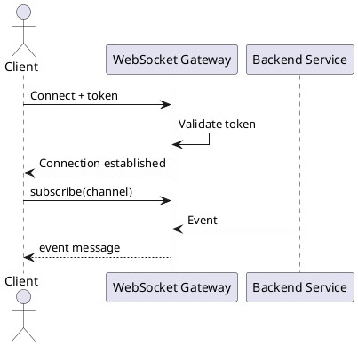

# Шаблон WebSocket

> WebSocket используется для двустороннего обмена сообщениями между клиентом и сервером в режиме открытого соединения.

## Паспорт интеграции

| Поле | Значение |
|---|---|
| Endpoint | `wss://<host>/<path>` |
| Назначение | `<для чего используется>` |
| Клиент | `<web / mobile / service>` |
| Сервер | `<backend service>` |
| Версия | `v1` |
| Статус | `Draft / Review / Approved` |

## Назначение

Опишите realtime-сценарии, которые закрывает WebSocket.

## URL подключения

```text
wss://api.example.ru/ws/v1/notifications
```

## Handshake

| Параметр | Где передается | Обяз. | Описание |
|---|---|---|---|
| Authorization | Header / Query | Да | `Bearer <token>` |
| X-Correlation-Id | Header | Нет | ID подключения |
| clientVersion | Query | Нет | Версия клиента |

## Авторизация

1. Клиент открывает соединение.
2. Сервер проверяет token.
3. Сервер проверяет права пользователя.
4. При успехе соединение устанавливается.
5. При ошибке сервер закрывает соединение с кодом `<close code>`.

## Каналы / подписки

| Канал | Кто подписывается | Назначение |
|---|---|---|
| `notifications` | Авторизованный пользователь | Пользовательские уведомления |
| `request-status` | Пользователь с правом `<permission>` | Изменение статусов заявок |

## Сообщение от клиента

```json
{
  "type": "subscribe",
  "requestId": "req-001",
  "payload": {
    "channel": "request-status",
    "filters": { "requestId": "12345" }
  }
}
```

## Сообщение от сервера

```json
{
  "type": "requestStatusChanged",
  "eventId": "evt-001",
  "occurredAt": "2026-05-09T12:00:00Z",
  "payload": {
    "requestId": "12345",
    "status": "APPROVED"
  }
}
```

## Типы сообщений

| Type | Направление | Описание |
|---|---|---|
| subscribe | Client -> Server | Подписка на канал |
| unsubscribe | Client -> Server | Отписка от канала |
| ping | Client -> Server | Проверка соединения |
| pong | Server -> Client | Ответ на ping |
| error | Server -> Client | Ошибка обработки |
| `<eventName>` | Server -> Client | Бизнес-событие |

## Ошибки и close codes

| Код / close code | Условие | Поведение |
|---|---|---|
| UNAUTHORIZED / 4001 | Не авторизован | Закрыть соединение |
| FORBIDDEN / 4003 | Нет прав | Закрыть или вернуть error |
| INVALID_MESSAGE | Некорректный формат | Вернуть error |
| RATE_LIMIT_EXCEEDED | Слишком много сообщений | Вернуть error / закрыть |

## Heartbeat и reconnect

| Параметр | Значение |
|---|---|
| Интервал ping | `<N>` секунд |
| Timeout pong | `<N>` секунд |
| Стратегия reconnect | Exponential backoff |
| После reconnect | Повторить подписки |
| Восстановление пропущенных событий | `<REST endpoint / повторная синхронизация>` |

## Гарантии доставки

| Вопрос | Ответ |
|---|---|
| Гарантируется доставка? | Да / Нет |
| Возможны дубли? | Да / Нет |
| Есть `eventId` для дедупликации? | Да / Нет |
| Есть история после reconnect? | Да / Нет |

## Ограничения

| Ограничение | Значение |
|---|---|
| Максимальный размер сообщения | `<N>` КБ |
| Максимум соединений на пользователя | `<N>` |
| Rate limit сообщений от клиента | `<N>` сообщений/сек |

## Sequence diagram



## Открытые вопросы

| ID | Вопрос | Кому адресован | Статус |
|---|---|---|---|
| Q-001 | `<вопрос>` | `<роль / ФИО>` | Открыт |

## Критерии приемки документа

| ID | Критерий |
|---|---|
| AC-DOC-001 | Документ согласован с владельцем продукта / архитектором / разработкой, если применимо. |
| AC-DOC-002 | Все спорные места вынесены в открытые вопросы или зафиксированы как ограничения. |
| AC-DOC-003 | В документе нет неоднозначных формулировок вроде "быстро", "удобно", "корректно" без измеримого критерия. |
