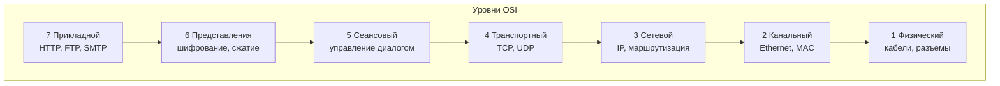
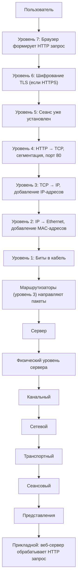
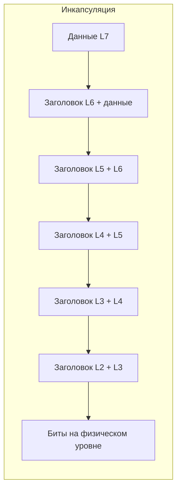

## Введение: Как данные путешествуют по сети

Представьте, что вам нужно отправить посылку из Москвы в Нью-Йорк. Вы не просто бросаете ее в ящик и надеетесь, что она дойдет. Вы упаковываете ее в коробку, приклеиваете адрес, отдаете курьеру, который передает ее на склад, потом грузят в самолет, потом таможня, потом местная доставка. Каждый этап решает свою задачу.

**Модель OSI (Open Systems Interconnection)** делает то же самое для компьютерных сетей. Это концептуальная модель, которая описывает, как данные передаются от одного компьютера к другому через сеть. Модель разбивает процесс передачи на семь уровней (layers). Каждый уровень отвечает за свою часть работы и общается только с соседними уровнями.

Модель OSI была разработана Международной организацией по стандартизации (ISO) в 1980-х годах. Хотя в реальных сетях чаще используется модель TCP/IP (которая проще), OSI остается важной для понимания того, как устроены сетевые протоколы и для диагностики проблем.

## Зачем нужна уровневая модель

**Разделение ответственности.** Каждый уровень решает свою задачу. Прикладной уровень не должен думать о том, как передать биты по кабелю. Физический уровень не должен знать, что за данные он передает.

**Стандартизация.** Производители оборудования могут делать сетевые карты (физический уровень), а разработчики — веб-серверы (прикладной уровень), не зная деталей друг о друге.

**Упрощение отладки.** Если сайт не открывается, можно понять, на каком уровне проблема: кабель отвалился (уровень 1), DNS не работает (уровень 7), порт закрыт (уровень 4).

## Семь уровней модели OSI

### Уровень 1: Физический (Physical)

**Что делает:** Передает сырые биты (0 и 1) по физической среде. Кабели, разъемы, напряжения, частоты, оптические сигналы.

**Задачи:** Определяет, какое напряжение означает 0, а какое 1. Сколько контактов в разъеме. Какая частота для Wi-Fi. Как модулировать сигнал.

**Примеры протоколов и технологий:** Ethernet (кабель), Wi-Fi (радио), Bluetooth, USB, HDMI, оптоволокно, коаксиальный кабель.

**Проблемы на этом уровне:** Обрыв кабеля, плохой контакт, помехи, слишком длинный кабель.

**Как диагностировать:** Проверить, горит ли индикатор на сетевой карте. Подключить другой кабель. Измерить напряжение.

### Уровень 2: Канальный (Data Link)

**Что делает:** Передает кадры (frames) между двумя соседними устройствами в одной сети. Обеспечивает надежность передачи на локальном участке. Управляет доступом к среде (кто может передавать).

**Задачи:** Формирование кадров (frame). Обнаружение ошибок (CRC). Управление доступом к среде (MAC). Адресация внутри локальной сети (MAC-адреса).

**Примеры протоколов:** Ethernet, Wi-Fi (802.11), PPP, ARP (формально между L2 и L3), MAC-адреса.

**Понятия:** MAC-адрес (уникальный идентификатор сетевого интерфейса), коммутатор (switch), мост (bridge).

**Проблемы на этом уровне:** Коллизии в сети (редко для современных сетей), неверный MAC-адрес, проблемы с коммутатором.

### Уровень 3: Сетевой (Network)

**Что делает:** Маршрутизирует пакеты от источника к получателю через несколько сетей. Определяет наилучший путь. Адресация глобальная (в отличие от MAC, который работает только в локальной сети).

**Задачи:** Маршрутизация (выбор пути). Фрагментация и сборка пакетов. Глобальная адресация (IP-адреса).

**Примеры протоколов:** IP (IPv4, IPv6), ICMP (ping), ARP (частично), RIP, OSPF, BGP.

**Понятия:** IP-адрес, маршрутизатор (router), подсеть, шлюз (gateway), TTL (time to live).

**Проблемы на этом уровне:** Неправильный IP-адрес, нет маршрута до сети, шлюз по умолчанию не настроен, проблемы с маршрутизатором.

**Как диагностировать:** `ping`, `traceroute`, `ipconfig` / `ifconfig`.

### Уровень 4: Транспортный (Transport)

**Что делает:** Обеспечивает надежную доставку данных между процессами на разных компьютерах. Контролирует поток данных, сегментацию, повторную передачу потерянных пакетов.

**Задачи:** Сегментация данных. Контроль ошибок (повторная передача). Управление потоком (чтобы отправитель не забивал получателя). Мультиплексирование (порты).

**Примеры протоколов:** TCP (надежный, с установкой соединения), UDP (быстрый, без установки соединения), SCTP.

**Понятия:** Порт (port), сегмент, сокет (socket), трехэтапное рукопожатие (TCP handshake), окно (window).

**Проблемы на этом уровне:** Порт закрыт (брандмауэр), много потерянных пакетов, переполнение буфера, таймауты.

**Как диагностировать:** `telnet host port`, `netstat`, `nmap`, `ss`.

### Уровень 5: Сеансовый (Session)

**Что делает:** Управляет диалогом между приложениями. Устанавливает, поддерживает и завершает сеансы связи. Разграничивает данные разных сеансов.

**Задачи:** Установка и завершение соединения. Управление диалогом (кто говорит). Синхронизация (контрольные точки для восстановления после сбоя).

**Примеры протоколов:** NetBIOS, RPC, PPTP, SIP (для VoIP), SMB (файловые шары Windows).

**Понятия:** Сеанс (session), контрольная точка (checkpoint), возобновление (resume).

**Проблемы на этом уровне:** Ошибки аутентификации, таймауты сеанса, проблемы с RPC.

> **Важно:** В модели TCP/IP функции сеансового и представительского уровня часто входят в прикладной уровень. Поэтому многие инженеры редко работают с L5 напрямую.

### Уровень 6: Представления (Presentation)

**Что делает:** Преобразует данные в формат, понятный приложению. Занимается шифрованием, сжатием, преобразованием кодировок.

**Задачи:** Шифрование и дешифрование. Сжатие данных. Преобразование форматов (XML, JSON, ASN.1). Преобразование кодировок (UTF-8, ASCII).

**Примеры протоколов и форматов:** TLS/SSL (частично, шифрование), JPEG, GIF, MPEG, ASCII, EBCDIC.

**Понятия:** Сериализация, десериализация, шифрование, кодеки.

**Проблемы на этом уровне:** Неправильная кодировка (кракозябры), несовместимые форматы данных, проблемы с сертификатами.

### Уровень 7: Прикладной (Application)

**Что делает:** Предоставляет пользователям и приложениям доступ к сетевым сервисам. Это то, с чем работают разработчики напрямую.

**Задачи:** Протоколы прикладного уровня. API для приложений. Управление ресурсами.

**Примеры протоколов:** HTTP/HTTPS (веб), FTP (файлы), SMTP (почта), POP3/IMAP (почта), DNS (имена), SSH (удаленный доступ), WebSocket.

**Понятия:** Браузер, веб-сервер, почтовый клиент, DNS resolver.

**Проблемы на этом уровне:** Ошибка 404 (не найдено), 500 (ошибка сервера), DNS не резолвится, неправильный URL.

**Как диагностировать:** `curl`, `wget`, браузер, `dig` (DNS).

## Сквозной пример: Открытие веб-страницы

Допустим, вы в браузере вводите "http://example.com" и нажимаете Enter.

## Модель OSI vs TCP/IP

На практике в интернете используется модель TCP/IP, которая объединяет некоторые уровни OSI.

| OSI | TCP/IP | Примеры |
| :--- | :--- | :--- |
| 7. Прикладной | \multirow{3}{*}{Прикладной} | HTTP, FTP, SMTP, DNS |
| 6. Представления | | TLS, JSON |
| 5. Сеансовый | | NetBIOS, RPC |
| 4. Транспортный | Транспортный | TCP, UDP |
| 3. Сетевой | Сетевой (Internet) | IP, ICMP |
| 2. Канальный | \multirow{2}{*}{Канальный (Network Access)} | Ethernet, Wi-Fi |
| 1. Физический | | Кабели, разъемы |

**Почему TCP/IP проще:** Уровни 5 и 6 в OSI редко используются как самостоятельные (их функции встроены в прикладной уровень). Поэтому в TCP/IP их объединили.

## Инкапсуляция (Encapsulation)

Ключевое понятие в модели OSI: каждый уровень добавляет свой заголовок к данным, полученным от вышестоящего уровня.

**Пример с HTTP:**

1. **L7 (HTTP):** "GET /index.html HTTP/1.1" (без заголовка на этом уровне, само сообщение)
2. **L6 (TLS):** Шифрует HTTP-сообщение, добавляет заголовок TLS
3. **L4 (TCP):** Добавляет TCP-заголовок (порт отправителя 12345, порт получателя 80, sequence number)
4. **L3 (IP):** Добавляет IP-заголовок (IP отправителя, IP получателя)
5. **L2 (Ethernet):** Добавляет Ethernet-заголовок (MAC отправителя, MAC получателя)
6. **L1:** Передает биты

## Диагностика проблем по уровням

| Проблема | Вероятный уровень | Команды/инструменты |
| :--- | :--- | :--- |
| Не горит лампочка на сетевой карте | 1 (физический) | Проверить кабель, разъемы |
| Ping до IP-адреса есть, но сайт не открывается | 4 (транспортный), 7 (прикладной) | `telnet host 80`, проверить веб-сервер |
| Ping до домена нет, до IP есть | 7 (прикладной, DNS) | `nslookup`, `dig` |
| Ping есть, но с потерями пакетов | 3 (сетевой), 4 (транспортный) | `mtr`, `traceroute` |
| Сайт открывается медленно | 4 (TCP окно), 3 (маршрутизация) | `traceroute`, анализ дампов |
| Ошибка "Connection refused" | 4 (порт закрыт) | `netstat -an`, `ss -tln` |
| Ошибка SSL/TLS | 6 (представления) | Проверить сертификат, время на клиенте |

## Распространенные ошибки

**Ошибка 1: Путать MAC-адрес и IP-адрес.** MAC (L2) для локальной сети, IP (L3) для глобальной. Маршрутизаторы работают с IP, коммутаторы — с MAC.

**Ошибка 2: Считать, что TCP и IP — это одно и то же.** TCP (L4) обеспечивает надежность, IP (L3) — маршрутизацию. Они работают вместе, но это разные протоколы.

**Ошибка 3: Игнорировать уровни 5-6.** При диагностике проблем с RPC, NetBIOS или шифрованием нужно помнить об этих уровнях.

**Ошибка 4: Забывать об инкапсуляции.** Каждый уровень добавляет свой заголовок. При анализе дампов (Wireshark) нужно понимать структуру пакета.

## Резюме

Модель OSI — это семиуровневая концептуальная модель, описывающая передачу данных в сети.

**Семь уровней (снизу вверх):**

1. **Физический (Physical)** — кабели, разъемы, биты.
2. **Канальный (Data Link)** — кадры, MAC-адреса, коммутаторы.
3. **Сетевой (Network)** — пакеты, IP-адреса, маршрутизация.
4. **Транспортный (Transport)** — сегменты, порты, TCP/UDP.
5. **Сеансовый (Session)** — управление диалогом, сеансы.
6. **Представления (Presentation)** — шифрование, сжатие, кодировки.
7. **Прикладной (Application)** — HTTP, FTP, SMTP, DNS.

**Ключевые принципы:**

- **Разделение ответственности.** Каждый уровень решает свою задачу.
- **Инкапсуляция.** Данные обрастают заголовками при движении вниз.
- **Соседние уровни общаются через интерфейсы.** Изменения внутри уровня не влияют на соседние.

**OSI vs TCP/IP:**

- OSI — теоретическая модель (7 уровней).
- TCP/IP — практическая модель (4 уровня) на основе OSI.

**Зачем знать OSI системному аналитику:** Диагностика сетевых проблем ("уровень 3" — проверить IP, "уровень 7" — проверить HTTP). Понимание того, как работают протоколы. Коммуникация с сетевыми инженерами. Хотя в повседневной работе чаще используется модель TCP/IP, OSI дает фундаментальное понимание того, как устроены сети.