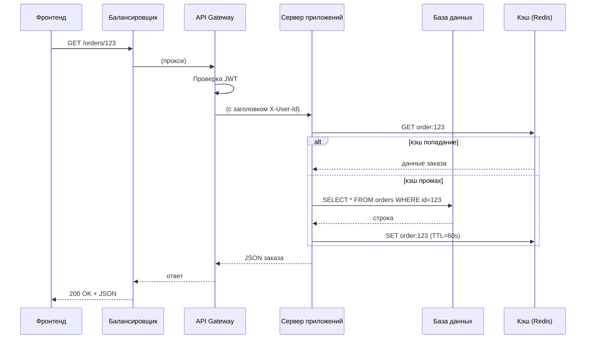

Когда пользователь открывает веб-сайт или мобильное приложение, он видит красивый интерфейс, нажимает кнопки, заполняет формы. Всё, что происходит "под капотом", в дата-центре или в облаке — это работа бэкенда.

**Backend (бэкенд, серверная часть)** — это совокупность компонентов, которые выполняются на сервере (или распределённой инфраструктуре) и обеспечивают хранение данных, бизнес-логику, безопасность, интеграцию с внешними системами и подготовку ответов для фронтенда. Бэкенд не виден пользователю напрямую, но без него интерфейс бесполезен — неоткуда взять список заказов, некому обработать платеж, негде сохранить новый комментарий.

Понимание устройства бэкенда помогает аналитику:

- Формулировать требования к API, базам данным и внешним интеграциям.
- Оценивать сложность задач (где нужно менять бэкенд, а где — только фронтенд).
- Понимать, почему некоторые изменения требуют миграции данных, согласования с другой командой или затрагивают несколько сервисов.
- Участвовать в выборе архитектурных решений (монолит, микросервисы, базы данных).

## Основные задачи бэкенда

1. **Хранение данных.** Бэкенд использует базы данных (SQL или NoSQL), файловые хранилища (S3, MinIO), кэши (Redis), чтобы сохранять информацию о пользователях, заказах, платежах, логах. Без бэкенда после перезагрузки страницы все данные исчезнут.

2. **Бизнес-логика.** Правила, по которым работает приложение: расчёт стоимости заказа со скидкой, проверка, может ли пользователь оформить возврат, начисление бонусных баллов. Бизнес-логика должна быть защищена от манипуляций — поэтому она выполняется на сервере, а не в коде приложения, который пользователь может изменить.

3. **Обработка API-запросов.** Бэкенд принимает запросы от фронтенда (через HTTP/HTTPS, WebSocket, gRPC), проверяет их корректность, выполняет нужные действия и возвращает ответ в формате JSON, XML или Protobuf.

4. **Аутентификация и авторизация.** Проверка, кто отправил запрос (аутентификация), и есть ли у него право на выполнение этой операции (авторизация). JWT, OAuth2, сессии — всё это задача бэкенда.

5. **Интеграция с внешними системами.** Бэкенд вызывает API платёжных шлюзов (Stripe, PayPal), складов, CRM, систем доставки, а также отправляет email и push-уведомления.

6. **Обеспечение безопасности.** Шифрование данных, защита от SQL-инъекций, DDoS-атак, валидация всех входных данных — бэкенд — последний рубеж.

7. **Масштабирование и отказоустойчивость.** Бэкенд проектируется так, чтобы выдерживать рост нагрузки (добавление серверов, репликация БД) и продолжать работать при падении части компонентов.

## Из чего состоит бэкенд

### 1. Сервер приложений (Application Server)

Здесь выполняется основной код на выбранном языке программирования: обрабатываются маршруты, вызываются функции, общаются с базами данных. Популярные языки и фреймворки:

| Язык | Популярные фреймворки | Особенность |
| :--- | :--- | :--- |
| **Java** | Spring Boot, Micronaut, Quarkus | Enterprise-стандарт, большая экосистема |
| **Go** | net/http, Gin, Echo | Высокая производительность, простота |
| **Python** | Django, FastAPI, Flask | Быстрая разработка, ML-интеграции |
| **Node.js (JS/TS)** | Express, Nest.js, Fastify | Единый язык с фронтендом, асинхронность |
| **C#** | ASP.NET Core | Кроссплатформенность, интеграция с Azure |
| **Ruby** | Ruby on Rails | Быстрая разработка, но падает производительность |
| **PHP** | Laravel, Symfony | До сих пор популярен на старых проектах |

Аналитику не обязательно знать все языки, но полезно понимать, что смена языка в проекте — очень дорогое решение, почти никогда не предпринимаемое без веских причин (проблемы с производительностью, наймом специалистов, поддержкой).

### 2. База данных (БД)

Хранилище данных. Основные типы:

- **Реляционные (SQL):** PostgreSQL, MySQL, Oracle, SQL Server. Строгая схема, ACID-транзакции, поддержка JOIN.
- **Документные (NoSQL):** MongoDB, Couchbase, Firestore. JSON-документы, гибкая схема.
- **Ключ-значение (Key-Value):** Redis, Memcached, DynamoDB (в режиме KV). Супер быстрые кэши и хранилища сессий.
- **Колоночные (Columnar):** ClickHouse, Snowflake, BigQuery, Redshift. Для аналитики и агрегатов.
- **Графовые:** Neo4j, ArangoDB. Для социальных связей, рекомендаций.

### 3. Кэш (Cache)

Промежуточный слой для ускорения чтения. Например, Redis или Memcached. Часто используемые данные (каталог товаров, профили пользователей) хранятся в кэше, чтобы не делать дорогие SQL-запросы. Кэш — не главное хранилище, данные в нём могут быть потеряны или устареть.

### 4. Очереди сообщений и брокеры

- **Очереди:** RabbitMQ, Amazon SQS, Redis (в режиме очереди). Для асинхронной обработки задач: отправка email, генерация отчётов, обновление поискового индекса.
- **Потоковые брокеры:** Apache Kafka, Redpanda. Для обработки больших потоков событий в реальном времени.

### 5. API Gateway (точка входа)

Единый вход для всех клиентов. Занимается маршрутизацией, аутентификацией, rate limiting, агрегацией ответов. Изолирует внутреннюю структуру бэкенда от внешнего мира.

### 6. Объектное хранилище (S3, MinIO)

Хранит файлы: изображения, видео, документы, логи, бэкапы. Отдаёт их либо напрямую клиенту (pre-signed URL), либо через бэкенд.

### 7. Сервисная шина и оркестрация

В микросервисной архитектуре компоненты бэкенда общаются друг с другом через HTTP/gRPC (синхронно) или через очереди (асинхронно). Нужны также сервис-дискавери (Consul, etcd), балансировщики и мониторинг.

## Как работает бэкенд: один запрос

Рассмотрим путь запроса от фронтенда до бэкенда и обратно на примере интернет-магазина. Пользователь открывает страницу заказа.

Краткое объяснение шагов:

1. **Балансировщик** (например, Nginx, AWS ALB) получает запрос и выбирает, какой экземпляр API Gateway получит запрос.
2. **API Gateway** проверяет JWT-токен, извлекает `userId`, добавляет его в заголовок (чтобы сервис знал, кто запрашивает данные).
3. **Сервер приложений** (на Java, Go, Python) проверяет права (может ли пользователь с таким ID смотреть этот заказ).
4. Если права есть, сервер пытается прочитать заказ из **кэша (Redis)**. Если в кэше его нет (промах), делает запрос к **базе данных (PostgreSQL)**.
5. После получения данных сервер обновляет кэш (чтобы следующий запрос за тем же заказом был быстрее) и формирует JSON-ответ.
6. Ответ идёт обратно через Gateway и балансировщик к клиенту.

## Взаимодействие бэкенда с фронтендом (API)

Фронтенд и бэкенд обмениваются данными через API. Самые распространённые стили:

- **REST (Representational State Transfer).** Ресурсы (users, orders, products) имеют свои URL, методы GET/POST/PUT/DELETE. Возвращают JSON.
- **GraphQL.** Один эндпоинт, клиент сам выбирает, какие поля ему нужны, и может запросить связанные данные за один запрос.
- **gRPC.** Высокопроизводительный бинарный протокол на базе Protobuf. Часто используется внутри одной инфраструктуры (между микросервисами), а также для мобильных приложений.
- **WebSocket.** Постоянное соединение для real-time сообщений (чаты, биржевые котировки, игровые события).

Аналитику важно понимать, какой API используется и почему. Например, для внутренних сервисов часто выбирают gRPC (быстрый, строгие контракты). Для публичного веб-API — REST (проще для клиентов) или GraphQL (когда клиентам нужна гибкость).

## Что аналитик должен знать о бэкенде

1. **Бэкенд — это "источник истины".** Даже если фронтенд показывает данные, финальная проверка и сохранение происходят на бэкенде. Любые бизнес-ограничения должны дублироваться на бэкенде, даже если фронтенд их уже проверил.

2. **Архитектура бэкенда определяет сложность изменений.** В монолите изменить один модуль — значит пересобрать всё приложение. В микросервисах изменения изолированы, но требуется координация API.

3. **Сбор требований к бэкенду должен включать нефункциональные требования:** сколько пользователей (RPS), допустимая задержка, требования к отказоустойчивости, окна плановых работ.

4. **Интеграции с внешними системами — часть бэкенда.** Платежи, отправка email, списание со склада. Аналитик должен описать не только "когда пользователь нажал оплатить", но и "что делать, если платёжный шлюз ответил ошибкой".

5. **API должен быть удобен для потребителя (фронтенда).** Не заставляйте фронтенд делать 5 запросов там, где можно вернуть агрегированный ответ. С другой стороны, не возвращайте тонны лишних данных, которые фронтенд не использует.

## Резюме

Бэкенд — это сердце информационной системы. Он хранит данные, реализует бизнес-логику, защищает ресурсы, общается с внешним миром. Без бэкенда приложение может показывать только пустую заглушку.

**Что должен знать аналитик о бэкенде:**

- Бэкенд состоит из сервера приложений, базы данных, кэша, очередей, API Gateway и других компонентов.
- Запрос от фронтенда проходит через балансировщик, Gateway, возможно, кэш и БД, прежде чем вернуться с ответом.
- Архитектура бэкенда (монолит/микросервисы) влияет на стоимость изменений и скорость разработки.
- API (REST, GraphQL, gRPC) — ключевой контракт между фронтендом и бэкендом.
- Аналитик должен формулировать требования к API, учитывать нефункциональные характеристики и аварийные сценарии (ошибки, таймауты, недоступность внешних систем).