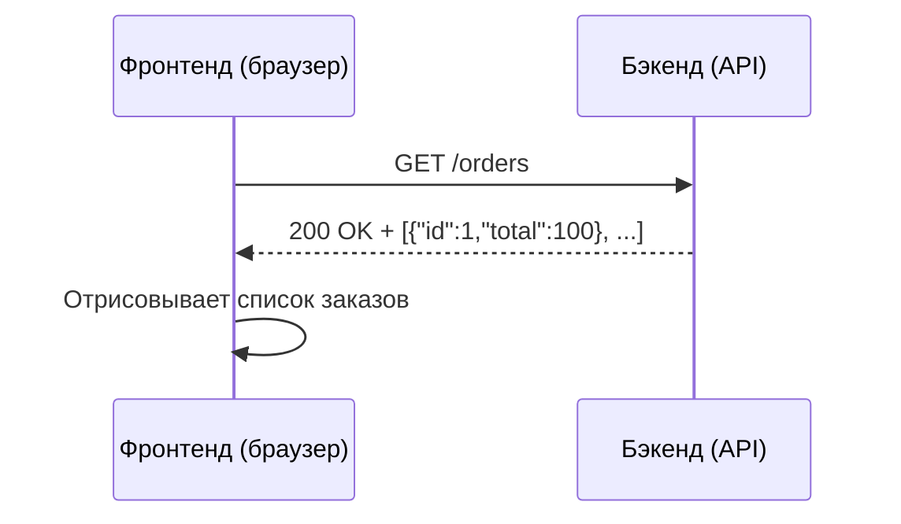

Когда пользователь открывает веб-сайт или мобильное приложение, большая часть того, что он видит и с чем взаимодействует, — это результат работы фронтенда.

**Frontend (фронтенд, клиентская часть)** — это всё, что выполняется на устройстве пользователя: отрисовка интерфейса, обработка действий (клики, свайпы, ввод с клавиатуры), отправка запросов на сервер и отображение полученных данных. Фронтенд работает локально, в браузере или на мобильном устройстве, и не требует постоянного подключения к серверу для базовых операций (хотя для получения или отправки данных связь, как правило, нужна).

Понимание того, как устроен фронтенд, его составляющих и принципов работы, помогают аналитику:

- Формулировать требования к API (какие данные и в каком виде нужны на экране).
- Понимать, почему изменение интерфейса иногда требует доработок на бэкенде.
- Ожидать, какие данные имеет смысл кэшировать на клиенте, а какие всегда запрашивать свежими.
- Оценивать влияние на производительность (загрузка страницы, количество запросов, объём ответов).

## Из чего состоит фронтенд

В веб-разработке фронтенд традиционно делится на три слоя:

- **HTML (HyperText Markup Language)** — разметка, структура страницы. Определяет, где находится заголовок, абзац, кнопка, таблица.
- **CSS (Cascading Style Sheets)** — описание внешнего вида: цвета, шрифты, отступы, расположение элементов, адаптация под мобильные экраны и разные разрешения.
- **JavaScript (JS)** — язык программирования для браузеров. Позволяет добавлять интерактивность: обрабатывать клики, отправлять запросы на сервер (fetch, axios), обновлять часть страницы без её перезагрузки (AJAX), анимировать элементы.

В мобильных приложениях (iOS, Android) роли распределяются иначе, но суть та же: код, который работает на устройстве пользователя, отрисовывает интерфейс, обрабатывает касания и жесты, обращается к локальному хранилищу или к серверу через HTTP/HTTPS.

## Взаимодействие между фронтендом и бэкендом (API)

Фронтенд не хранит бизнес-данные постоянно — за это отвечает бэкенд (база данных, сервер приложений). Обмен информацией происходит по протоколу HTTP/HTTPS через API (чаще всего REST или GraphQL).

Типичный сценарий:

1. Пользователь заходит на страницу "Список заказов".
2. Фронтенд формирует GET-запрос к API, например, `https://api.myapp.com/orders`.
3. Бэкенд обрабатывает запрос, достаёт заказы из базы данных и возвращает их в формате JSON.
4. Фронтенд получает JSON, парсит его и отрисовывает список заказов на странице.

Если фронтенд должен что-то сохранить (новый заказ, комментарий, лайк), он отправляет POST-запрос с данными в теле (JSON). После успешного ответа фронтенд обновляет интерфейс, чтобы отобразить изменения.

Аналитику важно знать:

- **Какие эндпоинты нужны для каждого экрана.** Это позволяет оценить, не придётся ли фронтенду делать 5 последовательных запросов вместо одного агрегированного.
- **Какие поля возвращает бэкенд.** Если на экране показывается аватар пользователя, а API пользователя его не отдаёт, потребуется доработка API или дополнительный запрос.
- **Как часто обновляются данные.** Для данных, которые меняются редко, можно использовать кэширование на фронтенде и уменьшить количество запросов.

## Типы рендеринга

В веб-приложениях есть несколько подходов к тому, *где* именно собирается итоговая HTML-страница.

### MPA (Multi‑Page Application) — классический сайт

При переходе по ссылке браузер запрашивает у сервера новую HTML-страницу целиком. Сервер генерирует HTML (часто с помощью шаблонизатора) и отправляет клиенту.

**Плюсы:** Простота, быстро первичная загрузка, хорошо индексируется поисковыми системами (SEO).

**Минусы:** При каждом действии страница перезагружается целиком, возникает ощущение "тормозов".

### SPA (Single‑Page Application) — современный подход

После начальной загрузки все переходы между разделами происходят без перезагрузки страницы. Фронтенд (React, Vue, Angular, Svelte) сам перерисовывает нужную часть экрана, получая данные из API.

**Плюсы:** Быстрая работа после начальной загрузки, плавные переходы, эффект "приложения".

**Минусы:** Сложнее первоначальная настройка; SEO требует дополнительных усилий (Server-Side Rendering).

### Universal / Isomorphic — гибридный подход

Первая загрузка происходит на сервере (быстрый показ контента и SEO), а последующие переходы обрабатываются на клиенте (как в SPA). Крайне популярно в Next.js (React) и Nuxt (Vue).

### Server‑Side Rendering (SSR)

HTML страницы генерируется на сервере на каждый запрос, но с помощью тех же JS-фреймворков (React, Vue). Позволяет совместить SEO и производительность с сохранением преимуществ SPA после загрузки.

## Виды фронтенда по месту исполнения

| Вид | Где работает | Пример |
| :--- | :--- | :--- |
| **Веб-фронтенд** | Браузер (Chrome, Safari, Edge) | Сайт интернет-магазина, личный кабинет |
| **Мобильный нативный** | iOS (Swift), Android (Kotlin/Java) | Приложения банков, соцсетей |
| **Кроссплатформенный мобильный** | React Native, Flutter | Приложения, которые выглядят нативно, но написаны один раз для двух платформ |
| **Десктопный** | Electron, Tauri, Qt | Slack, VSCode, Discord — веб-технологии внутри десктопной оболочки |

## Что делает фронтенд помимо отрисовки

- **Обработка пользовательских событий** (клики, ввод текста, скролл).
- **Валидация форм** на стороне клиента: проверка email, телефона, обязательных полей. Это не заменяет валидацию на бэкенде, но улучшает UX.
- **Кэширование данных** в браузере (localStorage, IndexedDB, HTTP-кэш). При отключении интернета приложение может показывать ранее загруженные данные.
- **Управление состоянием (state).** Например, когда пользователь выбрал товар в корзину, фронтенд хранит эту информацию локально и отправляет на сервер только в момент оформления заказа.
- **Отправка метрик и трекинга** (аналитика поведения, ошибки фронтенда).

## Frontend-фреймворки и библиотеки

Большинство современных проектов не пишут фронтенд на чистом JavaScript — используют фреймворки или библиотеки:

| Инструмент | Тип | Особенность |
| :--- | :--- | :--- |
| **React** | Библиотека (Meta) | Компонентный подход, большая экосистема, популярен в вебе и React Native |
| **Vue.js** | Фреймворк | Простой порог входа, хорош для небольших и средних проектов |
| **Angular** | Фреймворк (Google) | Тяжёлый, коробочное решение для крупных enterprise-приложений |
| **Svelte** | Компилятор | Нет виртуального DOM, меньший размер бандла |
| **jQuery** | Библиотека (устаревшая) | В новых проектах почти не используется, но много на старых сайтах |

Аналитику не обязательно знать детали реализации, но полезно понимать, что:

- Переход с одного фреймворка на другой — это дорого и редко делается без серьёзных причин.
- Выбор фреймворка влияет на команду (каких разработчиков проще нанять, с какими сложностями столкнутся).
- В одном проекте обычно не используют два разных фреймворка одновременно (это создаёт конфликты).

## Роль аналитика в работе с фронтендом

Аналитик не пишет код, но должен уметь:

- **Понимать, какой объём работы потребуется фронтенду** при изменении API. Например, если бэкенд перестаёт возвращать поле `user.avatar`, фронтенд должен будет перестать показывать аватар и, возможно, убрать целый блок интерфейса.
- **Формулировать критерии приёмки интерфейсных задач.** Например: "При нажатии на кнопку отправляется POST /order, а после успешного ответа открывается страница подтверждения".
- **Участвовать в обсуждении API** между фронтендом и бэкендом, чтобы избежать ситуации, когда фронтенду приходится делать 10 запросов для заполнения одного экрана (это медленно и сложно).
- **Описывать поведение при ошибках.** Что должно показываться, если API вернул 500? Если нет интернета? Если сессия истекла? Всё это поведение реализует фронтенд, и его нужно заранее специфицировать.

## Резюме

Фронтенд — это большая часть пользовательского опыта. Он отвечает за интерфейс, взаимодействие, отправку запросов и отображение данных. Хороший фронтенд не только "красивый", но и быстрый, понятный, работающий при плохом интернете и корректно ведущий себя при ошибках API.

**Что должен знать аналитик о фронтенде:**

- Фронтенд работает на устройстве пользователя (браузер, телефон).
- Для получения данных фронтенд общается с бэкендом через API (REST, GraphQL).
- Существуют разные подходы к рендерингу страниц, каждый со своими требованиями к API (SSR нужны полные HTML-ответы, у SPA достаточно JSON).
- Кэширование на фронтенде снижает нагрузку на бэкенд, но требует механизмов инвалидации.
- Задачи фронтенда включают логику, которую аналитик должен специфицировать (что делать при ошибках, как обрабатывать состояние загрузки, как показывать прогресс).