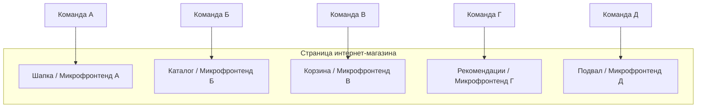
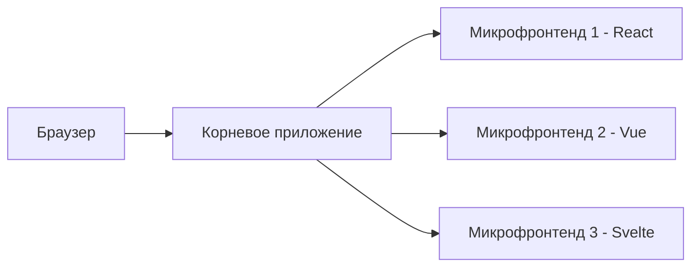

## Микрофронтенды

Представьте, что интернет-магазин состоит из нескольких независимых разделов: каталог товаров, корзина, личный кабинет, панель рекомендаций. Если всё это написано как единое фронтенд-приложение, любое изменение в рекомендациях требует пересборки и переразвертывания всего магазина. Команда, отвечающая за каталог, не может выпустить обновление, не дожидаясь команды корзины.

**Микрофронтенды (Micro Frontends)** переносят идеи микросервисной архитектуры из бэкенда в фронтенд. Приложение разбивается на независимые, слабо связанные части (микрофронтенды), каждая из которых отвечает за конкретную область экрана или бизнес‑функцию. Каждый микрофронтенд разрабатывается, тестируется и развертывается отдельной командой, используя свой технологический стек (React, Vue, Angular или даже vanilla JS).

## Проблемы, которые решают микрофронтенды

### Громоздкий монолит

Фронтенд традиционного SPA (Single Page Application) со временем превращается в монолит: тысячи компонентов, общие хранилища (store), конфликты при слиянии кода. Даже небольшое изменение может потребовать пересборки всего приложения.

### Команды мешают друг другу

Если над одним репозиторием работают несколько команд, неизбежны:

- Конфликты в Git (merge hell).
- Согласование версий библиотек.
- Общий график релизов (кто‑то задерживает всех).

### Разные технологии под разные задачи

Каталог товаров можно написать на Vue (быстрая разработка). Корзину — на React (большое сообщество). Админку — на Angular (строгая типизация). В монолите такой миксов не получится.

### Невозможность независимого развертывания

Исправили опечатку в тексте кнопки в корзине? В монолите всё равно придётся пересобрать всё приложение. Риск сломать соседний модуль очень высок.

Микрофронтенды позволяют каждой команде владеть своей частью приложения и развертывать её независимо.

## Как это работает

Микрофронтенды — это архитектурный подход, а не конкретная библиотека. Он заключается в композиции (сборке) страницы из нескольких независимо развернутых фрагментов.

### Композиция на сервере (SSR‑композиция)

Браузер запрашивает HTML‑страницу. Сервер собирает её из кусочков, каждый из которых получен от разных микросервисов. Сервер выступает оркестратором.

**Плюсы:** Хорошая производительность, SEO (поскольку HTML отдаётся сразу), проще управление версиями на уровне сервера.

**Минусы:** Сервер должен реализовать логику сборки (довольно сложную), увеличивается задержка ответа.

### Композиция на клиенте (Client‑side composition)

Браузер загружает "корневое приложение" (клиент‑шейл), которое динамически подгружает микрофронтенды по мере необходимости. Используются:

- **Фрагменты (fragments) через iframe.** Просто, но проблемы с SEO, стилями, взаимодействием.
- **Веб-компоненты (Web Components).** Микрофронтенд упаковывается в пользовательский элемент, который встраивается на страницу. Изолирован, может быть написан на любом фреймворке. Рекомендуемый метод.
- **Загрузка модулей через импорт (import maps).** Браузер сам подгружает бандлы разных фрагментов. Поддерживается современными браузерами.

### Edge‑side композиция (композиция на CDN)

Специализированные решения (например, Cloudflare Workers, Fastly) собирают страницу на границе сети (прямо в CDN). Сочетает скорость CDN и гибкость серверной композиции.

## Связь между микрофронтендами

### Обмен данными

- **Пользовательские события (Custom Events).** Один микрофронтенд генерирует событие "addToCart", другой его слушает. Слабая связанность.
- **Общее глобальное хранилище (shared store).** Например, Redux store в window. Но это создаёт неявные зависимости, нужно осторожно.
- **Агрегация данных на бэкенде.** Микрофронтенды не знают друг о друге; каждый получает свою порцию данных от соответствующего бэкенд-сервиса.

### Маршрутизация (Routing)

Обычно корневое приложение управляет основными маршрутами (например, `/catalog`, `/cart`). При переходе на новый маршрут корневое приложение решает, какой микрофронтенд (или комбинация) загрузить.

## Преимущества микрофронтендов

- **Независимость команд.** Каждая команда может выбирать свой фреймворк, инструменты и график релизов.
- **Изолированные развертывания.** Обновление одного микрофронтенда не требует переразвертывания всей страницы.
- **Масштабируемость процесса разработки.** При увеличении числа команд не растёт конфликтность.
- **Устойчивость (resilience).** Если один микрофронтенд упал (ошибка JS), остальные продолжают работать (благодаря изоляции).
- **Наследие (legacy).** Можно постепенно заменять куски старого фронтенда на новые технологии без полной переписывания.

## Недостатки и сложности

- **Размер и дублирование.** Каждый микрофронтенд загружает свои зависимости. В итоге на странице может быть React + ReactDOM + Vue + Angular + их рантаймы. Это killer для производительности.
- **Сложность интеграции.** Единый дизайн (CSS), единая аутентификация, сквозные функции (логирование, мониторинг) становятся нетривиальной задачей.
- **Сложность разработки и отладки.** Запустить все микрофронтенды локально (в dev‑режиме) тяжело. Отладка взаимодействия (особенно через Custom Events) — сложнее.
- **Тестирование.** Сквозные тесты (E2E, интеграционные) должны проверять взаимодействие нескольких микрофронтендов, что требует более сложной инфраструктуры.
- **Передача состояния.** Когда пользователь переходит с микрофронтенда на микрофронтенд, состояние (фильтры, корзина) нужно синхронизировать (через URL, бэкенд, глобальное хранилище).

## Когда использовать микрофронтенды

- **Крупные приложения** с несколькими независимыми бизнес-доменами, у каждого свой темп изменений.
- **Распределённые команды** (разные локации, разные отделы), которым сложно синхронизироваться на уровне единого monorepo.
- **Постепенная миграция** со старого фронтенда на новый, когда нельзя переписать всё сразу.
- **Разные технологии для разных частей** приложения (например, карта — на Leaflet + JS, а лента новостей — на React).

Но для небольших приложений (до 5–6 команд) микрофронтенды чаще всего являются преждевременным усложнением. Модульный монолит (хорошо организованное SPA) справится лучше.

## Сравнение с микрофронтендами на бэкенд

| Аспект | Микросервисы (бэкенд) | Микрофронтенды |
| :--- | :--- | :--- |
| **Единица развертывания** | Сервис | Фрагмент UI |
| **Владелец** | Команда | Команда |
| **Композиция** | Оркестрация через API Gateway или события | На сервере (SSR), на клиенте (Web Components, iframe) |
| **Изоляция** | Процессы, контейнеры, сети | Веб-компоненты, iframe, разные бандлы |
| **Связность** | Через API | Через Custom Events, глобальное хранилище, URL |

## Что аналитику нужно знать о микрофронтендах

Аналитик не пишет код микрофронтендов, но должен понимать их влияние на архитектуру и процессы:

1. **Разделение по доменам.** При проектировании микрофронтендов важно определить границы: какая команда за какой участок экрана отвечает, где проходят транзакционные потоки (например, оформление заказа может затрагивать и каталог, и корзину, и платёжную форму).

2. **API между микрофронтендами должны быть явными.** Если микрофронтенд А должен сказать микрофронтенду Б "добавь товар в корзину", этот договор нужно специфицировать (имя события, структура данных, кто вызывает, кто слушает).

3. **Размер бандлов.** Аналитик может потребовать метрики по размеру загружаемого кода. Если каждый микрофронтенд тащит свой фреймворк, страница может грузиться десятки секунд — это недопустимо для пользователей.

4. **Совместное тестирование.** Потребуется больше интеграционных и E2E-тестов. Аналитик должен предусмотреть сценарии, которые требуют взаимодействия между микрофронтендами.

5. **Изменения в API бэкенда.** Если микрофронтенды независимы, каждый из них может требовать свой эндпоинт. Раньше один API-метод отдавал данные сразу для каталога, рекомендаций и корзины. Теперь, возможно, потребуется три отдельных эндпоинта (что нормально в микросервисной архитектуре). Аналитик должен согласовать эти API между командами.

6. **Когда не нужны.** Для небольшой команды до 10 человек микрофронтенды почти всегда будут овер-инжинирингом.

## Известные примеры

- **Spotify.** Использует микрофронтенды для разных разделов: плитка плейлистов, подкасты, страница исполнителя. Каждый раздел разрабатывается независимой командой, собирается в общий плеер через фрагменты.
- **IKEA.** Один из пионеров подхода, перешла на микрофронтенды ещё в 2016 году.
- **Zalando.** Разделила фронтенд на независимые "системы", управляемые децентрализованными командами.

## Резюме

Микрофронтенды — это архитектурный подход, при котором фронтенд приложения разбивается на независимые части, каждая из которых разрабатывается, развертывается и эволюционирует отдельно.

**Ключевые принципы:**

- Моделирование вокруг бизнес-доменов, а не технических слоёв.
- Независимость команд (технологии, репозитории, релизы).
- Изоляция (Web Components, iframe, бандлы).
- Слабая связанность через пользовательские события или глобальное хранилище.

**Преимущества:** Масштабируемость разработки, независимые релизы, возможность технологической гетерогенности.

**Недостатки:** Размер бандлов (дублирование зависимостей), сложность интеграции и сквозного тестирования.