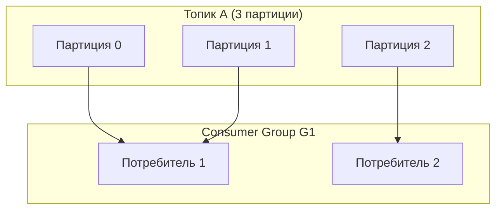
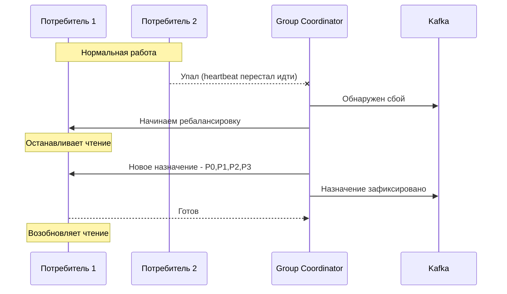
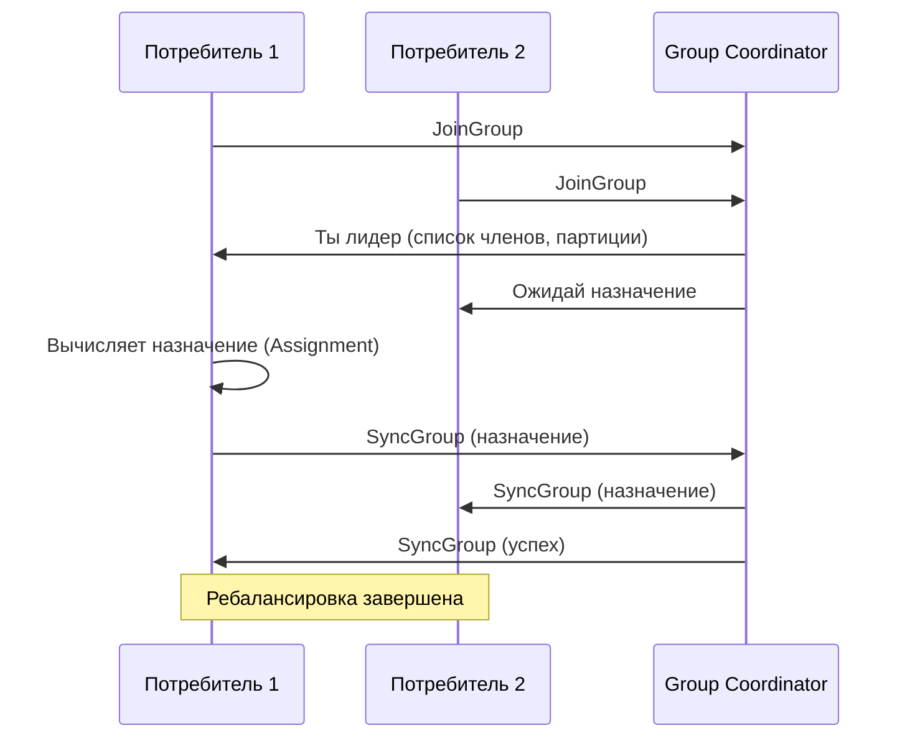

## Consumer Group Rebalancing в Apache Kafka: как потребители делят партиции

В мире распределенных систем Kafka занимает особое место. Многие знают о ней поверхностно: "это очередь сообщений", "в ней есть топики и партиции", "она быстрая". Но когда дело доходит до объяснения Consumer Group Rebalancing, даже опытные разработчики часто дают размытые ответы. А между тем, это один из самых частых вопросов на технических собеседованиях — и неспроста. Понимание ребалансировки раскрывает, как Kafka на самом деле управляет распределением нагрузки и обрабатывает сбои.

**Consumer Group Rebalancing** — это механизм, с помощью которого Kafka распределяет партиции между потребителями внутри одной группы. Когда в группе появляется новый потребитель, старый уходит, или умирает — Kafka перераспределяет партиции между оставшимися/новыми членами, чтобы нагрузка распределялась равномерно.

Этот механизм — одновременно и сила Kafka (отказоустойчивость, масштабируемость), и ее боль (stop-the-world ребалансировки, проблемы с большими группами). Понимание того, как работает ребалансировка, позволяет проектировать надежные системы обработки данных и избегать типовых проблем.

## Что такое consumer group и зачем она нужна

Прежде чем говорить о ребалансировке, нужно понять, что такое consumer group.

**Consumer group** — это набор потребителей, которые читают сообщения из одного топика (или нескольких топиков) и работают как единое целое. Kafka гарантирует, что каждое сообщение из топика будет доставлено только одному потребителю внутри группы.

Это ключевое свойство: если у вас несколько потребителей в одной группе, они автоматически делят партиции между собой. Каждый потребитель обрабатывает свою часть партиций, и сообщения не дублируются между потребителями группы.



Если потребителей меньше, чем партиций, некоторые потребители обрабатывают несколько партиций. Если потребителей больше, чем партиций — лишние потребители простаивают, помогая при сбоях.

## Что такое ребалансировка: простое объяснение

**Ребалансировка (rebalancing)** — это процесс перераспределения партиций между потребителями группы. Он запускается, когда состав группы изменяется:

- Новый потребитель присоединился к группе.
- Существующий потребитель покинул группу (умер, был остановлен).
- Потребитель перестал отправлять heartbeat (признан мертвым из-за сбоя или длительной обработки).
- Добавлена новая партиция в топик (при увеличении числа партиций).

Во время ребалансировки Kafka пересчитывает, кому какая партиция достанется. Все потребители временно останавливают чтение, пока не установлено новое распределение. Это "stop-the-world" для данной consumer group.



## Групповой координатор и протокол ребалансировки

За управление consumer groups отвечает специальный компонент внутри брокера Kafka — **Group Coordinator**. Для каждой consumer group один из брокеров назначается координатором.

**Heartbeat (сердцебиение).** Каждый потребитель периодически отправляет heartbeat координатору, сигнализируя, что он жив. Частота настраивается параметрами `heartbeat.interval.ms` (обычно 3 секунды) и `session.timeout.ms` (обычно 45 секунд). Если координатор не получает heartbeat в течение `session.timeout.ms`, потребитель считается мертвым, и запускается ребалансировка.

**Join group.** Когда потребитель хочет присоединиться к группе, он отправляет координатору запрос `JoinGroup`. Координатор собирает всех желающих и выбирает лидера группы.

**Leader group.** Один из потребителей в группе становится лидером. Именно он получает от координатора список всех партиций и всех членов группы и вычисляет новое распределение. Лидер отправляет назначение (Assignment) координатору, который рассылает его всем потребителям.

**Sync group.** Это финальная стадия, где все потребители подтверждают новое назначение. Только когда все подтвердили, ребалансировка завершается, и потребители начинают читать.



## Типы ребалансировки: Eager vs Cooperative

В старых версиях Kafka (до 2.4) ребалансировка была **eager ("жадной")**: все потребители полностью останавливались, все партиции отбирались у всех, затем назначались заново. Это вызывало "stop-the-world" и могло приводить к длительным паузам.

Начиная с Kafka 2.4, появился **cooperative rebalancing ("кооперативный")**. При этом типе ребалансировки отбираются только те партиции, которые действительно нужно перераспределить. Остальные потребители продолжают читать.

**Важные параметры:**

- `partition.assignment.strategy` — стратегия распределения партиций. Встроенные: `RangeAssignor` (по умолчанию, старый), `RoundRobinAssignor`, `StickyAssignor`, `CooperativeStickyAssignor` (рекомендуемый, кооперативный).
- `heartbeat.interval.ms` — частота heartbeat (меньше → быстрее обнаружение сбоя, но больше трафика).
- `session.timeout.ms` — таймаут, после которого потребитель считается мертвым.
- `max.poll.interval.ms` — критичный для долгой обработки параметр. Если потребитель дольше этого времени не вызывает `poll()`, он считается застрявшим, и ребалансировка запускается. Это защита от "мертвых", но долго обрабатывающих потребителей.

## Стратегии назначения партиций (Partition Assignors)

**RangeAssignor.** Партиции нумеруются, и диапазоны распределяются между потребителями. Пример: топик с 6 партициями, 2 потребителя: потребитель 1 получает партиции 0-2, потребитель 2 — 3-5.

**RoundRobinAssignor.** Партиции и потребители сортируются, затем партиции по очереди распределяются потребителям. Равномернее RangeAssignor.

**StickyAssignor.** Распределение, минимизирующее перемещение партиций при ребалансировке. При добавлении нового потребителя старая партиция перемещается к нему, остальные остаются на месте. Это снижает объем перемещаемых данных.

**CooperativeStickyAssignor.** Современный, кооперативный вариант StickyAssignor. Рекомендуется для новых проектов.

## Проблемы, связанные с ребалансировкой

**Проблема "живой, но застрявший" (livelock).** Потребитель шлет heartbeat, значит, он жив. Но он не вызывает `poll()` долгое время (в обработке сообщения). При превышении `max.poll.interval.ms` (обычно 5 минут) координатор считает его застрявшим и запускает ребалансировку. Обработка прерывается, партиции уходят другому потребителю.

**Решение:** Увеличить `max.poll.interval.ms` или уменьшить `max.poll.records` (чтобы за раз обрабатывалось меньше сообщений).

**Проблема "вытеснения партиций" (Partition Reassignment).** При ребалансировке партиции могут переходить от одного потребителя к другому. Потребитель, потерявший партицию, должен закоммитить текущий смещение и остановиться. Потребитель, получивший новую партицию, должен перечитать последние сообщения. При частых ребалансировках (например, при развертывании новых версий) возможны дублирования или потери.

**Проблема "drop in production".** В K8s при перезапуске подов может не хватать времени на graceful shutdown (отправку LeaveGroup). Потребители просто исчезают, и по таймауту запускается ребалансировка, которая может занять десятки секунд.

**Решение:** Настроить preStop hook в K8s, который вызывается за время, большее `session.timeout.ms`, и отправляет `LeaveGroup`.

## Влияние на аналитика: что нужно знать и контролировать

Как системный аналитик, вы не будете писать код потребителей. Но вы должны понимать:

**1. Время обработки сообщения** критически влияет на стабильность группы. Если бизнес-логика потребителя может обрабатывать одно сообщение несколько минут (например, ночной отчет из Kafka), то без настройки `max.poll.interval.ms` потребитель будет исключен.

**2. Количество потребителей в группе** должно быть не больше количества партиций. Лишние потребители простаивают и не повышают производительность.

**3. Добавление нового потребителя** вызывает ребалансировку, которая на время (секунды) останавливает обработку. При развертывании новой версии приложения (rolling update) каждый под выключается и включается — ребалансировка происходит каждый раз.

**4. Стратегия назначения партиций** влияет на равномерность загрузки. Проектируя топики, нужно учитывать, как партиции будут распределяться между потребителями.

**5. Использование кооперативной ребалансировки (CooperativeStickyAssignor)** обязательно, если у вас более 3-5 потребителей в группе. Иначе частые ребалансировки могут быть недопустимо долгими.

## Как смотреть и мониторить ребалансировки

**Метрики JMX, важные для мониторинга:**

- `kafka.consumer:type=consumer-coordinator-metrics` — количество ребалансировок, их длительность.
- `kafka.consumer:type=consumer-fetch-manager-metrics` — задержки обработки.

**Логи потребителя:** Поиск сообщений "Revoke previously assigned partitions" и "Assign new partitions" показывает начало и конец ребалансировки.

```bash
# Пример лога при ребалансировке
INFO [Consumer clientId=consumer-1, groupId=my-group] Revoke previously assigned partitions [topic-0, topic-1]
INFO [Consumer clientId=consumer-1, groupId=my-group] (Re-)join group completed
INFO [Consumer clientId=consumer-1, groupId=my-group] Assign new partitions [topic-2, topic-3]
```

**Аналитика:** Частые ребалансировки — симптом проблем. Нужно искать причину: долгая обработка, частые развертывания, сбои сети, неправильные настройки таймаутов.

## Резюме

Consumer Group Rebalancing — это механизм распределения партиций между потребителями в Kafka.

**Зачем нужна ребалансировка:** Чтобы автоматически перераспределять нагрузку при добавлении/удалении потребителей, при увеличении числа партиций, при сбоях.

**Как работает:** Group Coordinator отслеживает потребителей через heartbeat. При изменении состава группы запускается ребалансировка: потребители останавливаются, выбирается лидер, вычисляются новые назначения, распределение рассылается.

**Типы ребалансировки:**

- Eager (жадная) — полная остановка всех потребителей. Устаревший тип.
- Cooperative (кооперативная) — перемещаются только нужные партиции. Современный тип.

**Стратегии назначения:** Range (по умолчанию), RoundRobin, Sticky, CooperativeSticky (рекомендуется).

**Основные проблемы и их причины:**

| Проблема | Причина | Решение |
| :--- | :--- | :--- |
| Долгая ребалансировка | Большая группа, eager-ребалансировка | Использовать CooperativeStickyAssignor, уменьшить число потребителей в группе |
| Частые ребалансировки | Таймауты сессии, долгая обработка сообщений | Увеличить session.timeout.ms и max.poll.interval.ms |
| "Вытеснение" партиций (reassignment) | Нормальный процесс при масштабировании | Проектировать потребителей с учетом временных пауз |
| Потребитель не перечитывает сообщения после ребалансировки | Не настроен коммит смещений | Убедиться в настройке enable.auto.commit=true (или ручной коммит) |

**Для аналитика:** При проектировании потоковой обработки важно понимать, что ребалансировки неизбежны. Они влияют на задержку обработки и могут вызывать дублирование сообщений. Нужно:

- Предусматривать идемпотентность обработки на случай, если сообщение обработано дважды (при переключении партиции).
- Закладывать в SLA время на ребалансировку (обычно несколько секунд, но при больших группах может быть десятки секунд).
- Требовать от разработчиков настройки `max.poll.interval.ms` в соответствии со временем обработки пачки сообщений.

Ребалансировка — не баг, а фича, обеспечивающая отказоустойчивость. Но неправильная настройка может превратить ее в постоянный источник проблем. Глубокое понимание этого механизма отличает инженера, который "просто использует Kafka", от того, кто умеет делать её надежной.