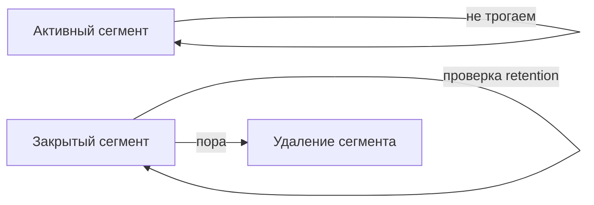

## Введение: Почему сообщения не живут вечно

Представьте, что вы ведёте дневник. Каждый день вы пишете новую страницу. Через год дневник занимает целую полку. Через десять лет — целый шкаф. Бесконечно хранить всё невозможно. Что-то нужно выкидывать.

В Kafka то же самое. Сообщения не удаляются после прочтения (как в очередях). Они хранятся, пока не истечёт срок или не превышен объём. Это называется **Data Retention** — политика хранения данных.

Для системного аналитика retention — это компромисс между доступностью истории и стоимостью хранения. Хранить долго — можно перечитывать старые события, но нужно много места. Хранить коротко — место экономится, но история теряется.

## Retention по времени

### Как работает

Сообщения хранятся фиксированное время. По истечении срока они удаляются.

| Параметр | По умолчанию | Типичные значения |
| :--- | :--- | :--- |
| `log.retention.hours` | 168 (7 дней) | 24 часа, 7 дней, 30 дней |
| `log.retention.minutes` | Нет | 5 минут, 60 минут |
| `log.retention.ms` | Нет | Точная настройка (миллисекунды) |

```yaml
Настройка на уровне топика:
  retention.ms=604800000  # 7 дней

Что происходит:
  - Сообщение создано в 12:00
  - Текущее время 12:00 + 7 дней
  - Сообщение удалено
```

### Пример

```yaml
Топик: user_events
retention.ms: 86400000 (24 часа)

Сообщения:
  10:00: сообщение 1
  12:00: сообщение 2
  14:00: сообщение 3

Завтра в 10:00: сообщение 1 удалено
Завтра в 12:00: сообщение 2 удалено
Завтра в 14:00: сообщение 3 удалено
```

## Retention по объёму

### Как работает

Хранится фиксированный объём данных на партицию. При превышении старые сообщения удаляются.

| Параметр | По умолчанию | Типичные значения |
| :--- | :--- | :--- |
| `log.retention.bytes` | -1 (без ограничения) | 1 ГБ, 10 ГБ, 100 ГБ |

```yaml
Настройка на уровне топика:
  retention.bytes=1073741824  # 1 ГБ на партицию

Что происходит:
  - Объём партиции = 500 МБ
  - Новое сообщение + 600 МБ
  - Всего стало 1.1 ГБ
  - Старые сообщения удаляются, пока объём не станет ≤ 1 ГБ
```

### Пример

```yaml
Топик: logs
retention.bytes: 104857600 (100 МБ)

Партиция:
  Сообщения 1-100: 90 МБ
  Сообщение 101: 15 МБ (всего 105 МБ)

Удаляются самые старые сообщения, пока объём не станет ≤ 100 МБ
```

## Сегменты (Segments)

### Что такое сегмент

Лог партиции разбит на сегменты — файлы на диске.

```yaml
Партиция 0:
  сегмент 0: offsets 0-999 (1 ГБ)  # активный (пишем сюда)
  сегмент 1: offsets 1000-1999 (1 ГБ)  # закрыт
  сегмент 2: offsets 2000-2999 (1 ГБ)  # закрыт
```

### Параметры сегментов

| Параметр | Значение по умолчанию | Что делает |
| :--- | :--- | :--- |
| `log.segment.bytes` | 1 ГБ | Максимальный размер сегмента |
| `log.segment.ms` | 7 дней | Максимальный возраст сегмента |

### Зачем нужны сегменты

- Удаление происходит целыми сегментами (эффективно)
- Активный сегмент не удаляется (только закрытые)
- Сегменты позволяют управлять retention без блокировок

## Удаление (Deletion)

### Как удаляются сообщения



**Почему сегментами, а не по одному сообщению:** Удаление целого файла быстрее и безопаснее, чем удаление отдельных записей внутри файла.

### Когда происходит удаление

Фоновый поток (cleaner thread) периодически проверяет:

- Не истекло ли время retention
- Не превышен ли объём retention
- Удаляет закрытые сегменты, которые подпадают под условия

## Компактизация (Compaction)

### Что это

Вместо удаления старых сообщений по времени или объёму, Kafka оставляет только последнее сообщение для каждого ключа.

### Как работает

```yaml
Исходный лог (ключ → значение):
  key: user_123 → value: {"name": "Иван", "status": "active"}
  key: user_123 → value: {"name": "Иван", "status": "blocked"}
  key: user_123 → value: {"name": "Иван", "status": "deleted"}
  key: user_456 → value: {"name": "Петр", "status": "active"}

После компактизации:
  key: user_123 → value: {"name": "Иван", "status": "deleted"}  # последнее
  key: user_456 → value: {"name": "Петр", "status": "active"}   # последнее
```

### Параметры

| Параметр | Значение по умолчанию |
| :--- | :--- |
| `cleanup.policy` | `delete` (по времени/объёму) |
| `cleanup.policy=compact` | Включить компактизацию |
| `min.cleanable.dirty.ratio` | 0.5 |

### Когда использовать компактизацию

| Сценарий | Пример |
| :--- | :--- |
| Хранение последнего состояния | Текущий статус пользователя |
| Таблица в Kafka (KTable) | KTable в Kafka Streams |
| Change Data Capture (CDC) | Логи изменений БД |

### Компактизация не подходит для

| Сценарий | Почему |
| :--- | :--- |
| События, где важна каждая запись | Логи, метрики, события |
| Данные без ключей | Нет ключа — нет компактизации |

## Комбинированные политики

### delete + compact

```yaml
cleanup.policy=compact,delete
```

Сначала компактизация (оставляем последнее по ключу), потом удаление по времени/объёму.

### Пример: Состояние пользователя

```yaml
Топик: user_state
cleanup.policy: compact
retention.ms: 604800000 (7 дней)

Что получаем:
  - Остаётся только последнее состояние каждого пользователя
  - Если пользователь не обновлялся 7 дней — удаляется полностью
```

## Настройка retention

### Уровни настройки

| Уровень | Параметр |
| :--- | :--- |
| **Глобальный (брокер)** | `log.retention.hours`, `log.retention.bytes` |
| **Топик** | `retention.ms`, `retention.bytes` |
| **Сегмент** | `log.segment.bytes`, `log.segment.ms` |

### Приоритет

Топик → глобальный. Если на топике задано, то глобальное игнорируется.

## Мониторинг retention

### Метрики

| Метрика | Что показывает |
| :--- | :--- |
| `kafka.log.LogSize` | Текущий размер лога |
| `kafka.log.NumLogSegments` | Количество сегментов |
| `kafka.log.OldestSegmentMs` | Возраст самого старого сегмента |

### Алерты

| Ситуация | Действие |
| :--- | :--- |
| Размер лога растёт бесконечно | Проверить, работает ли retention |
| Размер лога резко упал | Проверить, не удалили ли нужные данные |

## Влияние на производительность

### Удаление

| Фактор | Влияние |
| :--- | :--- |
| Частота удалений | Фоновый поток, нагрузка на диск |
| Количество сегментов | Много сегментов = больше файлов = медленнее |

### Компактизация

| Фактор | Влияние |
| :--- | :--- |
| Частота компактизации | Нагрузка на CPU, диск |
| Размер лога | Чем больше лог, тем дольше компактизация |

## Практические рекомендации

| Сценарий | Рекомендация |
| :--- | :--- |
| Логи, метрики | `cleanup.policy=delete`, `retention.ms=7d` |
| События для аналитики | `cleanup.policy=delete`, `retention.ms=30d` |
| Состояние (таблицы) | `cleanup.policy=compact` |
| CDC (Change Data Capture) | `cleanup.policy=compact,delete` |
| Высокая нагрузка | Увеличить `log.segment.bytes` (меньше сегментов) |
| Много маленьких сообщений | Уменьшить `log.segment.bytes` (быстрее компактизация) |

## Распространённые ошибки

### Ошибка 1: Слишком долгий retention

Хранят логи 5 лет. Место кончается.

**Решение:** Определить реальные потребности. Логи за прошлый год вряд ли кому-то нужны.

### Ошибка 2: Слишком короткий retention

Хранят 1 час. Аналитик не успевает прочитать.

**Решение:** Узнать требования потребителей. Минимум — время, за которое самый медленный потребитель читает данные.

### Ошибка 3: Компактизация без ключей

Включили компактизацию, но сообщения без ключей. Ничего не компактизируется.

**Решение:** Компактизация работает только с ключами.

### Ошибка 4: Компактизация для логов

Включили компактизацию для логов. Потеряли историю.

**Решение:** Для логов и метрик — `cleanup.policy=delete`.

### Ошибка 5: Игнорирование размера сегментов

Маленькие сегменты → много файлов → медленнее.

**Решение:** Настроить `log.segment.bytes` под объём данных.

## Резюме

1. **Data Retention** — политика хранения сообщений в Kafka. Сообщения не удаляются после прочтения, а живут определённое время.

2. **По времени** (`retention.ms`): сообщения удаляются через N миллисекунд.

3. **По объёму** (`retention.bytes`): сообщения удаляются, когда партиция превышает размер.

4. **Сегменты** — лог разбит на файлы. Удаление происходит целыми сегментами.

5. **Компактизация** (`cleanup.policy=compact`): оставляет только последнее сообщение для каждого ключа.

6. **Гибрид** (`compact,delete`): сначала компактизация, потом удаление по времени.

7. **Компактизация подходит** для хранения последнего состояния, таблиц, CDC.