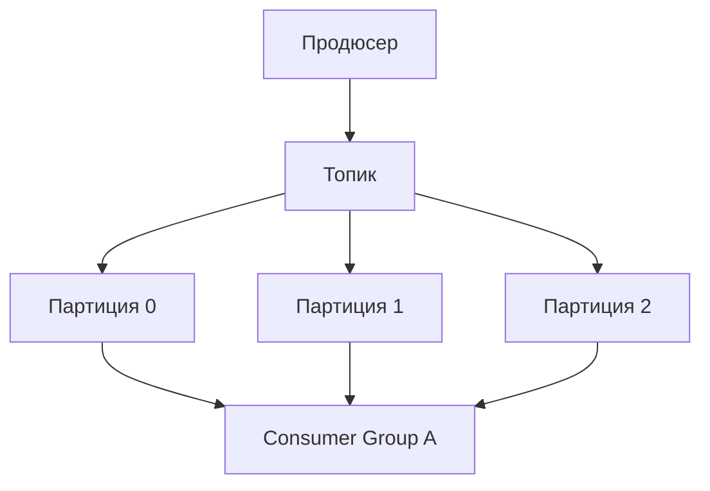
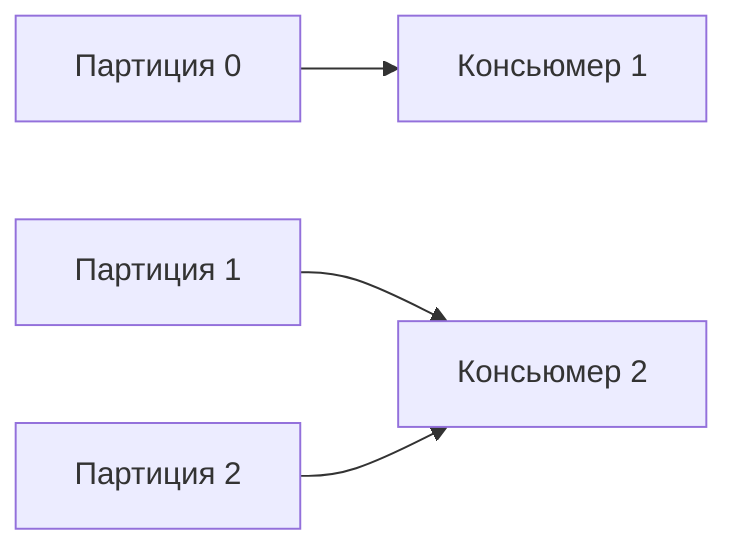
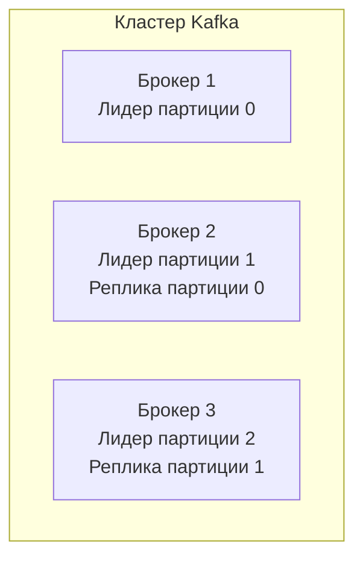
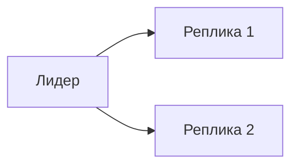

## Введение: Журнал, а не почтовый ящик

Представьте банковскую выписку по счёту. В ней записаны все операции в порядке их совершения. Вы не можете изменить прошлые записи — только добавить новые. Любой может прочитать выписку с любого момента. Выписка хранится годами.

Apache Kafka устроена как такая выписка. Это не почтовый ящик (где сообщение исчезает после прочтения). Это **журнал (log)** — упорядоченная, неизменяемая последовательность сообщений, которая хранится определённое время.

**Apache Kafka** — это распределённая платформа для потоковой передачи данных. Она сочетает в себе возможности брокера сообщений, хранилища данных и движка потоковой обработки.

Для системного аналитика Kafka — это инструмент для сценариев с высокими нагрузками, где важны порядок сообщений, хранение истории и возможность повторного чтения. Kafka не заменяет очереди (RabbitMQ) — они решают разные задачи.


## Ключевая идея: Журнал (Log)

```yaml
Тема "user_events" (журнал):
  +---------+---------+---------+---------+
  | Сообщение 0 | Сообщение 1 | Сообщение 2 | Сообщение 3 | ...
  +---------+---------+---------+---------+
  Offset:     0         1         2         3
```

**Свойства журнала:**

| Свойство | Значение |
| :--- | :--- |
| **Упорядоченность** | Сообщения имеют порядок (offset) |
| **Неизменяемость** | Нельзя изменить или удалить сообщение |
| **Хранение** | Сообщения хранятся определённое время |
| **Replay** | Можно перечитать сообщения с любого места |

В отличие от очередей (RabbitMQ), где сообщение удаляется после прочтения, в Kafka сообщение остаётся в журнале. Несколько потребителей могут читать одно и то же сообщение независимо.

## Основные компоненты



### Топик (Topic)

Категория или канал, куда публикуются сообщения. Аналог таблицы в базе данных.

### Партиция (Partition)

Топик разбивается на партиции. Каждая партиция — это упорядоченный журнал сообщений.

| Характеристика | Значение |
| :--- | :--- |
| **Порядок** | Гарантирован внутри партиции |
| **Параллелизм** | Разные партиции могут читаться параллельно |
| **Количество** | Определяет максимальную степень параллелизма |

### Offset (Смещение)

Уникальный идентификатор сообщения внутри партиции. Последовательное целое число.

```yaml
Партиция 0:
  offset 0: {user_id: 123, action: "login"}
  offset 1: {user_id: 123, action: "search"}
  offset 2: {user_id: 456, action: "login"}
```

## Продюсер (Producer)

Отправляет сообщения в топик.

**Выбор партиции:**

| Стратегия | Как работает |
| :--- | :--- |
| **Round-robin** | По очереди во все партиции |
| **По ключу** | `hash(key) % partitions` — все сообщения с одним ключом попадают в одну партицию |
| **Указана явно** | Продюсер сам решает |

**Пример ключа:** `user_id` — все события одного пользователя в одной партиции → порядок гарантирован.

## Консьюмер (Consumer)

Читает сообщения из топика.

### Consumer Group (Группа консьюмеров)

Несколько консьюмеров объединяются в группу. Каждая партиция читается одним консьюмером из группы.



**Правила:**

| Ситуация | Результат |
| :--- | :--- |
| Партиций больше, чем консьюмеров | Некоторые консьюмеры читают несколько партиций |
| Консьюмеров больше, чем партиций | Лишние консьюмеры простаивают |

## Брокер (Broker)

Сервер Kafka, который хранит партиции и обслуживает запросы.

### Кластер

Несколько брокеров образуют кластер. Один брокер — лидер (leader) партиции, другие — реплики (followers).



### Controller

Один из брокеров выполняет роль контроллера: управляет лидерами партиций, обрабатывает отказы.

## Порядок сообщений

| Уровень | Гарантия |
| :--- | :--- |
| **Внутри партиции** | Строгий порядок (offset) |
| **Между партициями** | Порядок не гарантирован |
| **Глобальный порядок** | Только если партиция одна (не масштабируется) |

**Как гарантировать порядок для одного пользователя:** использовать `user_id` как ключ → все события пользователя в одной партиции.

## Хранение данных

### Retention (Срок хранения)

| Параметр | Значение по умолчанию |
| :--- | :--- |
| По времени | 7 дней |
| По объёму | 1 ГБ на партицию |

После истечения срока или превышения объёма старые сообщения удаляются.

### Сегменты

Лог разбивается на сегменты (обычно 1 ГБ). Активный сегмент — тот, куда пишутся новые сообщения. Запечатанные сегменты доступны только для чтения и удаляются при устаревании.

## Репликация



**Параметры репликации:**

| Параметр | Значение |
| :--- | :--- |
| `replication.factor` | Количество копий (обычно 3) |
| `min.insync.replicas` | Минимум реплик, которые должны подтвердить запись |

**ACKS (подтверждения):**

| acks | Гарантия |
| :--- | :--- |
| 0 | Сообщение может потеряться |
| 1 | Лидер подтвердил (может потеряться, если лидер упал до репликации) |
| all | Все реплики в ISR подтвердили |

## ISR (In-Sync Replicas)

Реплики, которые успевают за лидером.

```yaml
Реплика в ISR:
  - replication lag < параметры
  - zookeeper connection alive
```

Если реплика отстала, она исключается из ISR. Запись считается успешной, если подтвердили все реплики из ISR.

## ZooKeeper / KRaft

### ZooKeeper (классическая)

Координирует кластер: хранит метаданные, выбирает контроллера, отслеживает состояние брокеров.

**Недостатки:** ZooKeeper — отдельная система, требует администрирования, не очень быстрая.

### KRaft (Kafka Raft)

Начиная с версии 2.8, Kafka может работать без ZooKeeper. Контроллеры управляют метаданными через Raft-консенсус.

**Преимущества:** Проще администрирование, быстрее, масштабируемость до миллионов партиций.

## Producer и Consumer в деталях

### Продюсер (Producer)

```yaml
Компоненты:
  - Serializer: объект → байты
  - Partitioner: определяет партицию
  - Compressor: сжатие (gzip, snappy, lz4, zstd)
  - Buffer: накопление сообщений перед отправкой
```

### Консьюмер (Consumer)

```yaml
Компоненты:
  - Deserializer: байты → объект
  - Commit offset: сохранение позиции
  - Rebalance listener: реакция на перераспределение партиций
```

### Consumer Group Rebalance

При добавлении/удалении консьюмера партиции перераспределяются. Во время ребаланса консьюмеры не читают.

## Потоковая обработка (Kafka Streams)

Kafka Streams — библиотека для обработки потоков данных внутри Kafka.


**Возможности:**

- Фильтрация, маппинг
- Агрегации по окнам
- Join потоков
- Stateful обработка (хранит состояние в RocksDB)

## Когда Kafka — хороший выбор

| Сценарий | Почему |
| :--- | :--- |
| **Высокая нагрузка** | Миллионы сообщений в секунду |
| **Важен порядок** | Гарантия внутри партиции |
| **Хранение истории** | Retention, replay |
| **Много подписчиков** | Каждый читает независимо |
| **Потоковая обработка** | Kafka Streams, ksqlDB |

## Когда Kafka — не лучший выбор

| Сценарий | Почему |
| :--- | :--- |
| **Нужна очередь с гарантией однократной доставки** | Kafka не удаляет сообщения |
| **Мало сообщений (<1000/сек)** | Избыточно, RabbitMQ проще |
| **Сложная маршрутизация** | RabbitMQ гибче |
| **Задержка важнее пропускной способности** | Kafka оптимизирована на throughput, не latency |

## Резюме

1. **Apache Kafka** — распределённый журнал (log), а не очередь. Сообщения не удаляются после прочтения.

2. **Топик** разбивается на **партиции**. Порядок гарантирован внутри партиции.

3. **Продюсер** пишет в партиции (round-robin или по ключу).

4. **Консьюмеры** объединяются в **группы**. Одна партиция — одному консьюмеру в группе.

5. **Брокеры** образуют кластер. **Репликация** обеспечивает надёжность.

6. **ISR (In-Sync Replicas)** — реплики, которые успевают за лидером.

7. **ZooKeeper / KRaft** — координация кластера.