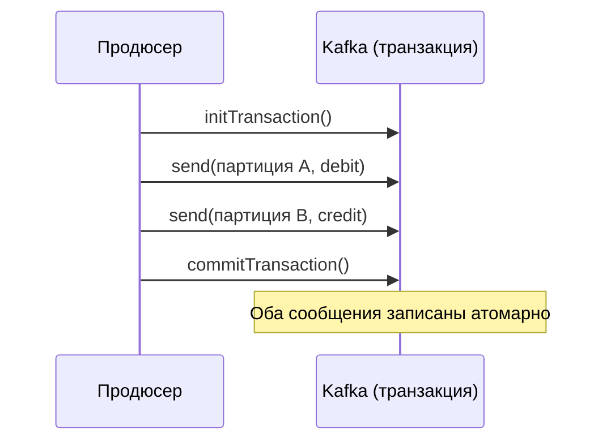
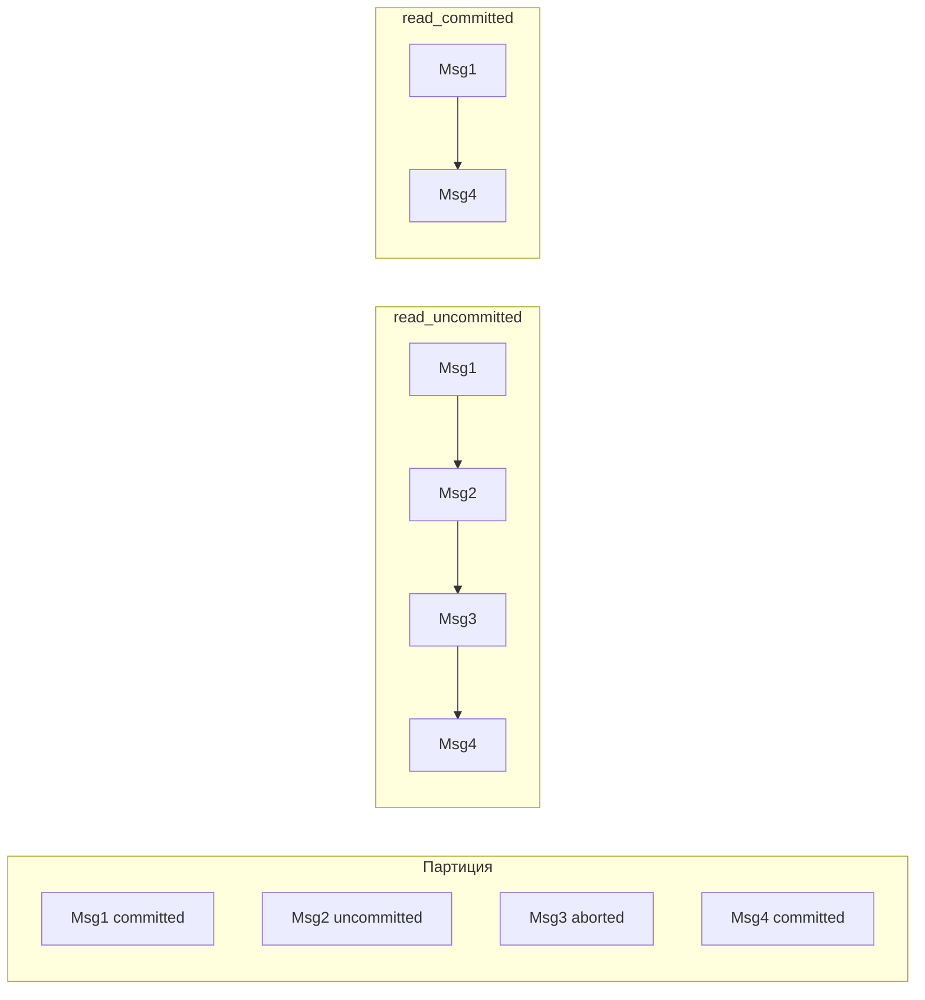
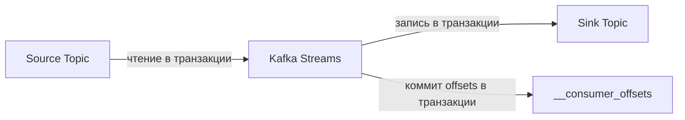

## Kafka Transactions: атомарная запись в несколько партиций и топиков

В стандартной конфигурации Kafka продюсер отправляет сообщения и может получить подтверждение, что каждое сообщение было записано. Но что, если нужно записать несколько сообщений в разные партиции (или даже в разные топики) так, чтобы либо все они были записаны, либо ни одного? Обычная отправка сообщений этого не обеспечивает.

**Kafka Transactions** — это механизм, который позволяет продюсеру атомарно отправлять сообщения в несколько партиций. Все сообщения в рамках транзакции либо становятся видимыми для потребителей одновременно, либо не становятся видимыми вовсе. Кроме того, транзакции позволяют стриминговым приложениям (Kafka Streams) реализовать exactly-once processing: читать сообщения из одного топика, обрабатывать их и записывать результаты в другой топик без дублирования и без потерь.

## Проблема: атомарная запись в несколько партиций

Представьте приложение, которое переводит деньги со счета на счет. Нужно:

1. Списать 100 рублей со счета А (событие "DebitAccountA").
2. Зачислить 100 рублей на счет Б (событие "CreditAccountB").

Если эти два события публикуются в Kafka отдельными запросами, возможна ситуация: событие "Debit" записалось, а событие "Credit" не записалось (сбой сети, перезапуск). Система в несогласованном состоянии.

Транзакция Kafka позволяет обернуть эти две отправки в одну атомарную операцию: оба сообщения будут записаны или оба не будут записаны атомарно.



## Основные понятия Kafka Transactions

**Producer ID (PID).** Каждый продюсер, использующий транзакции, получает уникальный ID. Этот ID позволяет брокерам отслеживать состояние транзакции.

**Transactional ID.** Это уникальный идентификатор, который административно назначается продюсеру (через конфигурацию `transactional.id`). В отличие от PID, transactional.id сохраняется между перезапусками продюсера. При сбое и перезапуске старый продюсер с тем же transactional.id будет считаться мертвым, а новый может продолжить транзакции.

**Transaction Coordinator.** Специальный компонент на стороне брокера (один из брокеров для каждой transactional.id). Он отслеживает состояние транзакции: ongoing, prepare commit, committed, aborted.

**Control messages (контрольные сообщения).** Kafka добавляет в партиции специальные сообщения `COMMIT` или `ABORT`, которые обозначают границу транзакции. Потребители, настроенные на `read_committed` уровень изоляции, игнорируют сообщения из незавершенных транзакций.

## Уровни изоляции для потребителя

Для работы с транзакциями потребитель может выбрать уровень изоляции через параметр `isolation.level`.

**read_uncommitted (по умолчанию).** Потребитель читает все сообщения, включая те, которые находятся в незавершенных транзакциях. Если транзакция позже откатится (abort), потребитель все равно уже прочитал эти сообщения. Так же как dirty read в реляционных БД. Это режим максимальной производительности.

**read_committed.** Потребитель читает только сообщения из завершенных транзакций (committed). Сообщения из открытых транзакций (ongoing) или откаченных (aborted) не видны. При этом потребитель должен читать партиции последовательно, пропуская контрольные сообщения. Это дает изоляцию на уровне транзакций.



## Как продюсер использует транзакции

Пример продюсера на Java (псевдокод):

```java
Properties props = new Properties();
props.put("transactional.id", "my-transactional-producer");
props.put("enable.idempotence", "true"); // обязательно для транзакций
KafkaProducer<String, String> producer = new KafkaProducer<>(props);

producer.initTransactions(); // инициализация (один раз)

try {
    producer.beginTransaction();
    producer.send(new ProducerRecord<>("topicA", "key", "value1"));
    producer.send(new ProducerRecord<>("topicB", "key", "value2"));
    // можно также отправлять в разные партиции и топики
    producer.commitTransaction();
} catch (Exception e) {
    producer.abortTransaction();
    throw e;
}
```

**Что происходит под капотом:**

1. `initTransactions()` регистрирует transactional.id в Transaction Coordinator.
2. `beginTransaction()` начинает новую транзакцию.
3. Все последующие `send()` помечаются ID этой транзакции.
4. `commitTransaction()` завершает транзакцию. Брокеры записывают контрольное сообщение `COMMIT` во все партиции, затронутые транзакцией.
5. `abortTransaction()` откатывает транзакцию. Записывается контрольное сообщение `ABORT`.

## Транзакции в Kafka Streams: exactly-once processing

Самое популярное применение транзакций — потоковая обработка с гарантией exactly-once.

**Задача:** Прочитать сообщения из топика A (source), обработать (например, подсчитать количество) и записать результат в топик B (sink). При этом:

- Каждое сообщение должно быть обработано ровно один раз (не потеряно, не продублировано).
- В случае сбоя процесс должен восстановиться и продолжить с того же места без потери.

Без транзакций стандартный подход давал at-least-once или at-most-once, но не exactly-once.

**Kafka Streams с exactly-once использует транзакции так:**

1. Сообщения читаются из исходного топика внутри транзакции.
2. Результаты обработки записываются в выходной топик в той же транзакции.
3. Смещения (offsets) потребителей коммитятся в том же транзакции (в топик `__consumer_offsets`).

Атомарно: либо все три действия (чтение сообщений, запись результатов, коммит) выполняются, либо ничего.



Kafka Streams предоставляет три уровня гарантий:

- `exactly_once_v1` (старый, на основе транзакций).
- `exactly_once_v2` (новый, более эффективный, рекомендуется).
- `at_least_once` (без транзакций).

## Цена транзакций: производительность и задержка

Транзакции в Kafka не бесплатны. Основные накладные расходы:

**Дополнительные обращения к Transaction Coordinator.** Каждая транзакция требует нескольких раундов общения с координатором. При очень большой частоте транзакций (тысячи в секунду) координатор может стать узким местом.

**Control messages.** Для каждой транзакции в каждую партицию записывается маркер COMMIT или ABORT. При большом количестве мелких транзакций это увеличивает объем хранимых данных.

**Задержка при commit.** Commit не мгновенный. Требуется синхронизация со всеми затронутыми партициями.

**Влияние на потребителей в режиме read_committed.** Потребитель, читающий в режиме read_committed, не может читать сообщения из открытой транзакции. Если транзакция очень долгая (часы), потребитель не увидит новые сообщения до её завершения. Это серьезное ограничение.

## Практические советы по использованию транзакций

**Не используйте транзакции для единичных сообщений.** Оборачивать каждое сообщение в отдельную транзакцию — дорого. Транзакции эффективны для пачек (batches).

**Тщательно выбирайте transactional.id.** Для одного логического продюсера (даже с несколькими экземплярами) должен быть один transactional.id. При конкурентных экземплярах с одним transactional.id возможны ошибки (ProducerFencedException).

**Продюсер должен корректно завершать транзакции при shutdown.** При закрытии продюсера нужно вызвать `commitTransaction()` или `abortTransaction()`. Висящая открытая транзакция будет мешать потребителям.

**Настройка времени транзакции.** `transaction.timeout.ms` (по умолчанию 1 минута) определяет, как долго координатор ждет завершения транзакции. Если продюсер не завершил транзакцию за это время, она будет откачена автоматически.

## Когда нужны транзакции, а когда нет

**Нужны:**

- Перемещение данных между топиками с гарантией exactly-once (Kafka Streams).
- Атомарная запись в несколько партиций (связанные события).
- Ситуации, когда дубликаты сообщений недопустимы (платежи, инвентаризация).
- Соединение (join) двух потоков в Kafka Streams (также требует exactly-once).

**Не нужны:**

- Простая at-least-once обработка (большинство случаев).
- Отправка логов или метрик.
- Ситуации, где дубликаты допустимы.
- Высоконагруженные системы с миллионами сообщений в секунду, где накладные расходы на транзакции будут значительными.

## Ограничения Kafka Transactions

**Производительность.** Для массовой отправки сообщений (миллионы в секунду) транзакции могут быть узким местом. Многие компании избегают транзакций для high-throughput сценариев, используя идемпотентность или компенсирующие действия.

**Длительные транзакции.** Kafka не предназначена для транзакций, которые длятся минуты или часы. Это создаст проблемы для потребителей (не видят новых сообщений) и для самого брокера.

**Распределенные транзакции между Kafka и внешними системами.** Транзакции Kafka не распространяются на базы данных или другие брокеры. Если вам нужно атомарно записать в Kafka и в PostgreSQL, Kafka транзакции не помогут. Нужен паттерн Transactional Outbox.

**Сложность отладки.** Транзакции добавляют дополнительную сложность. При ошибках диагностировать причину сложнее.

## Резюме

Kafka Transactions — мощный механизм для атомарной записи в несколько партиций и для exactly-once обработки в Kafka Streams.

**Ключевые идеи:**

- Транзакция включает несколько `send()` в разные партиции (и топики). Все сообщения становятся видимыми одновременно после `commitTransaction()`.
- Потребитель с `isolation.level = read_committed` не видит сообщения из незавершенных транзакций.
- Kafka Streams использует транзакции для exactly-once семантики: чтение, обработка, запись, коммит — за одну транзакцию.
- Транзакции требуют настройки `transactional.id` и `enable.idempotence=true`.
- Цена транзакций — снижение пропускной способности и увеличение задержки.

**Для аналитика:**

При проектировании системы на Kafka нужно понимать, нужны ли вам транзакции.

- Если вы передаете события, где дубликаты неприемлемы (например, финансовые транзакции), транзакции и exactly-once обработка обязательны.
- Если вы передаете логи, метрики, пользовательские события, where дубликаты допустимы, транзакции — овер-инжиниринг.
- Если вам нужно атомарно обновить несколько партиций, транзакции — правильное решение.
- Если вам нужна атомарность между Kafka и внешней БД, транзакции не помогут — рассмотрите outbox pattern.

Транзакции — мощный, но сложный инструмент. Не используйте их там, где можно обойтись более простыми at-least-once и идемпотентностью. Но там, где exactly-once действительно необходим, транзакции Kafka — это стандарт де-факто.