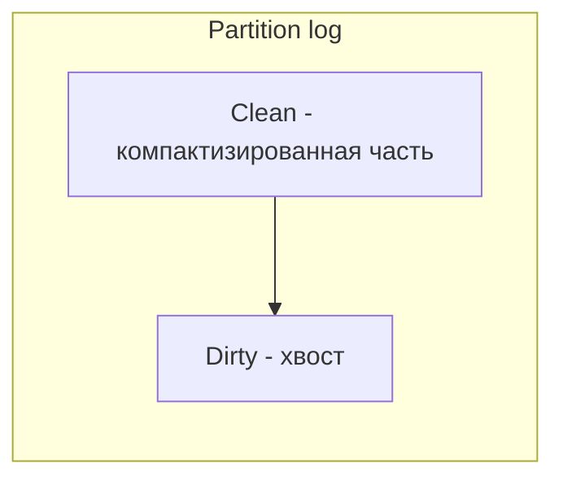

## Log Compaction в Apache Kafka: когда важна не вся история, а последнее состояние

Kafka по умолчанию работает как журнал коммитов (commit log): каждое сообщение добавляется в конец, старые сообщения удаляются по достижении размера сегмента или через заданное время (retention). Это идеально для потоков событий, где важна вся история (логи, события кликов, метрики).

Но есть другой класс задач: хранение текущего состояния (материализованных представлений) — таблиц, профилей, ключей-значений. Например, нужно хранить актуальный баланс счета, профиль пользователя, текущую цену акции. В таких сценариях важна не вся история изменений, а только последнее состояние по каждому ключу.

**Log Compaction** — это механизм Kafka, который превращает топик из журнала событий в key-value хранилище с гарантией сохранения последнего сообщения по каждому ключу. Старые версии одного ключа удаляются при компактизации. Это позволяет использовать Kafka как распределенное, реплицируемое, отказоустойчивое key-value хранилище для состояний приложений.

## Проблема: бесконечный рост и избыточность данных

Представьте топик `user-profiles`, куда каждое приложение пишет профили пользователей при каждом изменении. Пользователь Иван (id=123) менял имя 50 раз за неделю. В обычном топике у вас будет 50 сообщений с ключом 123. Но если вашему потребителю нужно только актуальное имя, остальные 49 сообщений — это мусор, который занимает дисковое пространство и замедляет чтение.

Без компактификации:

```yaml
Топик user-profiles (до компактификации):
  offset 0: {key:123, name:"Иван1"}
  offset 1: {key:124, name:"Мария"}
  offset 2: {key:123, name:"Иван2"}
  offset 4: {key:125, name:"Петр"}
  offset 5: {key:123, name:"Иван3"}  # последнее сообщение для ключа 123
  offset 6: {key:124, name:"Мария2"} # последнее сообщение для ключа 124
```

После компактификации (логической):

```yaml
Топик user-profiles (после компактификации):
  offset 0: (может быть удалено)
  offset 1: (может быть удалено)
  offset 2: (может быть удалено)
  offset 4: {key:125, name:"Петр"}  # последнее сообщение для ключа 125
  offset 5: {key:123, name:"Иван3"} # последнее сообщение для ключа 123
  offset 6: {key:124, name:"Мария2"} # последнее сообщение для ключа 124
```

Сообщения по ключам 123 и 124 с более ранними смещениями удаляются (будут удалены при физической компактизации). Сохраняется только последнее сообщение по каждому ключу.

## Как работает log compaction

**Log compaction** — это фоновый процесс на брокере, который периодически переписывает сегменты партиции, оставляя только последние сообщения для каждого ключа. Важно: компактизация не удаляет сообщения мгновенно после записи нового сообщения для того же ключа. Она работает с целыми сегментами, и старые версии могут существовать некоторое время, пока сегмент не будет компактизирован.

**Clean vs Dirty ratio (степень загрязнения).** Kafka компактизирует сегмент, когда доля "грязных" (подлежащих удалению) сообщений превышает порог `min.cleanable.dirty.ratio` (по умолчанию 0.5, т.е. 50%). Это баланс между частотой компактизации (и нагрузкой на брокер) и объемом хранимых данных.

**Структура лога при компактизации:**

Лог партиции делится на две части:

- **Clean (чистая).** Часть, которая уже была компактизирована. Каждый ключ встречается не более одного раза (последнее значение).
- **Dirty (грязная).** Хвост лога, который еще не был компактизирован. Здесь могут встречаться несколько версий одного ключа.



Потребитель, читающий с начала, увидит все сообщения из Clean (только последнее значение по каждому ключу) плюс все сообщения из Dirty (включая промежуточные версии). Поэтому при компактизации пропускная способность чтения не страдает, но пространство экономится.

## Важные особенности компактификации

**Ключ обязателен и не может быть null.** Сообщения с ключом null (без ключа) не подвергаются компактификации — они всегда удаляются по retention (обычно через заданное время). Для компактификации ключи должны быть уникальными идентификаторами сущностей (userId, orderId, accountId).

**Сообщения с одинаковым ключом в Dirty части.** Если в Dirty части несколько сообщений с одним ключом, при компактизации сохранится только последнее (самое большое смещение). Порядок между разными ключами сохраняется.

**Компактизация не гарантирует, что будет удалено сообщение, даже если пришло более новое.** Пока сегмент не достигнет порога dirty ratio, старое сообщение может жить. Это особенность, а не баг.

**Удаление записей (tombstone).** Чтобы явно удалить запись из компактифицированного топика, нужно отправить сообщение с тем же ключом и значением null (tombstone). При компактизации это сообщение останется как маркер удаления. Потребители, читающие компактифицированный топик, увидят tombstone и могут удалить значение из своих хранилищ. При этом, после компактизации tombstone тоже может быть удален (через заданный retention, обычно `delete.retention.ms`).

```yaml
# Удаление записи с ключом 123
Производитель отправляет:
  key: 123
  value: null   # tombstone

После компактизации:
  - Все предыдущие сообщения с ключом 123 удалены
  - Остался tombstone (маркер удаления)
  - Потребитель при чтении tombstone удаляет значение из своего store

Через delete.retention.ms tombstone тоже будет удален
```

## Настройка log compaction

Для включения компактификации используется параметр `cleanup.policy=compact`. Второй популярный вариант — `cleanup.policy=compact,delete` (компактификация + удаление по времени). В этом случае сначала применяется компактификация, потом удаляются сообщения старше `retention.ms`.

**Пример создания топика с компактификацией:**

```bash
kafka-topics --create \
  --topic user-profiles \
  --partitions 10 \
  --replication-factor 3 \
  --config cleanup.policy=compact \
  --config min.cleanable.dirty.ratio=0.5 \
  --config segment.ms=604800000 \
  --config delete.retention.ms=86400000
```

**Ключевые параметры:**

| Параметр | Назначение | Рекомендация |
| :--- | :--- | :--- |
| `cleanup.policy` | `compact` для логической компактификации, `delete` для временной, `compact,delete` для комбинированной | `compact` для состояний, `delete` для событий |
| `min.cleanable.dirty.ratio` | Доля грязных сообщений в сегменте, при которой запускается компактизация (0.5 = 50%). | 0.5 для большинства. Меньше — чаще компактизация, чище данные, выше нагрузка. |
| `segment.ms` | Максимальное время жизни сегмента (в мс). Новые сегменты создаются при превышении размера или времени. | 7 дней (604800000) для стабильных данных. |
| `delete.retention.ms` | Время хранения tombstone после его создания. | 24 часа (86400000) — достаточно, чтобы все потребители его увидели. |

## Когда применять log compaction

**Сценарии использования:**

- **Хранение текущего состояния для восстановления (state stores).** Kafka Streams использует компактифицированные ченжлоги (changelogs) для хранения состояния приложений. При перезапуске приложение восстанавливает состояние из компактифицированного топика.
- **База данных key-value поверх Kafka.** Можно использовать Kafka как распределенное, реплицируемое хранилище для профилей пользователей, настроек, цен. Компактификация обеспечивает, что хранятся только актуальные значения.
- **CDC (Change Data Capture) для снимков (snapshots).** При передаче изменений из БД в Kafka, компактифицированный топик может содержать последний снимок каждой сущности.
- **Справочники (reference data).** Коды валют, домены, категории.

**Когда НЕ применять:**

- **Журналы событий (логи, клики, метрики).** Здесь важна вся история, и компактификация может её уничтожить.
- **Очереди (как RabbitMQ).** Компактификация не гарантирует порядка сообщений между разными ключами и не удаляет сообщения после прочтения.
- **Финансовые транзакции, где важна полная аудит-история.** Удаление промежуточных версий может нарушить аудит.

## Компактификация vs Retention

| | Retention (delete) | Compaction (compact) |
| :--- | :--- | :--- |
| **Цель** | Удалить старые сообщения через время | Сохранить только последнее сообщение по ключу |
| **Ключ** | Игнорируется | Критичен (key must not be null) |
| **Что остается** | Ничего, если старше retention | Последнее сообщение по каждому ключу |
| **Использование** | Логи, события, метрики | Состояние, профили, таблицы |
| **Освобождение места** | Да | Да |
| **Порядок вызова** | `delete` | `compact,delete` |

## Как компактизация работает с Kafka Streams

В Kafka Streams каждое потоковое приложение внутренне использует состояние (state store), которое периодически сохраняется в компактифицированных ченжлогах. Это состояние необходимо для восстановления после сбоя. Компактификация гарантирует, что в ченжлоге хранится только последнее значение для каждого ключа.


Без компактификации ченжлог рос бы бесконечно, и восстановление после сбоя заняло бы часы. С компактификацией ченжлог хранит только последние версии ключей, что делает восстановление быстрым.

## Мониторинг и диагностика компактификации

**Метрики JMX для компактификации:**

- `kafka.log:type=LogCleanerManager` — общее состояние cleaner.
- `kafka.log:type=Cleaner` — время работы cleaner, количество удаленных сообщений.
- `kafka.log:type=LogCleaner,id=*` — для каждого cleaner'а.

**Признаки проблем:**

- **Недостаточная частота компактизации.** Если dirty ratio не достигает порога, сегменты остаются "грязными". Проверьте `min.cleanable.dirty.ratio` (слишком высок) и загрузку cleaner'а.
- **Рост размера топика, несмотря на компактификацию.** Возможно, есть ключи, которые обновляются очень часто, но сегмент не компактизируется (слишком большой сегмент). Уменьшите `segment.ms` или `segment.bytes`.
- **Tombstone не удаляются.** Потребители могут не успевать прочитать tombstone до того, как он будет удален. Увеличьте `delete.retention.ms`.

## Ограничения и компромиссы

**Не атомарность чтения.** При чтении из компактифицированного топика потребитель может увидеть состояние "до" и "после" компактизации в одном проходе, потому что dirty часть еще не переписана. Это нормально и ожидаемо.

**Потеря промежуточных состояний.** Если приложение полагается на историю изменений (например, для аудита), компактификация не подходит.

**Накладные расходы на компактизацию.** Компактизация потребляет CPU и дисковый I/O на брокерах. При высоких ставках изменения данных (high write rate) она может не успевать.

**Не для всех сценариев.** Пытаться использовать компактификацию как базу данных (нагружать точечными запросами) неэффективно. Kafka не оптимизирована для точечных чтений по ключу — это журнал, а не БД.

## Резюме

Log Compaction — механизм Kafka, превращающий топик из журнала событий в key-value хранилище, где хранится только последнее сообщение по каждому ключу.

**Как работает:** Фоновый процесс (cleaner) переписывает сегменты лога, удаляя старые версии для каждого ключа. Сегмент компактизируется, когда доля "грязных" сообщений превышает порог `min.cleanable.dirty.ratio`.

**Ключевые параметры:** `cleanup.policy=compact` (или `compact,delete`), `min.cleanable.dirty.ratio` (частота компактизации), `delete.retention.ms` (время жизни tombstone).

**Сценарии использования:** State stores в Kafka Streams, key-value хранилища поверх Kafka, справочники (reference data), CDC для снимков.

**Ограничения:** Не подходит для аудита журналов, не дает строгих гарантий на атомарность чтения, накладывает дополнительную нагрузку на брокеров при высокой частоте обновлений.

**Для аналитика:** Если проектируете систему, где нужно хранить текущее состояние сущности (профиль пользователя, баланс счета, цена акции) и при этом хотите использовать Kafka как транспорт — log compaction идеальное решение. Если нужна полная история — выбирайте обычную retention политику. Если нужна база данных с точечными запросами — возможно, Kafka не подходит, и лучше взять специализированную БД (PostgreSQL, Cassandra), а Kafka оставить для потока событий изменений. Компактификация делает Kafka более гибкой, но не превращает её в полноценную СУБД.