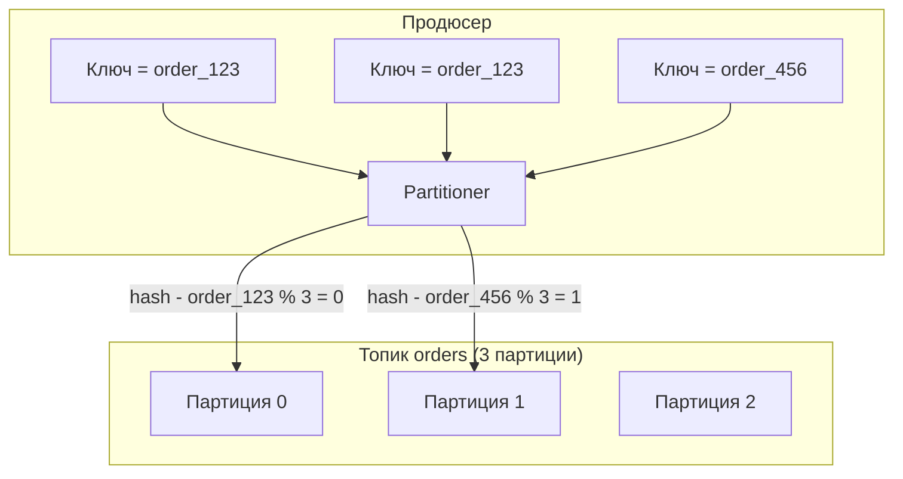
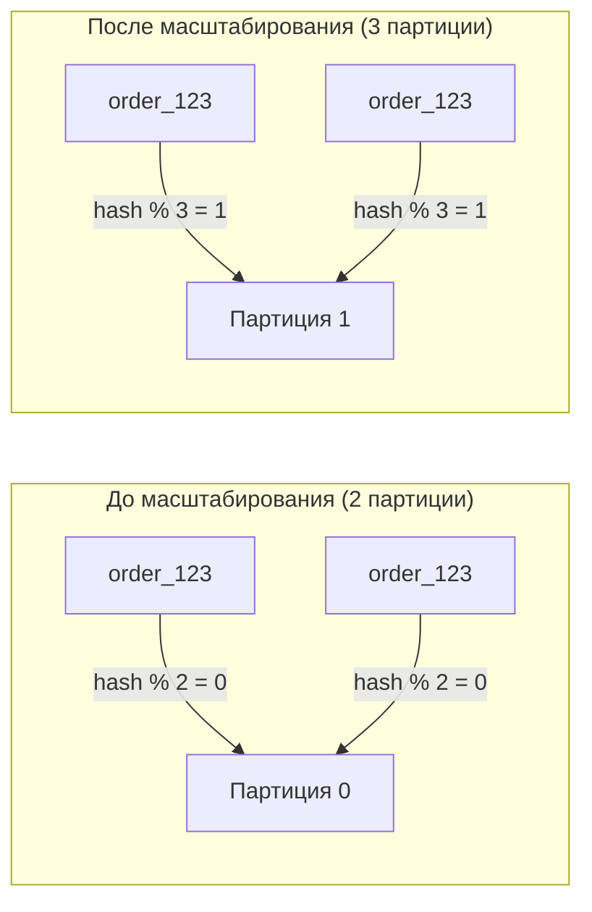

## Partition Key Design в Apache Kafka: как ключ определяет судьбу сообщения

Apache Kafka часто описывают как распределенный журнал коммитов (distributed commit log). Но в отличие от обычного журнала, Kafka умеет распределять данные по нескольким партициям, а порядок сообщений гарантируется только внутри одной партиции. Выбор ключа партиционирования (partition key) — это архитектурное решение, от которого зависит порядок обработки, равномерность нагрузки и возможность масштабирования в будущем.

Ошибка в выборе ключа может привести к "горячим" партициям, неожиданному порядку сообщений и невозможности увеличить число партиций без ручного перераспределения данных. Эта статья — для системных аналитиков, проектирующих потоковые системы на Kafka. Мы разберем, как работает партиционирование, как выбрать ключ и какие компромиссы нужно учитывать.

## Как Kafka распределяет сообщения по партициям

В Kafka топик разделен на партиции — упорядоченные, неизменяемые последовательности сообщений. Сообщение внутри партиции имеет уникальный смещение (offset). Порядок сообщений гарантируется только внутри одной партиции. Между партициями порядка нет.

При отправке сообщения продюсер решает, в какую партицию его положить. Этот выбор определяется **ключом сообщения** (message key) и **стратегией партиционирования** (partitioner).

**Стандартное правило (по умолчанию):**

- Если ключ не указан (null) — сообщение распределяется случайно round-robin по всем доступным партициям.
- Если ключ указан — хэш ключа вычисляется, и партиция выбирается как `hash(key) % numberOfPartitions`.

```java
// Псевдокод стандартного partitioner
partition = hash(key) % topic.partitions.count;
```

Один и тот же ключ всегда попадает в одну и ту же партицию (пока число партиций не меняется). Это гарантирует, что все сообщения с одинаковым ключом будут упорядочены.



## От чего зависит выбор ключа

Выбор ключа партиционирования — это компромисс между тремя требованиями:

1. **Порядок сообщений.** Сообщения с одинаковым ключом попадают в одну партицию и обрабатываются последовательно. Это важно, если важен порядок (например, события одного заказа).
2. **Равномерность нагрузки.** Хэш-функция должна распределять сообщения по партициям равномерно. Если один ключ генерирует 90% сообщений, одна партиция будет перегружена.
3. **Масштабируемость.** При увеличении числа партиций хэш-отображение меняется. Сообщения с тем же ключом могут попасть в другую партицию. Это нарушает порядок для старых данных, если вы читаете с начала (from beginning).

Ниже разберем каждое требование подробно.

## Требование 1: порядок сообщений (Message Ordering)

Главная причина использовать ключ — гарантия порядка. Kafka гарантирует порядок только в пределах одной партиции. Если нужно, чтобы все события, связанные с одной сущностью, обрабатывались в том порядке, в котором они произошли, эти события должны попадать в одну партицию.

**Пример: заказы в интернет-магазине.**

События одного заказа:
- `OrderCreated` (заказ создан)
- `PaymentReceived` (платеж получен)
- `OrderShipped` (заказ отправлен)
- `OrderDelivered` (заказ доставлен)

Если эти события попадут в разные партиции, потребители могут обработать `OrderDelivered` раньше, чем `OrderCreated`. Это логически невозможно. Поэтому ключом должен быть идентификатор заказа (`orderId`). Все события заказа 123 попадут в одну партицию и будут прочитаны в правильном порядке.

```yaml
Ключ: orderId = 123
Сообщения:
  1. OrderCreated (offset 0)
  2. PaymentReceived (offset 1)
  3. OrderShipped (offset 2)
  4. OrderDelivered (offset 3)
```

**Что если порядок не важен?** Тогда можно не указывать ключ (null), и сообщения распределятся случайно. Это даст лучшую равномерность, но потеряет порядок.

## Требование 2: равномерность распределения (Load Balancing)

Вторая задача ключа — распределить нагрузку равномерно между партициями. Если один ключ генерирует 90% сообщений, партиция, куда попадают сообщения с этим ключом, будет перегружена. Остальные партиции будут простаивать. Это называется "горячая партиция" (hot partition).

**Пример плохого ключа: статус заказа.**

```yaml
Ключ: status
Значения: pending (90% сообщений), processing (8%), completed (2%)
```

90% сообщений имеют ключ `"pending"`. Хэш от `"pending"` всегда дает одну и ту же партицию. Эта партиция получит 90% всех сообщений. Остальные партиции почти пусты.

**Пример хорошего ключа: идентификатор заказа (orderId).**

Идентификатор заказа — это случайное (или псевдослучайное) значение. Хэш от случайного равномерно распределит сообщения по всем партициям. Нет "горячего" ключа.

```yaml
Ключ: orderId (UUID)
Хэш от UUID распределен равномерно.
```

**Проблема: естественная неоднородность данных**

Даже при хорошем ключе может возникнуть дисбаланс. Например, один пользователь генерирует аномально много событий. Если ключ — `userId`, то его события попадут в одну партицию. Это редкий, но возможный случай.

**Решения:**

- Принять как данность (дисбаланс небольшой).
- Использовать "суффикс" для популярного ключа: `userId + "_" + (random % 10)`. Это размажет события популярного пользователя по 10 партициям, но потеряет порядок событий этого пользователя.
- Перепроектировать систему, чтобы популярная сущность обрабатывалась отдельно.

## Требование 3: масштабируемость и изменение числа партиций

Самая сложная проблема. Когда число партиций в топике увеличивается (а это часто делают для масштабирования), отображение `hash(key) % oldPartitions` становится недействительным. Сообщения с тем же ключом, отправленные после увеличения партиций, могут попасть в другую партицию.

**Пример:**

Было 2 партиции. `hash(order_123) % 2 = 0` → партиция 0.
Добавили 3-ю партицию. Стало 3 партиции. `hash(order_123) % 3 = 1` → партиция 1.

Сообщения этого заказа, отправленные после изменения числа партиций, попадают в другую партицию. Порядок сообщений этого заказа нарушается — старые сообщения в партиции 0, новые в партиции 1.



**Как смягчить проблему:**

- Проектировать число партиций "на вырост". Если вы планируете рост в 5 раз, заложите 5x партиций сразу.
- Использовать **логическое партиционирование** (custom partitioner), где отображение ключа в партицию не зависит от числа партиций. Например, ключ содержит номер партиции: `"order_123_part_0"`. Это неудобно, но решает проблему навсегда.
- Смириться с тем, что изменение числа партиций — редкое событие, и после него возможны кратковременные нарушения порядка. Для систем, где порядок критичен, это неприемлемо.

## Стратегии выбора ключа для разных сценариев

### Сценарий 1: Каждая сущность должна иметь строгий порядок событий (например, заказы, платежи)

**Ключ:** `entityId` (orderId, paymentId, userId).

**Компромисс:** Равномерность зависит от распределения идентификаторов. UUID распределены равномерно, автоинкрементные ID — нет.

**Масштабируемость:** Проблема при добавлении партиций.

### Сценарий 2: Порядок не важен, важна максимальная равномерность

**Ключ:** `null` (без ключа). Продюсер использует round-robin.

**Компромисс:** Полная равномерность, отсутствие порядка.

**Масштабируемость:** Проблемы нет — сообщения распределяются по доступным партициям случайно, при добавлении партиций просто начинают использоваться новые.

### Сценарий 3: Важна группировка по нескольким сущностям (например, заказы + пользователи)

**Ключ:** `orderId` удобнее для заказов, но не для запросов по пользователю. Если потребителю нужно обрабатывать события одного пользователя в порядке, ключ должен быть `userId`.

**Решение:** Два топика. Топик `orders-by-order` ключ `orderId` для потребителя, которому важен порядок заказов. Топик `orders-by-user` ключ `userId` для потребителя, которому важны события пользователя. Второй топик наполняется через Kafka Streams (из первого). Это дороже, но дает обе группировки.

### Сценарий 4: Ключ с большим количеством значений, но одно значение доминирует (например, логи от одного сервиса)

**Ключ:** `serviceId` приведет к горячей партиции для самого активного сервиса.

**Решение:** Композитный ключ: `serviceId + "_" + (random % N)`. N подбирается так, чтобы размазать события одного сервиса по N партициям. Порядок событий одного сервиса потеряется, но для логов это часто приемлемо.

## Продвинутые темы: ключ и компактизация (Log Compaction)

В топиках с лог-компактизацией ключ имеет особое значение. Kafka гарантирует, что для каждого ключа в топике останется только последнее сообщение (последнее значение). Это используется для хранения текущего состояния (таблиц) в Kafka.

**Пример:** Топик `user-profile`, ключ `userId`, значение — профиль пользователя. При компактизации Kafka удалит все старые версии профиля, оставив только последнюю.

**Выбор ключа здесь критичен:** если ключ не уникален для сущности, компактизация объединит разные сущности в одно сообщение. Ключ должен быть уникальным идентификатором сущности.

## Продюсер: кастомный partitioner

По умолчанию используется хэш-партиционер. Если стандартная логика не подходит, можно написать свой partitioner.

**Пример: ключ-суффикс для размазывания горячего ключа.**

```java
// Псевдокод кастомного partitioner
int partition = hash(keyWithoutSuffix) % numberOfPartitions;
if (isHotKey(keyWithoutSuffix)) {
    // Добавляем суффикс для размазывания
    int suffix = random.nextInt(10);
    partition = hash(keyWithoutSuffix + "_" + suffix) % numberOfPartitions;
}
return partition;
```

Это решает проблему горячей партиции, но теряет порядок для этого ключа.

## Потребитель: как читать из партиций, зная ключ

Потребитель обычно читает все партиции, назначенные его группе. Но если нужно прочитать сообщения для конкретного ключа (например, все события заказа 123), это сложно.

- Поскольку ключ хэшируется в партицию, вы можете вычислить, в какой партиции лежат сообщения с этим ключом, только если знаете формулу хэширования и число партиций. Но это неудобно и ненадежно.
- Лучше создать отдельный топик с ключом `orderId` и читать его полностью, фильтруя ненужные ключи на стороне потребителя.
- Или использовать Kafka Streams для создания "индекса" (таблицы) ключ → партиция.

## Влияние на аналитика: проектирование схемы данных

При проектировании потоковой обработки на Kafka аналитик должен ответить на вопросы:

**1. Какой ключ гарантирует нужный порядок?** Определите, какая сущность является единицей порядка. Это может быть `orderId`, `userId`, `deviceId`, `sessionId`. Опишите это в требованиях.

**2. Есть ли "горячие" ключи?** Оцените распределение данных. Один ключ генерирует более 10-20% трафика? Если да, стандартный ключ вызовет дисбаланс. Нужно либо мириться, либо использовать композитный ключ, либо увеличивать число партиций.

**3. Как часто планируется добавлять партиции?** Если часто — проектируйте с запасом или используйте ключи, не зависящие от числа партиций (композитные). Если редко — можно жить с риском нарушения порядка при добавлении.

**4. Важна ли компактизация для этого топика?** Если планируется лог-компактизация, ключ должен быть уникальным идентификатором сущности.

**5. Какое ожидаемое число партиций?** Рекомендация Kafka: число партиций должно быть кратно ожидаемому числу потребителей в группе. Если сложно предсказать, закладывайте 2-4 партиции на 1 потребителя в пиковой нагрузке. Но не делайте тысячи партиций на одном брокере.

## Резюме

Выбор ключа партиционирования — одно из самых важных архитектурных решений при проектировании системы на Kafka.

**Ключ определяет:**

- **Порядок сообщений** — одинаковый ключ → одна партиция → гарантированный порядок.
- **Распределение нагрузки** — равномерный хэш ключей → равномерное распределение по партициям. "Горячий" ключ → перегрузка одной партиции.
- **Масштабируемость** — при увеличении числа партиций отображение ключа меняется, порядок может нарушиться.

**Рекомендации по выбору ключа:**

| Сценарий | Рекомендуемый ключ | Комментарий |
| :--- | :--- | :--- |
| Нужен строгий порядок событий сущности | `entityId` (UUID) | Равномерность хорошая, масштабирование нарушает порядок |
| Максимальная равномерность, порядок не важен | `null` | Round-robin, идеальная равномерность |
| Горячий ключ доминирует (90% трафика) | Композитный: `entityId + "_" + (random % N)` | Теряется порядок, но нагрузка выравнивается |
| Лог-компактизация | Уникальный `entityId` | Ключ должен однозначно идентифицировать сущность |
| Группировка по нескольким сущностям | Два топика с разными ключами | Дороже, но дает обе группировки |

**Для аналитика:** при проектировании топиков Kafka запрашивайте у команды:

- Какая сущность является единицей порядка? (Ключ)
- Какое ожидаемое распределение ключей? Есть ли риск горячей партиции?
- Как часто планируется добавлять партиции?
- Какое число партиций закладывать (обычно от 3 до 100 на топик)?

Неправильный выбор ключа может привести к "горячим" партициям, когда одна партиция получает 90% сообщений, а другие простаивают. Исправить это потом — значит перераспределить все данные, что сложно и рискованно. Лучше один раз потратить время на анализ и выбрать правильный ключ, чем потом перекладывать миллионы сообщений вручную.