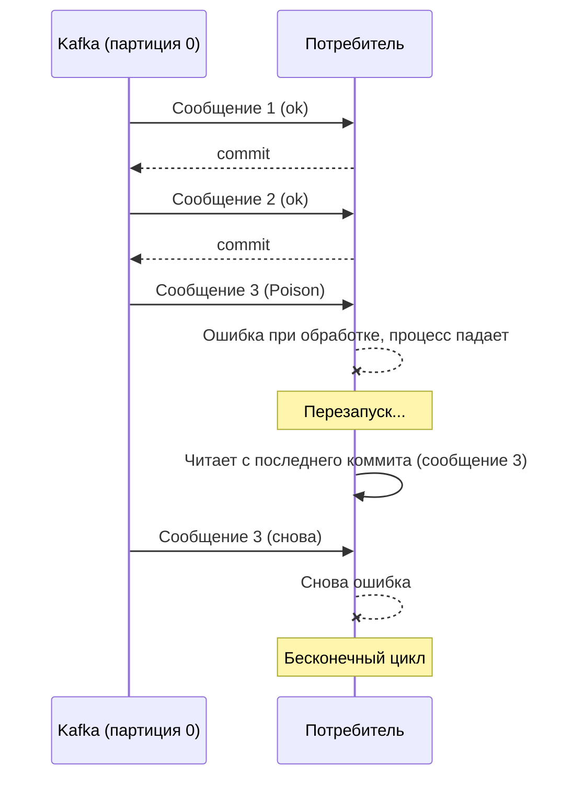
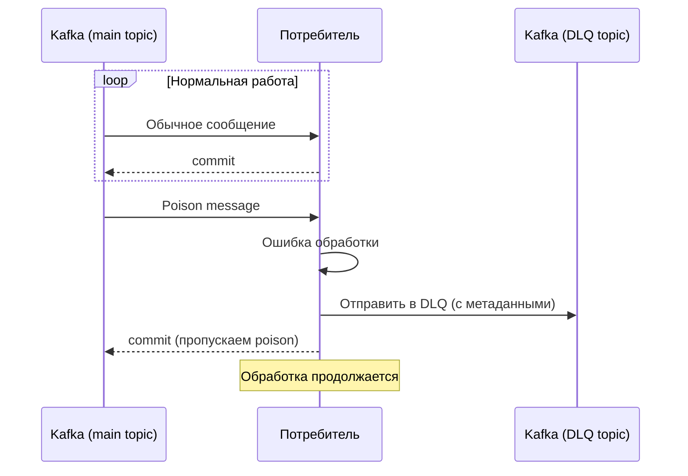

## Poison Message: когда одно сообщение ломает всю обработку

В распределенных системах, построенных на брокерах сообщений, рано или поздно возникает ситуация: потребитель (consumer) читает сообщение, пытается его обработать и падает. При перезапуске он снова читает то же сообщение, снова падает. Цикл повторяется. Одно "плохое" сообщение блокирует обработку всех последующих сообщений в партиции.

**Poison Message (отравленное сообщение)** — это сообщение, которое потребитель не может обработать, и оно вызывает повторяющиеся сбои. Система застревает в бесконечном цикле: прочитать → упасть → перезапустить потребителя → прочитать снова.

Проблема poison message актуальна для всех брокеров сообщений (Kafka, RabbitMQ, SQS), но в Kafka она особенно заметна из-за строгого порядка внутри партиции. Одно плохое сообщение останавливает обработку всех сообщений после него в той же партиции.

## Как возникает poison message

**Пример 1: Невалидный JSON.** Потребитель ожидает JSON определенной структуры, а сообщение содержит бинарные данные или XML.

```json
// Ожидаемый формат
{"userId": 123, "action": "payment"}

// Poison message
Тут просто текст, а не JSON
```

**Пример 2: Ошибка валидации бизнес-логики.** Сообщение содержит userId, которого нет в базе данных. Логика обработки пытается найти пользователя и падает с NullPointerException.

**Пример 3: Проблема с внешним API.** При обработке сообщения потребитель вызывает внешний API платежного шлюза. API вернул ошибку, которую потребитель не ожидал, и упал. Сообщение — не причина, но оно триггерит сбой.

**Пример 4: Некорректные данные (кодировка, символы).** Сообщение содержит управляющие символы или некорректную UTF-8 последовательность, которая ломает парсер.

**Пример 5: Гигантское сообщение (oversized).** Потребитель выделяет память под сообщение, но его размер превышает лимиты, и приложение падает с OutOfMemoryError.



## Почему poison message особенно опасен в Kafka

В RabbitMQ или SQS стандартное решение — отправить poison message в отдельную очередь Dead Letter Queue (DLQ) и продолжить обработку следующих сообщений. В Kafka это сделать сложнее.

**Причина: строгий порядок внутри партиции.** Kafka гарантирует порядок сообщений внутри одной партиции. Потребитель не может пропустить сообщение, потому что это нарушило бы смещения (offsets). Если сообщение 3 (poison) не обработано, потребитель не может закоммитить смещение и перейти к сообщению 4. Потребитель вынужден пытаться обработать сообщение 3 снова и снова.

```yaml
Смещения в партиции:
  offset 0: сообщение 1 (ok)
  offset 1: сообщение 2 (ok)
  offset 2: сообщение 3 (POISON)
  offset 3: сообщение 4 (ok)
  offset 4: сообщение 5 (ok)

Если потребитель не может обработать offset 2, он не закоммитит смещение.
Следующие сообщения (offset 3,4,5) никогда не будут прочитаны.
```

## Стратегии обработки poison message в Kafka

Существует несколько подходов. Каждый имеет свои компромиссы.

### Стратегия 1: Dead Letter Queue (DLQ) через отдельный топик

Это классическое решение из мира RabbitMQ, адаптированное для Kafka.

**Как работает:**

1. Потребитель пытается обработать сообщение.
2. При ошибке он записывает это сообщение в отдельный топик (DLQ), добавляя метаинформацию об ошибке (например, заголовок `original-topic`, `error-message`).
3. Потребитель коммитит смещение poison message (пропускает его).
4. Обработка продолжается со следующего сообщения.

**Проблема:** Если потребитель упал до того, как записал сообщение в DLQ, оно не будет обработано. Поэтому критически важна обработка ошибок и ручной коммит.



**Настройка DLQ в Kafka (пример с обработчиком ошибок в потребителе):**

```java
try {
    processRecord(record);
    consumer.commitSync();
} catch (Exception e) {
    // Логируем ошибку
    log.error("Failed to process record", e);
    // Отправляем в DLQ
    producer.send(new ProducerRecord<>("dlq-topic", 
        record.key(), record.value(),
        Headers().add("original-topic", record.topic())
               .add("error-message", e.getMessage())));
    // Коммитим смещение, чтобы пропустить poison
    consumer.commitSync();
}
```

**Недостатки:** Дополнительная логика в потребителе. Если потребитель падает до отправки в DLQ, сообщение застревает.

### Стратегия 2: Автоматический пропуск через настройку max.poll.records

Если потребитель не может обработать сообщение, но не падает (а просто выбрасывает исключение и продолжает), можно настроить `max.poll.records = 1`. Тогда потребитель читает по одному сообщению за раз, и при ошибке он может пропустить это сообщение, не читая пачку.

Но если приложение падает (краш) при обработке poison, эта стратегия не помогает.

### Стратегия 3: Увеличение `retries` и `retry.backoff.ms`

Вместо того чтобы падать, потребитель может повторить попытку обработки несколько раз с задержкой. Если после N попыток ошибка остается, сообщение отправляется в DLQ.

Это стандартная практика в Kafka Streams (через `ProductionExceptionHandler`).

### Стратегия 4: Ручное управление смещениями (seek)

При обнаружении poison сообщения потребитель может пропустить его, не коммитя смещение, а используя метод `seek()` для перемещения на следующее смещение.

```java
try {
    processRecord(record);
    consumer.commitSync();
} catch (Exception e) {
    long nextOffset = record.offset() + 1;
    consumer.seek(new TopicPartition(record.topic(), record.partition()), nextOffset);
    consumer.commitSync(); // коммитим смещение nextOffset (пропускаем poison)
    // Дополнительно: отправить в DLQ
}
```

Это опасно: если пропустить сообщение, не отправив его в DLQ, данные потеряны. Но для некритичных данных может быть приемлемо.

### Стратегия 5: Использование Kafka Streams с обработкой ошибок

Kafka Streams предоставляет встроенные механизмы для работы с poison messages через `ProductionExceptionHandler` и `DeserializationExceptionHandler`.

Конфигурация:

```properties
# Пропускать сообщения с ошибкой десериализации
deserialization.exception.handler=org.apache.kafka.streams.errors.LogAndContinueExceptionHandler

# Отправлять сообщения с ошибкой в DLQ
production.exception.handler=org.apache.kafka.streams.errors.DeadLetterQueueExceptionHandler
```

## Сравнение стратегий

| Стратегия | Сложность | Риск потери данных | Останавливает ли обработку |
| :--- | :--- | :--- | :--- |
| DLQ через отдельный топик | Средняя | Низкий (если реализован корректно) | Нет (после отправки в DLQ) |
| `max.poll.records=1` + пропуск | Низкая | Высокий (если нет DLQ) | Временно (на 1 сообщение) |
| Seek (ручной пропуск) | Низкая | Высокий | Нет |
| Kafka Streams с exception handler | Низкая (встроено) | Низкий (если настроен DLQ) | Нет |

## Проектирование системы с учетом poison messages

**Что должен предусмотреть аналитик при проектировании:**

1. **Схема DLQ (Dead Letter Queue).** Определите отдельный топик для poison messages. Включите в заголовки сообщения (или в отдельное поле) оригинальный топик, партицию, смещение, причину ошибки, timestamp.

2. **Мониторинг размера DLQ.** Резкий рост DLQ — симптом проблем либо с данными, либо с кодом потребителя. Настройте алерт.

3. **Процесс обработки DLQ.** Создайте отдельный сервис (или manual процесс), который читает DLQ и позволяет операторам решать, что делать с poison сообщением: исправить и отправить обратно, удалить, проанализировать.

4. **Идемпотентность обработки.** При обработке сообщений из DLQ важно не создать дубликаты, если сообщение будет обработано повторно.

5. **Dead Letter Queue retention.** DLQ может расти быстро. Установите разумный retention (например, 7 дней). Через неделю сообщение, которое никто не обработал, может быть удалено.

## Пример: Настройка DLQ в Kafka

```yaml
Топик для основной очереди:
  name: orders
  partitions: 6
  replication: 3
  cleanup.policy: delete
  retention.ms: 604800000 (7 дней)

Топик для DLQ:
  name: dlq-orders
  partitions: 1
  replication: 3
  cleanup.policy: delete
  retention.ms: 259200000 (3 дня)  # храним меньше, так как это "плохие" сообщения
```

Потребитель:

```python
# Псевдокод на Python
while True:
    records = consumer.poll()
    for record in records:
        try:
            process(record)
            consumer.commit()
        except Exception as e:
            # Логируем ошибку
            logger.error(f"Poison message detected: {record}", exc_info=e)
            # Отправляем в DLQ
            dlq_producer.send('dlq-orders', 
                key=record.key(),
                value=record.value(),
                headers=[
                    ('original-topic', record.topic()),
                    ('original-partition', str(record.partition())),
                    ('original-offset', str(record.offset())),
                    ('error', str(e))
                ])
            # Коммитим смещение, чтобы пропустить poison
            consumer.commit()
```

## Когда poison message не страшен: idempotent обработка

Если потребитель идемпотентен, то повторное чтение сообщения не создает проблем. Но если сам процесс обработки падает (например, NullPointerException) из-за poison, идемпотентность не помогает — процесс все равно не может обработать сообщение.

Идемпотентность защищает от дублей, но не от poison.

## Резюме

Poison message — это сообщение, которое потребитель не может обработать, что приводит к зацикливанию.

**Причины:** невалидный JSON, ошибки бизнес-логики, проблемы с внешними API, некорректные данные, огромный размер сообщения.

**Почему в Kafka сложнее:** из-за строгого порядка внутри партиции потребитель не может перейти к следующему сообщению, не обработав текущее.

**Основные стратегии:**

- **Dead Letter Queue (DLQ)** — отправлять poison в отдельный топик, коммитить смещение, продолжать обработку.
- **Ручной seek** — переместить указатель на следующее смещение, потеряв сообщение (опасно).
- **Kafka Streams с exception handler** — встроенная поддержка DLQ.

**Рекомендации для аналитика:**

- Проектируйте DLQ как неотъемлемую часть архитектуры для любого критичного потока.
- Определите процесс мониторинга и ручной обработки DLQ.
- Включайте в сообщения (или заголовки) достаточно метаинформации для диагностики.
- Устанавливайте разумные retention для DLQ.

Poison messages неизбежны. Систему, в которой их не может появиться, спроектировать невозможно (человеческий фактор, сбои внешних систем, ошибки в данных). Задача не в том, чтобы их никогда не было, а в том, чтобы система могла их выявить, изолировать и продолжить работу без ручного вмешательства (или с минимальным). Правильно спроектированный механизм обработки poison messages — признак зрелой, промышленной системы.