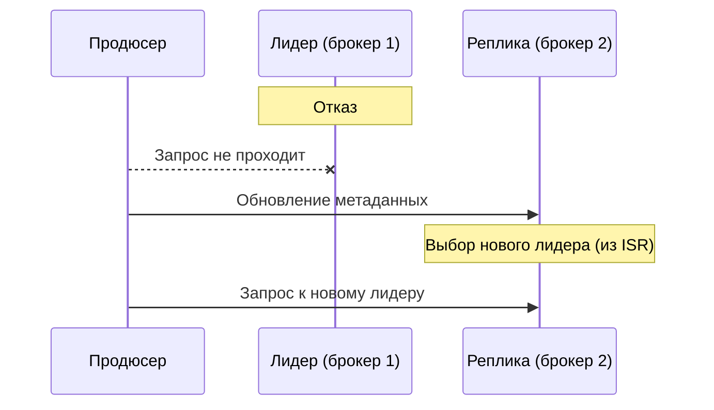

## Введение: Резервная копия, которая всегда с вами

Представьте, что у вас есть важный документ на компьютере. Вы можете хранить его на единственном жёстком диске. Но если диск сломается — документ потерян навсегда. Вы можете сделать копию на второй диск. Если первый сломается, второй останется. Вы можете сделать копию на третий диск, хранить его в другом здании. Тогда даже пожар не уничтожит документ.

В Kafka репликация делает то же самое. Каждое сообщение хранится не на одном брокере, а на нескольких. Если один брокер выходит из строя, другие продолжают работу. Данные не теряются.

**Репликация (Replication)** — это механизм, при котором одна и та же партиция хранится на нескольких брокерах. Одна копия — лидер (leader), остальные — реплики (followers). Лидер обслуживает запросы. Реплики синхронизируются с лидером и готовы заменить его в случае сбоя.

Для системного аналитика репликация — это основа отказоустойчивости и надёжности Kafka. Без репликации потеря одного брокера означает потерю всех данных на его партициях. С репликацией кластер продолжает работать, а данные остаются доступными. Понимание репликации позволяет оценить, сколько брокеров нужно в кластере, какой фактор репликации выбрать и какие гарантии надёжности вы получаете.

## Зачем нужна репликация

| Задача | Без репликации | С репликацией |
| :--- | :--- | :--- |
| **Отказ брокера** | Потеря данных, недоступность | Кластер продолжает работу |
| **Надёжность хранения** | Данные на одном диске | Данные на нескольких дисках |
| **Обслуживание** | Остановка кластера | Можно выключить брокер без остановки |
| **Балансировка нагрузки** | Чтение только с одного | Можно читать с реплик (не всегда) |

## Основные понятия

### Лидер (Leader)

Брокер, который обслуживает запросы к партиции. Все записи идут через лидера. Чтение по умолчанию тоже идёт через лидера.

**Почему нельзя писать в реплику:** Если писать в несколько копий одновременно, они могут разойтись. Порядок сообщений гарантирован только на лидере.

### Реплика (Follower / Replica)

Брокер, который хранит копию партиции и синхронизируется с лидером. Реплика читает данные от лидера и применяет их к своей копии. В случае сбоя лидера одна из реплик становится новым лидером.

### ISR (In-Sync Replicas)

Реплики, которые успевают за лидером. Только реплики из ISR могут стать лидером.

```yaml
Партиция 0:
  Лидер: брокер 1
  Реплики: брокер 2, брокер 3, брокер 4

  ISR: брокер 1, брокер 2, брокер 3
  (брокер 4 отстал, исключён)
```

## Фактор репликации (Replication Factor)

Количество копий партиции.

```yaml
replication.factor = 3
Партиция хранится на 3 брокерах:
  - лидер
  - 2 реплики
```

**Рекомендации по фактору репликации:**

| replication.factor | Надёжность | Стоимость | Когда использовать |
| :--- | :--- | :--- | :--- |
| 1 | Низкая | Низкая | Разработка, тестирование |
| 2 | Средняя | Средняя | Редко (не может быть 2 в production) |
| 3 | Высокая | Высокая | Production (стандарт) |
| 5+ | Очень высокая | Очень высокая | Критичные данные |

**Почему replication.factor должен быть нечётным:** Для работы алгоритма кворума. При чётном факторе может быть ситуация, когда голоса разделяются поровну (split-brain).

**Почему replication.factor=2 плохо:** Если один брокер упал, оставшаяся одна реплика не может обеспечить консенсус. Нужно минимум 3.

## min.insync.replicas

Минимальное количество реплик в ISR, которые должны подтвердить запись, чтобы она считалась успешной.

```yaml
replication.factor = 3
min.insync.replicas = 2

Запись считается успешной, если:
  - Лидер подтвердил
  - И хотя бы одна реплика из ISR подтвердила
  - (всего 2 из 3)
```

**Зачем это нужно:**

| min.insync.replicas | Гарантия |
| :--- | :--- |
| 1 | Запись подтверждена только лидером. Может потеряться, если лидер упал до репликации |
| 2 | Запись подтверждена лидером и минимум одной репликой. Более надёжно |
| replication.factor | Запись подтверждена всеми репликами. Максимальная надёжность, но медленнее |

**Важно:** `min.insync.replicas` не может быть больше `replication.factor`. Если `replication.factor=3`, а `min.insync.replicas=3`, то при недоступности одной реплики запись станет невозможной.

## ISR (In-Sync Replicas)

### Что такое ISR

Реплики, которые не отстают от лидера. Только они могут стать лидером.

**Условия вхождения в ISR:**

| Условие | Параметр |
| :--- | :--- |
| Не отстаёт по времени | `replica.lag.time.max.ms` (по умолчанию 10 секунд) |
| Не отстаёт по количеству сообщений | `replica.lag.max.messages` (устарел, теперь только время) |

### Как реплика выпадает из ISR

```yaml
Причины:
  - Реплика отстала по времени (не успела скопировать)
  - Сетевая проблема
  - Реплика перегружена
  - Брокер перезапустился
```

### Как реплика возвращается в ISR

Когда реплика догоняет лидера, она автоматически включается в ISR.

### ISR и гарантии записи

При `acks=all` запись считается успешной, когда все реплики из ISR подтвердили. Если ISR уменьшился, `acks=all` может означать меньшее количество реплик, чем ожидалось.

**Пример:**

```yaml
replication.factor = 3
min.insync.replicas = 2

Нормальное состояние:
  ISR = [1, 2, 3]
  Запись требует подтверждения от 2 реплик

После сбоя одного брокера:
  ISR = [1, 2]
  Запись всё ещё требует 2 реплики (теперь это все оставшиеся)
```

## Репликация и гарантии доставки

### acks (подтверждения от продюсера)

| acks | Гарантия | Риск |
| :--- | :--- | :--- |
| 0 | Сообщение отправлено. Не ждёт подтверждения | Может потеряться, даже не долетев до брокера |
| 1 | Лидер подтвердил. Не ждёт реплик | Может потеряться, если лидер упал до репликации |
| all | Все реплики в ISR подтвердили | Максимальная надъёжность, медленнее |

### Сочетание с min.insync.replicas

```yaml
replication.factor = 3
min.insync.replicas = 2
acks = all

Гарантия:
  - Сообщение не потеряется, пока хотя бы 2 брокера из 3 работают
  - Если в живых остался 1 брокер, запись станет невозможной (ошибка)
```

**Почему запись становится невозможной:** Потому что `min.insync.replicas=2`, а в живых только один брокер. Продюсер будет получать ошибку `NotEnoughReplicasException`.

## Лидер (Leader) и его роль

### Выбор лидера

Лидер выбирается при создании партиции. При сбое лидера новый лидер выбирается из ISR.

```yaml
Процесс выбора лидера:
  1. Контроллер обнаруживает, что лидер недоступен
  2. Выбирает новую реплику из ISR
  3. Обновляет метаданные
  4. Продюсеры и консьюмеры переключаются на нового лидера
```

### Предпочтение лидера (Leader Preference)

При включении брокера, у которого была копия, он не становится автоматически лидером. Нужно запустить `kafka-leader-election` или дождаться автоматической балансировки.

**Когда это важно:** После перезапуска брокера нагрузка может распределиться неравномерно. Старые лидеры могут остаться на других брокерах.

## Репликация и производительность

### Влияние на запись

| Фактор | Влияние |
| :--- | :--- |
| replication.factor | Чем выше, тем больше копий нужно записать |
| min.insync.replicas | Чем выше, тем больше подтверждений нужно ждать |
| acks | all медленнее, чем 1 |

**Задержка записи:**

```yaml
replication.factor=1, acks=1:
  - Сообщение записано на диск на одном брокере
  - Задержка: минимальная

replication.factor=3, acks=all, min.insync.replicas=2:
  - Сообщение записано на диск на лидере и минимум на одной реплике
  - Задержка: выше (ждём подтверждений)
```

### Влияние на чтение

По умолчанию чтение идёт через лидера. Можно настроить чтение с реплик (`client.rack` для сходства), но это увеличивает риск прочтения несамых свежих данных (если реплика отстала).

### Балансировка нагрузки

При `replication.factor > 1` партиции распределяются между брокерами. Каждый брокер является лидером для одних партиций и репликой для других.

```yaml
3 брокера, 6 партиций, replication.factor=3:

Брокер 1: лидер партиций 0, 3; реплика партиций 1, 2, 4, 5
Брокер 2: лидер партиций 1, 4; реплика партиций 0, 2, 3, 5
Брокер 3: лидер партиций 2, 5; реплика партиций 0, 1, 3, 4
```

## Отказ и восстановление

### Отказ лидера



### Отказ реплики

Ничего не происходит. Лидер продолжает работу. Реплика исключается из ISR. При восстановлении реплика догоняет лидера и возвращается в ISR.

### Восстановление после падения всех реплик

Если все реплики партиции недоступны, партиция становится недоступной. При восстановлении хотя бы одной реплики доступ восстанавливается.

## Preferred Leader

Лидер, который был назначен при создании партиции (обычно самый первый). После перераспределения лидер может оказаться на другом брокере.

```yaml
Создание: партиция 0, лидер брокер 1
Сбой: лидер брокер 2
Восстановление: брокер 1 вернулся, но лидер всё ещё брокер 2
```

**Инструменты:**

- Автоматическая балансировка (`auto.leader.rebalance.enable=true`)
- Ручная (`kafka-leader-election`)

## Репликация и хранение данных

### Размер данных с репликацией

```yaml
Исходные данные: 1 ТБ
replication.factor = 3
Итоговое хранение: 3 ТБ (каждая партиция хранится на 3 брокерах)
```

**Важно:** При планировании ёмкости кластера нужно учитывать фактор репликации.

### Репликация и удаление данных

При удалении сообщений (retention) удаление происходит на лидере. Реплики получают команду на удаление и также удаляют свои копии.

## ZooKeeper / KRaft и репликация

### ZooKeeper

Хранит метаданные о репликации: кто лидер, какие реплики, состав ISR. Координация выбора лидера.

### KRaft (Kafka без ZooKeeper)

Контроллеры управляют метаданными через Raft-консенсус. Информация о репликации хранится в самом кластере Kafka.

## Распространённые ошибки

### Ошибка 1: replication.factor = 1 в production

Один брокер упал — данные потеряны.

**Решение:** `replication.factor >= 3`.

### Ошибка 2: min.insync.replicas = 3 при replication.factor = 3

При недоступности одного брокера запись станет невозможной.

**Решение:** `min.insync.replicas = 2` при `replication.factor = 3`.

### Ошибка 3: acks = 0 для критичных данных

Сообщения могут теряться.

**Решение:** `acks = all` для данных, которые нельзя терять.

### Ошибка 4: Игнорирование отставания реплик

Реплика выпала из ISR, но никто не заметил. Риск потери данных при сбое лидера.

**Решение:** Мониторинг размера ISR.

### Ошибка 5: Реплики на одних и тех же дисках

Все реплики партиции на разных брокерах, но брокеры на одном физическом сервере. При отказе сервера теряются все реплики.

**Решение:** Размещать брокеров на разных физических серверах / разных зонах доступности.

## Резюме

1. **Репликация** — хранение партиции на нескольких брокерах. Лидер обслуживает запросы, реплики синхронизируются.

2. **Фактор репликации (RF)** — количество копий. В production стандарт — 3.

3. **ISR (In-Sync Replicas)** — реплики, которые не отстают от лидера. Только они могут стать лидером.

4. **min.insync.replicas** — минимальное количество подтверждений для успешной записи при `acks=all`.

5. **Выбор лидера** — из ISR. При сбое лидера контроллер выбирает новый лидер.

6. **Гарантии:** `acks=0` → данные могут теряться. `acks=1` → может потеряться при сбое лидера. `acks=all` + `min.insync.replicas=2` → данные не теряются, если хотя бы 2 брокера работают.

7. **Производительность:** Выше фактор репликации → медленнее запись. Выше `min.insync.replicas` → медленнее запись.