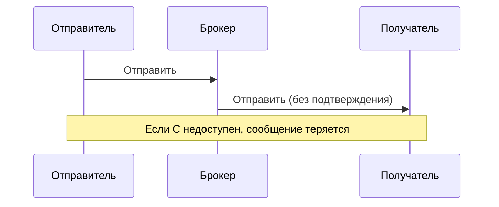
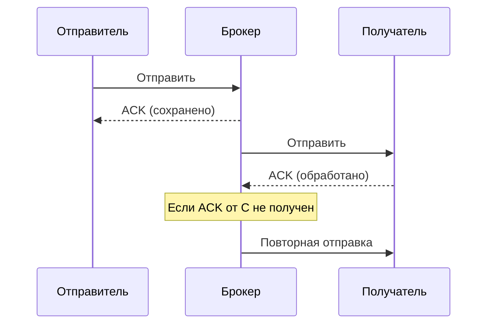
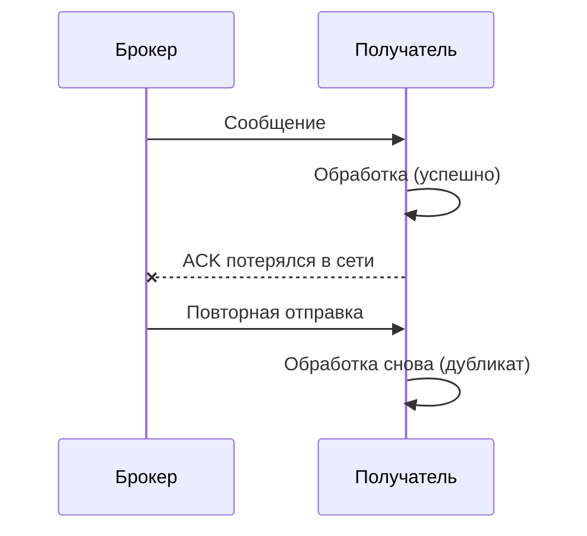
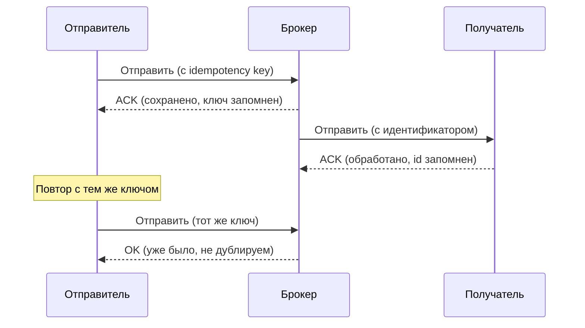

## Введение: Три обещания почтальона

Представьте, что вы отправляете ценное письмо. Почтальон может дать разные гарантии.

"Я брошу письмо в ящик, и забуду. Может, дойдёт, может, нет". Это **at-most-once** (не более одного раза).

"Я буду пытаться доставить письмо, пока не получу подтверждение. Если вы не подпишете уведомление, я приду снова. Но если вы подпишете, а я ошибся, письмо может прийти дважды". Это **at-least-once** (не менее одного раза).

"Я лично вручу письмо адресату под расписку, и буду сверять номера, чтобы исключить дубликаты. Письмо дойдёт ровно один раз". Это **exactly-once** (ровно один раз).

**Гарантии доставки (Delivery Guarantees)** — это обещания, которые брокер сообщений даёт о том, что сообщение будет доставлено. Они определяют, может ли сообщение потеряться, может ли быть доставлено дважды.

Для системного аналитика выбор гарантии доставки — это компромисс между надёжностью и производительностью. Exactly-once — самая надёжная, но самая медленная и дорогая. At-most-once — самая быстрая, но данные могут теряться.

## Три уровня гарантий

| Гарантия | Потеря данных | Дублирование | Производительность | Типичное применение |
| :--- | :--- | :--- | :--- | :--- |
| **At-most-once** | Допустима | Нет | Высокая | Логи, метрики |
| **At-least-once** | Нет | Допустимо | Средняя | Большинство сценариев |
| **Exactly-once** | Нет | Нет | Низкая | Финансы, критические данные |

## At-most-once (не более одного раза)

### Что это

Сообщение может быть доставлено ноль или один раз. Если доставка не удалась, сообщение теряется. Дубликатов не бывает.

### Как работает

Отправитель отправляет сообщение и не ждёт подтверждения. Брокер не хранит сообщение после отправки.



### Когда использовать

| Сценарий | Почему |
| :--- | :--- |
| **Логи** | Потеря одного лога не страшна |
| **Метрики** | Пропуск одного измерения не критичен |
| **Сенсорные данные** | Миллионы показаний, потеря одного не важна |
| **Высокая производительность** | Нет накладных расходов на подтверждения |

### Примеры брокеров

- Kafka (с acks=0)
- RabbitMQ (без publisher confirms)
- UDP (не брокер, но аналогично)

>  acks – это параметр, который определяет, сколько подтверждений от брокеров требуется продюсеру для того, чтобы считать сообщение успешно отправленным. Он позволяет балансировать между надёжностью доставки и производительностью.

## At-least-once (не менее одного раза)

### Что это

Сообщение будет доставлено один или более раз. Дубликаты возможны. Потери данных исключены.

### Как работает

Отправитель ждёт подтверждения от брокера. Получатель подтверждает обработку. Если подтверждение не получено, брокер повторяет доставку.



### Гарантии

| Гарантия | Значение |
| :--- | :--- |
| **Не потеряется** | Да |
| **Не продублируется** | Нет |

### Почему возникают дубликаты



### Когда использовать

| Сценарий | Почему |
| :--- | :--- |
| **Большинство сценариев** | Потеря данных недопустима |
| **Обработка заказов** | Заказ не должен потеряться |
| **Очереди задач** | Задача должна быть выполнена |
| **Уведомления** | Письмо должно быть отправлено |

### Требование к получателю

**Идемпотентность** — обработка должна быть устойчива к дубликатам.

```yaml
Обработка платежа:
  - Проверить, не обработан ли уже этот платеж (по idempotency key)
  - Если обработан — пропустить
  - Если нет — обработать
```

### Примеры брокеров

- Kafka (по умолчанию, acks=1 или all)
- RabbitMQ (с publisher confirms + consumer acks)
- AWS SQS (по умолчанию)

## Exactly-once (ровно один раз)

### Что это

Сообщение будет доставлено ровно один раз. Ни потерь, ни дубликатов.

### Как работает

Требует координации между отправителем, брокером и получателем. Используются идемпотентные продюсеры, транзакции, уникальные идентификаторы.



### Гарантии

| Гарантия | Значение |
| :--- | :--- |
| **Не потеряется** | Да |
| **Не продублируется** | Да |

### Цена exactly-once

| Цена | Объяснение |
| :--- | :--- |
| **Производительность** | Значительно ниже |
| **Сложность** | Нужна координация |
| **Совместимость** | Не все брокеры поддерживают |

### Когда использовать

| Сценарий | Почему |
| :--- | :--- |
| **Финансовые транзакции** | Деньги не должны теряться или удваиваться |
| **Инвентаризация** | Товар не должен списаться дважды |
| **Бронирование** | Место не должно продаться дважды |

### Примеры брокеров

- Kafka (с идемпотентным продюсером + транзакции)
- RabbitMQ (нет нативной поддержки)
- AWS SQS FIFO (exactly-once в рамках очереди)

## Сравнение гарантий

| Характеристика | At-most-once | At-least-once | Exactly-once |
| :--- | :--- | :--- | :--- |
| **Потеря данных** | Да | Нет | Нет |
| **Дубликаты** | Нет | Да | Нет |
| **Производительность** | Высокая | Средняя | Низкая |
| **Сложность** | Низкая | Средняя | Высокая |
| **Требования к получателю** | Минимальные | Идемпотентность | Идемпотентность + координация |

## Как гарантии реализуются в брокерах

### Kafka

| Настройка | Гарантия |
| :--- | :--- |
| `acks=0` | At-most-once |
| `acks=1` или `all` | At-least-once |
| `enable.idempotence=true` + транзакции | Exactly-once (в пределах одной партиции) |

### RabbitMQ

| Настройка | Гарантия |
| :--- | :--- |
| Без publisher confirms, без consumer acks | At-most-once |
| Publisher confirms + consumer acks | At-least-once |
| Идемпотентные потребители | Exactly-once (эмулируется) |

### AWS SQS

| Тип очереди | Гарантия |
| :--- | :--- |
| Standard | At-least-once |
| FIFO | Exactly-once (в рамках очереди) |

## Идемпотентность

### Что это

Свойство операции, при котором повторное выполнение даёт тот же результат, что и однократное.

### Как реализовать

```yaml
Получатель:
  1. Получить сообщение с idempotency_key
  2. Проверить в хранилище: ключ уже обработан?
  3. Если да → пропустить, вернуть OK
  4. Если нет → обработать, сохранить ключ
```

### Хранилище для ключей

| Вариант | Плюсы | Минусы |
| :--- | :--- | :--- |
| **База данных** | Надёжно | Медленно |
| **Redis** | Быстро | Может потерять данные |
| **Брокер (транзакции)** | Встроено | Не везде есть |

## Практические рекомендации

### Выбор гарантии

| Если | Выбирайте |
| :--- | :--- |
| Логи, метрики | At-most-once |
| Потеря данных недопустима, дубликаты можно обработать | At-least-once + идемпотентность |
| Ни потери, ни дубликаты недопустимы | Exactly-once (если поддерживается) |

### Что делать, если exactly-once не поддерживается

1. Использовать at-least-once
2. Сделать получателя идемпотентным
3. Дубликаты не страшны

### Пример: Платёжная система

| Компонент | Гарантия | Почему |
| :--- | :--- | :--- |
| Веб-сайт → брокер | At-least-once | Заказ не должен потеряться |
| Брокер → платёжный шлюз | At-least-once | Платёж не должен потеряться |
| Обработка платежа | Идемпотентность | Повтор платежа не создаст дубликат |

## Распространённые ошибки

### Ошибка 1: Exactly-once везде

Пытаются использовать exactly-once для логов.

**Решение:** At-most-once достаточно.

### Ошибка 2: At-most-once для критичных данных

Используют at-most-once для заказов. Сообщения теряются.

**Решение:** At-least-once.

### Ошибка 3: Нет идемпотентности при at-least-once

Дубликаты приводят к двойной обработке.

**Решение:** Идемпотентность.

### Ошибка 4: Exactly-once без тестирования

Думают, что exactly-once решает все проблемы, но не тестируют сценарии с падениями.

**Решение:** Нагрузочное тестирование с симуляцией сбоев.

### Ошибка 5: Путают гарантии брокера и обработки

Думают, что exactly-once от брокера означает exactly-once обработки.

**Решение:** Exactly-once от брокера гарантирует доставку, но не обработку. Обработка должна быть идемпотентной.

## Резюме

1. **Три уровня гарантий:** at-most-once (потеря возможна), at-least-once (дубликаты возможны), exactly-once (ни того, ни другого).

2. **At-most-once:** быстро, но данные могут теряться. Для логов, метрик.

3. **At-least-once:** надёжно, но возможны дубликаты. Для большинства сценариев.

4. **Exactly-once:** максимальная надёжность, но медленно и сложно. Для финансов, критических данных.

5. **Идемпотентность** — ключевое требование для at-least-once и exactly-once. Обработка должна быть устойчива к дубликатам.

6. **Компромисс:** надёжность vs производительность. Exactly-once дороже.