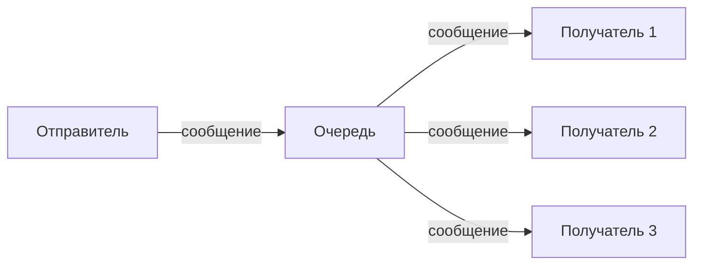
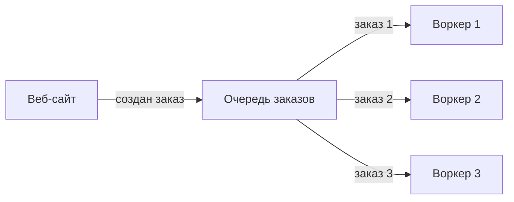
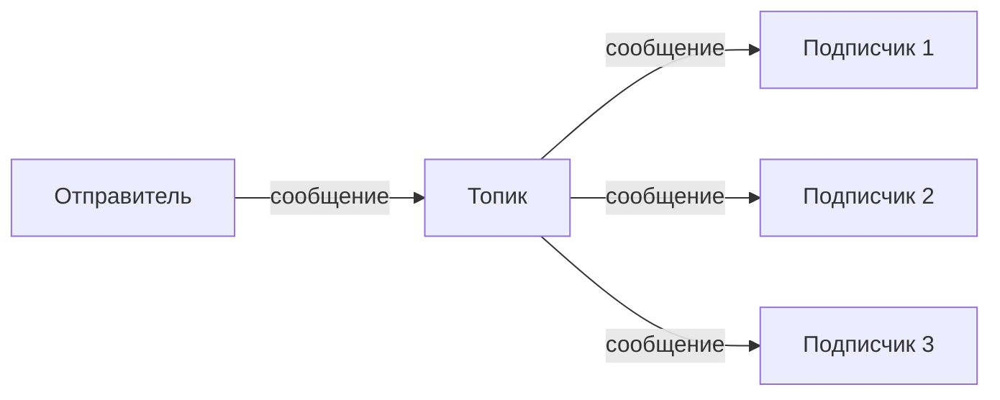
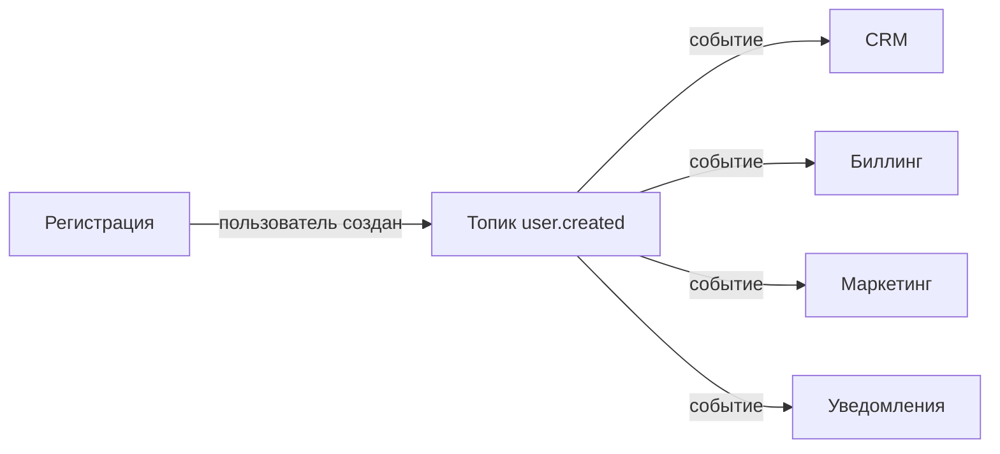
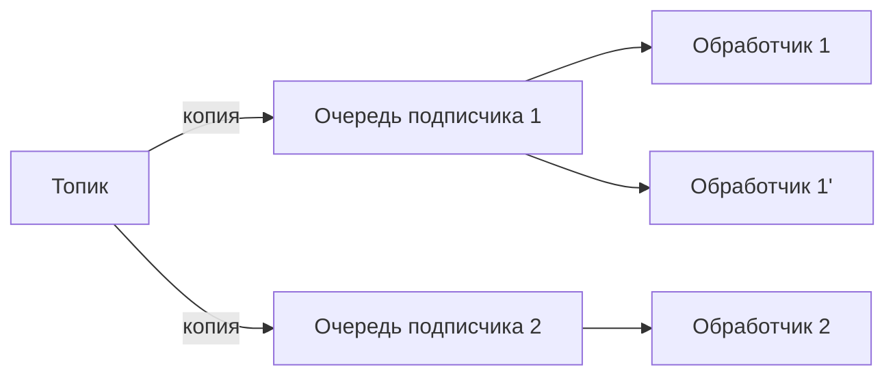
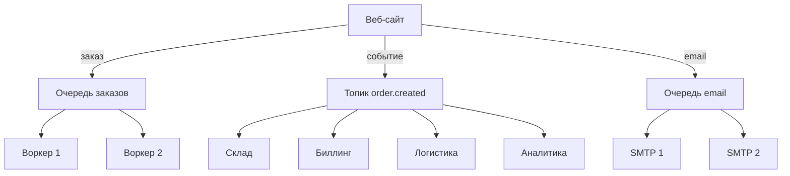

## Введение: Кому и как

Представьте, что вы отправляете посылку. Есть два принципиально разных способа. Первый: вы отправляете посылку конкретному человеку. Посылка адресована ему, и только он её получит. Второй: вы публикуете объявление в газете. Все, кто читает газету, могут его увидеть. Вы не знаете, кто именно прочитает.

В мире брокеров сообщений эти два способа называются **очередь** и **топик**.

**Модель доставки (Messaging Model)** — это способ, которым брокер определяет, кому доставлять сообщение. От этого зависит, сколько получателей получит сообщение, как они его обрабатывают, и как организована маршрутизация.

Для системного аналитика выбор модели доставки — это архитектурное решение. Очередь для задач, которые должен выполнить один обработчик. Топик для событий, о которых должны узнать все заинтересованные системы.

## Основные модели

| Модель | Кому доставляется | Сколько получателей | Типичное применение |
| :--- | :--- | :--- | :--- |
| **Очередь (Queue)** | Одному из подписчиков | 1 | Распределение задач |
| **Топик (Topic / Pub-Sub)** | Всем подписчикам | N | Оповещение о событиях |

## Очередь (Queue)

### Как работает

Отправитель кладёт сообщение в очередь. Сообщение достаётся одному из получателей. После того как получатель подтвердил обработку, сообщение удаляется из очереди.

### Особенности

| Характеристика | Значение |
| :--- | :--- |
| **Получатели** | Несколько, но каждый экземпляр получает разные сообщения |
| **Конкуренция** | Получатели соревнуются за сообщения |
| **Порядок** | Обычно FIFO (первым пришёл — первым ушёл) |
| **Балансировка нагрузки** | Автоматическая (кто свободен — тот взял) |
| **Типичный брокер** | RabbitMQ, AWS SQS, ActiveMQ |

### Пример: Обработка заказов

**Почему очередь:** Заказ должен быть обработан один раз. Не важно, каким воркером.

### Когда использовать очередь

| Сценарий | Почему |
| :--- | :--- |
| Распределение задач между воркерами | Нужно, чтобы задачу взял один |
| Балансировка нагрузки | Автоматически распределяет |
| Фоновая обработка | Каждое сообщение обрабатывается один раз |
| FIFO важна | Очередь сохраняет порядок |

## Топик (Topic / Publish-Subscribe)

### Как работает

Отправитель публикует сообщение в топик. Брокер рассылает сообщение всем подписчикам. Каждый подписчик получает копию сообщения.

### Особенности

| Характеристика | Значение |
| :--- | :--- |
| **Получатели** | Все, кто подписан |
| **Конкуренция** | Нет (все получают все сообщения) |
| **Порядок** | Может не гарантироваться (зависит от брокера) |
| **Масштабирование** | Легко добавить нового подписчика |
| **Типичный брокер** | Kafka, AWS SNS, Redis Pub/Sub |

### Пример: Событие "пользователь создан"

**Почему топик:** О событии должны узнать все системы.

### Когда использовать топик

| Сценарий | Почему |
| :--- | :--- |
| Оповещение о событиях | Многие системы должны знать |
| Событийная архитектура | Сервисы реагируют на события |
| Аудит и логирование | Все события должны быть записаны |
| Интеграция нескольких систем | Легко добавить нового подписчика |

## Очередь vs Топик

| Характеристика | Очередь | Топик |
| :--- | :--- | :--- |
| **Получателей** | Один (на сообщение) | Много |
| **Конкуренция** | Есть | Нет |
| **Балансировка нагрузки** | Автоматическая | Нет (все получают всё) |
| **Масштабирование обработки** | Добавляем воркеров в очередь | Добавляем подписчиков |
| **Типичное применение** | Задачи, фоновая обработка | События, уведомления |
| **Пример** | Очередь заказов | Топик user.created |

## Гибридные модели

### Очередь с несколькими подписчиками (не путать с топиком)

Некоторые брокеры позволяют нескольким приложениям читать из одной очереди, но каждое сообщение получает только одно приложение. Это всё ещё очередь, а не топик.

### Топик с подочередями (Subscription queues)

У каждого подписчика своя очередь. Топик рассылает копии в эти очереди.

**Пример:** AWS SNS + SQS. Топик рассылает сообщения в очереди, каждая очередь может обрабатываться несколькими воркерами.

### Канал (Channel) — более общее понятие

Некоторые брокеры (RabbitMQ) используют термин "канал" (exchange + queue). Exchange получает сообщение, queue хранит его для получателя.

## Выбор модели

### Выбираем очередь, если

| Признак | Пример |
| :--- | :--- |
| Сообщение должно быть обработано один раз | Платёж не должен списаться дважды |
| Есть несколько обработчиков для балансировки | Кто свободен — тот взял |
| Не важно, кто именно обработает | Любой воркер |
| Важен порядок обработки | FIFO очередь |

### Выбираем топик, если

| Признак | Пример |
| :--- | :--- |
| О событии должны узнать все | Все системы должны знать о новом пользователе |
| Легко добавлять новых подписчиков | Новая система просто подписывается |
| Нужен аудит | Все события логируются |
| Событийная архитектура | Сервисы реагируют на события |

### Гибрид, если

| Признак | Пример |
| :--- | :--- |
| Нужно и то, и другое | Событие → очередь → балансировка внутри команды |

## Пример в реальном проекте

**Задача:** Интернет-магазин.

| Сценарий | Модель | Почему |
| :--- | :--- | :--- |
| Обработка заказа | Очередь | Один заказ — один обработчик |
| Оповещение о новом заказе | Топик | Склад, биллинг, логистика — все должны знать |
| Отправка email | Очередь | Много email, распределяем между SMTP-серверами |
| Аудит действий пользователя | Топик | Система безопасности, аналитика, логи — все подписываются |

**Архитектура:**

## Особенности разных брокеров

| Брокер | Очередь | Топик | Особенность |
| :--- | :--- | :--- | :--- |
| **RabbitMQ** | Да (queue) | Да (exchange + queue) | Гибкая маршрутизация |
| **Kafka** | Нет (похоже на топик) | Да (topic) | Потоковая, лог-ориентированная |
| **AWS SQS** | Да | Нет | Только очередь |
| **AWS SNS** | Нет | Да | Только топик |
| **Redis** | Да (list) | Да (pub/sub) | Легковесный |

## Распространённые ошибки

### Ошибка 1: Использовать очередь для событий

Отправили событие "пользователь создан" в очередь. Только одна система получила событие. Остальные не узнали.

**Решение:** Для событий — топик.

### Ошибка 2: Использовать топик для задач

Опубликовали задачу "обработать заказ" в топик. Все обработчики взяли задачу и обработали 100 раз.

**Решение:** Для задач — очередь.

### Ошибка 3: Путать очередь и топик в AWS

AWS SQS — очередь. AWS SNS — топик. SQS + SNS — гибрид.

**Решение:** Изучить терминологию брокера.

### Ошибка 4: FIFO для топика

Требуют строгий порядок сообщений в топике. Брокер не гарантирует.

**Решение:** Использовать очередь (FIFO) или добавить порядок через partition key (Kafka).

### Ошибка 5: Топик без мониторинга

Подписчики падают, сообщения не доставляются, никто не знает.

**Решение:** Мониторинг всех подписчиков, алерты.

## Резюме

1. **Две основные модели:** очередь (одному получателю) и топик (всем подписчикам).

2. **Очередь (Queue):** сообщение достаётся одному получателю. Для задач, распределения работы, балансировки нагрузки.

3. **Топик (Topic / Pub-Sub):** сообщение доставляется всем подписчикам. Для событий, уведомлений, аудита.

4. **Ключевое различие:** сколько получателей получит одно сообщение. Один (очередь) или много (топик).

5. **Гибрид:** топик + очередь для каждого подписчика (AWS SNS+SQS).

6. **Выбор модели:** задача → очередь, событие → топик.