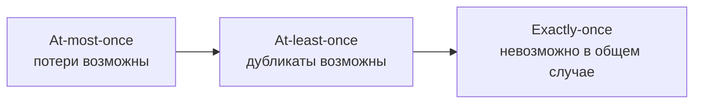
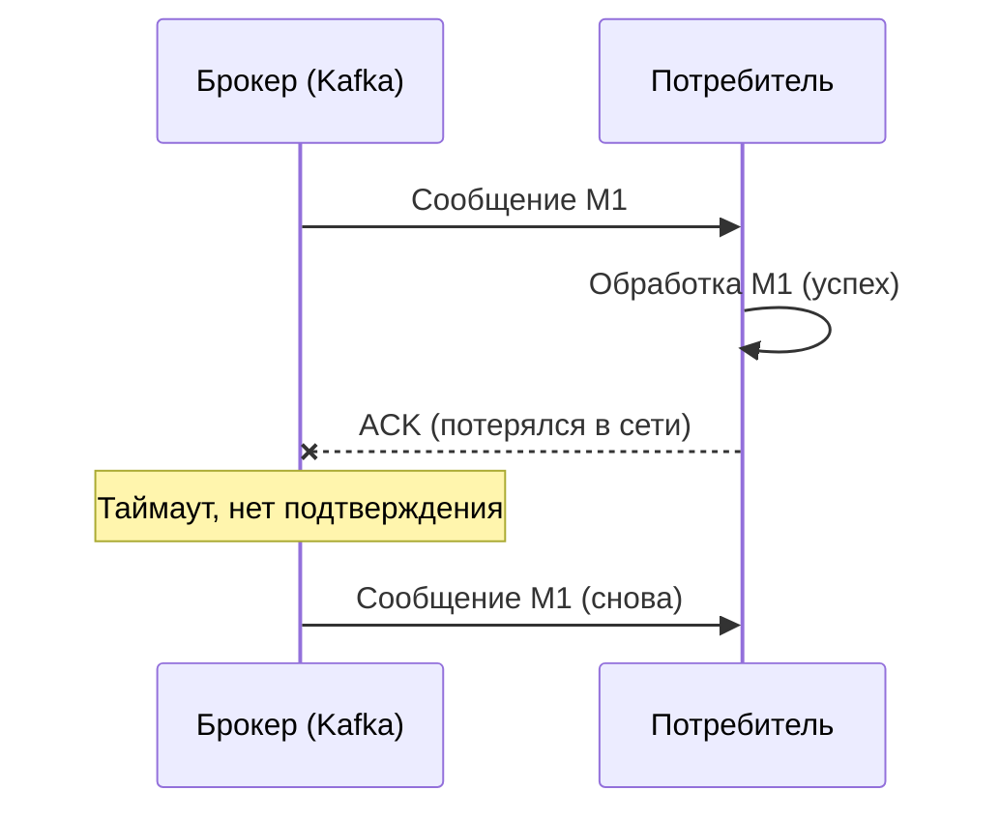
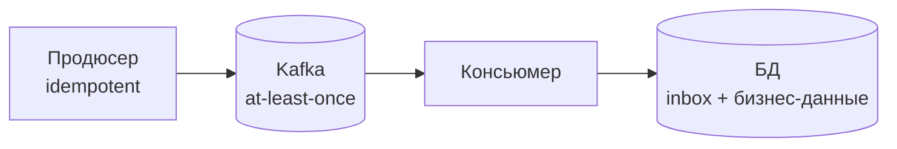

## Exactly-once как миф: почему в распределенных системах это недостижимо

В мире распределенных систем "exactly-once" (ровно один раз) — это священный грааль. Разработчики хотят, чтобы каждое сообщение было обработано один и только один раз. Ни потери, ни дублирования. Звучит как разумное требование. Почему же его так трудно достичь, и почему большинство систем даже не пытаются?

**Короткий ответ:** Exactly-once доставка в распределенной системе с отказами (сетевые сбои, падения серверов, перезапуски) невозможна в общем случае. Это следует из теоремы CAP и более практических соображений. Вместо этого промышленные системы строятся на компромиссе: **at-least-once (как минимум один раз) + идемпотентность**.

## Три гарантии доставки

Перед тем как обсуждать exactly-once, определим термины.

**At-most-once (не более одного раза).** Сообщение доставляется ноль или один раз. Если доставка не удалась, сообщение теряется. Это самая слабая гарантия, подходит для некритичных логов или метрик, где потеря нескольких сообщений не страшна.

**At-least-once (как минимум один раз).** Сообщение доставляется один или более раз. При сбоях возможны дубликаты, но потерь нет. Это стандартная гарантия в большинстве брокеров сообщений (Kafka, RabbitMQ, SQS). Подходит для критичных данных, где дубликаты лучше, чем потеря.

**Exactly-once (ровно один раз).** Сообщение доставляется один и только один раз. Ни потерь, ни дубликатов. Это то, чего хотят все, но что невозможно в общем случае.



## Почему exactly-once невозможен: проблема двух генералов

Классическая проблема распределенных систем — **проблема двух генералов**. Два генерала, осаждающие город, находятся на разных холмах. Они должны атаковать одновременно, иначе их армии будут разбиты. Генералы могут обмениваться сообщениями через курьеров, но курьер может быть перехвачен (сеть ненадежна). Генерал А отправляет сообщение "Атакуем в 9 утра". Генерал Б получает его и отправляет подтверждение. А получает подтверждение и отправляет подтверждение на подтверждение. И так до бесконечности.

В любой распределенной системе с ненадежной сетью невозможно гарантировать, что отправитель узнает о том, что получатель получил сообщение. Следовательно, отправитель не может отличить ситуацию "сообщение потеряно" от ситуации "сообщение доставлено, но ответ потерян".

**Применительно к exactly-once:** Если потребитель обработал сообщение, но его подтверждение (ACK) потерялось в сети, брокер не знает, было ли сообщение обработано. Единственный безопасный выбор — отправить сообщение снова (at-least-once). Если брокер не отправит повторно, есть риск потери. Обработчик должен быть готов к дублям.



## Что обещают брокеры сообщений: разбор маркетинга

### Kafka: exactly-once semantics (EOS)

Начиная с версии 0.11, Kafka поддерживает **exactly-once semantics** (EOS) в ограниченном смысле. Но это не exactly-once доставки от продюсера до консьюмера. Это exactly-once в операциях записи в Kafka (между продюсером и брокером) и exactly-once при потоковой обработке в Kafka Streams (между чтением из топика и записью в другой топик).

**Что дает Kafka EOS:**

- Продюсер не создаст дубликатов сообщений при повторах (идемпотентный продюсер).
- Транзакционная запись в несколько партиций атомарна (все или ничего).

**Что Kafka EOS не дает:** Гарантию, что консьюмер обработает сообщение ровно один раз. Консьюмер — это отдельная программа, которая читает из Kafka и делает что-то свое (пишет в БД, вызывает API). Kafka не контролирует эту программу.

Даже с EOS на стороне консьюмера возможны дубликаты: консьюмер обработал сообщение, записал результат в БД, но упал до того, как отправил ACK в Kafka. Kafka отправит сообщение снова.

### RabbitMQ

RabbitMQ гарантирует at-least-once при использовании publisher confirms и consumer acknowledgements. Exactly-once не обещается.

### AWS SQS

SQS (Standard) гарантирует at-least-once. Можно настроить FIFO очередь (FIFO SQS), которая гарантирует exactly-once, но с ограничениями: 3000 сообщений в секунду, строгая последовательность, высокая стоимость. FIFO SQS достигает exactly-once за счет устранения параллелизма и строгой координации, что ограничивает масштабируемость.

## Идемпотентность: практическая замена exactly-once

Поскольку exactly-once в общем случае недостижим, промышленные системы строятся на другой комбинации: **at-least-once + идемпотентность**.

**Идемпотентность** — свойство операции, при котором её повторное выполнение с теми же параметрами дает тот же результат и не создает дополнительных побочных эффектов. Идемпотентный обработчик может получить сообщение дважды, но эффект будет таким же, как от одного выполнения.

**Операции, которые легко сделать идемпотентными:**

- `DELETE /users/123` — повторное удаление не создает проблем.
- `PUT /users/123` с полными данными — повторная запись тех же данных не меняет состояние.
- Вставка в БД с проверкой на дубликат по уникальному ключу.
- Обновление счетчика через `UPDATE counter SET value = value + 1` не идемпотентно, но `SET value = 10` (абсолютное значение) — идемпотентно.

**Операции, не являющиеся идемпотентными:**

- `POST /orders` — повтор вызова создаст второй заказ.
- `POST /payments` — повтор создаст второй платеж.
- `UPDATE account SET balance = balance - 100` — повтор вычтет еще 100.

**Как сделать неидемпотентные операции идемпотентными:** добавить идемпотентный ключ (idempotency key). Клиент генерирует уникальный ключ для операции. Сервер запоминает ключ и результат. При повторном запросе с тем же ключом сервер возвращает сохраненный результат, не выполняя операцию снова.

```json
// Запрос с idempotency key
POST /orders
Idempotency-Key: 550e8400-e29b-41d4-a716-446655440000
{
  "userId": 123,
  "items": [...]
}
```

**Таким образом, at-least-once + идемпотентность дает тот же эффект, что exactly-once:** сообщение обрабатывается один раз, даже если физически было доставлено дважды.

## Практическая реализация: Kafka + idempotent consumer

Типичный надежный пайплайн:

1. **Продюсер** отправляет сообщения в Kafka с идемпотентностью (enable.idempotence=true). Kafka гарантирует, что в партиции не будет дублей от продюсера.
2. **Kafka** хранит сообщения и гарантирует at-least-once доставку консьюмеру (при сбоях возможны дубли).
3. **Консьюмер** при обработке сообщения:
   - Проверяет, не обрабатывалось ли уже сообщение с таким id (например, по таблице `inbox` в БД).
   - Если нет — выполняет бизнес-логику и записывает факт обработки (в той же транзакции).
   - Если да — пропускает.
4. **Консьюмер** отправляет ACK в Kafka после успешной обработки.



## Почему брокеры не реализуют exactly-once для потребителей

Технически можно представить протокол, который гарантирует exactly-once между брокером и потребителем. Он требует:

- Двухфазного подтверждения: потребитель должен подтвердить, что обработал сообщение и готов к следующему.
- Проверки, что потребитель не обрабатывал это сообщение раньше (хранить состояние).
- Координации при отказах потребителя: брокер должен знать, какое сообщение было последним обработанным.

**Но это невозможно в общем случае**, потому что:

- Потребитель может упасть после обработки сообщения, но до отправки confirmation. Брокер не знает, было ли сообщение обработано.
- Потребитель может обрабатывать сообщения асинхронно и в параллель. Гарантия порядка и exactly-once требует строгой последовательности и блокировок, что убивает производительность.

Поэтому современные брокеры предоставляют **at-least-once** и оставляют идемпотентность на совести приложения.

## Исключения: где exactly-once возможен (и за какую цену)

### Транзакции в рамках одной системы

Внутри одной реляционной базы данных `BEGIN; UPDATE; INSERT; COMMIT` дает exactly-once для операций внутри этой БД. Это возможно, потому что нет сети, все в рамках одного движка.

### Двухфазный коммит (2PC)

Координируемая транзакция между двумя системами (БД и брокером) теоретически возможна. Однако 2PC:

- Требует поддержки от обеих систем (редкость).
- Блокирует ресурсы на время транзакции.
- При падении координатора может зависнуть.

Используется в очень специфических сценариях, обычно в банковской сфере, но не в высоконагруженных микросервисах.

### FIFO очереди (SQS FIFO, Kafka с partition=1)

В строго последовательной очереди с одним потребителем можно гарантировать exactly-once, если потребитель сохраняет состояние (last processed message id) в атомарном хранилище. Цена — потеря параллелизма и масштабируемости. Для тысячи сообщений в секунду это ок, для миллиона — нет.

## Заключение для аналитика

При проектировании интеграций важно понимать, что exactly-once — это недостижимая абстракция в распределенных системах.

**Что нужно требовать от брокеров сообщений:** at-least-once гарантии и идемпотентность продюсера (чтобы не было дублей на уровне брокера). Этого достаточно.

**Что нужно требовать от потребителей сообщений:** идемпотентность обработки. Каждый потребитель должен уметь обрабатывать одно и то же сообщение дважды без побочных эффектов.

**Что не нужно требовать:** exactly-once от брокера или от пайплайна в целом. Технически невозможно (или очень дорого и медленно).

**Ответ на вопрос "как гарантировать exactly-once":** не пытайтесь. Стройте системы, устойчивые к дублям. Используйте идемпотентные ключи, таблицы inbox/outbox, проверку уникальности.

## Резюме

Exactly-once в распределенных системах с ненадежной сетью — миф. Это следует из проблемы двух генералов и CAP-теоремы.

**Три гарантии доставки:**

- At-most-once — потери возможны, некритичные данные.
- At-least-once — дубликаты возможны, но нет потерь. Стандарт.
- Exactly-once — недостижим в общем случае.

**Почему exactly-once невозможен:** отправитель не может отличить потерю сообщения от потери подтверждения. Единственный безопасный вариант — отправить повторно (at-least-once).

**Практическое решение:** at-least-once + идемпотентность. Идемпотентный обработчик может получить сообщение дважды, но эффект будет один.

**Идемпотентность достигается через:**

- Идемпотентные операции (DELETE, PUT с полной заменой).
- Уникальные ключи в БД (UNIQUE constraint).
- Idempotency key для неидемпотентных операций (POST, /payments).
- Таблицы inbox/outbox.

**Что обещают брокеры:**

- Kafka EOS — exactly-once внутри Kafka (между продюсером и брокером), но не для консьюмеров.
- SQS FIFO — exactly-once с потерей параллелизма и масштабируемости.

**Главное:** Требуйте идемпотентности от потребителей. Не верьте маркетингу exactly-once. At-least-once с идемпотентностью дают тот же эффект без иллюзий.