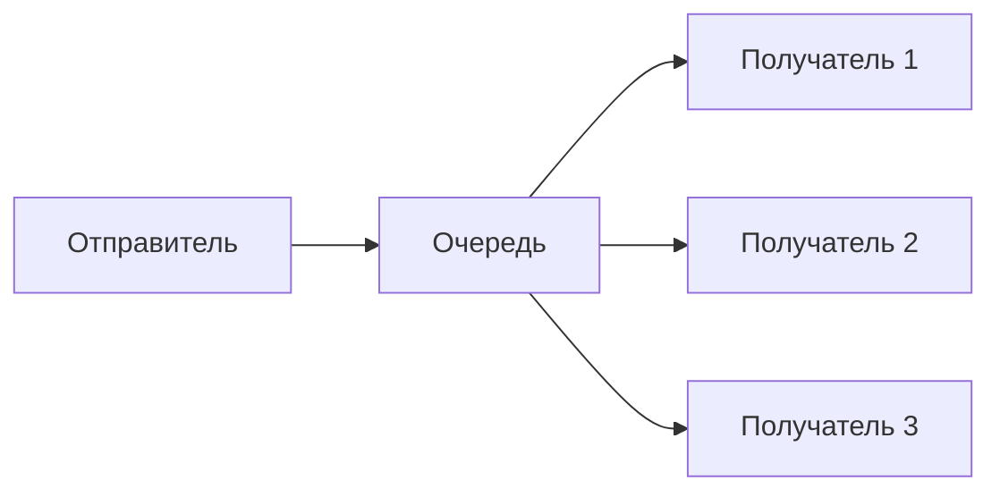
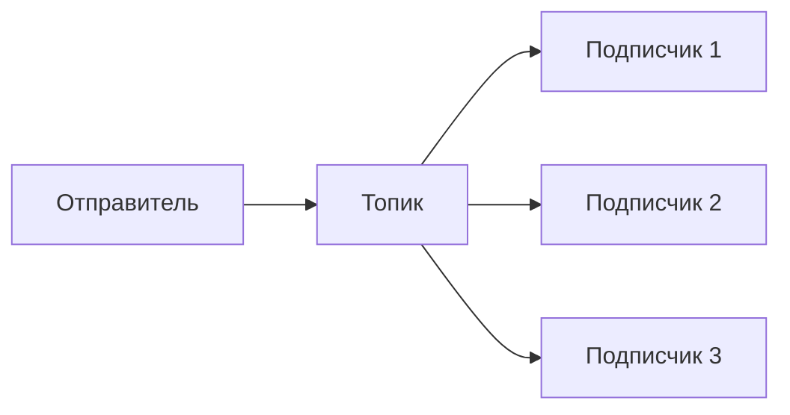
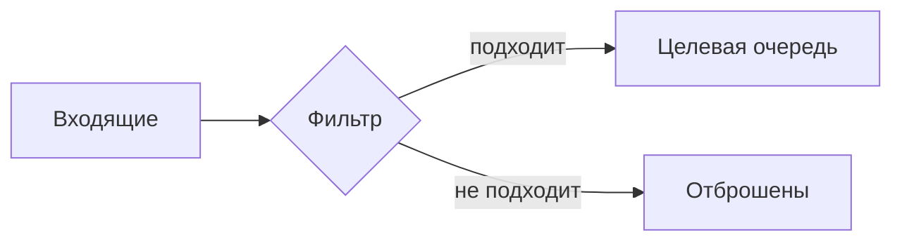
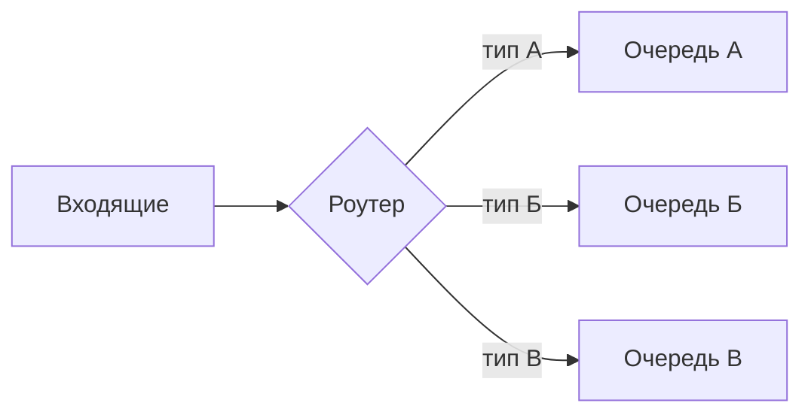
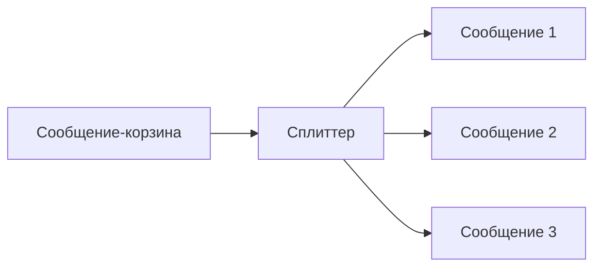
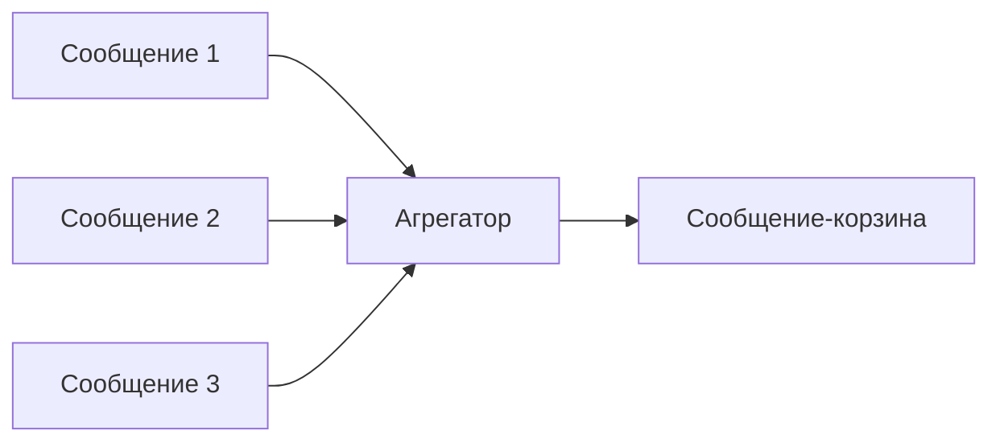
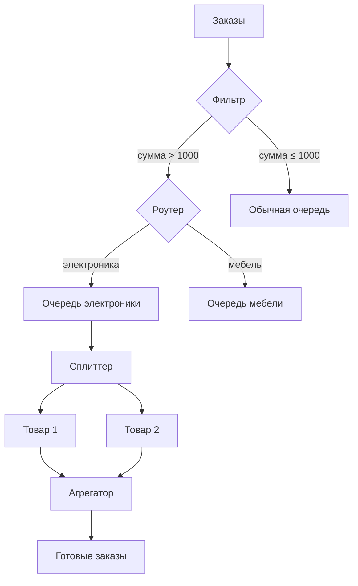

## Введение: Способы сказать "привет"

Представьте, что вы в офисе. Есть много способов передать информацию коллеге.

Можно подойти и сказать лично — это **точка-точка**. Можно крикнуть всем в комнате — это **publish-subscribe**. Можно написать на доске объявлений — это **message queue**. Можно попросить секретаря разослать письма — это **message router**.

**Паттерны обмена сообщениями (Messaging Patterns)** — это типовые способы организации обмена сообщениями между системами через брокер. Они определяют, как сообщение попадает от отправителя к получателю, сколько получателей его получат, как оно маршрутизируется.

Для системного аналитика паттерны обмена — это строительные блоки для интеграционных решений. Понимание паттернов позволяет проектировать архитектуру, которая будет надёжной, масштабируемой и понятной команде.

## Классификация паттернов

| Категория | Паттерны |
| :--- | :--- |
| **Базовые** | Message Queue, Publish-Subscribe |
| **Маршрутизация** | Message Filter, Message Router, Content-Based Router |
| **Трансформация** | Message Splitter, Message Aggregator |
| **Надёжность** | Dead Letter Channel, Idempotent Consumer |

## Базовые паттерны

### Message Queue (Очередь сообщений)

Сообщение помещается в очередь и доставляется одному получателю.



**Характеристики:**

| Свойство | Значение |
| :--- | :--- |
| Получателей на сообщение | Один |
| Конкуренция | Есть |
| Балансировка нагрузки | Автоматическая |

**Когда использовать:** Распределение задач между воркерами.

### Publish-Subscribe (Pub-Sub)

Сообщение публикуется в топик и доставляется всем подписчикам.



**Характеристики:**

| Свойство | Значение |
| :--- | :--- |
| Получателей на сообщение | Все подписчики |
| Конкуренция | Нет |
| Масштабирование | Легко добавить подписчика |

**Когда использовать:** Оповещение о событиях.

## Паттерны маршрутизации

### Message Filter (Фильтр сообщений)

Сообщения фильтруются по критериям. Неподходящие отбрасываются.



**Пример:** Только заказы на сумму > 1000 отправлять в очередь VIP-обработки.

**Когда использовать:** Нужно разделить поток на важный и неважный.

### Message Router (Маршрутизатор)

Сообщение направляется в одну из нескольких очередей на основе правил.



**Пример:** Заказы из Москвы — в очередь московского склада, из СПб — в очередь питерского.

### Content-Based Router (Маршрутизация по содержимому)

Разновидность маршрутизатора, где решение принимается на основе содержимого сообщения.

```yaml
Правила:
  - Если order.type = "electronic" → очередь электроники
  - Если order.type = "furniture" → очередь мебели
  - Если order.type = "clothing" → очередь одежды
```

## Паттерны трансформации

### Message Splitter (Разделитель)

Одно сообщение разбивается на несколько.



**Пример:** Заказ на несколько товаров → отдельное сообщение для каждого товара.

### Message Aggregator (Агрегатор)

Несколько сообщений объединяются в одно.



**Пример:** Отдельные события от датчиков → агрегированный отчёт за час.

## Паттерны надёжности

### Dead Letter Channel (Канал мёртвых писем)

Сообщения, которые не удалось обработать, отправляются в специальную очередь.


**Причины попадания в DLQ:**

| Причина | Описание |
| :--- | :--- |
| Превышено количество попыток | Получатель не смог обработать после N попыток |
| Невалидное сообщение | Сообщение нельзя обработать в принципе |
| Таймаут | Обработка заняла слишком много времени |

### Idempotent Consumer (Идемпотентный потребитель)

Обработчик, который устойчив к дубликатам сообщений.

```yaml
Алгоритм:
  1. Получить сообщение с idempotency_key
  2. Проверить в хранилище: ключ уже обработан?
  3. Если да → пропустить, вернуть OK
  4. Если нет → обработать, сохранить ключ
```

## Комбинирование паттернов

### Пример: Обработка заказов



## Паттерны и брокеры

| Брокер | Поддержка паттернов |
| :--- | :--- |
| **RabbitMQ** | Все паттерны (гибкая маршрутизация через exchanges) |
| **Kafka** | Pub-Sub, Consumer Groups (аналог очереди), но фильтрация на стороне потребителя |
| **AWS SQS** | Очередь, DLQ |
| **AWS SNS** | Pub-Sub, фильтрация (по атрибутам) |

## Выбор паттерна

| Задача | Паттерн |
| :--- | :--- |
| Распределить задачи между воркерами | Message Queue |
| Оповестить все системы о событии | Publish-Subscribe |
| Отбросить неважные сообщения | Message Filter |
| Направить сообщения в разные очереди | Message Router |
| Разбить составное сообщение на части | Message Splitter |
| Собрать части в одно сообщение | Message Aggregator |
| Обработать ошибочные сообщения | Dead Letter Channel |
| Избежать дублирования обработки | Idempotent Consumer |

## Распространённые ошибки

### Ошибка 1: Очередь для событий

Используют очередь для оповещения многих систем. Одна система получила, остальные нет.

**Решение:** Publish-Subscribe.

### Ошибка 2: Pub-Sub для задач

Публикуют задачи в топик. Все подписчики берут и обрабатывают одну задачу.

**Решение:** Message Queue.

### Ошибка 3: Нет DLQ

Сообщения-ошибки теряются или зависают в очереди.

**Решение:** Dead Letter Channel.

### Ошибка 4: Нет идемпотентности

При at-least-once дубликаты приводят к двойной обработке.

**Решение:** Idempotent Consumer.

### Ошибка 5: Слишком сложная маршрутизация

Роутер с сотней правил, который никто не может поддерживать.

**Решение:** Вынести логику в отдельный сервис.

## Резюме

1. **Паттерны обмена** — типовые способы организации обмена сообщениями через брокер.

2. **Базовые:** очередь (одному получателю), топик (всем подписчикам).

3. **Маршрутизация:** фильтр, роутер, content-based router.

4. **Трансформация:** сплиттер (разделение), агрегатор (объединение).

5. **Надёжность:** DLQ (для ошибочных сообщений), идемпотентный потребитель (защита от дубликатов).

6. **Комбинирование:** паттерны можно и нужно комбинировать.