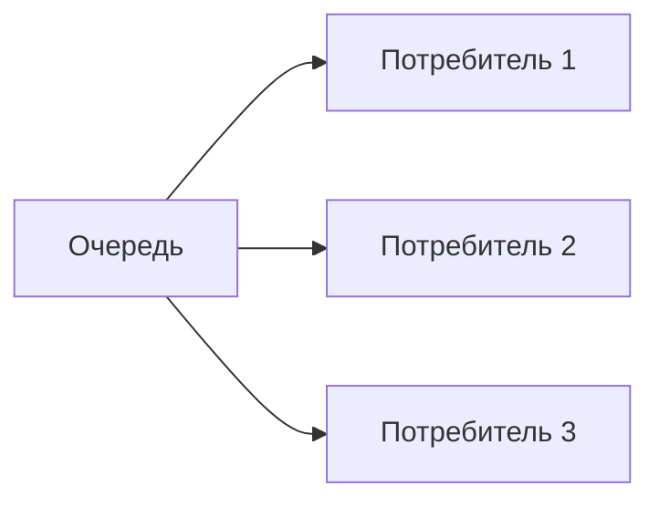

## Введение: Несколько касс в супермаркете

Представьте супермаркет в час пик. Стоит одна касса. Очередь огромная, люди ждут по полчаса. Магазин открывает вторую кассу. Теперь два кассира обслуживают покупателей из одной общей очереди. Кто освободился — тот берёт следующего. Открывают третью кассу — очередь становится ещё короче. Покупатели не привязаны к конкретному кассиру. Кассиры не закреплены за конкретными покупателями. Очередь одна, кассиров много.

**Competing Consumers (Конкурирующие потребители)** — это паттерн, при котором несколько потребителей (воркеров) читают сообщения из одной очереди. Каждое сообщение достаётся одному потребителю. Потребители конкурируют за сообщения.

Для системного аналитика этот паттерн — основной способ масштабирования обработки сообщений. Вместо того чтобы один потребитель обрабатывал всё, вы запускаете несколько экземпляров. Они автоматически распределяют нагрузку. При росте объёма сообщений вы добавляете новых потребителей. При падении нагрузки — убираете.

## Основная идея



**Ключевые принципы:**

```yaml
Одна очередь:
  - Все сообщения поступают в одну очередь
  - Нет разделения сообщений между потребителями

Много потребителей:
  - Каждый потребитель берёт следующее сообщение
  - Кто первый взял — тот и обрабатывает

Автоматическое распределение:
  - Если потребитель 1 занят, сообщение идёт потребителю 2
  - Балансировка происходит автоматически
```

## Как это работает

### Процесс

```yaml
1. Сообщение попадает в очередь
2. Потребители ждут сообщений
3. Когда сообщение доступно, один из потребителей забирает его
4. Потребитель обрабатывает сообщение
5. Подтверждает (ack) или отклоняет (reject)
6. Сообщение удаляется из очереди (или возвращается)
7. Следующее сообщение забирает следующий свободный потребитель
```

### Распределение сообщений

```yaml
Round-robin (по умолчанию):
  - Сообщение 1 → потребитель 1
  - Сообщение 2 → потребитель 2
  - Сообщение 3 → потребитель 3
  - Сообщение 4 → потребитель 1
  - Сообщение 5 → потребитель 2

Недостаток: если потребитель 1 обрабатывает медленно, он всё равно получает сообщения
```

### Fair dispatch (честное распределение)

```yaml
С prefetch (QoS):
  - Потребитель может получить не более N неподтверждённых сообщений
  - Если у потребителя уже есть N неподтверждённых, новых не дают
  - Сообщения идут более свободным потребителям

Преимущество: нет "медленного" потребителя, который накапливает очередь
```

## Зачем нужен этот паттерн

### 1. Горизонтальное масштабирование

```yaml
Проблема:
  - Один потребитель не справляется с нагрузкой
  - Сообщения накапливаются в очереди

Решение:
  - Запустить несколько экземпляров потребителя
  - Нагрузка распределяется автоматически
```

### 2. Высокая доступность

```yaml
Проблема:
  - Потребитель упал
  - Сообщения не обрабатываются

Решение:
  - Другие потребители продолжают работу
  - Сообщения упавшего потребителя возвращаются в очередь
  - Их обработают другие
```

### 3. Обработка пиковых нагрузок

```yaml
Проблема:
  - Днём заказов много, ночью мало
  - Нужно адаптироваться под нагрузку

Решение:
  - В часы пик: 10 потребителей
  - Ночью: 2 потребителя
  - Можно менять динамически
```

## Параметры конфигурации

### Prefetch (QoS)

```yaml
prefetch_count = 1:
  - Потребитель получает одно сообщение
  - Подтверждает
  - Получает следующее

prefetch_count = 10:
  - Потребитель получает 10 сообщений
  - Обрабатывает в своём темпе
  - Подтверждает по одному или пачкой

Рекомендация:
  - prefetch_count = 1 для медленных операций (БД, API)
  - prefetch_count = 10-100 для быстрых операций (логи, метрики)
```

### Подтверждения (Ack)

```yaml
auto-ack:
  - Сообщение удаляется сразу после отправки потребителю
  - Риск: при падении потребителя сообщение потеряно
  - Не рекомендуется для критичных данных

manual ack:
  - Потребитель подтверждает после успешной обработки
  - При падении сообщение возвращается в очередь
  - Рекомендуется для production
```

### Retry и Dead Letter

```yaml
При ошибке:
  - basic.reject(requeue=true) → сообщение возвращается в очередь
  - basic.reject(requeue=false) → сообщение в DLQ

Риск:
  - Бесконечные retry при requeue=true
  - Потеря данных при requeue=false

Решение:
  - Ограниченное количество попыток
  - После N попыток → в DLQ
```

## Примеры использования

### 1. Обработка заказов

```yaml
Очередь: orders.queue

Потребители:
  - 5 экземпляров приложения на Kubernetes
  - Каждый забирает следующий заказ

Масштабирование:
  - В обед: 10 экземпляров
  - Ночью: 2 экземпляра
```

### 2. Отправка email

```yaml
Очередь: email.queue

Потребители:
  - 10 воркеров, каждый отправляет email через SMTP

Балансировка:
  - Если SMTP сервер медленный, воркеры не накапливают сообщения
  - Prefetch=1, чтобы не отправлять 100 писем одновременно
```

### 3. Ресайз изображений

```yaml
Очередь: image.resize.queue

Потребители:
  - 3 воркера, каждый ресайзит изображения

Особенность:
  - Ресайз — CPU-интенсивная операция
  - Количество воркеров = количеству ядер CPU
```

## Преимущества и недостатки

### Преимущества

| Преимущество | Объяснение |
| :--- | :--- |
| **Горизонтальное масштабирование** | Добавляем потребителей → растёт пропускная способность |
| **Высокая доступность** | Падение одного потребителя не останавливает обработку |
| **Автоматическая балансировка** | Не нужно вручную распределять задачи |
| **Адаптивность** | Можно менять число потребителей под нагрузку |
| **Устойчивость к медленным потребителям** | Fair dispatch не даёт одному забить очередь |

### Недостатки

| Недостаток | Объяснение |
| :--- | :--- |
| **Порядок не гарантирован** | Сообщения могут обрабатываться не по порядку |
| **Сложность отладки** | Трудно понять, какой потребитель обработал сообщение |
| **Гонка за сообщениями** | При большом количестве потребителей снижается эффективность |
| **Перегрузка потребителя** | Без prefetch можно задавить медленного потребителя |

## Реализации

| Брокер | Поддержка | Особенности |
| :--- | :--- | :--- |
| **RabbitMQ** | Да (из коробки) | Round-robin, prefetch, manual ack |
| **Kafka** | Да (consumer group) | Каждая партиция — одному потребителю |
| **AWS SQS** | Да | Управляемый, autoscaling |
| **Redis** | Да (через BRPOP) | Простой, но без гарантий порядка при нескольких потребителях |

## RabbitMQ: Особенности

```yaml
Конфигурация:
  - queue: tasks.queue
  - prefetch_count: 5
  - manual ack: true

Потребители:
  - 10 экземпляров
  - Каждый подключается к той же очереди

Поведение:
  - Сообщения распределяются round-robin
  - Prefetch=5 ограничивает количество неподтверждённых
  - При падении потребителя его сообщения возвращаются в очередь
```

## Kafka: Особенности

```yaml
Consumer group: order-processors

Партиции: 10
Потребители: 5

Правило:
  - Каждая партиция закрепляется за одним потребителем
  - Если потребителей меньше, чем партиций, некоторые потребители читают несколько партиций
  - Если потребителей больше, чем партиций, лишние простаивают

Масштабирование:
  - Увеличить число партиций → можно увеличить число потребителей
  - Нельзя динамически изменить число партиций
```

## Когда использовать

### Хорошо подходит

```yaml
Сценарии:
  - Обработка заказов
  - Отправка email
  - Ресайз изображений
  - Любая фоновая обработка, где важна пропускная способность, а не порядок
```

### Не подходит

```yaml
Сценарии:
  - Строгий порядок обработки (например, банковские транзакции по счёту)
  - Задачи, которые нельзя обрабатывать параллельно
  - Очень маленькая нагрузка (один потребитель справляется)
```

## Распространённые ошибки

### Ошибка 1: auto-ack для критичных данных

Потребитель упал, сообщение потеряно.

**Решение:** manual ack.

### Ошибка 2: Слишком большой prefetch

prefetch=1000, потребитель упал, 1000 сообщений вернулись в очередь и обрабатываются заново.

**Решение:** prefetch по мощности потребителя.

### Ошибка 3: Бесконечный requeue

Сообщение падает, возвращается в очередь, снова падает, бесконечно.

**Решение:** DLQ после N попыток.

### Ошибка 4: Игнорирование порядка

Предполагают, что сообщения обрабатываются в порядке поступления.

**Решение:** Если порядок важен, нужна одна партиция (Kafka) или один потребитель (RabbitMQ).

### Ошибка 5: Слишком много потребителей

100 потребителей на 10 партиций Kafka. 90 простаивают.

**Решение:** Число потребителей ≤ числа партиций (Kafka).

## Практический пример

```yaml
Задача: Обработка заказов интернет-магазина

Настройка:
  - Очередь: orders.queue
  - prefetch_count: 5
  - manual ack: true
  - DLQ: orders.dlq (после 3 попыток)

Масштабирование:
  - Днём (1000 заказов/мин): 10 воркеров
  - Ночью (100 заказов/мин): 2 воркера
  - Чёрная пятница (5000 заказов/мин): 50 воркеров

Мониторинг:
  - Глубина очереди
  - Количество активных воркеров
  - Среднее время обработки
```

## Резюме

1. **Competing Consumers** — несколько потребителей читают из одной очереди. Каждое сообщение обрабатывается одним потребителем.

2. **Основная цель:** горизонтальное масштабирование, высокая доступность, автоматическая балансировка.

3. **Ключевые параметры:** prefetch (ограничение неподтверждённых), manual ack (гарантия обработки), DLQ (обработка ошибок).

4. **Когда использовать:** фоновые задачи, обработка заказов, отправка email, ресайз изображений.

5. **Когда не использовать:** когда важен строгий порядок обработки.

6. **Реализации:** RabbitMQ (round-robin + prefetch), Kafka (consumer group + партиции), AWS SQS.