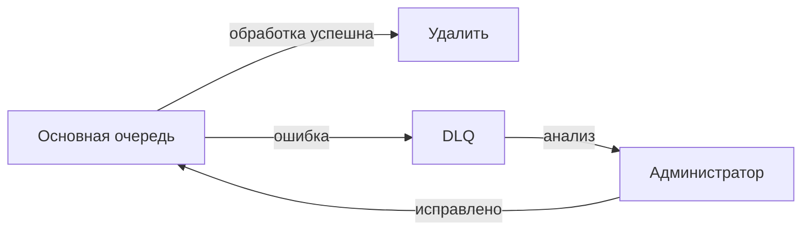
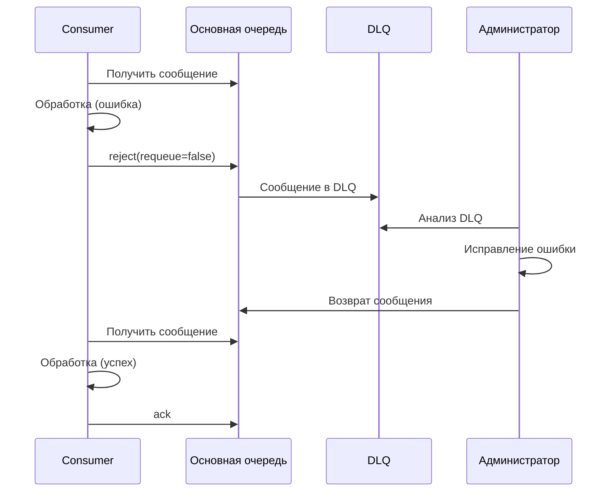

## Введение: Контейнер для безнадёжных писем

Представьте, что вы отправили письмо. Оно не может быть доставлено: адрес не существует, получатель переехал, письмо повреждено. В нормальной почтовой системе такое письмо не выбрасывают. Его отправляют в специальную папку "недоставленные письма". Раз в неделю приходит сотрудник, разбирает их, пытается исправить ошибки или возвращает отправителю.

В мире сообщений то же самое. Сообщение может не быть обработано по разным причинам: ошибка в формате, временная недоступность базы данных, ошибка в бизнес-логике. Если просто отбросить такое сообщение, данные будут потеряны.

**Dead Letter Channel (Канал мёртвых писем)** — это паттерн, при котором сообщения, которые не могут быть обработаны (после нескольких попыток), направляются в специальный канал (очередь) для дальнейшего анализа, а не теряются.

Для системного аналитика Dead Letter Channel — это инструмент для обработки ошибок, аудита и восстановления данных. Вместо того чтобы терять сообщения, вы сохраняете их в Dead Letter Queue (DLQ), анализируете, исправляете проблемы и, при необходимости, повторно обрабатываете.

## Зачем нужен Dead Letter Channel

### Проблема без DLQ

```yaml
Сообщение с ошибкой:
  - Consumer получил сообщение
  - Обработка упала
  - Consumer отклонил с requeue=false
  - Сообщение потеряно навсегда

Или:
  - Consumer отклонил с requeue=true
  - Сообщение вернулось в очередь
  - Снова упало
  - Бесконечный цикл
```

### Решение с DLQ

```yaml
Сообщение с ошибкой:
  - Consumer получил сообщение
  - Обработка упала
  - Consumer отклонил с requeue=false
  - Сообщение направляется в DLQ
  - Сообщение сохранено для анализа
```

## Как это работает



### Процесс

```yaml
1. Сообщение поступает в основную очередь
2. Consumer забирает сообщение
3. Попытка обработки
4. Если успех → ack → сообщение удалено
5. Если ошибка → reject(requeue=false) → сообщение идёт в DLQ
6. Администратор анализирует DLQ
7. Исправляет причину (ошибка в данных, баг)
8. Возвращает сообщение в основную очередь
9. Повторная обработка
```

## Когда сообщение попадает в DLQ

### В RabbitMQ

```yaml
Причины:
  - Consumer вызвал basic.reject(requeue=false)
  - Consumer вызвал basic.nack(requeue=false)
  - Истёк TTL сообщения (x-message-ttl)
  - Очередь переполнена (x-max-length)
  - Истёк срок жизни очереди (x-expires)
```

### В AWS SQS

```yaml
Причины:
  - Превышено количество попыток получения (maxReceiveCount)
  - Сообщение не было обработано за время видимости (visibility timeout)

Настройка:
  - Redrive policy: maxReceiveCount=3, deadLetterTargetArn=...
```

### В Kafka

```yaml
Kafka не имеет встроенной DLQ:
  - Реализуется на стороне потребителя
  - При ошибке отправить сообщение в отдельный топик (error-topic)
```

## Настройка DLQ

### RabbitMQ

```yaml
Основная очередь:
  - Имя: main.queue
  - x-dead-letter-exchange: dlx.exchange
  - x-dead-letter-routing-key: failed

DLX (обменник):
  - Имя: dlx.exchange
  - Тип: direct

DLQ (очередь):
  - Имя: dlq.queue
  - Привязана к dlx.exchange с routing_key "failed"

Результат:
  - Сообщения, попавшие в DLQ, сохраняются
  - Не теряются
```

### AWS SQS

```yaml
Основная очередь:
  - Имя: main-queue
  - Redrive policy:
      deadLetterTargetArn: arn:aws:sqs:...:dlq-queue
      maxReceiveCount: 3

DLQ:
  - Имя: dlq-queue
```

## Жизненный цикл сообщения в DLQ



## Мониторинг DLQ

### Что мониторить

```yaml
Метрики:
  - Глубина DLQ (количество сообщений)
  - Скорость поступления в DLQ (сообщений/сек)
  - Возраст самого старого сообщения в DLQ

Алерты:
  - Глубина DLQ > 1000
  - Сообщение в DLQ старше 1 часа
  - Скорость поступления в DLQ > 10/мин
```

### Инструменты

```yaml
RabbitMQ Management UI:
  - Вкладка Queues
  - Видно количество сообщений в DLQ

Prometheus:
  - rabbitmq_queue_messages (для DLQ)
  - rabbitmq_queue_messages_ready

CloudWatch (AWS SQS):
  - ApproximateNumberOfMessagesVisible (для DLQ)
  - ApproximateNumberOfMessagesNotVisible
```

## Обработка DLQ

### Автоматическая

```yaml
Потребитель DLQ:
  - Читает сообщения из DLQ
  - Анализирует причину (по заголовкам)
  - Если можно исправить автоматически — исправляет и отправляет обратно
  - Если нельзя — отправляет в отдельную очередь для ручной обработки
```

### Ручная (административная)

```yaml
Администратор:
  - Смотрит сообщения в DLQ (через Management UI)
  - Анализирует проблему
  - Исправляет данные (если нужно)
  - Пересылает в основную очередь
```

### Комбинированная

```yaml
Автоматические попытки:
  - Первая ошибка → DLQ → автоматический анализ → повтор
  - Вторая ошибка → DLQ → уведомление администратора
```

## Информация в сообщении DLQ

### RabbitMQ

```yaml
Заголовки в DLQ:
  x-death:
    - count: 1                # сколько раз умерло
      reason: rejected        # причина
      queue: main.queue       # исходная очередь
      time: 2024-01-15T10:30:00Z
      exchange: main.exchange
      routing-keys: ["user.created"]
  x-first-death-reason: rejected
  x-first-death-queue: main.queue
```

### AWS SQS

```yaml
Атрибуты:
  - ApproximateReceiveCount: количество попыток
  - SentTimestamp: время отправки
  - ApproximateFirstReceiveTimestamp: время первого получения
```

## Стратегии работы с DLQ

### Retry с ограничением

```yaml
Попытки:
  - 1-я попытка: обработка
  - 2-я попытка: обработка
  - 3-я попытка: обработка
  - 4-я попытка: DLQ

Почему:
  - Даём системе шанс восстановиться
  - Не зацикливаемся бесконечно
```

### Exponential backoff

```yaml
Задержки между попытками:
  - 1-я ошибка: повтор через 1 секунду
  - 2-я ошибка: повтор через 2 секунды
  - 3-я ошибка: повтор через 4 секунды
  - 4-я ошибка: повтор через 8 секунд
  - 5-я ошибка: DLQ
```

### С разделением по типам ошибок

```yaml
Типы ошибок:
  - Валидация (неправильный формат) → DLQ без повторов
  - Временная ошибка (БД недоступна) → повторы
  - Бизнес-ошибка (товара нет на складе) → DLQ
```

## Преимущества и недостатки

### Преимущества

| Преимущество | Объяснение |
| :--- | :--- |
| **Нет потери данных** | Сообщения сохраняются для анализа |
| **Аудит ошибок** | Можно анализировать, почему сообщения не обработаны |
| **Восстановление** | Можно исправить ошибку и повторить обработку |
| **Отладка** | Легко воспроизвести проблему |
| **Защита от бесконечных циклов** | Ограниченное количество попыток |

### Недостатки

| Недостаток | Объяснение |
| :--- | :--- |
| **Дополнительная сложность** | Нужно настраивать DLQ |
| **Ручное вмешательство** | Часто требует администратора |
| **Задержка обработки** | Сообщения ждут в DLQ |
| **Риск накопления** | DLQ может переполниться |

## Распространённые ошибки

### Ошибка 1: Нет DLQ

Сообщения с ошибками теряются. Невозможно понять, что пошло не так.

**Решение:** Всегда настраивать DLQ для критичных очередей.

### Ошибка 2: Бесконечный retry

Сообщение падает, возвращается в очередь, снова падает, бесконечно.

**Решение:** DLQ после N попыток.

### Ошибка 3: DLQ без мониторинга

DLQ растёт, никто не знает. Сообщения накапливаются.

**Решение:** Мониторинг глубины DLQ, алерты.

### Ошибка 4: Потеря информации о причине

В DLQ не сохраняется информация, почему сообщение умерло.

**Решение:** Использовать заголовки x-death (RabbitMQ) или логировать причины.

### Ошибка 5: DLQ на том же брокере

При отказе брокера DLQ тоже теряется.

**Решение:** Репликация или отдельный кластер для DLQ.

## Практический пример

```yaml
Настройка:
  - Main queue: user.events.queue
    x-dead-letter-exchange: dlx.user
    x-dead-letter-routing-key: failed
    x-message-ttl: 60000 (сообщение живёт 60 секунд)

  - DLX: dlx.user (topic exchange)

  - DLQ: user.events.dlq
    binding: dlx.user → user.events.dlq, routing_key: failed
    x-message-ttl: 86400000 (хранить 24 часа)

Сценарии попадания в DLQ:
  1. Consumer отклонил (reject) → DLQ
  2. Истёк TTL (60 сек) → DLQ
  3. Ошибка в обработке после 3 попыток → reject → DLQ

Обработка DLQ:
  - Администратор проверяет DLQ каждое утро
  - Исправляет ошибки
  - Возвращает сообщения в основную очередь
```

## Резюме

1. **Dead Letter Channel (DLQ)** — канал для сообщений, которые не могут быть обработаны. Сообщения сохраняются для анализа, а не теряются.

2. **Причины попадания в DLQ:** reject, истечение TTL, переполнение очереди, превышение количества попыток.

3. **Ключевые компоненты:** основная очередь → DLX (обменник) → DLQ.

4. **Мониторинг:** глубина DLQ, скорость поступления, возраст сообщений. Алерты при росте.

5. **Обработка:** автоматическая, ручная (административная), комбинированная.

6. **Преимущества:** нет потери данных, аудит, восстановление, отладка.

7. **Недостатки:** сложность, ручное вмешательство, задержка.