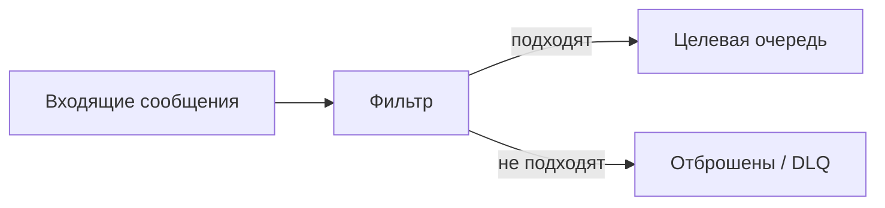
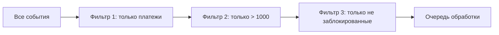

## Введение: Сито для сообщений

Представьте, что вы получаете сотни писем каждый день. Большинство — спам, рассылки, уведомления. Вам нужны только письма от начальника и счета от поставщиков. Вы можете настроить фильтр в почтовой программе: письма от начальника — в папку "Важное", счета — в папку "Финансы", остальное — в "Спам". Фильтр пропускает только то, что вам нужно.

В мире сообщений та же проблема. В топик публикуются тысячи сообщений. Но конкретному потребителю нужны только некоторые из них. Фильтр отсеивает ненужные сообщения до того, как они попадут к потребителю.

**Message Filter (Фильтр сообщений)** — это паттерн, который отсеивает сообщения, не соответствующие определённым критериям. Сообщения, прошедшие фильтр, отправляются дальше. Непрошедшие — отбрасываются (или направляются в другой канал).

Для системного аналитика фильтр — это способ уменьшить нагрузку на потребителей. Вместо того чтобы каждый потребитель получал все сообщения и фильтровал их сам, фильтрация происходит на стороне брокера. Это экономит ресурсы и упрощает логику потребителей.

## Зачем нужен фильтр

### Проблема без фильтра

```yaml
Топик: events (1000 сообщений/сек)

Подписчики:
  - CRM (нужны все сообщения)
  - Биллинг (нужны только платежи, 100 сообщений/сек)
  - Маркетинг (нужны только регистрации, 50 сообщений/сек)

Без фильтра:
  - Все подписчики получают 1000 сообщений/сек
  - Биллинг и маркетинг отбрасывают 90-95% сообщений
  - Трата ресурсов на передачу и обработку
```

### Решение с фильтром

```yaml
Фильтр на стороне брокера:
  - CRM: все сообщения (1000/сек)
  - Биллинг: только платежи (100/сек)
  - Маркетинг: только регистрации (50/сек)

Экономия:
  - Меньше сетевого трафика
  - Меньше нагрузки на потребителей
  - Потребители могут быть проще
```

## Как это работает



### Процесс

```yaml
1. Сообщение поступает на вход фильтра
2. Фильтр проверяет сообщение по критериям
3. Если сообщение подходит → передаётся дальше
4. Если не подходит → отбрасывается (или в DLQ)
```

### Где находится фильтр

```yaml
Вариант 1: На стороне брокера
  - Фильтрация до доставки потребителю
  - Потребитель получает только нужные сообщения
  - Пример: RabbitMQ topic exchange, AWS SNS filtering

Вариант 2: На стороне потребителя
  - Потребитель получает все сообщения
  - Фильтрует сам
  - Проще, но неэффективно
```

## Типы фильтров

### По содержимому (Content-based)

Фильтрация на основе данных в теле сообщения.

```yaml
Критерии:
  - event.type == "order.created"
  - order.amount > 1000
  - user.status == "vip"
```

### По заголовкам (Header-based)

Фильтрация на основе метаданных сообщения.

```yaml
Критерии:
  - x-priority == "high"
  - x-source == "mobile"
  - x-region == "eu"
```

### По routing key (в RabbitMQ)

Фильтрация на основе routing key.

```yaml
Routing key: user.created
Bindings:
  - *.created → получает user.created, order.created
  - user.* → получает user.created, user.updated, user.deleted
  - # → получает всё
```

### По атрибутам (в AWS SNS)

Фильтрация по атрибутам сообщения.

```yaml
Атрибуты:
  - event_type: "order.created"
  - priority: "high"

Фильтр:
  - event_type = "order.created" AND priority = "high"
```

## Реализации в брокерах

### RabbitMQ (Topic Exchange)

```yaml
Exchange: events.topic (type: topic)

Bindings:
  - Queue: all, routing_key: #
  - Queue: crm, routing_key: user.*, order.*
  - Queue: billing, routing_key: order.paid, order.refunded
  - Queue: marketing, routing_key: user.created, user.updated

Сообщение с routing_key="user.created":
  - Идёт в all, crm, marketing

Сообщение с routing_key="order.paid":
  - Идёт в all, crm, billing
```

### AWS SNS (Message Filtering)

```yaml
Топик: user_events

Подписки:
  - CRM: фильтр (event_type = "user.created" OR event_type = "user.updated")
  - Биллинг: фильтр (event_type = "user.created")
  - Маркетинг: фильтр (event_type = "user.created" AND user.consent = true)

Сообщение:
  {
    "event_type": "user.created",
    "user": {"id": 123, "consent": true}
  }

Результат:
  - CRM: да
  - Биллинг: да
  - Маркетинг: да (consent=true)
```

### Kafka (Consumer-side filtering)

```yaml
Топик: events (10 партиций)

Потребитель:
  - Читает все сообщения
  - Фильтрует в коде

Недостаток:
  - Все сообщения передаются потребителю
  - Трата трафика и CPU на фильтрацию
```

## Фильтр vs Маршрутизатор

| Характеристика | Фильтр | Маршрутизатор |
| :--- | :--- | :--- |
| **Что делает** | Отбрасывает неподходящие | Направляет в разные очереди |
| **Количество выходов** | Один (или ноль) | Несколько |
| **Неподходящие сообщения** | Отбрасываются | Идут в другую очередь |
| **Пример** | Только платежи > 1000 | Платежи → в очередь А, возвраты → в очередь Б |

## Фильтр в цепочке обработки



**Преимущество:** Уменьшаем поток на каждом этапе.

## Преимущества и недостатки

### Преимущества

| Преимущество | Объяснение |
| :--- | :--- |
| **Экономия ресурсов** | Потребители получают только нужные сообщения |
| **Упрощение потребителей** | Не нужно реализовывать фильтрацию в коде |
| **Меньше трафика** | По сети передаются только нужные сообщения |
| **Централизация логики** | Правила фильтрации в одном месте |

### Недостатки

| Недостаток | Объяснение |
| :--- | :--- |
| **Дополнительная сложность** | Нужно настраивать фильтры |
| **Ограниченные возможности** | Не все брокеры поддерживают сложную фильтрацию |
| **Потеря сообщений** | Отброшенные сообщения теряются (если нет DLQ) |
| **Производительность** | Фильтрация на брокере требует ресурсов |

## Когда использовать фильтр

### Хорошо подходит

```yaml
Сценарии:
  - Поток большой, нужны только некоторые сообщения
  - Потребителей много, каждый хочет свою подвыборку
  - Правила фильтрации простые (по типу, по атрибуту)
  - Сообщения можно отбрасывать без последствий
```

### Плохо подходит

```yaml
Сценарии:
  - Отброшенные сообщения нельзя терять (нужна DLQ)
  - Сложная фильтрация (SQL-подобные запросы)
  - Правила фильтрации часто меняются
  - Брокер не поддерживает нужные типы фильтров
```

## Фильтр и Dead Letter Queue

```yaml
Что делать с отброшенными сообщениями?

Вариант 1: Просто отбросить
  - Хорошо: для неважных сообщений
  - Плохо: для критичных

Вариант 2: Направить в DLQ
  - Сообщения сохраняются для анализа
  - Можно восстановить позже

Вариант 3: Направить в другую очередь
  - Например, в очередь для ручной обработки
```

## Практический пример

```yaml
Задача: Система аналитики

Исходный поток:
  - Все действия пользователей: клики, просмотры, покупки (10 000/сек)

Аналитикам нужны:
  - Маркетологам: только регистрации (100/сек)
  - Финансистам: только покупки (500/сек)
  - Продуктологам: все действия (10 000/сек)

Решение:
  - Маркетологи подписываются на топик с фильтром по типу "registration"
  - Финансисты подписываются с фильтром по типу "purchase"
  - Продуктологи подписываются без фильтра

Результат:
  - Маркетологи получают 100/сек вместо 10 000/сек
  - Экономия ресурсов: 100 раз
```

## Распространённые ошибки

### Ошибка 1: Фильтр на стороне потребителя

Каждый потребитель получает все сообщения и фильтрует сам.

**Решение:** Фильтровать на стороне брокера.

### Ошибка 2: Потеря отброшенных сообщений

Отброшенные сообщения теряются без следа. Невозможно понять, почему.

**Решение:** Направить отброшенные в DLQ для анализа.

### Ошибка 3: Слишком сложная фильтрация

Пытаются фильтровать по сложным правилам (JOIN, агрегации).

**Решение:** Простые фильтры на брокере, сложные — в потребителе.

### Ошибка 4: Фильтр после маршрутизации

Сначала маршрутизируют, потом фильтруют. Маршрутизатор уже разослал сообщения, фильтр бесполезен.

**Решение:** Фильтр до маршрутизатора.

### Ошибка 5: Игнорирование производительности

Фильтр на брокере замедляет доставку всех сообщений.

**Решение:** Измерять производительность. При необходимости — выносить фильтрацию в отдельный сервис.

## Резюме

1. **Message Filter** — паттерн, отсеивающий сообщения, не соответствующие критериям. Пропускает только нужные.

2. **Типы фильтров:** по содержимому, по заголовкам, по routing key, по атрибутам.

3. **Реализации:** RabbitMQ (topic exchange), AWS SNS (message filtering), Kafka (на стороне потребителя).

4. **Преимущества:** экономия ресурсов, упрощение потребителей, меньше трафика.

5. **Недостатки:** сложность, ограниченные возможности, риск потери сообщений.

6. **Что делать с отброшенными:** отбросить (если неважно), DLQ (если нужно анализировать), другая очередь (если нужна ручная обработка).