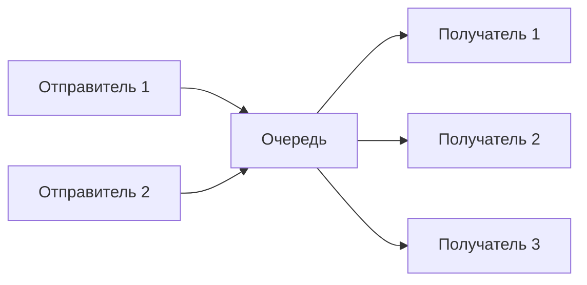
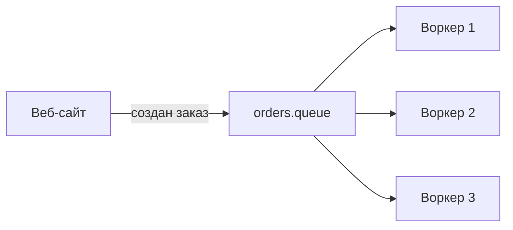

## Введение: Живая очередь в банке

Представьте, что вы пришли в банк. Стоят несколько касс. Вы подходите к свободной кассе — вас обслуживают. Если все кассы заняты, вы встаёте в общую очередь. Когда касса освобождается, подходит следующий клиент. Клиенты не знают, к какой кассе пойдут. Кассиры не знают, кто следующий. Очередь управляет всем процессом.

В мире программ очередь сообщений работает так же. Программы-отправители кладут сообщения в очередь. Программы-получатели забирают сообщения из очереди. Каждое сообщение достаётся одному получателю. Если получателей несколько, они делят сообщения между собой.

**Message Queue (Очередь сообщений)** — это паттерн интеграции, при котором сообщение доставляется ровно одному получателю. Очередь выступает буфером между отправителем и получателем, позволяя им работать независимо и в разном темпе.

Это самый простой и самый распространённый паттерн обмена сообщениями. Он лежит в основе многих систем: от обработки заказов до фоновых задач. Для системного аналитика понимание очереди сообщений — это база для проектирования асинхронных и слабосвязанных систем.

## Ключевые принципы

### Разделение отправителя и получателя

```yaml
Отправитель:
  - Не знает IP получателя
  - Не знает, сколько получателей
  - Не знает, доступен ли получатель

Получатель:
  - Не знает, кто отправил
  - Не знает, сколько отправителей
```

### Буферизация

```yaml
Если получатель временно недоступен:
  - Сообщения накапливаются в очереди
  - При восстановлении получатель обрабатывает накопленные сообщения
```

### Балансировка нагрузки

```yaml
Несколько получателей:
  - Каждое сообщение достаётся одному получателю
  - Распределение: round-robin или по готовности
```

### FIFO (First In, First Out)

```yaml
Порядок:
  - Сообщения обрабатываются в порядке поступления
  - Первым пришёл — первым ушёл
```

## Как это работает



### Шаг 1: Отправка

Отправитель создаёт сообщение и отправляет его в очередь. Не ждёт ответа (асинхронно). Может продолжить свою работу.

### Шаг 2: Хранение

Очередь хранит сообщение до тех пор, пока получатель не заберёт его и не подтвердит обработку. Сообщение может храниться в памяти или на диске.

### Шаг 3: Получение

Получатель забирает сообщение из очереди. Если получателей несколько, сообщение достаётся одному. Получатель обрабатывает сообщение. После успешной обработки подтверждает (ack). Очередь удаляет сообщение.

### Шаг 4: Повтор при ошибке

```yaml
Сценарий:
  1. Получатель забрал сообщение
  2. Обработка упала
  3. Подтверждение не пришло
  4. Сообщение возвращается в очередь
  5. Другой получатель обработает
```

## Свойства очереди

### Point-to-Point (Точка-точка)

Одно сообщение — один получатель. Это главное свойство очереди.

```yaml
Отличие от Pub-Sub:
  - Pub-Sub: сообщение получают все подписчики
  - Message Queue: сообщение получает один получатель
```

### Асинхронность

Отправитель не ждёт ответа. Получатель может обрабатывать сообщение в удобное время.

### Надёжность

Сообщения не теряются (при настройке persistent и подтверждениях). Хранятся на диске до обработки.

### Балансировка нагрузки

Несколько получателей автоматически распределяют сообщения между собой.

## Режимы работы

### Автоматическое подтверждение (auto-ack)

```yaml
Алгоритм:
  1. Получатель забрал сообщение
  2. Брокер сразу удаляет сообщение из очереди
  3. Получатель обрабатывает

Риск:
  - Если обработка упала — сообщение потеряно
```

### Ручное подтверждение (manual ack)

```yaml
Алгоритм:
  1. Получатель забрал сообщение
  2. Обрабатывает
  3. После успеха — подтверждает (ack)
  4. Брокер удаляет сообщение

Плюс:
  - Сообщение не потеряется при падении

Минус:
  - Сложнее реализовать
```

### Распределение сообщений

```yaml
Round-robin (по умолчанию):
  - Сообщение 1 → получатель 1
  - Сообщение 2 → получатель 2
  - Сообщение 3 → получатель 1
  - Сообщение 4 → получатель 2

Fair dispatch (с prefetch):
  - Учитывает готовность получателя
  - Не даёт новое сообщение, пока предыдущее не подтверждено
```

## Где используется

### 1. Обработка заказов в интернет-магазине

```yaml
Отправитель:
  - Веб-сайт (пришёл новый заказ)

Очередь:
  - orders.queue

Получатели:
  - 5 воркеров, обрабатывающих заказы

Почему очередь:
  - Заказ должен быть обработан один раз
  - Воркеров можно добавлять при росте нагрузки
  - Если все воркеры заняты — заказы ждут в очереди
```

### 2. Отправка email

```yaml
Отправитель:
  - Сервис регистрации (нужно отправить письмо)

Очередь:
  - email.queue

Получатели:
  - 10 SMTP-воркеров

Почему очередь:
  - SMTP-сервер может быть медленным
  - Очередь сглаживает пики
  - При ошибке письмо можно отправить повторно
```

### 3. Ресайз изображений

```yaml
Отправитель:
  - Пользователь загрузил изображение

Очередь:
  - image.resize.queue

Получатели:
  - Воркеры для ресайза

Почему очередь:
  - Ресайз может занимать секунды
  - Пользователь не должен ждать
```

### 4. Асинхронная обработка данных

```yaml
Отправитель:
  - API, принявший данные

Очередь:
  - data.processing.queue

Получатели:
  - Аналитический движок

Почему очередь:
  - Обработка может быть долгой
  - API должен ответить быстро
```

## Преимущества и недостатки

### Преимущества

| Преимущество | Объяснение |
| :--- | :--- |
| **Слабая связанность** | Отправитель и получатель не знают друг о друге |
| **Асинхронность** | Отправитель не ждёт обработки |
| **Буферизация** | Сообщения накапливаются при перегрузке получателя |
| **Балансировка нагрузки** | Автоматическое распределение между воркерами |
| **Надёжность** | Сообщения не теряются (с подтверждениями) |
| **Масштабирование** | Легко добавить новых получателей |

### Недостатки

| Недостаток | Объяснение |
| :--- | :--- |
| **Нет ответа** | Отправитель не знает результат обработки |
| **Нет истории** | Сообщение удаляется после обработки |
| **Задержка** | Сообщение может ждать в очереди |
| **Сложность отладки** | Трудно отследить путь сообщения |

## Реализации

| Брокер | Поддержка очередей | Особенности |
| :--- | :--- | :--- |
| **RabbitMQ** | Да (основной паттерн) | Гибкая маршрутизация, подтверждения |
| **ActiveMQ** | Да | Java-экосистема |
| **AWS SQS** | Да (управляемый) | Простота, интеграция с AWS |
| **Redis (List)** | Да | Лёгкий, быстрый |
| **Kafka** | Нет (эмулируется через consumer group) | Не очередь, а журнал |

## Message Queue vs Publish-Subscribe

| Характеристика | Message Queue | Publish-Subscribe |
| :--- | :--- | :--- |
| **Получателей** | Один | Много |
| **Балансировка** | Да | Нет (все получают всё) |
| **Типичное применение** | Задачи, работы | События, уведомления |
| **Сообщение после прочтения** | Удаляется | Копируется подписчикам |

## Message Queue vs Kafka

| Характеристика | Message Queue | Kafka |
| :--- | :--- | :--- |
| **Модель** | Очередь | Журнал |
| **После прочтения** | Сообщение удаляется | Сообщение остаётся |
| **Replay** | Нет | Да |
| **Порядок** | FIFO | Внутри партиции |
| **Типичное применение** | Задачи | Потоки событий |

## Практический пример: Обработка заказов

### Схема



### Характеристики

```yaml
Очередь:
  - durable: true (сохраняется при перезапуске)
  - persistent: true (сообщения на диске)

Отправитель (веб-сайт):
  - Отправляет заказ
  - Не ждёт обработки
  - Мгновенно отвечает клиенту

Получатели (воркеры):
  - manual ack
  - ack после записи в БД
  - prefetch = 5 (не более 5 неподтверждённых)
```

### Преимущества для бизнеса

```yaml
Пользователь:
  - Не ждёт, пока заказ обработается
  - Получает мгновенный ответ "заказ принят"

Магазин:
  - Может масштабировать воркеров в час пик
  - Не теряет заказы при падении воркера
  - Может обрабатывать пиковые нагрузки
```

## Распространённые ошибки

### Ошибка 1: Очередь как база данных

Хранят в очереди сообщения, которые нужно сохранить надолго.

**Решение:** Очередь — для передачи. База данных — для хранения.

### Ошибка 2: Очередь для синхронных вызовов

Отправляют сообщение и ждут ответа в той же очереди.

**Решение:** Для синхронных вызовов используйте HTTP/gRPC. Для RPC через очередь — отдельный паттерн с reply_to.

### Ошибка 3: Нет мониторинга глубины

Очередь растёт, никто не знает. Воркеры не справляются.

**Решение:** Мониторинг queue depth, алерты при росте.

### Ошибка 4: Бесконечный retry

Сообщение падает, возвращается в очередь, снова падает, бесконечно.

**Решение:** Dead Letter Queue после N попыток.

### Ошибка 5: Одна очередь на всё

Все типы сообщений в одной очереди. Сложно масштабировать, приоритеты не работают.

**Решение:** Разные очереди под разные типы задач.

## Резюме

1. **Message Queue** — паттерн, при котором сообщение доставляется ровно одному получателю. Основа для очередей задач, распределения работы, асинхронной обработки.

2. **Ключевые свойства:** point-to-point, асинхронность, буферизация, балансировка нагрузки, FIFO.

3. **Где используется:** обработка заказов, отправка email, ресайз изображений, фоновая обработка.

4. **Преимущества:** слабая связанность, масштабируемость, надёжность.

5. **Недостатки:** нет ответа отправителю, нет истории, возможна задержка.

6. **Реализации:** RabbitMQ, ActiveMQ, AWS SQS, Redis.