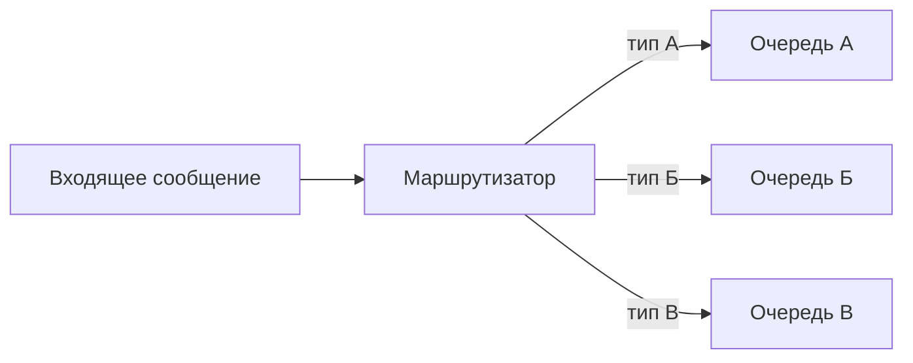
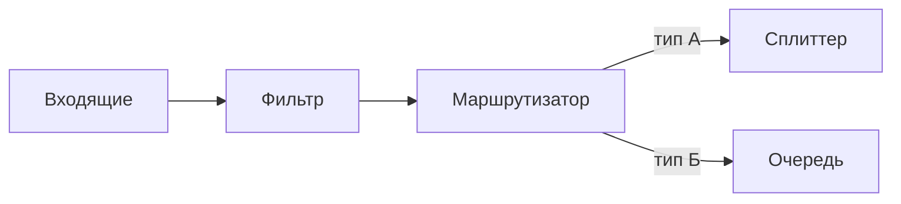

## Введение: Сортировщик на почте

Представьте, что вы отправляете письмо. Вы опускаете его в почтовый ящик. Дальше письмо попадает на сортировочную станцию. Сотрудник смотрит на индекс, определяет город, регион, улицу. Письмо отправляется в нужный вагон, потом на нужную почту, потом нужному почтальону. Сортировщик решает, куда направить письмо, основываясь на его содержимом.

В мире сообщений то же самое. Приходит одно сообщение. Его нужно направить в одну из нескольких очередей в зависимости от содержимого. Это не фильтр (который отбрасывает), и не broadcast (который рассылает всем). Это маршрутизатор: одно сообщение → одна целевая очередь.

**Message Router (Маршрутизатор сообщений)** — это паттерн, который направляет сообщение в одну из нескольких целевых очередей на основе правил. В отличие от фильтра (отбрасывает неподходящие), маршрутизатор всегда доставляет сообщение (в одну из очередей). В отличие от pub-sub (рассылает всем), маршрутизатор отправляет только одному получателю.

Для системного аналитика маршрутизатор — это способ разделить поток сообщений на несколько логических потоков в зависимости от их типа, содержимого или других атрибутов. Это позволяет разным типам сообщений обрабатываться разными системами.

## Маршрутизатор vs Фильтр vs Pub-Sub

| Характеристика | Фильтр | Маршрутизатор | Pub-Sub |
| :--- | :--- | :--- | :--- |
| **Что делает** | Отбрасывает неподходящие | Направляет в одну из очередей | Рассылает всем |
| **Количество выходов** | Один (или ноль) | Один (из нескольких) | Много (всем) |
| **Неподходящие сообщения** | Отбрасываются | Не бывает (всегда есть правило) | Не бывает (все получают всё) |
| **Пример** | Только платежи > 1000 | Платежи → очередь А, возвраты → очередь Б | Платежи → всем подписчикам |

## Как это работает



### Процесс

```yaml
1. Сообщение поступает на вход маршрутизатора
2. Маршрутизатор анализирует сообщение (по содержимому, заголовкам, routing key)
3. Применяет правила маршрутизации
4. Направляет сообщение в одну из целевых очередей
5. Если правило не найдено — либо ошибка, либо в очередь по умолчанию
```

## Типы маршрутизаторов

### Content-Based Router (Маршрутизация по содержимому)

Решение принимается на основе данных в теле сообщения.

```yaml
Правила:
  - Если event.type == "order.created" → очередь заказов
  - Если event.type == "payment.completed" → очередь платежей
  - Если event.type == "user.registered" → очередь регистраций
  - Иначе → очередь ошибок
```

### Header-Based Router (Маршрутизация по заголовкам)

Решение принимается на основе метаданных сообщения.

```yaml
Правила:
  - Если x-priority == "high" → очередь высокого приоритета
  - Если x-priority == "low" → очередь низкого приоритета
  - Если x-region == "eu" → очередь Европы
  - Если x-region == "us" → очередь США
```

### Routing Key Router (в RabbitMQ)

Решение принимается на основе routing key.

```yaml
Exchange: events.direct

Bindings:
  - Queue: orders, routing_key: order.*
  - Queue: payments, routing_key: payment.*
  - Queue: users, routing_key: user.*

Сообщение с routing_key="order.created" → очередь orders
```

### Dynamic Router (Динамический маршрутизатор)

Правила маршрутизации могут меняться во время выполнения.

```yaml
Пример:
  - Утром: сообщения в очередь А
  - Вечером: сообщения в очередь Б
  - В выходные: сообщения в очередь В
```

## Реализации в брокерах

### RabbitMQ (Direct Exchange)

```yaml
Exchange: orders.direct (type: direct)

Bindings:
  - Queue: orders_moscow, routing_key: moscow
  - Queue: orders_spb, routing_key: spb
  - Queue: orders_kazan, routing_key: kazan

Producer:
  - Отправляет сообщение с routing_key="moscow"

Результат:
  - Сообщение идёт только в orders_moscow
```

### RabbitMQ (Topic Exchange)

```yaml
Exchange: events.topic (type: topic)

Bindings:
  - Queue: user_events, routing_key: user.*
  - Queue: order_events, routing_key: order.*
  - Queue: payment_events, routing_key: payment.*

Producer:
  - Отправляет сообщение с routing_key="order.created"

Результат:
  - Сообщение идёт в order_events
```

### Apache Camel (Content-Based Router)

```yaml
from("direct:input")
  .choice()
    .when(header("type").isEqualTo("order"))
      .to("jms:queue:orders")
    .when(header("type").isEqualTo("payment"))
      .to("jms:queue:payments")
    .otherwise()
      .to("jms:queue:errors");
```

### Kafka (Client-side routing)

```yaml
Потребитель читает из топика:
  - Читает сообщение
  - Определяет тип
  - Отправляет в другой топик (через producer)

Недостаток: маршрутизация на стороне потребителя, а не брокера.
```

## Примеры использования

### 1. Интернет-магазин: заказы по городам

```yaml
Входящий поток: заказы со всей страны

Маршрутизатор:
  - Москва → очередь московского склада
  - СПб → очередь питерского склада
  - Казань → очередь казанского склада
  - Другие города → очередь распределительного центра

Почему:
  - Заказы обрабатываются ближайшим складом
  - Каждый склад имеет свою очередь
  - Балансировка нагрузки между складами
```

### 2. Система поддержки: тикеты по отделам

```yaml
Входящий поток: тикеты от пользователей

Маршрутизатор:
  - Проблемы с оплатой → очередь биллинга
  - Технические проблемы → очередь техподдержки
  - Вопросы по товарам → очередь отдела продаж
  - Жалобы → очередь эскалации

Почему:
  - Каждый отдел обрабатывает свои тикеты
  - Специализация обработчиков
```

### 3. Обработка событий по приоритету

```yaml
Входящий поток: события от системы

Маршрутизатор:
  - priority = critical → очередь срочных
  - priority = high → очередь высокого приоритета
  - priority = normal → очередь обычных
  - priority = low → очередь низкого приоритета

Почему:
  - Критические события обрабатываются в первую очередь
  - Разные воркеры для разных приоритетов
```

## Преимущества и недостатки

### Преимущества

| Преимущество | Объяснение |
| :--- | :--- |
| **Разделение потоков** | Разные типы сообщений идут в разные очереди |
| **Специализация обработчиков** | Каждая очередь может иметь своих воркеров |
| **Гибкость** | Легко добавить новый тип сообщений |
| **Масштабирование** | Каждый поток масштабируется независимо |
| **Изоляция** | Ошибка в одном потоке не влияет на другие |

### Недостатки

| Недостаток | Объяснение |
| :--- | :--- |
| **Сложность** | Нужно настраивать правила маршрутизации |
| **Один выход** | Сообщение не может быть отправлено в несколько очередей |
| **Трудно отлаживать** | Не всегда понятно, почему сообщение пошло в ту или иную очередь |
| **Нет стандарта** | Реализации отличаются у разных брокеров |

## Маршрутизатор в цепочке паттернов



**Пример:** Фильтр → только заказы. Маршрутизатор → по городам. Сплиттер → разбивает заказ на товары.

## Обработка ошибок

### Что делать, если правило не найдено?

```yaml
Вариант 1: Ошибка
  - Маршрутизатор возвращает ошибку
  - Сообщение отправляется в DLQ

Вариант 2: Очередь по умолчанию
  - Сообщение направляется в default.queue
  - Там его обрабатывает общий обработчик

Вариант 3: Игнорировать
  - Сообщение отбрасывается (опасно)
```

### Рекомендация

```yaml
Всегда иметь очередь по умолчанию или DLQ:
  - Ни одно сообщение не должно теряться
  - Неизвестные типы должны логироваться
```

## Маршрутизатор vs Маршрутизатор с фильтром

```yaml
Чистый маршрутизатор:
  - Каждое сообщение направляется в одну очередь
  - Нет отбрасывания

Маршрутизатор с фильтром:
  - Сначала фильтр отбрасывает неподходящие
  - Потом маршрутизатор направляет оставшиеся

Когда нужно:
  - Если нужно отбросить часть сообщений
  - Если нужно направить разные типы в разные очереди
```

## Распространённые ошибки

### Ошибка 1: Маршрутизатор вместо фильтра

Направляют сообщения в разные очереди, но некоторые типы должны быть отброшены.

**Решение:** Фильтр + маршрутизатор.

### Ошибка 2: Маршрутизатор вместо pub-sub

Пытаются направить одно сообщение в несколько очередей.

**Решение:** Pub-sub (topic exchange, fanout).

### Ошибка 3: Нет обработки неизвестных типов

Сообщения с неизвестным типом теряются.

**Решение:** Очередь по умолчанию или DLQ.

### Ошибка 4: Слишком сложные правила

Правила маршрутизации становятся нечитаемыми.

**Решение:** Вынести маршрутизацию в отдельный сервис.

### Ошибка 5: Маршрутизация на стороне потребителя

Каждый потребитель сам решает, куда отправить сообщение.

**Решение:** Маршрутизация на стороне брокера (централизованно).

## Практический пример

```yaml
Задача: Система заказов интернет-магазина

Входящий поток:
  - Заказы (тип: order)
  - Возвраты (тип: return)
  - Отзывы (тип: review)

Маршрутизатор (по типу):
  - order → orders.queue (5 воркеров)
  - return → returns.queue (2 воркера)
  - review → reviews.queue (1 воркер)

Маршрутизатор (по сумме для заказов):
  - order.amount > 10000 → vip.orders.queue (приоритетная)
  - order.amount <= 10000 → regular.orders.queue

Результат:
  - VIP-заказы обрабатываются быстрее
  - Возвраты обрабатываются отдельной командой
  - Отзывы — отдельно, с низким приоритетом
```

## Резюме

1. **Message Router** — паттерн, направляющий сообщение в одну из нескольких целевых очередей на основе правил.

2. **Отличие от фильтра:** фильтр отбрасывает, маршрутизатор всегда доставляет (в одну из очередей).

3. **Отличие от pub-sub:** pub-sub рассылает всем, маршрутизатор — одному.

4. **Типы:** по содержимому, по заголовкам, по routing key, динамический.

5. **Реализации:** RabbitMQ (direct/topic exchange), Apache Camel, Kafka (на стороне клиента).

6. **Где используется:** разделение потоков по типам, приоритетам, регионам, отделам.

7. **Обработка ошибок:** очередь по умолчанию или DLQ для неизвестных типов.