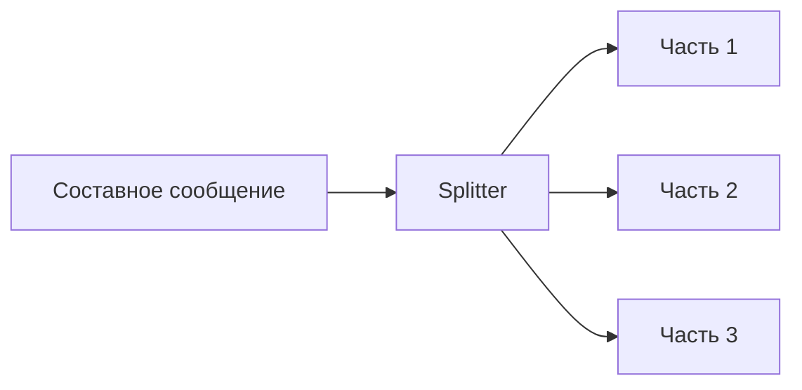
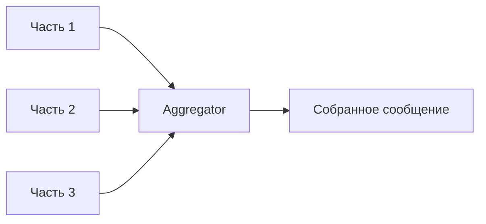
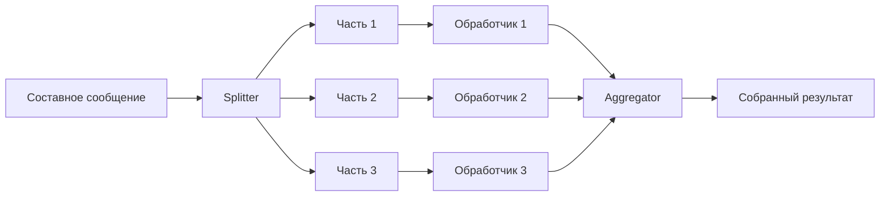
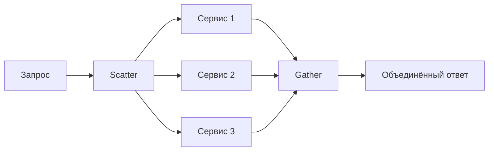

## Введение: Целое на части и части в целое

Представьте, что вы получили заказ на сборку трёх разных шкафов. Вместо того чтобы передавать весь заказ одному сборщику, вы разделяете его на три отдельные задачи: "собрать шкаф А", "собрать шкаф Б", "собрать шкаф В". Три сборщика работают параллельно. Когда все три задачи выполнены, вы объединяете результаты и сообщаете заказчику: "Заказ выполнен".

В мире сообщений то же самое. Иногда сообщение слишком большое или состоит из нескольких логических частей. Вместо того чтобы обрабатывать его целиком, вы разделяете его на несколько маленьких сообщений, обрабатываете параллельно, а потом собираете результаты обратно.

**Message Splitter (Разделитель)** — паттерн, который разбивает одно составное сообщение на несколько более мелких для параллельной обработки.

**Message Aggregator (Агрегатор)** — паттерн, который собирает несколько связанных сообщений в одно после их обработки.

Эти два паттерна часто используются вместе: сначала разделитель разбивает, потом агрегатор собирает. Для системного аналитика это способ распараллелить обработку, ускорить выполнение и лучше использовать ресурсы.

## Когда нужен Splitter

### Проблема

```yaml
Пришло составное сообщение:
  - Заказ из 100 товаров
  - Обрабатывать 100 товаров последовательно — долго
  - Обрабатывать 100 товаров параллельно — быстро
```

### Решение

```yaml
Splitter:
  - Разбивает заказ на 100 отдельных сообщений (по одному на товар)
  - Каждое сообщение обрабатывается параллельно
  - Время обработки сокращается с суммы до максимума
```

## Когда нужен Aggregator

### Проблема

```yaml
Пришло 100 сообщений (результаты обработки товаров):
  - Нужно собрать их в один отчёт
  - Нужно дождаться всех
  - Нужно объединить результаты
```

### Решение

```yaml
Aggregator:
  - Собирает 100 сообщений
  - Отслеживает, какие уже пришли
  - Когда все пришли — объединяет в одно
  - Отправляет дальше
```

## Message Splitter

### Как работает



### Процесс

```yaml
1. На вход приходит составное сообщение (корзина, список, заказ)
2. Splitter анализирует структуру
3. Разбивает на отдельные элементы
4. Каждый элемент отправляется как отдельное сообщение
5. Исходное сообщение больше не существует
```

### Примеры использования

| Сценарий | Вход | Выход |
| :--- | :--- | :--- |
| Заказ из нескольких товаров | Заказ (10 товаров) | 10 сообщений (по товару) |
| Пакетная загрузка файлов | Архив из 100 файлов | 100 сообщений (по файлу) |
| Событие с несколькими действиями | Событие с массивом действий | N сообщений (по действию) |
| Документ с секциями | Документ (5 секций) | 5 сообщений (по секции) |

### Реализации

```yaml
Код (псевдокод):
  splitter:
    input: order.queue
    output: items.exchange
    logic:
      - получить сообщение (заказ)
      - for each item in order.items:
          отправить item в items.exchange
      - подтвердить исходное сообщение
```

## Message Aggregator

### Как работает



### Процесс

```yaml
1. На вход приходят отдельные сообщения
2. Aggregator хранит их до тех пор, пока не соберётся полный набор
3. Определяет, какие сообщения относятся к одной группе (correlation id)
4. Определяет, когда группа завершена (количество, таймаут)
5. Объединяет сообщения в одно
6. Отправляет дальше
```

### Ключевые параметры

```yaml
Correlation ID:
  - Идентификатор, связывающий сообщения одной группы
  - Пример: order_id, batch_id, transaction_id

Completion criteria:
  - По количеству: когда пришло N сообщений
  - По таймауту: если за 5 минут не пришли все — завершить с тем, что есть
  - По флагу: специальное сообщение "последнее"

State management:
  - Хранить накопленные сообщения
  - Redis / In-memory / База данных
```

### Примеры использования

| Сценарий | Вход | Выход | Критерий |
| :--- | :--- | :--- | :--- |
| Обработка заказа | 100 товаров обработаны | Отчёт по заказу | 100 сообщений |
| Сборка документа | 5 секций готовы | Полный документ | 5 сообщений |
| Пакетная загрузка | 10 файлов загружены | Подтверждение | 10 сообщений + таймаут |

## Splitter + Aggregator вместе



### Пример: Обработка заказа

```yaml
1. Заказ с 10 товарами → Splitter → 10 сообщений (по товару)
2. Каждый товар обрабатывается параллельно (резервирование на складе)
3. Aggregator ждёт 10 результатов
4. Когда все пришли → собирает в один отчёт
5. Отчёт отправляется дальше
```

## Scatter-Gather

**Scatter-Gather** — это частный случай Splitter + Aggregator, где сообщение рассылается нескольким обработчикам, а результаты собираются.



**Пример:** Поиск авиабилетов: запрос отправляется 5 авиакомпаниям, результаты собираются и объединяются.

## Преимущества и недостатки

### Splitter

| Преимущество | Недостаток |
| :--- | :--- |
| Параллельная обработка | Дополнительная сложность |
| Ускорение обработки | Нужен aggregator для сборки |
| Лучшее использование ресурсов | Риск частичной обработки |

### Aggregator

| Преимущество | Недостаток |
| :--- | :--- |
| Объединение результатов | Нужно хранить состояние |
| Отправка одного отчёта вместо многих | Риск зависших групп (таймаут) |
| Удобно для клиента | Сложность отладки |

## Реализации

### В брокерах

```yaml
RabbitMQ:
  - Нет встроенного splitter/aggregator
  - Реализуется в коде потребителя

Kafka:
  - Нет встроенного splitter/aggregator
  - Реализуется в Kafka Streams (stateful)

Apache Camel:
  - Встроенный splitter/aggregator
  - DSL для конфигурации
```

### В коде потребителя

```yaml
Splitter (Python):
  def handle_order(order):
      for item in order.items:
          send_to_queue(item)
      ack()

Aggregator (Python):
  state = {}
  
  def handle_item(item):
      order_id = item.order_id
      if order_id not in state:
          state[order_id] = []
      state[order_id].append(item)
      
      if len(state[order_id]) == expected_count:
          result = merge(state[order_id])
          send_result(result)
          del state[order_id]
```

## Пример: Обработка заказа в интернет-магазине

### Без Splitter/Aggregator

```yaml
Время обработки заказа из 10 товаров:
  - Товар 1: 1 сек
  - Товар 2: 1 сек
  - ...
  - Товар 10: 1 сек
  Итого: 10 секунд
```

### С Splitter/Aggregator

```yaml
Время обработки заказа из 10 товаров:
  - Товар 1: 1 сек (параллельно)
  - Товар 2: 1 сек (параллельно)
  - ...
  - Товар 10: 1 сек (параллельно)
  Итого: 1 секунда + накладные расходы
```

### Схема

```yaml
1. API получает заказ
2. Отправляет заказ в order.queue
3. Splitter: разбивает на 10 товаров
4. 10 товаров в item.queue
5. 10 воркеров резервируют товары параллельно
6. Результаты в result.queue
7. Aggregator: ждёт 10 результатов
8. Отправляет результат клиенту
```

## Таймауты и обработка ошибок

### Что делать, если не все сообщения пришли?

```yaml
Сценарий:
  - Ожидаем 10 результатов
  - Пришло только 9
  - 10-е потерялось или обработчик упал

Варианты:
  - Ждать таймаут (например, 30 секунд)
  - По таймауту завершить с тем, что есть
  - Отправить сообщение об ошибке
  - Переотправить запрос на недостающие
```

### Что делать, если одно сообщение упало?

```yaml
Сценарий:
  - 9 товаров обработаны успешно
  - 10-й товар не может быть обработан (нет на складе)

Варианты:
  - Откатить все 9 (сложно)
  - Обработать 9, отправить отчёт с ошибкой по 10-му
  - Повторить попытку для 10-го
  - Отправить в DLQ, остальные 9 обработать
```

## Распространённые ошибки

### Ошибка 1: Splitter без Aggregator

Разбили сообщение, обработали части, а собрать забыли. Клиент получил 100 маленьких ответов вместо одного.

**Решение:** Всегда использовать Aggregator, если клиент ожидает один ответ.

### Ошибка 2: Aggregator без таймаута

Ждём 100 сообщений. 99 пришли, 1 потерялся. Система ждёт вечно.

**Решение:** Всегда устанавливать таймаут.

### Ошибка 3: Потеря корреляции

Не передали correlation_id. Aggregator не может понять, какие сообщения к какой группе относятся.

**Решение:** Всегда передавать идентификатор группы (order_id, batch_id).

### Ошибка 4: Хранение состояния в памяти

Aggregator хранит накопленные сообщения в памяти. При падении агрегатора всё теряется.

**Решение:** Использовать持久化 хранилище (Redis, БД) для stateful агрегации.

### Ошибка 5: Слишком мелкое разделение

Разбили задачу на слишком маленькие части. Накладные расходы на разделение и сборку превышают выигрыш.

**Решение:** Баланс между размером части и накладными расходами.

## Резюме

1. **Message Splitter** — разбивает одно составное сообщение на несколько маленьких для параллельной обработки.

2. **Message Aggregator** — собирает несколько связанных сообщений в одно после обработки.

3. **Scatter-Gather** — частный случай: рассылка запроса нескольким обработчикам и сборка результатов.

4. **Ключевые параметры агрегатора:** correlation ID (связь сообщений), completion criteria (количество или таймаут), state management (хранение накопленных сообщений).

5. **Где используется:** обработка заказов, пакетная загрузка, параллельные запросы, сборка отчётов.

6. **Преимущества:** параллельная обработка, ускорение, лучшее использование ресурсов.

7. **Недостатки:** сложность, накладные расходы, риск частичной обработки.