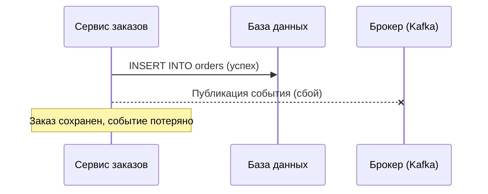
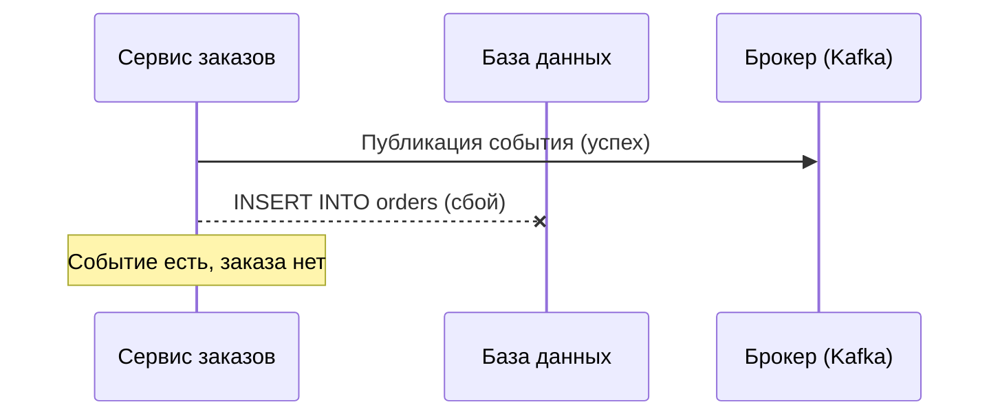
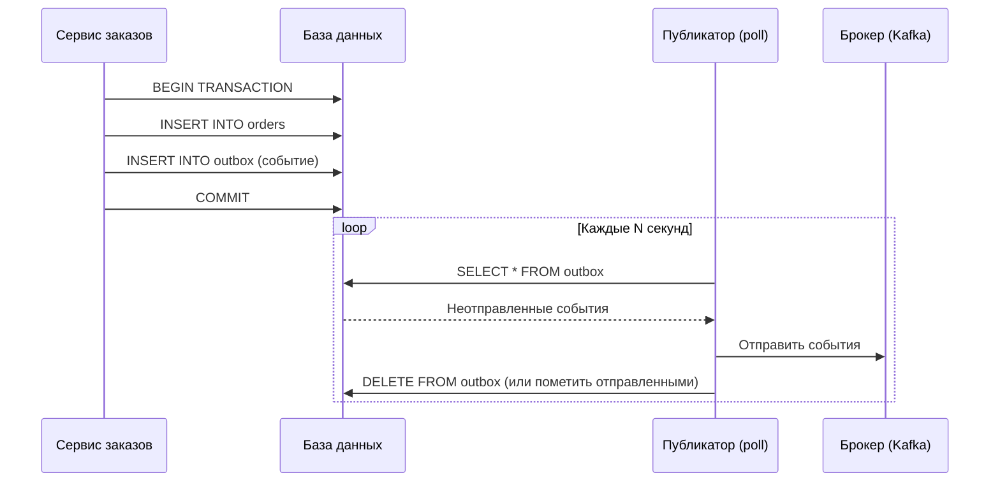
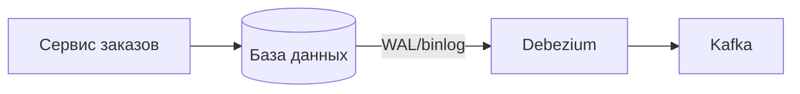
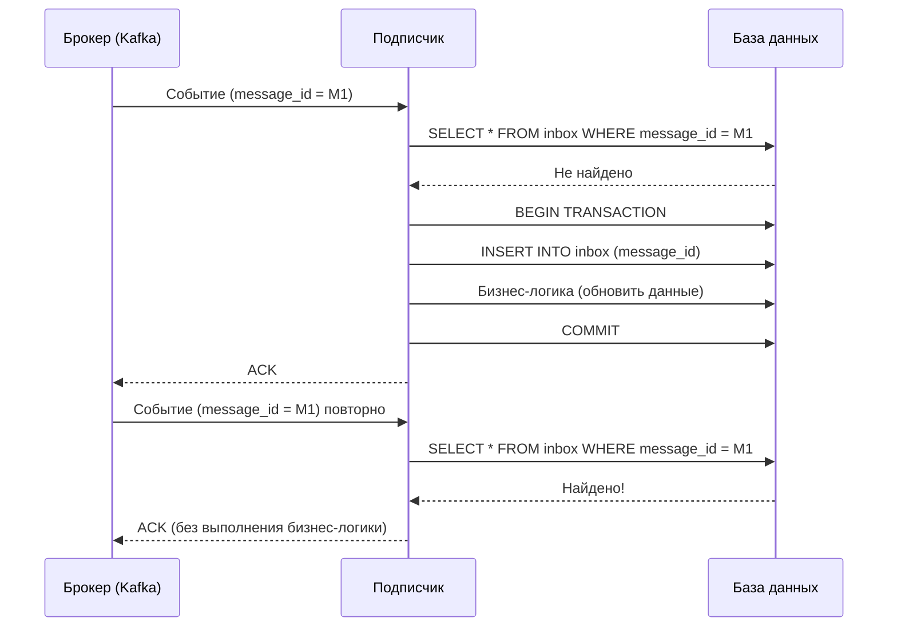
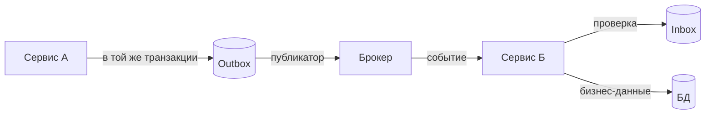

## Outbox / Inbox Pattern: надежная публикация событий и защита от дублей

В распределенных системах один сервис часто должен уведомить другие сервисы о том, что произошло нечто важное. Заказ создан — надо отправить уведомление покупателю, зарезервировать товар на складе, списать деньги. Классическое решение — опубликовать событие в брокер сообщений (Kafka, RabbitMQ).

Но здесь возникает фундаментальная проблема: как гарантировать, что событие будет опубликовано, только если бизнес-операция действительно выполнена? И как сделать так, чтобы при сбоях событие не публиковалось дважды?

**Outbox pattern** решает проблему надежной публикации событий. **Inbox pattern** решает проблему надежной обработки входящих сообщений с защитой от дублей. Оба паттерна основаны на одной идее: использовать базу данных как источник истины и точку синхронизации между бизнес-данными и событиями.

## Проблема: атомарность между записью в БД и публикацией события

Представьте сервис заказов. При оформлении заказа нужно:

1. Сохранить заказ в базу данных (INSERT в таблицу `orders`).
2. Опубликовать событие `OrderCreated` в Kafka, чтобы другие сервисы (платежи, инвентаризация, уведомления) узнали о новом заказе.

Если сначала сохранить заказ, а потом публиковать событие, то при сбое между этими шагами заказ сохранится, а событие не уйдет. Другие сервисы не узнают о заказе. Бизнес-процесс остановится.



Если сначала публиковать событие, а потом сохранять заказ, то при сбое между шагами событие уйдет, а заказ не сохранится. Другие сервисы получат событие о заказе, которого нет в базе. Это еще хуже.



Эта проблема называется **проблемой атомарности между реляционной БД и брокером сообщений**. Две разные системы (БД и брокер) не поддерживают распределенных транзакций.

## Outbox Pattern: решение для надежной публикации

Outbox pattern добавляет промежуточную таблицу в ту же базу данных, где хранятся бизнес-данные.

**Как это работает:**

1. При сохранении бизнес-данных (заказа) сервис вставляет запись о событии в специальную таблицу `outbox` в ТОЙ ЖЕ ТРАНЗАКЦИИ.
2. Транзакция БД гарантирует, что либо сохранятся и заказ, и запись в outbox, либо ничего не сохранится.
3. Отдельный фоновый процесс (публикатор) читает таблицу `outbox` и отправляет события в брокер.
4. После успешной отправки публикатор удаляет (или помечает) запись в outbox.



**Схема таблицы outbox (пример для PostgreSQL):**

```sql
CREATE TABLE outbox (
    id UUID PRIMARY KEY,
    aggregate_id UUID NOT NULL,        -- ID заказа или другой сущности
    aggregate_type VARCHAR(100) NOT NULL, -- "order", "payment"
    event_type VARCHAR(100) NOT NULL,    -- "OrderCreated", "OrderPaid"
    payload JSONB NOT NULL,              -- тело события
    created_at TIMESTAMP NOT NULL,
    processed_at TIMESTAMP,              -- NULL = еще не отправлено
    retry_count INT DEFAULT 0
);

CREATE INDEX idx_outbox_unprocessed ON outbox (created_at) WHERE processed_at IS NULL;
```

**Ключевые преимущества outbox pattern:**

- **Гарантия "хотя бы один раз".** Событие будет доставлено, даже если после COMMIT сервис упадет. Публикатор восстановит его при следующем запуске.
- **Гарантия порядка.** События публикуются в том же порядке, в котором были закоммичены (если публикатор читает в порядке `created_at`).
- **Атомарность.** Заказ и событие сохраняются атомарно в одной транзакции БД.

**Важные нюансы реализации:**

- **Публикатор должен быть идемпотентным.** Если одно и то же событие будет опубликовано дважды (например, при перезапуске публикатора), подписчики должны быть готовы к дублям (см. Inbox pattern).
- **Удаление vs пометка.** Вместо DELETE можно использовать столбец `processed_at` и периодически чистить старые записи. DELETE уменьшает размер таблицы, но создает нагрузку на БД.
- **Несколько публикаторов.** Если запустить несколько экземпляров публикатора, они могут конкурентно обрабатывать одни и те же сообщения. Нужна блокировка: `SELECT ... FOR UPDATE SKIP LOCKED` или оптимистичная блокировка с версионированием.
- **Большой объем сообщений.** Таблица outbox может разрастаться. Нужна архивация и чистка. Типичное время жизни записи in outbox — минуты или часы.

## Вариации Outbox Pattern

### Polling публикатор (как в примере)

Самый простой. Фоновый процесс каждые N секунд опрашивает таблицу outbox. Подходит для систем, где задержка до нескольких секунд приемлема.

### Transaction log tailing (CDC)

Вместо опроса таблицы outbox можно использовать Change Data Capture (Debezium) для чтения журнала транзакций БД (WAL в PostgreSQL, binlog в MySQL). Когда в outbox появляется новая запись, CDC сразу отправляет событие в Kafka. Задержка — миллисекунды.



### Outbox с многопартионностью

Для высоких нагрузок таблица outbox шардируется по `aggregate_id`, чтобы разные экземпляры публикатора могли обрабатывать разные партиции параллельно.

## Inbox Pattern: защита от дублей при обработке входящих сообщений

Outbox гарантирует доставку событий хотя бы один раз (at-least-once). Это означает, что подписчик может получить одно и то же событие дважды:

- Публикатор отправил событие, но не успел удалить его из outbox и упал. При restart он отправит его снова.
- Брокер сообщений (Kafka) гарантирует at-least-once доставку.

Подписчик должен быть защищен от повторной обработки. Это задача **Inbox pattern**.

**Как работает Inbox pattern:**

1. Подписчик при получении сообщения сначала проверяет, обрабатывалось ли уже сообщение с таким ID (idempotency key).
2. Если нет — записывает ID сообщения в таблицу `inbox` в той же транзакции, что и бизнес-логику.
3. Если да — игнорирует сообщение.



**Схема таблицы inbox:**

```sql
CREATE TABLE inbox (
    message_id VARCHAR(255) PRIMARY KEY,
    aggregate_id UUID NOT NULL,
    event_type VARCHAR(100) NOT NULL,
    processed_at TIMESTAMP NOT NULL
);
```

**Где хранится inbox?** Обычно в той же базе данных, что и бизнес-данные подписчика. Это позволяет атомарно записать и факт обработки сообщения, и изменения в бизнес-данных.

## Outbox + Inbox: сквозная надежность

Вместе outbox и inbox образуют надежный канал обмена сообщениями с гарантией exactly-once (разработка — хотя бы один раз, обработка — идемпотентно).



**Гарантии:**

- **At-least-once доставка.** Благодаря outbox и повторным попыткам публикатора.
- **Idempotent обработка.** Благодаря inbox и идемпотентности подписчика.
- **Никаких распределенных транзакций.** Все операции локальные (в рамках одной БД).

## Альтернативы и когда они не работают

### Двухфазный коммит (XA)

Распределенная транзакция между БД и брокером. Поддерживается некоторыми БД и брокерами (PostgreSQL + RabbitMQ через XA).

**Недостатки:** Медленно, блокирует ресурсы, плохо масштабируется, редко используется в современных микросервисах.

### Публикация события до COMMIT (сначала событие)

Описанный ранее антипаттерн. Не гарантирует атомарности.

### Публикация события после COMMIT (сначала БД)

Описанный ранее. При сбое между COMMIT и публикацией событие теряется.

### Transactional outbox (предложенный паттерн)

Правильное решение.

## Пример: Оформление заказа с outbox

**Сервис заказов (публикатор):**

```sql
BEGIN;
INSERT INTO orders (id, user_id, total, status) VALUES (123, 456, 299.99, 'pending');
INSERT INTO outbox (id, aggregate_id, aggregate_type, event_type, payload, created_at)
VALUES ('evt_001', 123, 'order', 'OrderCreated', '{"orderId":123,"userId":456,"total":299.99}', NOW());
COMMIT;
```

Публикатор читает `outbox`, отправляет в Kafka.

**Сервис платежей (подписчик):**

```sql
-- Получил событие из Kafka
BEGIN;
SELECT * FROM inbox WHERE message_id = 'evt_001';
-- Не найдено
INSERT INTO inbox (message_id, aggregate_id, event_type, processed_at) 
VALUES ('evt_001', 123, 'OrderCreated', NOW());
-- Бизнес-логика: создать платеж
INSERT INTO payments (order_id, amount, status) VALUES (123, 299.99, 'pending');
COMMIT;
-- Подтверждение в Kafka (ACK)
```

Если событие придет повторно, подписчик увидит `evt_001` в inbox и проигнорирует его.

## Outbox в Kafka: Kafka Connect и Debezium

Если в качестве брокера используется Kafka, outbox можно реализовать через **Kafka Connect** с коннектором **Debezium**. Debezium читает таблицу outbox через CDC и автоматически публикует события в Kafka. Это избавляет от необходимости писать отдельный публикатор.

```sql
-- В таблице outbox появляется запись
INSERT INTO outbox (id, aggregate_id, event_type, payload) VALUES (...);
```

Debezium детектирует INSERT и отправляет сообщение в топик Kafka.

Это популярный подход в мире микросервисов (используется в паттерне "Transaction Log Tailing").

## Outbox для запросов (Integration Events)

Outbox используется не только для публикации событий, но и для надежной отправки команд или запросов к другим сервисам. Например, сервис А должен синхронно вызвать сервис Б, но не хочет зависеть от его доступности. Он сохраняет запрос в outbox, а публикатор отправляет его асинхронно.

## Масштабирование outbox

Таблица outbox может стать узким местом при очень высокой нагрузке (десятки тысяч событий в секунду).

**Способы масштабирования:**

- **Шардирование.** Разные экземпляры публикатора обрабатывают разные шарды (например, по `aggregate_id % N`).
- **Множество публикаторов с блокировкой.** Использовать `SELECT ... FOR UPDATE SKIP LOCKED` в PostgreSQL, чтобы разные воркеры не мешали друг другу.
- **CDC вместо poll.** Debezium масштабируется горизонтально (по партициям бинаря).
- **Cleanup.** Периодически удалять обработанные записи, чтобы таблица не разрасталась.

## Ограничения и подводные камни

**Outbox увеличивает нагрузку на БД.** Каждая транзакция теперь пишет в два места (бизнес-таблица + outbox). При очень высокой нагрузке это может быть заметно.

**Задержка публикации.** При poll-публикаторе задержка может составлять несколько секунд. Если нужна задержка в миллисекундах, используйте CDC.

**Необходимость идемпотентности подписчиков.** Inbox — это реализация идемпотентности. Inbox решает проблему.

**Ручное управление.** Outbox и inbox нужно проектировать, создавать таблицы, настраивать очистку. Это дополнительная работа по сравнению с "опубликовал сразу".

## Резюме

Outbox и Inbox — это паттерны, обеспечивающие надежную публикацию и обработку сообщений в распределенных системах без использования распределенных транзакций.

**Outbox pattern (публикация):**

- Проблема: атомарность между записью в БД и публикацией события.
- Решение: сохранять событие в таблицу `outbox` в той же транзакции, что и бизнес-данные. Фоновый процесс (публикатор) читает outbox и отправляет события в брокер.
- Гарантии: at-least-once доставка, сохранение порядка (при последовательном чтении).

**Inbox pattern (обработка):**

- Проблема: дублирование сообщений при at-least-once доставке.
- Решение: хранить ID обработанных сообщений в таблице `inbox`. При получении сообщения проверять, не обработано ли оно ранее.
- Гарантии: idempotent обработка (exactly-once с точки зрения эффекта).

**Вместе** outbox и inbox обеспечивают надежный канал обмена сообщениями, не требуя двухфазного коммита и сохраняя слабую связанность сервисов.

**Для аналитика:** при проектировании интеграций, где важна надежность (платежи, заказы, инвентаризация), нужно требовать использования outbox/inbox или аналогичных механизмов. Без них сбои в сети или брокере будут приводить к потере событий или дублированию. Outbox и inbox — это не опция, а необходимость для критических потоков данных.