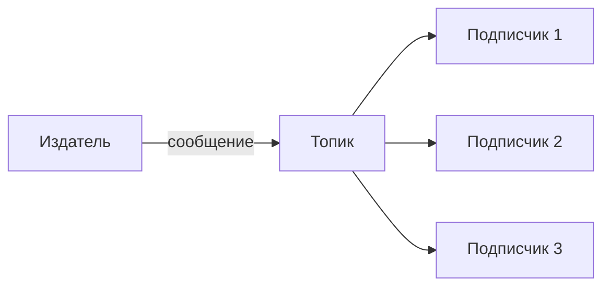
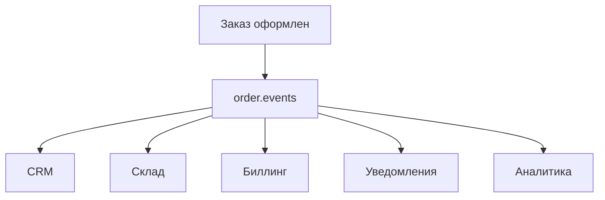

## Введение: Газета, а не письмо

Представьте, что вы хотите узнавать новости. Можно каждому другу отправлять письмо: "Привет, случилось то-то". Это работает, но если друзей много, вы устанете. Можно просто подписаться на газету. Газета одна, а читателей много. Вы не знаете, кто ещё подписан. Читатели не знают друг друга. Новости приходят всем одновременно.

Publish-Subscribe (Pub-Sub) — это как газета. Один издатель публикует сообщение. Брокер рассылает его всем, кто подписан. Отправитель не знает получателей. Получатели не знают друг друга. Новое приложение может просто подписаться и начать получать события.

**Publish-Subscribe** — это паттерн интеграции, при котором сообщение доставляется всем подписчикам. В отличие от очереди (Message Queue), где сообщение получает один, здесь сообщение получают все.

Для системного аналитика Pub-Sub — это способ оповещения множества систем о событиях. Вместо того чтобы каждая система спрашивала "не случилось ли чего?", они подписываются и получают уведомления автоматически. Это основа событийно-ориентированной архитектуры.

## Ключевые принципы

### Один ко многим (One-to-many)

```yaml
Один отправитель → много получателей
Каждый получатель получает копию сообщения
```

### Слабая связанность (Decoupling)

```yaml
Издатель (Publisher):
  - Не знает подписчиков
  - Не знает, сколько их
  - Не знает, доступны ли они

Подписчик (Subscriber):
  - Не знает издателя
  - Не знает других подписчиков
  - Может подписаться или отписаться в любой момент
```

### Динамичность

```yaml
Новый сервис:
  - Просто подписывается на топик
  - Начинает получать события
  - Не требует изменений в издателе
```

## Как это работает



### Шаг 1: Публикация

Издатель публикует сообщение в топик. Не знает, кто подписан. Не ждёт ответа.

### Шаг 2: Рассылка

Брокер рассылает сообщение всем подписчикам. Каждый получает свою копию.

### Шаг 3: Получение

Каждый подписчик обрабатывает сообщение независимо. Не знает о других подписчиках.

## Message Queue vs Publish-Subscribe

| Характеристика | Message Queue | Publish-Subscribe |
| :--- | :--- | :--- |
| **Получателей** | Один | Много |
| **Связь** | Точка-точка | Один-ко-многим |
| **Балансировка нагрузки** | Да | Нет (все получают всё) |
| **Удаление после прочтения** | Да (у одного) | Нет (копируется всем) |
| **Типичное применение** | Задачи, работы | События, уведомления |

```yaml
Message Queue:
  - Один заказ — один обработчик
  - Задача должна быть выполнена один раз

Publish-Subscribe:
  - Одно событие — много систем должны знать
  - "Пользователь создан" → CRM, биллинг, маркетинг, безопасность
```

## Топик (Topic)

### Что такое топик

Канал, куда публикуются сообщения. Подписчики подписываются на топик.

```yaml
Топик: user.events
  - Подписчик 1: CRM
  - Подписчик 2: Биллинг
  - Подписчик 3: Маркетинг
  - Подписчик 4: Логирование
```

### Именование топиков

```yaml
Рекомендации:
  - Используйте domain.event: user.created, order.paid
  - Используйте иерархию: users.created, users.updated, users.deleted
  - Единый стиль во всей системе
```

## Виды Pub-Sub

### Простой (без фильтрации)

Все подписчики получают все сообщения.

```yaml
Топик: user.events
Сообщение: user.created → все подписчики
Сообщение: user.deleted → все подписчики
```

### С фильтрацией (по содержимому)

Подписчики получают только сообщения, соответствующие критериям.

```yaml
Топик: user.events
Подписчик 1 (CRM): все сообщения
Подписчик 2 (Безопасность): только user.deleted
Подписчик 3 (Маркетинг): только user.created, user.updated
```

### С маршрутизацией (topic exchange в RabbitMQ)

Используются wildcard для фильтрации.

```yaml
Топик: events.*
  - events.user.created → подписчики на events.user.*
  - events.order.paid → подписчики на events.order.*

Топик: events.#
  - Любое событие → подписчики на events.#
```

## Где используется

### 1. Событийная архитектура микросервисов

```yaml
Событие: "пользователь создан"
Подписчики:
  - CRM: создать профиль
  - Биллинг: создать счёт
  - Маркетинг: добавить в рассылку
  - Аналитика: записать событие
  - Безопасность: проверить на мошенничество
```

### 2. Оповещение пользователей

```yaml
Событие: "новое сообщение в чате"
Подписчики:
  - Сервис уведомлений (push)
  - Сервис email (письмо)
  - Сервис логов (записать)
```

### 3. CDC (Change Data Capture)

```yaml
Событие: "изменение в базе данных"
Подписчики:
  - Кеш: инвалидация
  - Поиск: обновление индекса
  - Аналитика: обновление хранилища
```

### 4. Метрики и мониторинг

```yaml
Событие: "запрос обработан"
Подписчики:
  - Система метрик (Prometheus)
  - Система логирования (ELK)
  - Система алертов (Alertmanager)
```

## Преимущества и недостатки

### Преимущества

| Преимущество | Объяснение |
| :--- | :--- |
| **Слабая связанность** | Издатель не знает подписчиков |
| **Масштабируемость** | Легко добавить нового подписчика |
| **Динамичность** | Подписчики могут появляться и исчезать |
| **Асинхронность** | Издатель не ждёт обработки |
| **Один источник истины** | Все системы видят одно событие |

### Недостатки

| Недостаток | Объяснение |
| :--- | :--- |
| **Нет балансировки** | Каждый подписчик получает все сообщения |
| **Нагрузка на подписчиков** | При многих подписчиках брокер копирует сообщения |
| **Сложность отладки** | Трудно понять, кто получает сообщения |
| **Порядок не гарантирован** | Сообщения могут приходить в разном порядке |

## Реализации Pub-Sub

| Брокер | Поддержка Pub-Sub | Особенности |
| :--- | :--- | :--- |
| **RabbitMQ** | Да (topic exchange, fanout) | Гибкая маршрутизация |
| **Kafka** | Да (топики) | Хранение истории, replay |
| **AWS SNS** | Да (управляемый) | Интеграция с AWS, фильтрация |
| **Redis Pub/Sub** | Да | Лёгкий, быстрый, нет персистентности |
| **Google Pub/Sub** | Да (управляемый) | GCP, глобальная |

## Pub-Sub в разных брокерах

### RabbitMQ (topic exchange)

```yaml
Exchange: events.topic (type: topic)

Bindings:
  - Queue: crm, routing_key: user.*
  - Queue: billing, routing_key: user.created
  - Queue: marketing, routing_key: user.created, user.updated

Сообщение с routing_key="user.created":
  - Идёт в crm, billing, marketing

Сообщение с routing_key="user.deleted":
  - Идёт только в crm
```

### Kafka (топики)

```yaml
Топик: user.events

Consumer group: crm
Consumer group: billing
Consumer group: marketing

Каждая группа читает все сообщения из топика
```

### AWS SNS (топики + фильтрация)

```yaml
Топик: user_events

Подписки:
  - crm: фильтр (любые)
  - billing: фильтр (event_type = "user.created")
  - marketing: фильтр (event_type in ["user.created", "user.updated"])
```

## Практический пример: События в интернет-магазине

### Схема



### События

```yaml
События:
  - order.created
  - order.paid
  - order.shipped
  - order.delivered
  - order.cancelled
```

### Подписчики

```yaml
CRM:
  - Интересуют: order.created, order.cancelled
  - Действие: обновить статус заказа в CRM

Склад:
  - Интересует: order.paid (зарезервировать товар)
  - Действие: уменьшить остатки

Биллинг:
  - Интересует: order.paid (зафиксировать платеж)
  - Действие: обновить финансовую отчётность

Уведомления:
  - Интересуют: order.shipped, order.delivered
  - Действие: отправить SMS/email клиенту

Аналитика:
  - Интересуют: все события
  - Действие: записать в хранилище для отчётов
```

## Pub-Sub vs Message Queue: Когда что выбирать

```yaml
Выбираем Pub-Sub, если:
  - Событие должно быть видно многим системам
  - Системы не конкурируют за сообщение
  - Легко добавить нового подписчика

Выбираем Message Queue, если:
  - Сообщение должно быть обработано один раз
  - Есть несколько воркеров для балансировки
  - Нужна гарантия однократной обработки
```

## Распространённые ошибки

### Ошибка 1: Pub-Sub для задач

Публикуют задачу в топик. Все подписчики берут и обрабатывают одну задачу.

**Решение:** Для задач — Message Queue.

### Ошибка 2: Нет фильтрации

Все подписчики получают все сообщения. Каждый подписчик фильтрует сам.

**Решение:** Использовать фильтрацию на уровне брокера (topic exchange, SNS filtering).

### Ошибка 3: Ожидание ответа

Издатель ждёт, пока все подписчики обработают.

**Решение:** Pub-Sub асинхронен. Для синхронного ответа используйте другой паттерн.

### Ошибка 4: Предположение о порядке

Думают, что сообщения приходят в том же порядке, в котором были отправлены.

**Решение:** Порядок не гарантирован. Проектируйте систему с учётом этого.

### Ошибка 5: Нет мониторинга отставания

Подписчик упал, сообщения накапливаются, никто не знает.

**Решение:** Мониторинг отставания для каждого подписчика.

## Резюме

1. **Publish-Subscribe** — паттерн, при котором сообщение доставляется всем подписчикам. Один издатель, много получателей.

2. **Ключевое отличие от очереди:** в очереди сообщение получает один, в Pub-Sub — все.

3. **Топик** — канал, куда публикуются сообщения. Подписчики подписываются на топик.

4. **Фильтрация** позволяет подписчикам получать только нужные сообщения (по содержимому, wildcard).

5. **Где используется:** событийная архитектура, оповещения, CDC, метрики.

6. **Преимущества:** слабая связанность, масштабируемость, динамичность.

7. **Недостатки:** нет балансировки, нагрузка на брокера, сложность отладки.