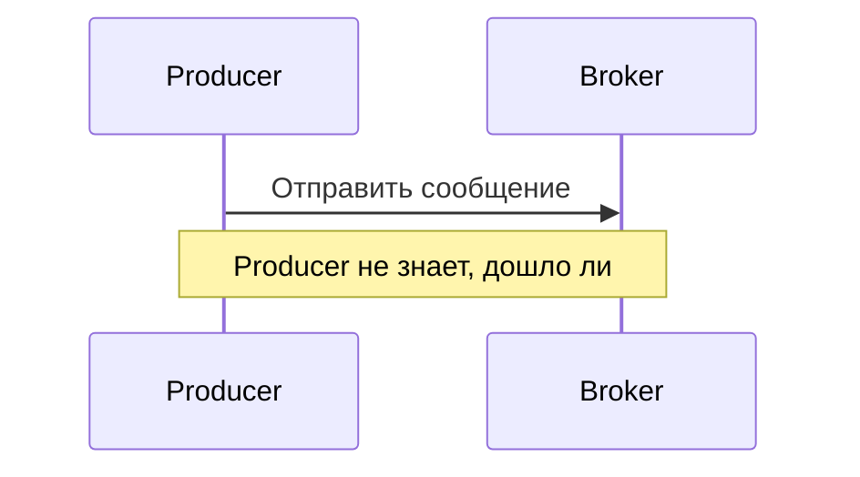
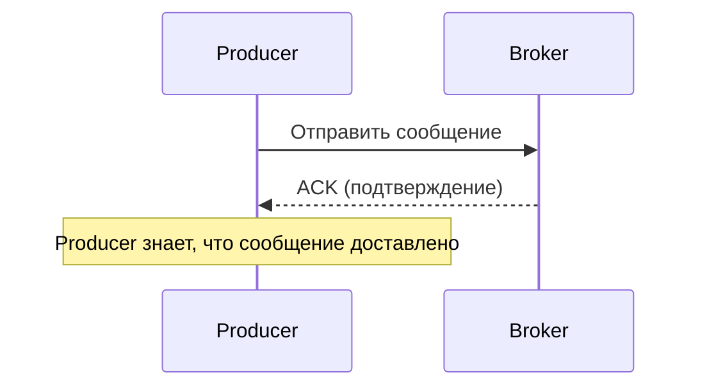
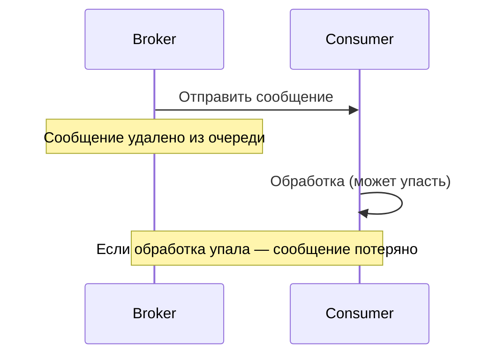
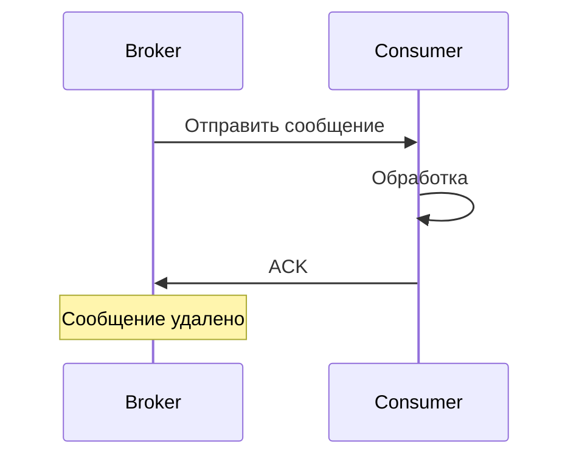

## Введение: Расписка в получении

Представьте, что вы отправляете ценную посылку курьерской службой. Вы не просто бросаете её в ящик и надеетесь. Вы передаёте курьеру, он ставит отметку в накладной, вы получаете уведомление, что посылка принята. Когда курьер доставляет посылку адресату, тот расписывается в получении. Вы знаете, что посылка дошла.

В мире сообщений без подтверждений вы никогда не знаете, дошло ли сообщение. Может, оно потерялось в сети. Может, брокер упал. Может, потребитель получил, но упал до обработки.

**Подтверждения (Acknowledgments)** — это механизм, который даёт гарантии. Producer получает подтверждение от брокера: "Сообщение получено и сохранено". Consumer отправляет подтверждение брокеру: "Сообщение обработано, можно удалять".

В RabbitMQ подтверждения — это ключевой механизм обеспечения надёжности. Без них сообщения могут теряться, дублироваться, обрабатываться несколько раз. С ними вы можете строить системы, где потеря данных недопустима.

Для системного аналитика понимание подтверждений позволяет оценить гарантии доставки, которые даёт система, и выбрать правильную стратегию для разных типов сообщений.

## Два вида подтверждений

| Вид | Участники | Что подтверждает | Зачем |
| :--- | :--- | :--- | :--- |
| **Publisher Confirms** | Producer → Broker | Сообщение получено брокером | Producer знает, что сообщение не потерялось по пути |
| **Consumer Acks** | Consumer → Broker | Сообщение обработано | Broker знает, что можно удалить сообщение |

## Publisher Confirms (Подтверждения от издателя)

### Что это

Механизм, с помощью которого producer получает подтверждение от брокера, что сообщение получено и (опционально) записано на диск.

### Без подтверждений



**Риски:**

| Риск | Что происходит |
| :--- | :--- |
| **Сетевые проблемы** | Сообщение не долетело до брокера |
| **Брокер упал** | Сообщение потеряно |
| **Перегрузка** | Сообщение отброшено |

### С подтверждениями



### Режимы publisher confirms

| Режим | Как работает | Гарантия | Производительность |
| :--- | :--- | :--- | :--- |
| **Обычный (single)** | Ждём подтверждение после каждого сообщения | Высокая | Низкая |
| **Пакетный (batch)** | Отправили N сообщений, ждём одно подтверждение на все | Высокая | Средняя |
| **Асинхронный** | Отправляем, подтверждения приходят в callback | Высокая | Высокая |

### Обычный режим (single)

```yaml
Алгоритм:
  1. Отправить сообщение
  2. Ждать подтверждения
  3. Отправить следующее

Плюсы:
  - Простота
  - Каждое сообщение подтверждено

Минусы:
  - Медленно (задержка на каждое сообщение)
```

### Пакетный режим (batch)

```yaml
Алгоритм:
  1. Отправить 100 сообщений
  2. Ждать одного подтверждения на все
  3. Если подтверждение пришло — все доставлены
  4. Если нет — повторить всю пачку

Плюсы:
  - Быстрее, чем single

Минусы:
  - При ошибке нужно повторять всю пачку
  - Непонятно, какое сообщение из пачки потерялось
```

### Асинхронный режим

```yaml
Алгоритм:
  1. Отправить сообщение
  2. Не ждать
  3. При получении подтверждения вызвать callback
  4. При получении nack вызвать другой callback

Плюсы:
  - Максимальная производительность

Минусы:
  - Сложнее реализовать
```

### Подтверждения и персистентность

| Тип сообщения | Подтверждение | Гарантия |
| :--- | :--- | :--- |
| Transient (в памяти) | Пришло | Сообщение в памяти брокера |
| Persistent (на диск) | Пришло | Сообщение на диске |

**Рекомендация:** Для критичных данных используйте persistent + publisher confirms.

## Consumer Acks (Подтверждения от потребителя)

### Что это

Механизм, с помощью которого consumer подтверждает брокеру, что сообщение обработано. Только после этого брокер удаляет сообщение из очереди.

### Без подтверждений (auto-ack)



### С подтверждениями (manual ack)



### Что происходит без ACK

```yaml
Сценарий:
  1. Consumer получил сообщение
  2. Соединение оборвалось (consumer упал)
  3. Сообщение возвращается в очередь
  4. Другой consumer получит его
```

### Режимы подтверждений

| Режим | Поведение | Риск |
| :--- | :--- | :--- |
| **auto-ack** | Подтверждение сразу после получения | Потеря сообщения при падении consumer |
| **manual ack** | Consumer сам решает, когда подтвердить | Сообщение может зависнуть (если забыли ack) |

### Стратегии подтверждений

**Подтверждать после обработки:**

```yaml
Алгоритм:
  1. Получить сообщение
  2. Обработать
  3. Подтвердить

Плюсы: Сообщение не потеряется при падении
Минусы: Если обработка долгая — сообщение долго в unacked
```

**Подтверждать до обработки (не рекомендуется):**

```yaml
Алгоритм:
  1. Получить сообщение
  2. Подтвердить
  3. Обработать

Риск: При падении после подтверждения сообщение потеряно
```

**Подтверждать пачкой (batch ack):**

```yaml
Алгоритм:
  1. Получить 10 сообщений
  2. Обработать все
  3. Подтвердить все (multiple=true)

Плюсы: Быстрее
Минусы: При ошибке нужно разбираться, какие обработаны, какие нет
```

### Reject и Nack

| Действие | Команда | Что происходит |
| :--- | :--- | :--- |
| **Отклонить с requeue** | `basic.reject(requeue=true)` | Сообщение возвращается в очередь |
| **Отклонить без requeue** | `basic.reject(requeue=false)` | Сообщение удаляется или в DLQ |
| **Nack (множественное отклонение)** | `basic.nack(multiple=true)` | Отклонить пачку сообщений |

**Когда использовать reject:**

```yaml
requeue=true:
  - Временная ошибка (база данных недоступна)
  - Сообщение можно обработать позже

requeue=false:
  - Сообщение невалидно (нельзя обработать в принципе)
  - Превышено количество попыток
```

## Гарантии доставки и подтверждения

### At-most-once (не более одного раза)

```yaml
Настройка:
  - auto-ack (consumer)
  - Нет publisher confirms (или acks=0)

Риск:
  - Сообщение может потеряться
  - Дубликатов нет
```

### At-least-once (не менее одного раза)

```yaml
Настройка:
  - manual ack (consumer)
  - publisher confirms

Риск:
  - Сообщение не потеряется
  - Возможны дубликаты (если ack потерялся)
```

### Exactly-once (ровно один раз)

```yaml
Настройка:
  - manual ack + идемпотентность на consumer
  - publisher confirms

Дубликаты возможны, но обработка должна быть идемпотентной.
```

## Подтверждения и производительность

### Влияние publisher confirms

| Режим | Задержка | Пропускная способность |
| :--- | :--- | :--- |
| Без подтверждений | Минимальная | Максимальная |
| Single confirm | Высокая | Низкая |
| Batch confirm | Средняя | Средняя |
| Async confirm | Низкая | Высокая |

### Влияние consumer acks

| Режим | Задержка | Риск потери |
| :--- | :--- | :--- |
| auto-ack | Минимальная | Высокий |
| manual ack (каждое сообщение) | Средняя | Низкий |
| manual ack (batch) | Низкая | Средний |

### Prefetch (QoS)

Ограничение количества неподтверждённых сообщений у consumer.

```yaml
prefetch_count = 10:
  - Consumer получил 10 сообщений
  - Не подтвердил ни одного
  - Больше не получит, пока не подтвердит

Зачем:
  - Защита от перегрузки consumer
  - Равномерное распределение нагрузки
```

## Подтверждения и Dead Letter Queue

### Путь сообщения в DLQ

```yaml
1. Consumer получил сообщение
2. Ошибка при обработке
3. Consumer отклонил (reject с requeue=false)
4. Сообщение попадает в DLQ
```

### Настройка DLQ для неподтверждённых сообщений

```yaml
Очередь:
  x-dead-letter-exchange: dlx
  x-dead-letter-routing-key: failed

Политика:
  - Если consumer не подтвердил в течение x-consumer-timeout
  - Сообщение попадает в DLQ
```

## Практические сценарии

### Сценарий 1: Критичные данные (платежи)

```yaml
Producer:
  - publisher confirms (async)
  - persistent messages

Consumer:
  - manual ack
  - ack после записи в БД
  - reject с requeue=false при ошибке (в DLQ)
```

### Сценарий 2: Логи и метрики

```yaml
Producer:
  - без подтверждений (можно потерять)

Consumer:
  - auto-ack
```

### Сценарий 3: Очередь задач (workers)

```yaml
Producer:
  - publisher confirms (batch)

Consumer:
  - manual ack
  - ack после выполнения задачи
  - reject с requeue=true при временной ошибке
```

## Мониторинг подтверждений

### Метрики

| Метрика | Что показывает |
| :--- | :--- |
| `unacknowledged_messages` | Сообщения, отправленные, но не подтверждённые |
| `delivered_unacknowledged` | Сообщения, доставленные без ack |
| `publish_confirm` | Количество подтверждённых публикаций |

### Алерты

| Ситуация | Действие |
| :--- | :--- |
| unacknowledged растёт | Consumer не успевает или завис |
| publish confirm долго нет | Проблемы с брокером или сетью |

## Распространённые ошибки

### Ошибка 1: auto-ack для критичных данных

Consumer получил, auto-ack отправил, обработка упала — сообщение потеряно.

**Решение:** manual ack.

### Ошибка 2: Забытый ack

Consumer обработал, но забыл подтвердить. Сообщение висит в unacked, очередь растёт.

**Решение:** Всегда ack в блоке finally.

### Ошибка 3: reject без DLQ

Consumer отклонил с requeue=false, сообщение потеряно.

**Решение:** Настроить DLQ.

### Ошибка 4: Слишком большой prefetch

prefetch=1000, consumer не успевает, unacked растёт.

**Решение:** Установить prefetch в соответствии с мощностью consumer.

### Ошибка 5: Подтверждение до обработки

Подтвердили, потом обрабатывали. При падении сообщение потеряно.

**Решение:** Подтверждать после обработки.

## Резюме

1. **Два вида подтверждений:** publisher confirms (producer → broker) и consumer acks (consumer → broker).

2. **Publisher confirms:** producer получает подтверждение, что сообщение доставлено в брокер. Режимы: single, batch, async.

3. **Consumer acks:** consumer подтверждает, что сообщение обработано. auto-ack (опасно), manual ack (надёжно).

4. **Без подтверждений:** сообщения могут теряться. С подтверждениями — at-least-once.

5. **Для exactly-once** нужна идемпотентность на consumer + at-least-once.

6. **Prefetch (QoS)** ограничивает количество неподтверждённых сообщений у consumer.

7. **Reject** позволяет вернуть сообщение в очередь (requeue=true) или отправить в DLQ (requeue=false).