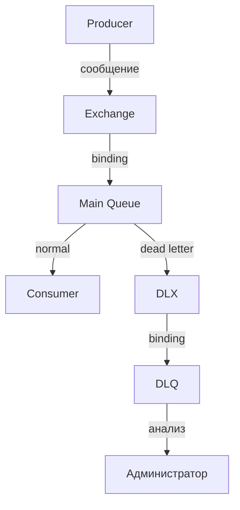

## Введение: Контейнер для битых писем

Представьте почтовое отделение. Большинство писем доставляются адресатам. Но некоторые письма не могут быть доставлены: адрес написан неразборчиво, получатель переехал, письмо повреждено. В нормальном почтовом отделении такие письма не выбрасывают. Их отправляют в специальную папку — "недоставленные письма". Раз в неделю приходит сотрудник, разбирает их, пытается исправить ошибки или возвращает отправителю.

В RabbitMQ та же проблема. Сообщение может не быть обработано. Потребитель может упасть, сообщение может быть невалидным, может истечь срок жизни, очередь может переполниться. Что делать с такими сообщениями? Удалить навсегда? Потерять данные?

**Dead Letter Queue (DLQ)** — это специальная очередь для сообщений, которые не удалось доставить или обработать. Сообщения попадают в DLQ вместо того, чтобы быть потерянными.

Для системного аналитика DLQ — это инструмент для обработки ошибок, аудита и восстановления данных. Вместо того чтобы терять сообщения, вы сохраняете их в DLQ, анализируете, исправляете проблемы и, при необходимости, повторно обрабатываете.

## Что такое Dead Letter Queue

**Dead Letter Queue (DLQ)** — это очередь, куда попадают сообщения, которые не могут быть доставлены или обработаны нормальным образом.

### Когда сообщение попадает в DLQ

| Ситуация | Описание |
| :--- | :--- |
| **Сообщение отклонено (reject)** | Потребитель вызвал `basic.reject` или `basic.nack` с `requeue=false` |
| **Истек срок жизни сообщения** | Установлен `x-message-ttl`, сообщение не обработано вовремя |
| **Истек срок жизни очереди** | Установлен `x-expires`, очередь удалена |
| **Очередь переполнена** | Достигнут `x-max-length`, новые сообщения не влезают |
| **Превышена длина очереди** | `x-max-length-bytes` достигнут |

### DLX (Dead Letter Exchange)

Сообщения не попадают напрямую в DLQ. Они попадают в **Dead Letter Exchange (DLX)** — специальный обменник, который затем маршрутизирует их в DLQ.

```yaml
Обычная очередь (с DLX) → DLX (обменник) → Dead Letter Queue
```

## Настройка Dead Letter Queue

### Основная очередь с DLX

```yaml
Queue: main.queue
Arguments:
  x-dead-letter-exchange: dlx.exchange
  x-dead-letter-routing-key: failed
```

**Параметры:**

| Параметр | Значение | Что делает |
| :--- | :--- | :--- |
| `x-dead-letter-exchange` | Имя обменника | Куда отправлять "мёртвые" сообщения |
| `x-dead-letter-routing-key` | Ключ маршрутизации | С каким routing key отправлять |

### DLX (обменник)

```yaml
Exchange: dlx.exchange
Type: direct (или topic, fanout)
```

### Dead Letter Queue

```yaml
Queue: dlq.queue
Bindings:
  - dlx.exchange → dlq.queue, routing_key: failed
```

### Полная схема

```yaml
1. Producer → exchange (обычный) → main.queue
2. Если сообщение "умерло" → main.queue → dlx.exchange (с routing_key="failed")
3. dlx.exchange → dlq.queue (по binding failed)
```

## Причины попадания в DLQ

### 1. Сообщение отклонено (Reject)

**Как выглядит в коде потребителя:**

```yaml
Потребитель:
  1. Получил сообщение
  2. Ошибка: сообщение невалидно
  3. basic.reject(delivery_tag, requeue=false)
  4. Сообщение → DLQ
```

**Когда использовать:**

```yaml
requeue=false:
  - Сообщение нельзя обработать в принципе (невалидный формат)
  - Превышено количество попыток

requeue=true:
  - Временная ошибка (база недоступна)
  - Сообщение можно попробовать позже
```

### 2. Истек срок жизни сообщения (TTL)

**Настройка TTL для очереди:**

```yaml
Queue: main.queue
Arguments:
  x-message-ttl: 60000  # 60 секунд
```

**Что происходит:** Сообщение, не обработанное за 60 секунд, удаляется из очереди и отправляется в DLX.

**Настройка TTL для сообщения:**

Producer может установить TTL для конкретного сообщения (expiration).

### 3. Очередь переполнена

**Настройка ограничений:**

```yaml
Queue: main.queue
Arguments:
  x-max-length: 1000        # максимум 1000 сообщений
  x-max-length-bytes: 10MB  # максимум 10 МБ
  x-overflow: reject-publish  # или drop-head
```

**Что происходит:**

```yaml
x-overflow: reject-publish:
  - При превышении лимита новые сообщения отклоняются
  - Отклонённые сообщения → DLX

x-overflow: drop-head:
  - При превышении лимита старые сообщения удаляются
  - Удалённые сообщения → DLX
```

### 4. Истек срок жизни очереди

```yaml
Queue: temp.queue
Arguments:
  x-expires: 300000  # 5 минут
```

**Что происходит:** Если к очереди никто не обращался 5 минут, она удаляется. Все сообщения из удалённой очереди отправляются в DLX.

## Путь сообщения в DLQ



## Что происходит с исходным сообщением

### Сообщение в DLQ

Исходное сообщение не теряется. Оно попадает в DLQ с дополнительными заголовками:

```yaml
Заголовки в DLQ:
  x-death:
    - count: 1                # сколько раз умерло
      reason: rejected        # причина
      queue: main.queue       # исходная очередь
      time: 2024-01-15T10:30:00Z
      exchange: main.exchange
      routing-keys: ["user.created"]
  x-first-death-reason: rejected
  x-first-death-queue: main.queue
```

**Что это даёт:**

| Заголовок | Использование |
| :--- | :--- |
| `x-death` | История "смертей" сообщения |
| `count` | Сколько раз сообщение умирало |
| `reason` | Почему умерло (rejected, expired, maxlen) |
| `original routing key` | Можно восстановить маршрут |

## Dead Letter Queue как паттерн

### Dead Letter Channel

DLQ — это реализация паттерна **Dead Letter Channel**. Сообщения, которые не могут быть обработаны, направляются в специальный канал для дальнейшего анализа.

### Преимущества

| Преимущество | Объяснение |
| :--- | :--- |
| **Нет потери данных** | Сообщения не удаляются навсегда |
| **Аудит ошибок** | Можно анализировать, почему сообщения не обработаны |
| **Восстановление** | Можно исправить ошибку и отправить сообщение заново |
| **Отладка** | Легко воспроизвести проблему |

## Мониторинг DLQ

### Что мониторить

| Метрика | Что показывает | Действие при росте |
| :--- | :--- | :--- |
| **Глубина DLQ** | Количество "мёртвых" сообщений | Есть проблема с обработкой |
| **Скорость поступления в DLQ** | Сообщения/сек | Проблема критическая |
| **Причины смертей** | rejected, expired, maxlen | Понимать, что чинить |

### Алерты

```yaml
Alert: DLQ depth > 100
Action: 
  - Уведомить команду
  - Посмотреть, что в DLQ
  - Исправить причину
```

## Обработка DLQ

### 1. Автоматическая

```yaml
Потребитель DLQ:
  - Читает сообщения из DLQ
  - Анализирует причину (x-death)
  - Если можно исправить — отправляет обратно в исходную очередь
  - Если нельзя — логирует, удаляет
```

### 2. Ручная (административная)

```yaml
Администратор:
  - Смотрит сообщения в DLQ (через Management UI)
  - Анализирует проблему
  - Исправляет (если нужно)
  - Пересылает в исходную очередь
```

### 3. Комбинированная

```yaml
Попытки автоматического восстановления:
  - Первая ошибка → DLQ → автоматический анализ → повтор
  - Вторая ошибка → DLQ → уведомление администратора
```

## Настройка нескольких DLQ

### По типам ошибок

```yaml
Main Queue:
  x-dead-letter-exchange: dlx.error

DLX error:
  Bindings:
    - routing_key: validation → dlq.validation
    - routing_key: timeout → dlq.timeout
    - routing_key: database → dlq.database
```

**Что даёт:** Разные очереди для разных типов ошибок. Можно по-разному обрабатывать.

### По приоритетам

```yaml
Main Queue:
  x-dead-letter-exchange: dlx

DLX:
  Bindings:
    - routing_key: high → dlq.high (срочные)
    - routing_key: low → dlq.low (не срочные)
```

## Распространённые ошибки

### Ошибка 1: Нет DLQ

Сообщения, которые не удалось обработать, теряются. Невозможно понять, что пошло не так.

**Решение:** Всегда настраивать DLQ для критичных очередей.

### Ошибка 2: DLQ без ограничений

DLQ растёт бесконечно. Место кончается.

**Решение:** Установить TTL для DLQ или ограничение по размеру.

### Ошибка 3: Циклические сценарии

Сообщение из DLQ отправляется обратно в исходную очередь, снова падает, снова в DLQ.

**Решение:** Проверять `x-death.count` при повторной отправке.

### Ошибка 4: Игнорирование причин

Все сообщения из DLQ просто удаляют, не анализируя.

**Решение:** Анализировать, почему сообщения попадают в DLQ, и исправлять первопричину.

### Ошибка 5: DLQ на том же брокере

При отказе брокера DLQ тоже теряется.

**Решение:** Для критичных данных — репликация или отдельный кластер для DLQ.

## Практический пример

```yaml
Настройка:
  - Main queue: user.events.queue
    x-dead-letter-exchange: dlx.user
    x-dead-letter-routing-key: failed
    x-message-ttl: 60000
    x-max-length: 10000

  - DLX: dlx.user (topic exchange)

  - DLQ: user.events.dlq
    binding: dlx.user → user.events.dlq, routing_key: failed
    x-message-ttl: 86400000 (хранить 24 часа)

Сценарии:
  1. Сообщение не обработано за 60 секунд → DLQ
  2. Очередь переполнена (10 000 сообщений) → новые сообщения → DLQ
  3. Consumer отклонил (reject) → DLQ
```

## Резюме

1. **Dead Letter Queue (DLQ)** — очередь для сообщений, которые не удалось доставить или обработать. Вместо потери данных они сохраняются для анализа.

2. **Dead Letter Exchange (DLX)** — обменник, через который сообщения попадают в DLQ.

3. **Причины попадания в DLQ:** reject (requeue=false), истечение TTL, переполнение очереди, истечение срока жизни очереди.

4. **Дополнительные заголовки:** `x-death` (история), `x-first-death-reason` (причина), `x-first-death-queue` (исходная очередь).

5. **Мониторинг:** глубина DLQ, скорость поступления, причины смертей. Алерты при росте.

6. **Обработка:** автоматическая (потребитель DLQ), ручная (администратор), комбинированная.