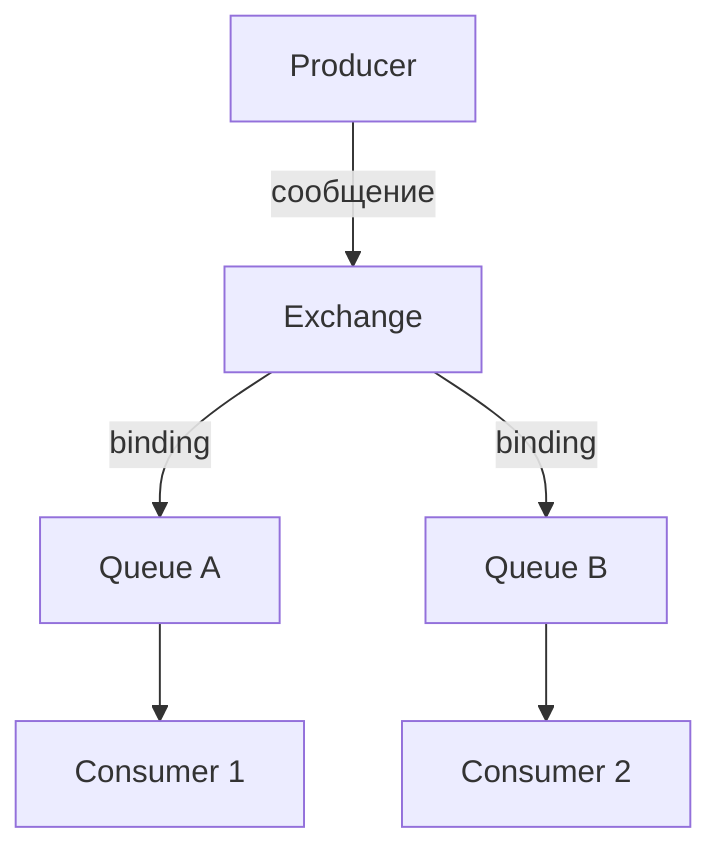
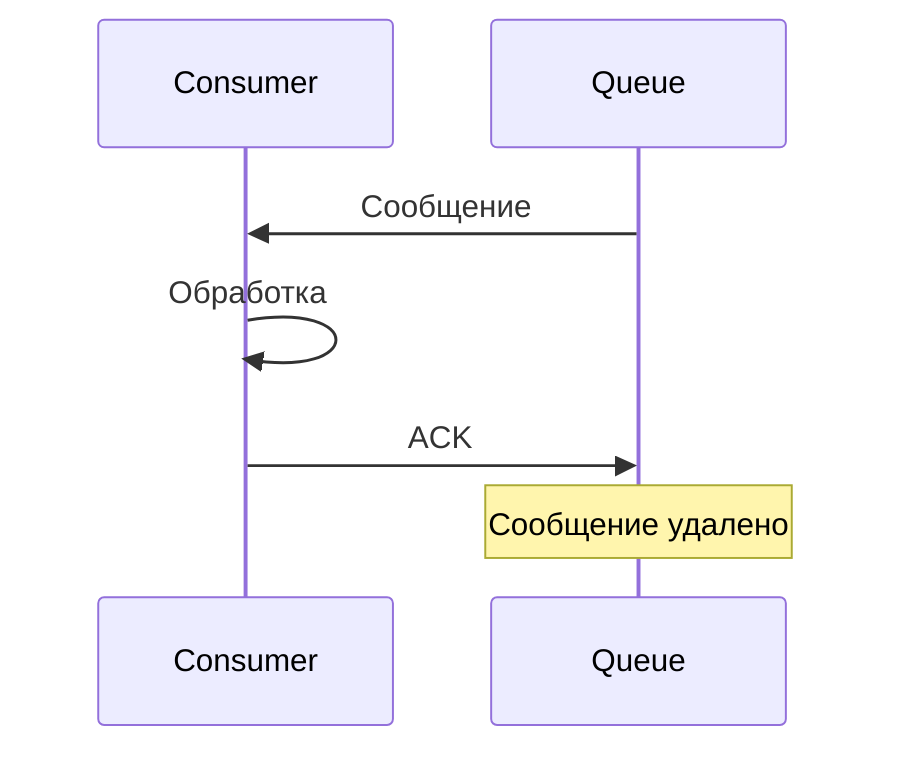

## Введение: Умная почта

Представьте почтовое отделение, где можно не просто отправить письмо, но и указать сложные правила: "Письма от Ивана отправлять в синий ящик, письма от Петра — в красный, письма с пометкой "срочно" — в зелёный". Почтальон не просто доставляет — он сортирует, фильтрует, размножает.

RabbitMQ — это такая умная почта. Это брокер сообщений, который специализируется на гибкой маршрутизации. В отличие от Kafka (журнал для потоков), RabbitMQ — классическая очередь сообщений с богатыми возможностями маршрутизации.

**RabbitMQ** — это брокер сообщений, реализующий протокол AMQP (Advanced Message Queuing Protocol). Он поддерживает множество паттернов: очереди, publish-subscribe, маршрутизацию по содержимому, RPC, очереди с приоритетами, отложенные сообщения.

Для системного аналитика RabbitMQ — инструмент для сценариев, где нужна сложная маршрутизация, гибкие схемы доставки, гарантии, но не требуется хранение истории и replay. RabbitMQ надёжен, проверен годами, прост в освоении.

## Ключевые понятия

### Producer (Издатель)

Приложение, которое отправляет сообщения. Не отправляет напрямую в очередь. Отправляет в **exchange** (обменник).

### Consumer (Потребитель)

Приложение, которое получает сообщения из **очереди**. Подтверждает обработку (ack).

### Message (Сообщение)

Блок данных, который передаётся. Состоит из:

- **Properties** (метаданные): заголовки, priority, delivery mode (persistent/non-persistent)
- **Body** (тело): сами данные (массив байт)

### Exchange (Обменник)

Принимает сообщения от producer и направляет их в очереди по правилам (binding). Это мозг RabbitMQ.

### Queue (Очередь)

Хранит сообщения до тех пор, пока consumer не заберёт их. FIFO (first in, first out).

### Binding (Связывание)

Правило, которое связывает exchange и очередь. Определяет, какие сообщения попадут в очередь.

### Virtual Host (Виртуальный хост)

Изолированная среда внутри одного брокера. Свои exchanges, очереди, права доступа. Аналог "схемы" в базе данных.

## Компоненты архитектуры



### Producer → Exchange

Producer не знает об очередях. Он отправляет сообщение в exchange с указанием **routing key**.

### Exchange → Queue

Exchange по routing key и типу exchange решает, в какие очереди отправить сообщение. Правила задаются через bindings.

### Queue → Consumer

Consumer подключается к очереди и получает сообщения. Подтверждает обработку (ack). Если не подтвердил — сообщение вернётся в очередь.

## Типы обменников (Exchange Types)

### Direct Exchange

Сообщение отправляется в очередь, у которой routing key точно совпадает с ключом сообщения.

```yaml
Exchange: orders_direct

Bindings:
  - Queue: orders_queue, routing_key: order.created
  - Queue: payments_queue, routing_key: payment.completed

Сообщение с routing_key="order.created" → orders_queue
Сообщение с routing_key="payment.completed" → payments_queue
```

**Когда использовать:** Маршрутизация по одному точному критерию.

### Fanout Exchange

Сообщение отправляется во все очереди, привязанные к exchange. Routing key игнорируется.

```yaml
Exchange: notifications_fanout

Bindings:
  - Queue: sms_queue
  - Queue: email_queue
  - Queue: push_queue

Сообщение → sms_queue, email_queue, push_queue
```

**Когда использовать:** Broadcast, publish-subscribe.

### Topic Exchange

Сообщение отправляется в очереди, где routing key соответствует шаблону (wildcard).

```yaml
* (звездочка) — ровно одно слово
# (решетка) — ноль или более слов

Exchange: events_topic

Bindings:
  - Queue: user_queue, routing_key: user.*
  - Queue: order_queue, routing_key: order.*
  - Queue: all_queue, routing_key: #

Сообщение "user.created" → user_queue, all_queue
Сообщение "user.deleted" → user_queue, all_queue
Сообщение "order.paid" → order_queue, all_queue
Сообщение "user.order.paid" → all_queue (user.order — два слова, user.* не сработает)
```

**Когда использовать:** Маршрутизация по нескольким категориям.

### Headers Exchange

Маршрутизация по заголовкам сообщения, а не по routing key.

```yaml
Exchange: events_headers

Bindings:
  - Queue: urgent_queue, headers: {x-priority: high}, x-match: any
  - Queue: error_queue, headers: {x-type: error}, x-match: any

Сообщение с заголовком x-priority=high → urgent_queue
Сообщение с заголовком x-type=error → error_queue
```

**Когда использовать:** Сложная маршрутизация, где routing key неудобен.

## Очереди (Queues)

### Свойства очереди

| Свойство | Значение | Пример |
| :--- | :--- | :--- |
| **Имя** | Уникальное в рамках virtual host | `orders.queue` |
| **Durable** | Сохраняется после перезапуска брокера | `durable=true` |
| **Exclusive** | Только для одного соединения, удаляется при закрытии | `exclusive=true` |
| **Auto-delete** | Удаляется, когда нет потребителей | `auto-delete=true` |
| **Arguments** | Дополнительные параметры | TTL, max length, dead letter |

### Временные очереди

```yaml
Анонимные очереди (без имени):
  - Создаются автоматически
  - Удаляются при закрытии соединения
  - Используются для RPC и temporary subscriptions
```

## Надёжность

### Durable vs Transient

| Тип | Сообщение | Очередь | После перезапуска |
| :--- | :--- | :--- | :--- |
| Durable | На диске | Сохраняется | Сообщения сохраняются |
| Transient | В памяти | Не сохраняется | Всё теряется |

**Рекомендация:** В production очереди должны быть durable, критичные сообщения — persistent.

### Подтверждения (Acknowledgments)



**Если ACK не пришёл:**

```yaml
Сценарий:
  - Consumer получил сообщение
  - Соединение оборвалось
  - Сообщение возвращается в очередь
  - Другой consumer получит его
```

**Автоматическое подтверждение (auto-ack):**

```yaml
Риск:
  - Consumer получил сообщение
  - Обработка упала
  - Сообщение потеряно (auto-ack отправил подтверждение до обработки)
```

**Рекомендация:** Всегда использовать ручное подтверждение (manual ack) после успешной обработки.

## Подтверждения на стороне издателя (Publisher Confirms)

Брокер подтверждает, что сообщение получено и (опционально) записано на диск.

```yaml
Без подтверждения:
  - Producer отправил
  - Не знает, дошло ли

С подтверждением:
  - Producer отправил
  - Брокер подтвердил (ack)
  - Producer знает, что сообщение доставлено
```

## Dead Letter Queue (DLQ)

Очередь для сообщений, которые не удалось обработать.

**Когда сообщение попадает в DLQ:**

| Ситуация | Параметр |
| :--- | :--- |
| Сообщение отклонено (reject) | `requeue=false` |
| Истёк TTL сообщения | `x-message-ttl` |
| Очередь переполнена | `x-max-length` |
| Превышено количество попыток | `x-dead-letter-routing-key` |

**Настройка DLQ:**

```yaml
Основная очередь:
  x-dead-letter-exchange: dlx
  x-dead-letter-routing-key: failed

DLX (обменник для мёртвых писем):
  - Имя: dlx
  - Тип: direct

DLQ (очередь для мёртвых писем):
  - Имя: dead.letter.queue
  - Привязана к dlx с routing_key: failed
```

## Virtual Hosts (vhosts)

Изолированные среды внутри одного брокера.

```yaml
Брокер:
  - vhost: / (default)
    - queues: ...
    - exchanges: ...
    - users: guest (доступ)
  - vhost: /production
    - queues: ...
    - exchanges: ...
    - users: prod_user
  - vhost: /staging
    - queues: ...
    - exchanges: ...
    - users: staging_user
```

**Когда использовать:** Разделение окружений (dev, staging, prod) или арендаторов (multi-tenant).

## Кластеризация

### Кластер RabbitMQ

Несколько брокеров объединяются в кластер. Очереди могут быть на разных узлах.

```yaml
Кластер:
  - node1 (rabbit@host1)
  - node2 (rabbit@host2)
  - node3 (rabbit@host3)
```

**Особенности:**

| Характеристика | Значение |
| :--- | :--- |
| **Очереди** | На одном узле (владелец). Другие узлы знают, где очередь |
| **Репликация** | Quorum queues (реплицируются) или классические очереди (нет репликации) |
| **Высокая доступность** | Quorum queues (рекомендованы) или mirrored queues (устарели) |

### Quorum Queues

Реплицируются на несколько узлов. Основаны на алгоритме Raft.

```yaml
Quorum queue:
  - Мастер (leader)
  - Реплики (followers)
  - При сбое мастера выбирается новый

Параметры:
  - x-quorum-initial-group-size: количество реплик (обычно 3)
  - x-max-in-memory-length: ограничение в памяти
```

## Сценарии использования

### 1. Очередь задач (Work Queue)

```yaml
Продюсер: веб-сайт
Очередь: tasks
Потребители: воркеры (несколько экземпляров)

Особенности:
  - Round-robin распределение
  - Подтверждения (manual ack)
  - Persistent сообщения
```

### 2. Publish-Subscribe (Fanout)

```yaml
Продюсер: сервис заказов
Exchange: fanout
Очереди: для каждого подписчика (логи, аналитика, уведомления)
```

### 3. Маршрутизация (Direct / Topic)

```yaml
Продюсер: система событий
Exchange: topic
Очереди: user.*, order.*, #
```

### 4. RPC (Remote Procedure Call)

```yaml
Клиент: отправляет сообщение с reply_to
Сервер: обрабатывает, отправляет ответ в reply_to
Клиент: временная очередь, ждёт ответа
```

### 5. Отложенные задачи (Delayed Messages)

```yaml
Плагин: rabbitmq_delayed_message_exchange
Exchange: delayed
Задача: отправить сообщение через 30 минут
```

## Мониторинг

### Метрики

| Метрика | Что показывает |
| :--- | :--- |
| `queue_depth` | Количество сообщений в очереди |
| `egress_rate` | Скорость выхода сообщений |
| `ingress_rate` | Скорость входа сообщений |
| `consumer_count` | Количество потребителей |
| `unacked_messages` | Сообщения, отправленные, но не подтверждённые |

### Инструменты

- **Management UI** (порт 15672)
- **Prometheus** (экспортёр)
- **Datadog**, **New Relic**

## Распространённые ошибки

### Ошибка 1: Очередь без ограничений

Без `x-max-length` или TTL очередь может расти бесконечно.

**Решение:** Установить `x-max-length`, `x-message-ttl`, `x-overflow`.

### Ошибка 2: Auto-ack для критичных задач

При падении consumer сообщение теряется.

**Решение:** Manual ack после успешной обработки.

### Ошибка 3: Transient очереди в production

При перезапуске брокера очереди и сообщения теряются.

**Решение:** Durable очереди, persistent сообщения.

### Ошибка 4: Нет мониторинга очередей

Очередь растёт, никто не знает.

**Решение:** Мониторинг `queue_depth`, алерты.

### Ошибка 5: Одна очередь на всё

Все типы сообщений в одной очереди. Сложно масштабировать.

**Решение:** Разные очереди под разные типы задач.

## Резюме

1. **RabbitMQ** — брокер сообщений с гибкой маршрутизацией. Основан на протоколе AMQP.

2. **Основные компоненты:** producer, exchange, queue, consumer, binding.

3. **Типы обменников:** direct (точное совпадение), fanout (всем), topic (шаблоны), headers (по заголовкам).

4. **Очереди** могут быть durable (сохраняются после перезапуска), exclusive, auto-delete.

5. **Надёжность:** publisher confirms (подтверждение от брокера), consumer acks (подтверждение от consumer), persistent сообщения, quorum queues (репликация).

6. **Dead Letter Queue** — очередь для сообщений, которые не удалось обработать.

7. **Virtual Hosts** — изоляция окружений (dev, staging, prod) в одном брокере.