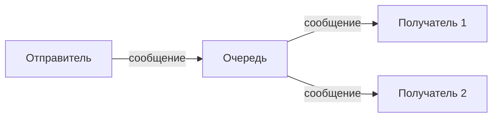
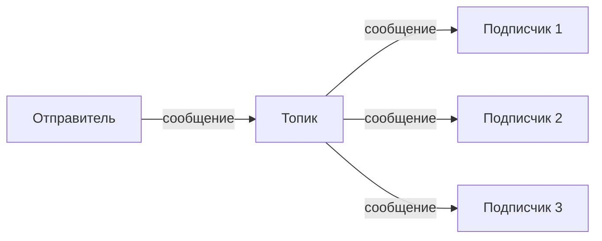
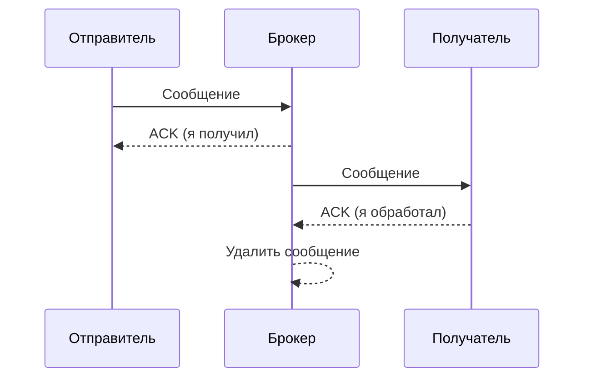
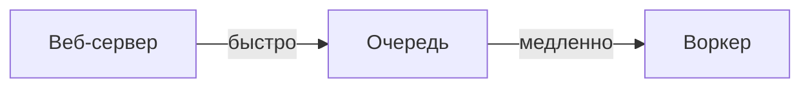
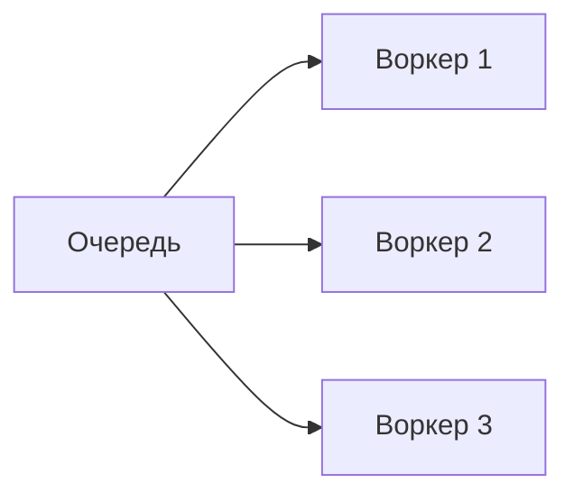
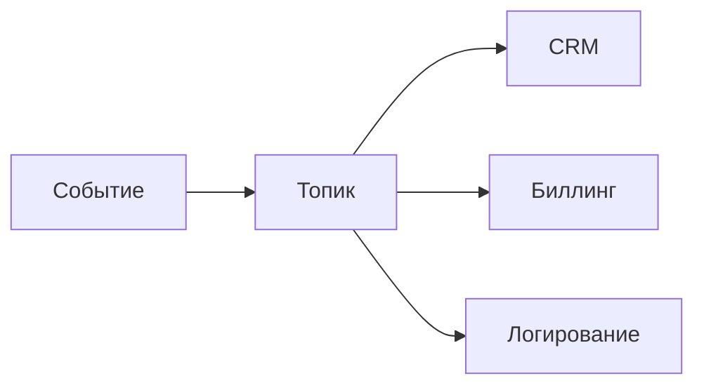
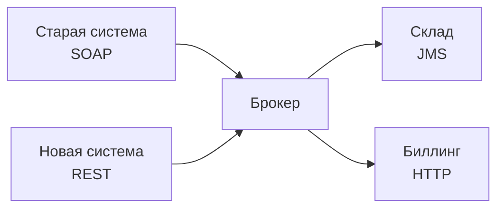
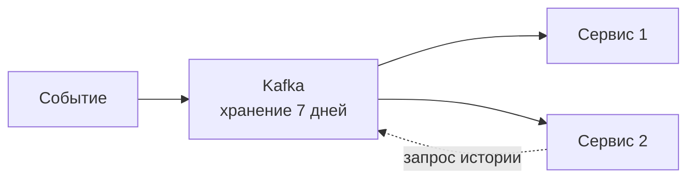
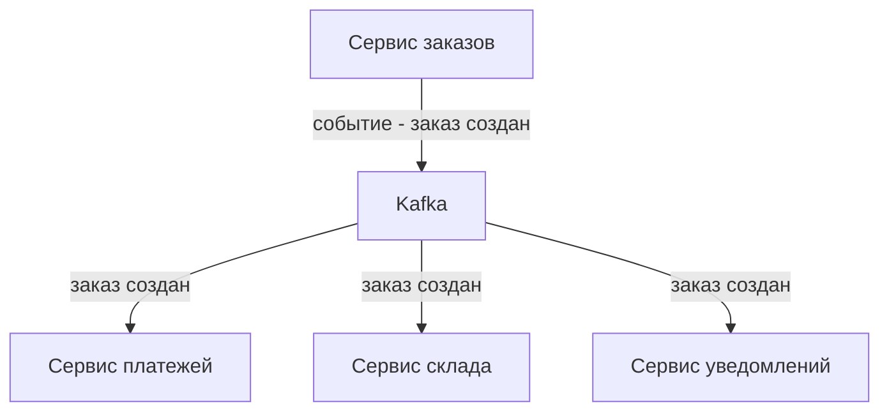

## Введение: Почтальон для программ

Представьте, что вы отправляете письмо другу. Вы не идёте к нему домой, не стучите в дверь, не ждёте, пока он откроет. Вы опускаете письмо в почтовый ящик. Почтальон забирает письмо, везёт его на почту, сортирует, а потом доставляет адресату. Если друг не дома, письмо ждёт в ящике. Если почтальон заболел, другой почтальон заберёт письмо. Если друг переехал, почта перешлёт письмо по новому адресу.

**Брокер сообщений (Message Broker)** — это "почта" для программ. Программа-отправитель не вызывает программу-получателя напрямую. Она отправляет сообщение брокеру. Брокер хранит сообщение и доставляет его получателю, когда тот готов.

Брокер решает классические проблемы интеграции систем: как быть, если получатель временно недоступен? Как доставить сообщение нескольким получателям? Как гарантировать, что сообщение не потеряется? Как сделать так, чтобы отправитель и получатель не зависели друг от друга?

Для системного аналитика брокер сообщений — это архитектурный паттерн для асинхронной, слабосвязанной, надёжной интеграции. Это фундамент для событийно-ориентированных систем, микросервисов, ETL-процессов, очередей задач.

## Зачем нужен брокер сообщений

### Проблемы прямого взаимодействия

| Проблема | Прямой вызов (HTTP) | С брокером |
| :--- | :--- | :--- |
| **Получатель недоступен** | Ошибка, потеря данных | Сообщение ждёт в очереди |
| **Получатель перегружен** | Таймауты, ошибки | Сообщение ждёт своей очереди |
| **Много получателей** | Отправитель знает всех | Отправитель не знает получателей |
| **Разные протоколы** | Сложно, много адаптеров | Брокер конвертирует |
| **Пиковая нагрузка** | Сервер не выдерживает | Очередь сглаживает пики |

## Основные понятия

### Сообщение (Message)

Блок данных, который передаётся от отправителя к получателю.

```yaml
Сообщение:
  заголовки:
    message_id: "abc-123"
    timestamp: "2024-01-15T10:30:00Z"
    correlation_id: "req-789"
    content_type: "application/json"
  тело:
    order_id: 1001
    amount: 5000
```

### Очередь (Queue)

Хранилище сообщений в порядке поступления (FIFO). Сообщение достаётся одному получателю.



### Топик (Topic)

Канал, на который можно подписаться. Сообщение доставляется всем подписчикам.



### Брокер (Broker)

Сервер, который принимает, хранит, маршрутизирует и доставляет сообщения.

## Синхронность и асинхронность

| Характеристика | Синхронный (HTTP) | Асинхронный (брокер) |
| :--- | :--- | :--- |
| **Отправитель ждёт ответ** | Да | Нет |
| **Блокировка** | Отправитель блокируется | Отправитель не блокируется |
| **Получатель недоступен** | Ошибка | Сообщение в очереди |
| **Связанность** | Отправитель знает получателя | Отправитель не знает получателя |
| **Ответ** | Немедленный | Через отдельное сообщение |

**Аналогия:** Синхронный вызов — это телефонный звонок (должны оба быть на линии). Асинхронный — это отправка письма (можно отправить в любое время).

## Зачем нужна асинхронность

### Сглаживание пиков (Load levelling)


Брокер накапливает сообщения во время пика и отдаёт их получателю с комфортной для него скоростью.

### Разделение отправителя и получателя (Decoupling)

- Отправитель не знает IP, порт, протокол получателя
- Отправитель не знает, сколько получателей
- Отправитель не знает, доступен ли получатель
- Получатель может быть переписан без изменения отправителя

### Буферизация

Если получатель временно недоступен, сообщения накапливаются в очереди. При восстановлении получатель обработает накопленные сообщения.

## Надёжность

### Персистентность (Persistent)

Сообщение записывается на диск, а не только в оперативную память. При перезапуске брокера сообщение не теряется.

### Подтверждения (Acknowledgment)



**Что даёт:** Сообщение не потеряется, если получатель упал до обработки.

### Dead Letter Queue (DLQ)

Очередь для сообщений, которые не удалось обработать после нескольких попыток.


## Популярные брокеры

| Брокер | Модель | Особенность |
| :--- | :--- | :--- |
| **Apache Kafka** | Log-ориентированный | Высокая производительность, хранение событий, replay |
| **RabbitMQ** | Очередной | Гибкая маршрутизация, сложные сценарии |
| **ActiveMQ** | Очередной | Java-экосистема |
| **AWS SQS** | Очередной | Управляемый, облачный |
| **AWS SNS** | Pub/Sub | Управляемый, облачный |
| **NATS** | Лёгкий | Высокая скорость, простота |
| **Redis Pub/Sub** | Pub/Sub | Простой, встроен в Redis |
| **Google Pub/Sub** | Pub/Sub | Управляемый, GCP |

## Какие задачи решает брокер

### Разгрузка сервера (Offloading)

Тяжёлая обработка выносится в фоновые задачи.



Веб-сервер быстро отвечает клиенту, а тяжёлая обработка идёт в фоне.

### Распределение работы (Load balancing)

Несколько воркеров читают из одной очереди.



### Уведомление многих (Broadcast)

Одно событие — много подписчиков.



### Интеграция разнородных систем

Разные протоколы, разные форматы.



## Брокер как хранилище

Некоторые брокеры (Kafka) хранят сообщения определённое время. Это позволяет:

- Новому сервису прочитать историю событий (replay)
- Перечитать сообщение, если обработка упала
- Анализировать поток событий



## Брокер и микросервисы

В микросервисной архитектуре брокер часто используется для:

- **Коммуникации между сервисами** (асинхронно)
- **Событийной архитектуры** (сервисы реагируют на события)
- **Согласованности данных** (обновление нескольких сервисов через события)
- **CQRS** (команды и события)



## Распространённые ошибки

### Ошибка 1: Использование брокера для синхронных вызовов

Пытаются получить ответ в той же транзакции через брокер (request-response через очереди). Это сложно и не нужно.

**Решение:** Для синхронных вызовов используйте HTTP/gRPC.

### Ошибка 2: Игнорирование идемпотентности

Брокер может доставить сообщение дважды (at-least-once). Получатель не обрабатывает дубликаты.

**Решение:** Сделать обработку идемпотентной (по idempotency key).

### Ошибка 3: Нет мониторинга очередей

Очередь растёт, никто не знает, почему.

**Решение:** Мониторинг глубины очереди, алерты при превышении порога.

### Ошибка 4: Неправильный выбор брокера

Выбрали Kafka для сложной маршрутизации (нужен RabbitMQ). Или RabbitMQ для высокой нагрузки (нужна Kafka).

**Решение:** Изучить сильные стороны брокеров.

### Ошибка 5: Отсутствие DLQ

Сообщения-ошибки теряются или зависают в очереди.

**Решение:** Настроить Dead Letter Queue.

## Резюме

1. **Брокер сообщений** — посредник между отправителями и получателями. Отправитель отправляет сообщение брокеру, брокер доставляет получателю.

2. **Ключевые понятия:** сообщение, очередь (одному получателю), топик (многим получателям), брокер (сервер).

3. **Асинхронность:** отправитель не ждёт ответа. Брокер накапливает сообщения, если получатель недоступен.

4. **Что даёт брокер:** разгрузка сервера, распределение работы, уведомление многих, интеграция разнородных систем, сглаживание пиков.

5. **Надёжность:** персистентность (на диск), подтверждения (ACK), Dead Letter Queue (DLQ).

6. **Когда нужен брокер:** асинхронные задачи, событийная архитектура, интеграция систем, очереди задач.