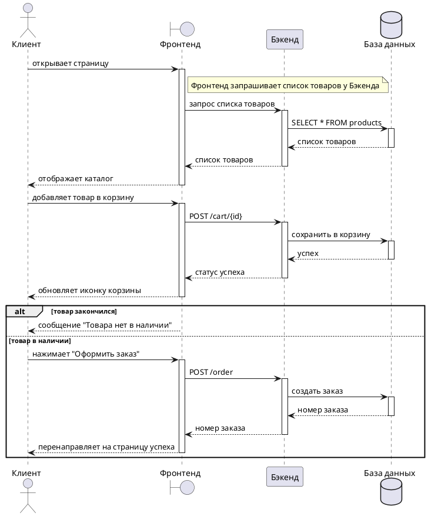
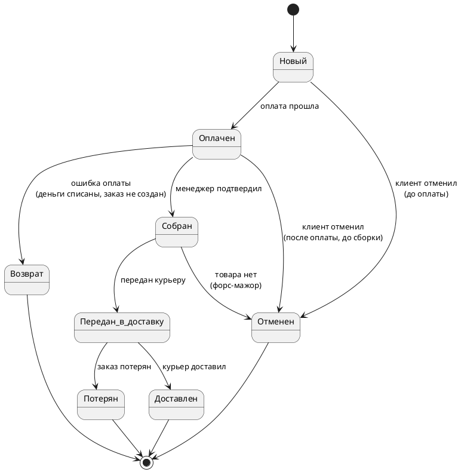
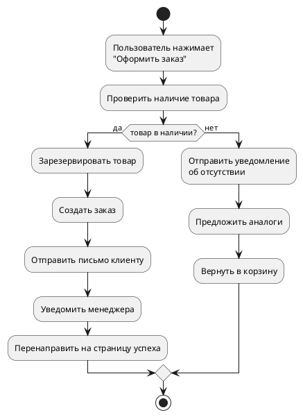
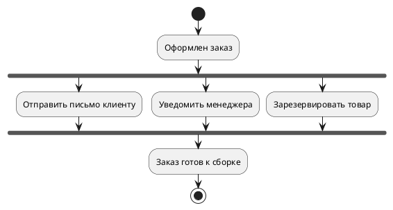

## Введение

Представьте, что вы архитектор. Вам нужно спроектировать дом. Вы не начнете строить сразу – сначала нарисуете разные чертежи: план этажей (как комнаты расположены), схему коммуникаций (где трубы и провода), схему эвакуации (как люди выходят при пожаре). Каждый чертеж отвечает на свой вопрос и показывает разные аспекты дома.

**UML (Unified Modeling Language)** – это набор таких чертежей для программных систем. В нем есть 14 типов диаграмм, каждая для своего. Системному аналитику чаще всего нужны три:

- **Диаграмма последовательности (Sequence Diagram)** – показывает, как объекты обмениваются сообщениями во времени. Кто кому что сказал и в каком порядке.
- **Диаграмма состояний (State Machine Diagram)** – показывает, как объект меняет свое состояние в ответ на события. Заказ был "Новый", стал "Оплачен", стал "Отправлен".
- **Диаграмма деятельности (Activity Diagram)** – похожа на BPMN, показывает поток управления и действий. Бизнес-процесс внутри системы.

## Что такое UML

UML – это язык визуального моделирования. Придуман, чтобы разработчики, аналитики, архитекторы и даже заказчики могли понимать друг друга.

**Зачем это нужно:**
- Чтобы описать систему до того, как написана первая строка кода.
- Чтобы объяснить сложную логику, которую текстом не описать.
- Чтобы документация была живой – схемы не устаревают быстрее, чем их нарисовали.

## Диаграмма последовательности (Sequence Diagram)

### Что это такое

Sequence diagram – это представление взаимодействия между различными объектами или компонентами системы в определенной последовательности. Диаграмма последовательности отображает передачу сообщений между объектами во времени, что помогает в понимании порядка выполнения действий в системе.

Это диаграмма, которая показывает взаимодействие объектов во времени. Сверху вниз идет время. Горизонтально расположены "участники" (акторы, объекты, компоненты). Между ними летят стрелки-сообщения.

**Когда использовать:**
- Описать сценарий использования (Use Case) в технических деталях.
- Показать, как микросервисы обмениваются запросами. Показать поток данных.
- Объяснить, что происходит, когда пользователь нажимает кнопку.

**Базово состоит из:**
1. Заголовок / название диаграммы
2. Объекты системы, они же сущности
3. Линии жизни
4. Сообщения и ответные (возвратные) сообщения, они же стрелки
5. Участник процесса (актор)
6. Фреймы
7. Активации
8. Комментарии

### Основные элементы Sequence Diagram

| Элемент                        | Обозначение в PlantUML        | Что означает                                                              |
| :----------------------------- | :---------------------------- | :------------------------------------------------------------------------ |
| **Актор (actor)**              | `actor "Клиент" as Client`    | Человек или внешняя система, которая взаимодействует с нашей системой.    |
| **Объект (participant)**       | `participant "Бэкенд" as BE`  | Участник внутри системы. Может быть компонентом, сервисом, классом.       |
| **Жизненная линия (lifeline)** | вертикальная пунктирная линия | Показывает существование объекта во времени.                              |
| **Сообщение (message)**        | `Client -> FE: запрос`        | Стрелка от отправителя к получателю.                                      |
| **Возврат (return)**           | `FE --> Client: ответ`        | Пунктирная стрелка с ответом.                                             |
| **Альтернатива (alt)**         | `alt условие`                 | Блок, где выбирается один из вариантов (как XOR в BPMN). Блок с условием. |
| **Опция (opt)**                | `opt условие`                 | Блок, который выполняется только если условие истинно.                    |
| **Параллель (par)**            | `par`                         | Блок, где действия выполняются параллельно (как AND в BPMN).              |
| **Цикл (loop)**                | `loop [раз]`                  | Блок, который повторяется указанное количество раз.                       |
**Чуть подробнее про фреймы:**

**Фреймы** – структурированные блоки, которые используются для организации группы сообщений и/или взаимодействий в логически связанные последовательности.

`alt` – альтернативные ветки (условие if / else). Используется, когда у сценария есть взаимоисключающие варианты развития.

**Когда использовать:**
- успешная / неуспешная операция
- есть данные / нет данных
- доступ разрешен / запрещен


`opt` – опциональный сценарий (if без else). Описывает необязательный шаг, который может выполниться, а может быть пропущен.

**Когда использовать:**
- включенная дополнительная проверка
- необязательное уведомление


`loop` – повторяющееся действие (цикл). Показывает, что одни и те же действия повторяются несколько раз.

**Когда использовать:**
- опрос статуса (polling)
- обработка списка элементов
- повтор до наступления условия


`par` – параллельное выполнение. Используется, когда несколько действий запускаются одновременно и не зависят друг от друга.

**Когда использовать:**
- отправка уведомлений
- запуск фоновых процессов
- параллельные интеграции


`ref` – ссылка на другую диаграмму. Используется, чтобы не перегружать текущую диаграмму и сослаться на другую, более детальную.

**Когда использовать:**
- сложная логика (оплата, антифрод, расчеты)
- повторно используемый сценарий
- декомпозиция


neg – используется для предоставления альтернативной сценарной ветки, которая НЕ должна происходить в системе. То есть, он используется для описания ошибок или невозможных сценариев. Без проблем заменяется alt, поэтому в PlantUML не реализован. Но, нужно помнить, что в PlantUML есть возможность создать фрейм с любым названием.

**Когда использовать:**
- когда некоторые последовательности должны быть явно запрещены

### Пример Sequence Diagram в PlantUML

"Клиент заходит в интернет-магазин, ищет товар, кладет в корзину, оформляет заказ".

Пример, сгенерированный на основе синтаксиса описанного в PlantUML:


Cинтаксиса к примеру выше:
```
@startuml
actor "Клиент" as Client
boundary "Фронтенд" as FE
participant "Бэкенд" as BE
database "База данных" as DB

Client -> FE: открывает страницу
activate FE
note right of FE: Фронтенд запрашивает список товаров у Бэкенда
FE -> BE: запрос списка товаров
activate BE
BE -> DB: SELECT * FROM products
activate DB
DB --> BE: список товаров
deactivate DB
BE --> FE: список товаров
deactivate BE
FE --> Client: отображает каталог
deactivate FE

Client -> FE: добавляет товар в корзину
activate FE
FE -> BE: POST /cart/{id}
activate BE
BE -> DB: сохранить в корзину
activate DB
DB --> BE: успех
deactivate DB
BE --> FE: статус успеха
deactivate BE
FE --> Client: обновляет иконку корзины
deactivate FE

alt товар закончился
    FE --> Client: сообщение "Товара нет в наличии"
else товар в наличии
    Client -> FE: нажимает "Оформить заказ"
    activate FE
    FE -> BE: POST /order
    activate BE
    BE -> DB: создать заказ
    activate DB
    DB --> BE: номер заказа
    deactivate DB
    BE --> FE: номер заказа
    deactivate BE
    FE --> Client: перенаправляет на страницу успеха
    deactivate FE
end

@enduml
```

Мы видим всю цепочку запросов, кто с кем общается, какие возвраты происходят, и как обрабатывается альтернативный сценарий.

Еще один пример:
![[пример_сиквенса.png]]

Покупатель нажимает "Оформить заказ" в Web UI, после чего интерфейс синхронно отправляет в Order API запрос на создание заказа с товарами и адресом и получает быстрый ответ 202 Accepted с идентификатором черновика заказа. Далее, если пользователь вводит промокод, UI отправляет отдельный запрос на его применение и получает подтверждение, что скидка применена. Затем Order API синхронно обращается в Inventory Service, чтобы зарезервировать товары. Если товары есть в наличии, резерв создается и процесс продолжается: UI асинхронно инициирует создание платежа в Payment Service, не ожидая мгновенного результата. После этого UI в цикле запрашивает у Order API статус оплаты, пока он не станет финальным. Если оплата успешна, UI параллельно запускает создание доставки в Delivery Service и отправку письма-подтверждения через Email Service (оба вызова асинхронные), а детали внутренней логики платежа вынесены ссылкой на отдельную диаграмму. Затем Order API возвращает UI подтвержденный статус заказа, и UI показывает пользователю, что заказ оформлен. Если оплата неуспешна, Order API снимает резерв в Inventory Service, возвращает UI ошибку оплаты, и UI сообщает пользователю, что оплата не прошла. Если же на этапе резерва выясняется, что товара нет или остатков недостаточно, Inventory возвращает отказ, Order API отдает UI ошибку "нет остатков", и пользователь видит сообщение "Нет в наличии".

### Советы при написании Sequence Diagram в PlantUML

1.  **Используйте `activate` и `deactivate`** – они показывают, когда объект начинает и заканчивает обработку. Это делает диаграмму понятнее.

2.  **Сокращайте имена участников** – `participant "Бэкенд-сервис авторизации" as Auth` и потом используйте `Auth`.

3.  **Группируйте логику в блоки (фреймы)** – `alt`, `opt`, `loop`, `par` делают диаграмму структурированной.

4.  **Добавляйте комментарии** – `note right of FE: здесь проверяется авторизация`. Комментарии помогают объяснить, что происходит.

5.  **Не бойтесь длинных диаграмм** – если сценарий большой, разбивайте на несколько диаграмм. Одна диаграмма не должна быть на 3 экрана. Для ссылки на другую диаграмму используйте фрейм – `ref`

## Диаграмма состояний (State Machine Diagram)

### Что это такое

State-machine diagram – показывает, как объект переходит из одного состояния в другое. Она позволяет описать все возможные состояния объекта, а также переходы между ними в ответ на определенные события.

Это диаграмма, которая показывает, как объект меняет свое состояние в ответ на события. Состояние - это конкретная ситуация, в которой может находиться объект (заказ, пользователь, документ).

**Когда использовать:**
- Описать жизненный цикл заказа, заявки, документа.
- Показать, в каких состояниях может быть объект и как он переходит между ними.
- Обнаружить необработанные события (чего-то не хватает).

### Основные элементы State Diagram

| Элемент                 | Обозначение в PlantUML                           | Что означает                                                                                                                                                         |
| ----------------------- | ------------------------------------------------ | -------------------------------------------------------------------------------------------------------------------------------------------------------------------- |
| **Состояние**           | `state "Новый" as New`                           | Прямоугольник с названием состояния. Представляет определенное состояние объекта или системы, которое может изменяться в ответ на события, условия или действия.     |
| **Переход**             | `New -> Paid: оплата прошла`                     | Стрелка от одного состояния к другому. Обозначает изменение состояния и указывает, при каких условиях происходит переход между состояниями.                          |
| **Событие**             | `оплата прошла` (текст над стрелкой)             | Текст вдоль линии перехода. То, что вызывает переход из одного состояния в другое.                                                                                   |
| **Составное состояние** | `state "Обработка заказа" as Processing { ... }` | Сложное состояние, состоящее из других вложенных в него состояний (подсостояний). Подсостояния могут быть последовательными и параллельными.                         |
| **Начальное состояние** | `[*]` (заполненный кружок)                       | Состояние, с которого начинается выполнение процесса. Обозначается символом заполненного кружка, откуда исходят стрелки, представляющие переходы в другие состояния. |
| **Конечное состояние**  | `[*]` (закрытый кружок)                          | Состояние, в котором процесс завершает свое выполнение. Обозначается символом закрытого кружка.                                                                      |

### Пример State Diagram в PlantUML

Жизненный цикл заказа в интернет-магазине.



Синтаксис к примеру выше:
```
@startuml
[*] --> Новый

Новый --> Оплачен: оплата прошла
Новый --> Отменен: клиент отменил\n(до оплаты)

Оплачен --> Собран: менеджер подтвердил
Оплачен --> Отменен: клиент отменил\n(после оплаты, до сборки)
Оплачен --> Возврат: ошибка оплаты\n(деньги списаны, заказ не создан)

Собран --> Передан_в_доставку: передан курьеру
Собран --> Отменен: товара нет\n(форс-мажор)

Передан_в_доставку --> Доставлен: курьер доставил
Передан_в_доставку --> Потерян: заказ потерян

Доставлен --> [*]
Отменен --> [*]
Возврат --> [*]
Потерян --> [*]

@enduml
```

Мы видим все возможные состояния заказа, все переходы и события, которые эти переходы вызывают. Сразу видны альтернативные пути.

## Диаграмма деятельности (Activity Diagram)

### Что это такое

Activity diagram – это представление процесса или потока работы системы в виде последовательности действий, необходимых для достижения определенной цели. Она, как и диаграмма состояний, отражает динамические аспекты поведения системы. По существу, эта диаграмма представляет собой блок-схему, которая наглядно показывает, как поток управления переходит от одной деятельности к другой.

Это диаграмма, которая показывает поток управления - последовательность действий, ветвления, параллелизм. Она очень похожа на BPMN, но более техническая и используется внутри системы.

**Когда использовать:**
- Описать сложный алгоритм.
- Показать логику работы функции или метода.
- Описать сценарий, где много ветвлений и параллельных действий.

### Основные элементы Activity Diagram

| Элемент | Обозначение в PlantUML | Что означает |
| :--- | :--- | :--- |
| **Начальный узел** | `start` | Начало деятельности. |
| **Конечный узел** | `stop` | Конец деятельности. |
| **Действие (action)** | `:действие;` | Конкретное действие. |
| **Условие (decision)** | `if (условие) then (да)` | Развилка (аналог XOR). |
| **Параллель (fork/join)** | `fork` / `fork again` / `end fork` | Параллельное выполнение (аналог AND). |
| **Событие (event)** | `event` | Что-то, что происходит (например, получение сообщения). |

### Пример Activity Diagram в PlantUML

Алгоритм оформления заказа с проверкой наличия товара.



Синтаксис для примера выше:
``` 
@startuml
start

:Пользователь нажимает
"Оформить заказ";

:Проверить наличие товара;

if (товар в наличии?) then (да)
    :Зарезервировать товар;
    :Создать заказ;
    :Отправить письмо клиенту;
    :Уведомить менеджера;
    :Перенаправить на страницу успеха;
else (нет)
    :Отправить уведомление
    об отсутствии;
    :Предложить аналоги;
    :Вернуть в корзину;
endif

stop
@enduml
```

**С параллельными действиями (fork/join):**


Синтаксис для примера выше:
```
@startuml
start

:Оформлен заказ;

fork
    :Отправить письмо клиенту;
fork again
    :Уведомить менеджера;
fork again
    :Зарезервировать товар;
end fork

:Заказ готов к сборке;

stop
@enduml
```
### Советы при написании Activity Diagram в PlantUML

1.  **Используйте `if` для ветвлений** – это самый понятный способ.

2.  **Применяйте `fork` для параллельных действий** – показывает, что действия выполняются одновременно.

3.  **Не злоупотребляйте вложенными условиями** – если условий больше 3, разбейте на подпроцессы.

4.  **Добавляйте `note` для пояснений** – особенно если действие не очевидно.

5.  **Используйте `repeat` и `while` для циклов** – если в процессе есть повторяющиеся действия.

## Где писать PlantUML

| Инструмент              | Описание                                                                    |
| :---------------------- | :-------------------------------------------------------------------------- |
| **PlantUML Web Server** | Бесплатный онлайн-редактор, можно попробовать прямо в браузере.             |
| **VS Code + плагин**    | Удобный вариант. Устанавливаете плагин PlantUML, пишете код, видите превью. |
| **Confluence / Jira**   | Есть плагины, которые рендерят PlantUML прямо в вики.                       |
| **Mermaid**             | Альтернатива PlantUML, тоже текстовый язык. Немного проще, но менее мощный. |

## Когда какую диаграмму использовать (примеры)

| Задача | Диаграмма |
| :--- | :--- |
| Показать, как сервисы общаются по API | **Sequence Diagram** |
| Описать жизненный цикл заказа, заявки | **State Diagram** |
| Описать алгоритм или бизнес-процесс | **Activity Diagram** |
| Показать, кто инициирует взаимодействие | **Sequence Diagram** (с актером) |
| Найти все возможные состояния объекта | **State Diagram** |
| Описать сценарий с параллельными ветвями | **Activity Diagram** (fork/join) |
