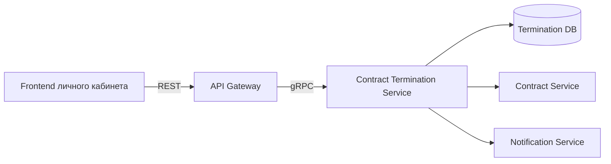

## Название задачи

Создание заявки на досрочное расторжение договора.

## Цель статьи

Показать полный набор артефактов системного аналитика на одной реалистичной задаче: от бизнес-постановки до REST/gRPC-контрактов, маппинга, ошибок, статусов и sequence diagram.

## Архитектурный контур

## Суть задачи

Клиент в личном кабинете выбирает активный договор и подает заявку на досрочное расторжение.

Клиент указывает:

- причину расторжения;
- желаемую дату расторжения;
- банковские реквизиты для возврата денежных средств;
- комментарий;
- документы, если они требуются.

Frontend отправляет REST-запрос в API Gateway. API Gateway выполняет техническую валидацию, маппит REST-модель в gRPC-модель и вызывает backend-микросервис `ContractTerminationService`.

Backend-сервис выполняет бизнес-проверки, создает заявку и возвращает результат.

## Основные системы

| Система | Назначение |
|---|---|
| Frontend личного кабинета | UI для подачи заявки |
| API Gateway | Принимает REST-запрос, валидирует, маппит данные в gRPC |
| Contract Termination Service | Создает и обрабатывает заявки на расторжение |
| Contract Service | Предоставляет данные договора |
| Termination DB | Хранит заявки на расторжение |
| Notification Service | Отправляет уведомления клиенту |

## Допущение

Кейс учебный и синтетический. Названия сервисов, методов, полей и бизнес-правил придуманы для демонстрации артефактов, но структура соответствует типовой enterprise-разработке.
