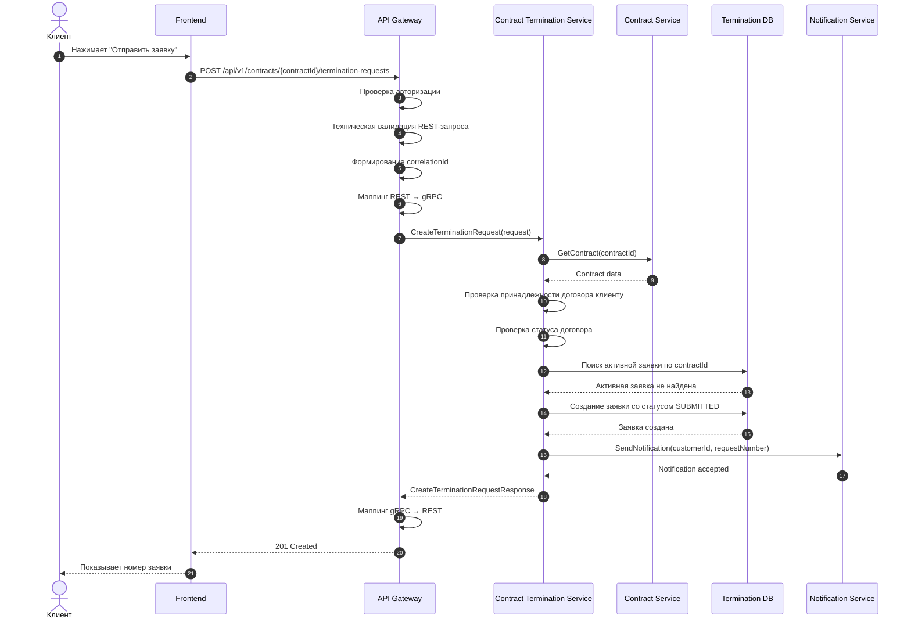
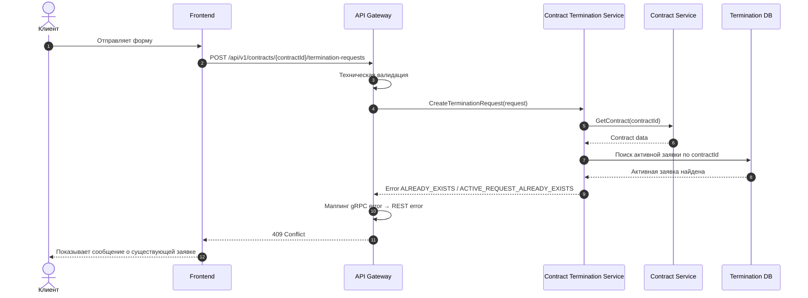
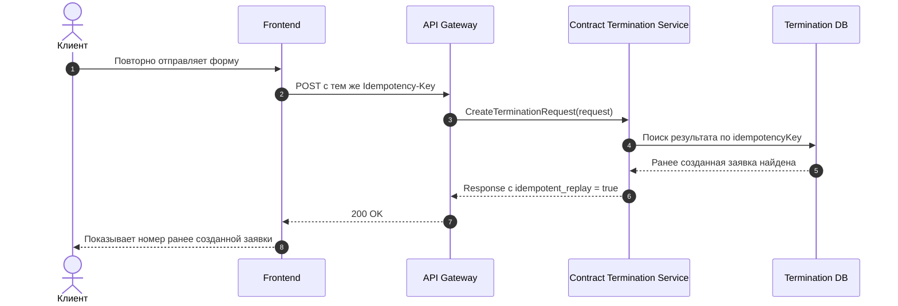

# Sequence diagram

## Успешный сценарий создания заявки

```mermaid
sequenceDiagram
    autonumber

    actor Client as Клиент
    participant Front as Frontend
    participant APIGW as API Gateway
    participant CTS as Contract Termination Service
    participant CS as Contract Service
    participant DB as Termination DB
    participant NS as Notification Service

    Client->>Front: Нажимает "Отправить заявку"
    Front->>APIGW: POST /api/v1/contracts/{contractId}/termination-requests

    APIGW->>APIGW: Проверка авторизации
    APIGW->>APIGW: Техническая валидация REST-запроса
    APIGW->>APIGW: Формирование correlationId
    APIGW->>APIGW: Маппинг REST → gRPC

    APIGW->>CTS: CreateTerminationRequest(request)

    CTS->>CS: GetContract(contractId)
    CS-->>CTS: Contract data

    CTS->>CTS: Проверка принадлежности договора клиенту
    CTS->>CTS: Проверка статуса договора
    CTS->>DB: Поиск активной заявки по contractId
    DB-->>CTS: Активная заявка не найдена

    CTS->>DB: Создание заявки со статусом SUBMITTED
    DB-->>CTS: Заявка создана

    CTS->>NS: SendNotification(customerId, requestNumber)
    NS-->>CTS: Notification accepted

    CTS-->>APIGW: CreateTerminationRequestResponse
    APIGW->>APIGW: Маппинг gRPC → REST
    APIGW-->>Front: 201 Created
    Front-->>Client: Показывает номер заявки
```

## Альтернативный сценарий: по договору уже есть активная заявка

```mermaid
sequenceDiagram
    autonumber

    actor Client as Клиент
    participant Front as Frontend
    participant APIGW as API Gateway
    participant CTS as Contract Termination Service
    participant CS as Contract Service
    participant DB as Termination DB

    Client->>Front: Отправляет форму
    Front->>APIGW: POST /api/v1/contracts/{contractId}/termination-requests

    APIGW->>APIGW: Техническая валидация
    APIGW->>CTS: CreateTerminationRequest(request)

    CTS->>CS: GetContract(contractId)
    CS-->>CTS: Contract data

    CTS->>DB: Поиск активной заявки по contractId
    DB-->>CTS: Активная заявка найдена

    CTS-->>APIGW: Error ALREADY_EXISTS / ACTIVE_REQUEST_ALREADY_EXISTS
    APIGW->>APIGW: Маппинг gRPC error → REST error
    APIGW-->>Front: 409 Conflict
    Front-->>Client: Показывает сообщение о существующей заявке
```

## Альтернативный сценарий: повторный идемпотентный запрос

```mermaid
sequenceDiagram
    autonumber

    actor Client as Клиент
    participant Front as Frontend
    participant APIGW as API Gateway
    participant CTS as Contract Termination Service
    participant DB as Termination DB

    Client->>Front: Повторно отправляет форму
    Front->>APIGW: POST с тем же Idempotency-Key

    APIGW->>CTS: CreateTerminationRequest(request)

    CTS->>DB: Поиск результата по idempotencyKey
    DB-->>CTS: Ранее созданная заявка найдена

    CTS-->>APIGW: Response с idempotent_replay = true
    APIGW-->>Front: 200 OK
    Front-->>Client: Показывает номер ранее созданной заявки
```
