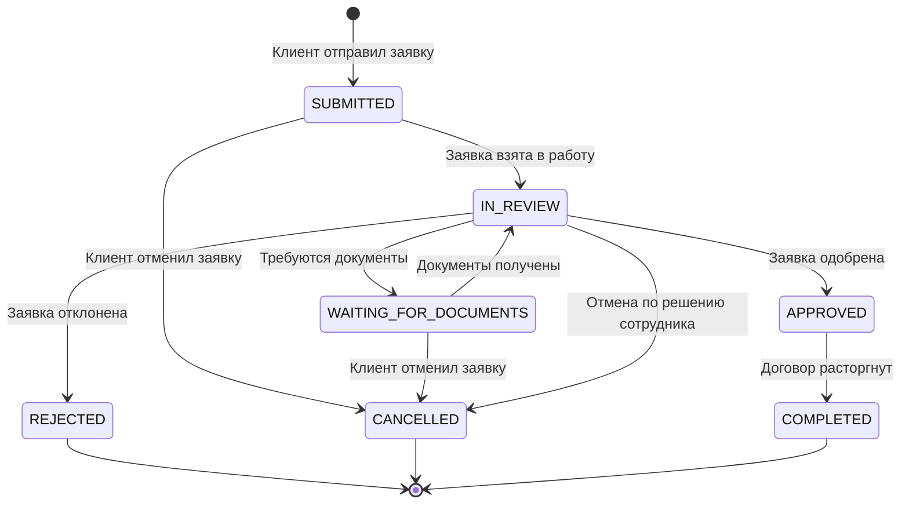

## Назначение

Документ описывает статусы заявки на досрочное расторжение договора и допустимые переходы между ними.

## Статусы заявки

| Статус | Описание | Видимость клиенту |
|---|---|---|
| `DRAFT` | Черновик заявки | Да |
| `SUBMITTED` | Заявка отправлена клиентом и принята системой | Да |
| `IN_REVIEW` | Заявка находится на проверке у сотрудника | Да |
| `WAITING_FOR_DOCUMENTS` | По заявке требуются дополнительные документы | Да |
| `APPROVED` | Заявка одобрена | Да |
| `REJECTED` | Заявка отклонена | Да |
| `CANCELLED` | Заявка отменена клиентом или системой | Да |
| `COMPLETED` | Договор расторгнут, процесс завершен | Да |

## Начальный статус

При создании заявки через личный кабинет заявка создается в статусе:

```text
SUBMITTED
```

Статус `DRAFT` в текущем объеме не используется, но зарезервирован для будущего сценария сохранения черновика.

## Активные статусы

Активными считаются статусы:

- `DRAFT`;
- `SUBMITTED`;
- `IN_REVIEW`;
- `WAITING_FOR_DOCUMENTS`;
- `APPROVED`.

Если по договору есть заявка в одном из активных статусов, новая заявка на расторжение не создается.

## Финальные статусы

Финальными считаются статусы:

- `REJECTED`;
- `CANCELLED`;
- `COMPLETED`.

## Диаграмма статусов



## UI-наименования статусов

| Системный статус | Текст в интерфейсе |
|---|---|
| `DRAFT` | Черновик |
| `SUBMITTED` | Отправлена |
| `IN_REVIEW` | На рассмотрении |
| `WAITING_FOR_DOCUMENTS` | Требуются документы |
| `APPROVED` | Одобрена |
| `REJECTED` | Отклонена |
| `CANCELLED` | Отменена |
| `COMPLETED` | Завершена |
| `UNKNOWN` | Статус неизвестен |
